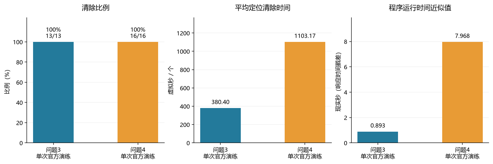
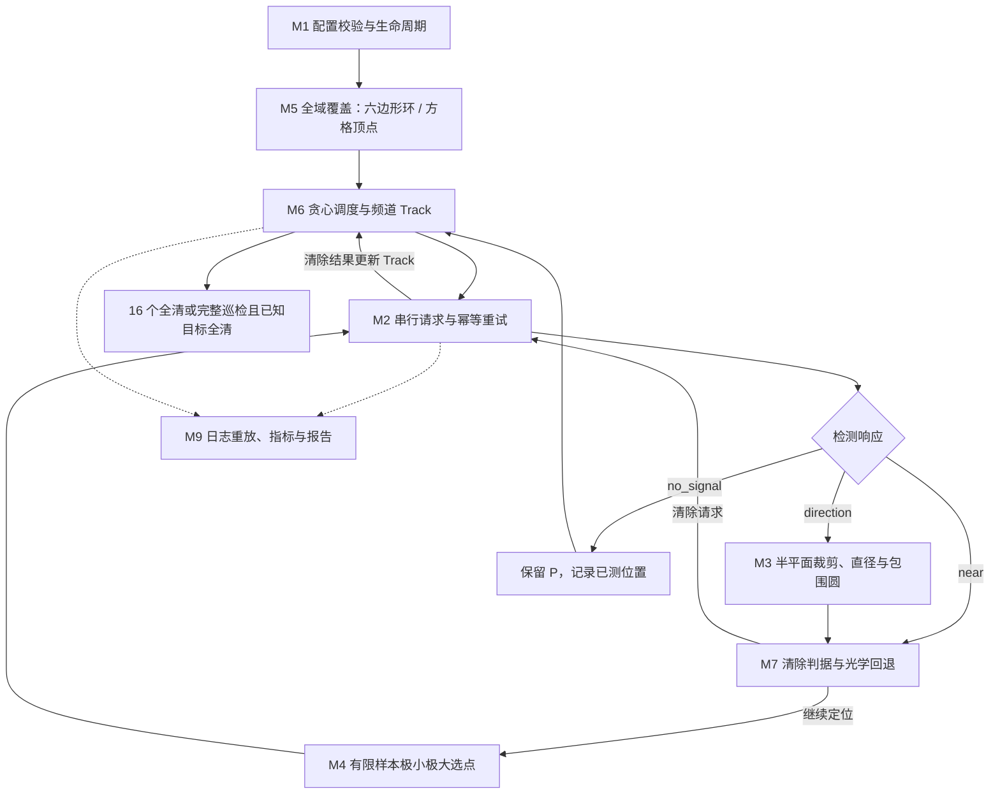
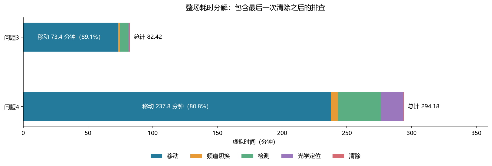
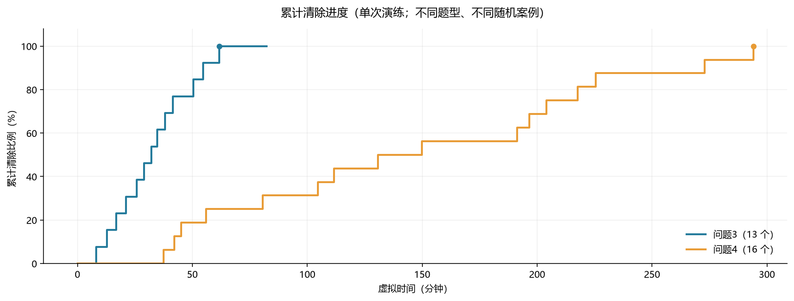
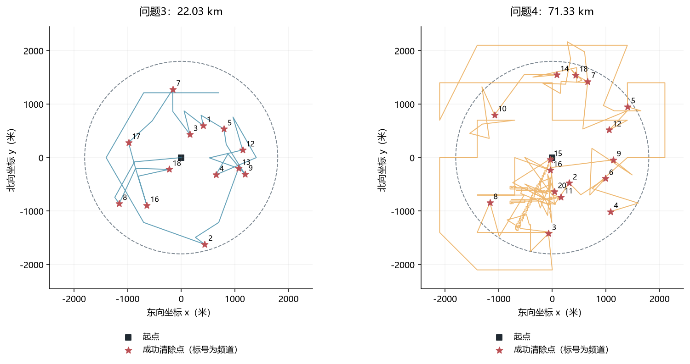

# 基础模型 v1：运行报告

本版已完成一次问题 3 和一次问题 4 的官方模拟器演练，均清除全部目标；另保存了 6 个固定种子的离线案例，全部清除。本版的用途是建立可运行、可核验、可调整的起点，尚未进行性能优化。官方模拟器版本为 **v1.1**，两次演练发生在北京时间 **2026-09-10 23:53–23:55**。本报告生成于 2026-09-11。

## 1. 直接关系到题目评价的结果

| 场景 | 测试案例编码 | 清除数 / 总数 | 清除比例 | 虚拟总时间（秒） | 平均定位清除时间（秒/个） | 程序现实时间近似值（秒） |
| --- | --- | ---: | ---: | ---: | ---: | ---: |
| 问题3 | `CP6Y-7DQ7-QKU2-45ZW` | 13/13 | 100% | 4945.153268 | 380.40 | 0.893 |
| 问题4 | `VBWK-PJVR-JVUQ-CGGF` | 16/16 | 100% | 17650.711245 | 1103.17 | 7.968 |

问题 3 的 13 个目标均为全向源。问题 4 的演练结束界面显示 **全向 0 个、定向 16 个**；因此本次官方 Q4 实测是全定向案例。自建离线 Q4 案例另覆盖了混合类型。

清除个数来自去重后的成功 `/clear` 响应，总数来自演练结束界面。虚拟总时间取成功 `/exit` 的时间戳，平均时间严格使用 **整场虚拟总时间 / 成功清除个数**。程序现实时间使用 `/exit` 与 `/enter` 响应的服务端时间戳差，标注为 `server_timestamp_proxy`；演练界面未给出精确的程序运行时长，不能把取整的剩余时间倒推出精确值。

题目没有公布综合分数或权重，本报告不计算“官方总分”。两场属于不同题型、不同随机案例，不能把它们的时间差解释为同一任务下的算法改进幅度。每种题型目前只有一次官方演练，尚不能估计官方场景总体成功率或时间分布。



## 2. 模块化技术细节与算法实现

本节描述两场 v1 官方演练实际使用的模块、算法和数据流。参数以各局 `metadata.json` 的 `config` 为准，对应 [默认配置](configs/default.json) 与 [Config 默认值](baseline/config.py)。第 3 节进一步给出四问的数学模型与覆盖论证，第 7 节的优化建议不属于本版已实现算法。

### 2.1 模块、算法与接口映射

| 编号 / 模块 | 实际使用的算法或机制 | 输入 → 输出 | 代码与主要函数 |
| --- | --- | --- | --- |
| M1 参数与运行生命周期 | 不可变配置、覆盖约束校验、预算保护、运行状态归档 | CLI / JSON 配置、进入响应 → 有效配置、运行状态与退出原因 | [config.py](baseline/config.py)：`Config.validate()`、`load_config()`；[run.py](run.py)：`run()` |
| M2 接口通信 | 串行 HTTP+JSON、请求 ID 幂等重试、指数退避 | 动作与坐标 / 频道 → 公开响应、有效虚拟时钟、事件日志 | [protocol.py](baseline/protocol.py)：`HttpTransport.send()`、`Client.call()`、`journal_event()` |
| M3 有界误差几何 | 外接多边形、Sutherland–Hodgman 半平面裁剪、最远顶点对、支撑点枚举最小包围圆 | 历史区域、测点、示向度 → 新区域 P、直径 D、包围圆中心 c 与半径 r | [geometry.py](baseline/geometry.py)：`outer_circle()`、`clip_bearing()`、`polygon_diameter()`、`enclosing_circle()` |
| M4 第二 / 后续测点 | 离散候选搜索、有限样本极小极大、移动代价加权 | P、首个示向度、当前位置、已测位置 → 下一测点与预测评分 | [planning.py](baseline/planning.py)：`measurement_candidates()`、`select_measurement()` |
| M5 全域接收覆盖 | Q3 原点加六边形环；Q4 相交方格的顶点覆盖 | 题型、目标圆与接收半径 → 有覆盖依据的巡检点集 | [planning.py](baseline/planning.py)：`survey_points()` |
| M6 频道与目标调度 | 最近邻贪心、逐频道 Track 状态机、覆盖完成判定 | 巡检点、20 个频道状态、P → 巡检 / 定位任务顺序、停止原因 | [strategy.py](baseline/strategy.py)：`Track`、`Strategy.run()`、`measure()` |
| M7 清除与光学回退 | 包围圆覆盖判据、估计中心试探、相交方格中心穷举、最近邻访问 | P、包围圆、near 响应 → 清除动作与逐次成功 / 失败记录 | [strategy.py](baseline/strategy.py)：`localize()`、`clear()`；[geometry.py](baseline/geometry.py)：`optical_cover()` |
| M8 离线场景与协议替身 | 固定种子随机抽样、固定位置哈希误差、接口与物理计时模拟 | 种子与题型 → 离线源、与官方格式一致的响应 | [mock.py](baseline/mock.py)：`generate_sources()`、`MockTransport` |
| M9 证据、评价与报告 | 脱敏 JSONL、源码 SHA-256、独立事件重放、计时复算与指标聚合 | 请求响应、决策、事后总数 → 指标、核验结果、图表与报告 | [run.py](run.py)：`source_fingerprint()`；[Benchmark/evaluate.py](../../Benchmark/evaluate.py)：`replay()`、`evaluate()`；[make_report.py](make_report.py)：`build_report()`；[verify_artifacts.py](verify_artifacts.py) |

### 2.2 模块关系与观测反馈

下图中的实线表示运行中的调用或观测反馈，虚线表示日志进入事后评价。M8 仅在离线运行时充当 M2 的后端；官方运行使用 HTTP 后端。



每个 `Track` 保存频道、相容多边形、正观测 `(位置, 示向度)`、全部已测位置及清除状态。只有 `direction` 更新多边形；`no_signal` 保留区域并记录已测位置；`near` 直接触发同点清除。决策输出再经 M2 变成下一次公开观测，构成搜索—定位—清除的反馈过程。

### 2.3 M3：区域表示、直径和清除几何

`outer_circle()` 用半径 1800 m 目标圆的外接正 64 边形初始化 P。`clip_bearing()` 将示向度的 ±1.01° 扇区转成两个线性半平面，并加入沿示向方向投影不超过 1500 m 的半平面；`clip_half_plane()` 逐边保留内侧顶点、计算跨界交点。该距离约束是接收圆盘的外包络，结果 P 是保守位置集合。

`polygon_diameter()` 枚举全部顶点对，返回最大欧氏距离及对应端点；v 个顶点的时间复杂度为 O(v²)。`enclosing_circle()` 对单点直接返回零半径圆，对其他情况枚举二点直径圆和三点外接圆，逐一检查是否包含所有顶点，选最小半径；候选枚举加顶点检查的最坏时间复杂度为 O(v⁴)，适用于本版小规模定位多边形。两者求的是输入多边形的几何量，不是连续物理真值区域的精确几何量。空交集在 `Strategy.measure()` 中直接报错，不作为高精度定位。

### 2.4 M4：离散测点生成与有限样本评分

当 D > 300 m，候选集包含沿首示向方向前进 375 / 750 / 1125 m、横移 ±250 / ±450 m 的 12 点；无论 D 大小，都加入以 c 为中心、每隔 45° 一个方位的 8 点，环半径为 `max(40, min(250, D))` 米。筛去距该频道任一已测点不足 10 m 的候选。若有候选到 P 的所有顶点均不超过 1000 m，则只保留这一组，否则使用剩余全部候选。

对每个候选 s，用 P 的顶点和包围圆中心作为假想源 q，对未来误差枚举 `−1.01°、0、+1.01°`，重做裁剪并取预测直径最大值 W(s)。距离候选不超过 5 m 的假想源跳过该示向模拟。最终最小化 `J(s) = W(s) + 0.04 × distance(当前位置, s)`，输出 `predicted_worst_diameter_m`、`travel_m`、`objective`、`candidates_evaluated` 与 `guaranteed_range`。

这是有限样本极小极大启发式。`guaranteed_range` 只说明当前外包络落在最小接收半径内：Q3 可据此保障接收，Q4 还受未知辐射朝向影响。本版未建立朝向模型；无候选时抛出异常，由运行入口归档失败，不等同于自动进入光学回退。

### 2.5 M5 / M6：全域覆盖、调度与停止

Q3 的参考集合为原点加半径 1400 m 的正六边形顶点，共 7 点。Q4 对所有与目标圆相交的 700 m 方格保留四个顶点，去重后默认共 45 点，与官方演练归档的 `coverage_plan` 一致，包含必要的圆外点。两种构造分别利用最小接收半径和未知 180° 闭半平面的几何覆盖性质，证明见第 3 节。

`Strategy.run()` 每次从剩余巡检点中选离当前位置最近的一点；到点后扫描全部未清除频道，当前检测频道优先，其余按频道号排序。随后按包围圆中心到当前位置的距离，逐一定位并清除全部已发现目标，再选择下一个巡检点。本版没有路径 2-opt、逐频道覆盖位集或沿途补扫调度。

程序在完成当前轮巡检与已知目标定位后，若累计清除 16 个则返回 `all_16_cleared`；否则遍历完整点集后返回 `coverage_complete`。后者依赖该覆盖集合及已知目标定位全部成功，不能从单次无信号或已清除 10 个推断结束。

### 2.6 M7：分层清除与有限回退

| 触发条件 | 执行动作 | 记录与依据 |
| --- | --- | --- |
| 检测响应为 `near` | 在同一点执行 `/clear` | `near`：依据公开近距离响应 |
| 包围圆 r ≤ 19.9 m | 到 c 执行 `/clear` | `guaranteed_enclosing_circle`：整个 P 均在清除范围内；失败时报模型 / 协议不一致 |
| 至少两次正观测且 r ≤ 65 m | 在 c 试探清除，失败后继续选测点 | `opportunistic_estimate`：中心估计启发式，不保证一次成功 |
| 最多 8 轮局部循环结束且未清除 | 生成与 P 相交的 25 m 方格中心，按最近邻逐点清除 | `optical_fallback`、`guaranteed_grid_cover`：完整点集覆盖半径为 25/√2 ≈ 17.68 m；单个点可失败 |

8 轮指单次 `localize()` 调用中的循环上限，不是整场每频道检测总数。光学覆盖通过四个轴向半平面裁剪判断方格与 P 是否相交，保留所有相交格的中心；这是确定性覆盖枚举，不依赖无线电可接收性。整组点都执行仍失败则报几何不一致，预算保护也可能提前终止，因此覆盖证明不构成预算内必然全清的证明。

### 2.7 M1 / M2：参数边界、串行协议与预算

`Config.validate()` 检查参数有限性、Q3 巡检环覆盖、Q4 的 `700√2 < 1000` 与光学格的 `25/√2 < 20`。`Client.call()` 为每个新动作生成请求 ID，在收到完整响应后才发送下一新动作；默认超时 5 s，最多重试 2 次，退避 0.25 / 0.5 s，重试复用原 ID 和内容。拒绝响应不会更新有效时钟，`/clear` 只更新位置与清除状态，不改变检测频道。

`Strategy.guard()` 在动作前检查现实截止时间、12000 次动作上限和 350000 s 虚拟预算，并用“移动时间 + 6 s”估计下一动作成本。现实退出预留为 15 s。`run()` 区分 `completed`、`incomplete`、`failed`；若最后请求结果未知，客户端标记 `uncertain`，运行入口不再发送新的 `/exit` 探测。

### 2.8 M8 / M9：离线验证、可追溯日志与报告生成

`generate_sources()` 用固定种子生成场景，`MockTransport` 模拟四接口、接收区域、固定位置误差与计时；抽样分布详见第 5 节。策略仅接收协议响应。离线真值仅供模拟后端和运行结束后的审计，官方后端不使用它；本版没有神经网络、强化学习或预训练模型。

`Client.journal_event()` 保存脱敏事件，`Strategy.record()` 保存 `bearing_update`、`next_measurement`、`clear_attempt`、`optical_fallback` 等决策。`run.py` 另保存配置、Git 提交与源码 SHA-256。独立评价器 `Benchmark/evaluate.py` 中的 `replay()` 依据请求 ID 去重、重建位置和频道、复算物理时间，`evaluate()` 形成清除比例、整场 T/K 等指标；`verify_artifacts.py` 核对已有产物、源码指纹与报告链接。`make_report.py` 汇总既有指标、绘制四组图，并由本模板生成 `REPORT.md`。因此本节也保存在生成模板内，重新生成报告会保留模块说明。

## 3. 四问对应的基本模型

### Q1：交会区域与直径

检测点为 \(S_i\)，示向度为 \(\theta_i\)，记 \(u(\theta)=(\cos\theta,\sin\theta)\)。每次观测对应两个半平面：

\[
u(\theta_i-\varepsilon)\times(X-S_i)\ge0,\qquad
u(\theta_i+\varepsilon)\times(X-S_i)\le0.
\]

对这些半平面求交得到凸区域。对有界多边形的顶点 \(v_1,\ldots,v_k\)，

\[
D=\max_{i,j}\|v_i-v_j\|_2.
\]

原因是凸多边形中两点间距离的最大值可在顶点对上取得。枚举算法复杂度为 O(k²)，适合本题很少的定位区顶点；未来可替换为凸包配合旋转卡壳。空区域应报几何不一致，单点直径为 0，线段直径为端点距；仅由近乎平行示向线得到的无界区域不能被当成有限精度定位。

**以 D 为直径的圆不一定覆盖区域。** 边长为 D 的正三角形的最小包围圆半径为 \(D/\sqrt3>D/2\)。因此 `D≤40 m` 不能直接作为可靠清除条件。本实现另算最小包围圆并检验覆盖半径；Q3 有 6 次、Q4 有 7 次成功清除使用了包围圆半径证据。也允许记录为 `opportunistic_estimate` 的试探性清除，失败后继续缩小区域，不把试探当作保证。

运行实现使用整个目标圆的 **外接正 64 边形**作为初始约束，且增加沿示向方向投影不超过 1500 m 的保守距离约束。它们形成真实可行区域的外包络；输出的多边形直径是该外包络的精确直径，是物理可行区域直径的保守上界，不冒充原始示向扇区无约束交集的精确值。外接多边形而非内接多边形可避免排除圆边缘真值。

题给误差为 ±1°。考虑接口两位小数可能引入的最多 0.005° 量化误差，实际配置采用 ±1.01°，多出的部分是保守数值裕量。只有新位置才可能提供新的误差条件，本模型不会靠原地重复检测“平均掉”固定误差。

### Q2：第二个测点如何选择

首测点 S、示向单位向量 u、法向量 \(u_\perp\) 确定局部坐标。候选区域以 \(S+a u+b u_\perp\) 描述。第一批离散点取：

\[
a\in\{375,750,1125\}\text{ m},\qquad b\in\{-450,-250,250,450\}\text{ m}.
\]

再增加以当前区域包围圆中心为中心的 8 个方位候选点，半径为 `max(40, min(250, 当前直径))` 米。当源不确定区较小时，只用这组局部候选点。为使 Q3 的第二次检测确实收到信号，优先保留满足下式的候选点：

\[
\max_{v\in\mathrm{vertices}(P)}\|S_2-v\|\le1000\text{ m}.
\]

由于圆盘为凸集，包含全部顶点就包含整个 P。这一条件对全向源给出保守的接收保障；对定向源只保障距离，不保障角度覆盖。若离散集合中没有满足条件的点，则允许试探并显式处理无信号。

对 P 的顶点与包围圆中心构造假想源位置，对未来观测误差取 `−ε、0、+ε`，计算预测交会区域直径，最小化

\[
J(S_2)=\max_{\text{离散假想源、离散误差}}D(P_{\text{更新}})
+0.04\|S_2-S_{\text{当前}}\|.
\]

这是**有限样本上的启发式极小极大搜索**，不是整个连续区域上的最优性证明；`predicted_worst_diameter_m` 也只是该离散搜索的预测值。测点偏离首条示向线能改善交会角，同时距离惩罚避免无限拉长基线。候选区域、权重及角度裕量都可调整。

### Q3：全向覆盖与停止条件

对半径不超过 1000 m 的目标，原点一定能接收。对半径 r∈[1000,1800] m 的目标，距最近六边形顶点的夹角不超过 30°，距离平方满足

\[
d^2\le r^2+1400^2-2\cdot1400r\cos30^\circ.
\]

该凸二次式在区间两端取最大值，两端距离均小于 1000 m。因此 7 个巡检点覆盖目标圆。每个点扫描所有尚未清除的频道，已获得示向度的目标按就近顺序定位清除，随后继续巡检。停止条件为：清除 16 个达到题给上限，或完整巡检覆盖且所有已发现目标完成清除。不会清除 10 个后就假定结束。

### Q4：定向覆盖与光学回退

每个目标所在的 700 m 方格四个顶点与目标距离不超过 \(700\sqrt2\approx989.95\) m。目标位于四顶点的凸包内，所以通过目标的任一闭半平面都包含至少一个顶点；未知 180° 发射区总能包含一个距离合格的接收点。位于格点或格边时，邻接方格的顶点也被保留。所有与目标圆相交的方格的顶点构成覆盖集合，包含圆外测点。

无信号不能解释为“这里没有源”，本版不据此删除定位区。最多尝试 8 次后续测量；仍无法完成定位时，对相容区域使用 25 m 方格中心光学覆盖。方格中任一点到中心不超过 \(25/\sqrt2\approx17.68\) m，小于 20 m。只要区域仍包含真值且运行预算未触发，就有最终清除点。该回退保证的是覆盖完整性，时间成本可能很高。

上述覆盖论证不等于已证明整个软件在任意允许场景下都能在现实和虚拟预算内完成；当前仍有动作数、虚拟时间和现实时间保护。触发保护或几何异常会记录未完成/失败，不报告成功。

## 4. 时间用在哪里



| 诊断指标（非官方单独计分项） | 问题 3 | 问题 4 |
| --- | ---: | ---: |
| 移动路程（m） | 22025.77 | 71333.56 |
| 检测次数 | 80 | 397 |
| 频道切换次数 | 75 | 323 |
| 无信号比例 | 66.25% | 92.44% |
| 清除尝试次数 | 13 | 348 |
| 清除失败次数 | 0 | 332 |
| 拒绝请求数 | 0 | 0 |
| 通信错误数 | 0 | 0 |

两局的移动时间分别占 **89.08%** 和 **80.83%**。问题 4 触发光学回退 **3 次**，对应频道 [15, 20, 11]；大量失败清除尝试属于光学格点搜索，其 3 秒光学定位成本及移动成本已全额计入。

问题 3 在清除最后一个目标后，还用了 **1246.97 秒**完成剩余频道的全域排查。这是未知总数导致的确认成本，已包含在平均时间分子中；不能在评估时删去。这也是未来优化的重要方向。





路线图只展示公开请求中的机器人位置和成功清除点。星号是机器人执行清除的位置，真源可能在其 20 m 内，不能把星号当成官方真源精确坐标。

## 5. 验证与初步 Benchmark

按照要求，在写报告前，独立子代理仔细阅读题干与两份附件，建立了 [Benchmark 指标规范](../../Benchmark/README.md)、机器可读指标字典、场景规范和评价器。模型与评价器分开实现，后者从公开日志重建物理状态，核对公式：

\[
T=L/5+N_{\text{切换}}+5N_{\text{检测}}+3N_{\text{清除尝试}}+2N_{\text{清除成功}}.
\]

两场官方演练的计时复算均通过，误差在微秒级累计舍入范围内；没有拒绝请求或通信错误。`/clear` 不改变检测频道，幂等请求不重复计时，`accepted=false` 的零时钟不覆盖最后有效时钟。

模型的 11 项测试通过，包括圆边界、角度跨 0°、±1.005° 极端角误差、正三角形反例、光学覆盖、最小半径向外定向源、官方附件的 199 秒示例、已执行但丢失响应后的原动作重试。独立评价器 7 项测试通过。集成测试还执行了 6 个固定案例和 1 个边界定向压力案例；这些临时测试与下面持久化的 6 局结果分开，不混入样本统计。

| 自建离线场景 | 保存场数 | 全清场数 | 每场平均时间的均值（秒/个） | 中位数 | 最大值 |
| --- | ---: | ---: | ---: | ---: | ---: |
| 问题3 | 3 | 3/3 | 396.78 | 422.80 | 454.97 |
| 问题4 | 3 | 3/3 | 1068.10 | 1298.15 | 1385.56 |

保存的随机种子为 `20260910、20260911、20260912`，Q3/Q4 各跑一次。此处均值是 `mean(T_i/K_i)`，不是 `sum(T_i)/sum(K_i)`。离线源数在 10–16 中均匀取整，位置在圆盘内按面积均匀抽样，接收半径在 1000–1500 m 均匀抽样；Q4 每个源以 0.6 概率为定向，朝向均匀抽样；同频道同位置的误差由固定种子的哈希映射固定在 ±1°。这些是**自建测试分布**，不声称与官方生成规则相同。

本次没有使用正式测试机会，也没有生成可填入论文正式结果表的三次正式测试数据。演练界面生成的日志文件名和显示大小保存在各局 `metadata.json`；公开客户端日志已归档，原始加密 `.jlog` 由模拟器保存，当前未导出到 Git 仓库。

## 6. 文件和复现入口

主要代码、配置、每局产物和本报告集中于 `experiments/baseline_v1/`；长期公用指标定义位于 `Benchmark/`。每局目录保存 `metadata.json`、脱敏的 `events.jsonl`、策略决策 `decisions.jsonl`、独立评价结果 `metrics.json`；官方演练另有脱敏的界面文本 `ui_evidence.txt`。离线案例额外保存 `offline_truth.json`，仅供离线审计。

运行元数据记录父 Git 提交、源码内容 SHA-256 和完整配置。因为初次演练发生在本次提交之前，`git_commit` 是当时的父提交；**源码哈希**标识实际运行的新增代码，不能只按父提交复现。最终提交包含运行的这套源文件。

从仓库根目录运行：

```powershell
# 离线单局（名字不能与既有证据目录重复）
python experiments/baseline_v1/run.py --backend mock --problem 3 --seed 20260910 --name my_q3_run

# 固定集合：已有目录原样保留；新版本应使用不同 prefix 并核对源码与配置
python experiments/baseline_v1/benchmark_suite.py --prefix next_version

# 官方演练：先在界面选择演练，等待接口就绪；队号仅从环境变量传入
$env:JAMMERS_ROBOT_ID = '<当前登录队号>'
python experiments/baseline_v1/run.py --backend official --problem 3 --name my_practice --case-code '<界面案例编码>'

# 测试、重算指标、重新生成图表与报告
python -m unittest discover -s experiments/baseline_v1/tests -v
python -m unittest discover -s Benchmark -p 'test_*.py' -v
python experiments/baseline_v1/evaluate_runs.py
python -m pip install -r experiments/baseline_v1/requirements-report.txt
python experiments/baseline_v1/make_report.py
```

官方新演练完成后，将界面显示的总数填入该局 `metadata.json` 的 `total_jammers`，同时填写 `total_source="simulator_ui_post_run"` 和界面证据，再重算指标。正式测试真值不公开，不能填推测总数。自动生成的本版报告固定选取两局初始官方演练，后续多局对比可使用 `benchmark_index.json` 或扩展报告脚本的选择逻辑。

## 7. 后续优化顺序

1. **先改定向失信号处理。** 利用“已收信号位置必须在辐射半平面内”的朝向约束，缩小下一测点区域；避免连续多次进入盲区后直接大范围光学覆盖。以 Q4 的清除失败次数、路程和平均时间衡量收益。
2. **优化未知频道的全域排查。** 保持可证明的覆盖停止条件，减少末期巡检、重复频道扫描和无效折返。Q3 的最后清除后耗时是直接观察窗口。
3. **联合目标顺序与测点选择。** 当前只按“离估计中心近”调度；可考虑下一目标信息、路径长度和可观测性联合代价，或者巡检路径的 2-opt。
4. **扩展固定场景再比较。** 当前 3 个离线种子/题型只构成初步基准，增加源数、边界、极端误差、全定向、失信号等分层；先比较全清率，再比较平均虚拟时间，不删除失败案例。

本版最值得保留的是日志与独立计时评价、保守几何区域和完整覆盖回退；最值得替换的是贪心路线以及定向失信号时的候选测点策略。
