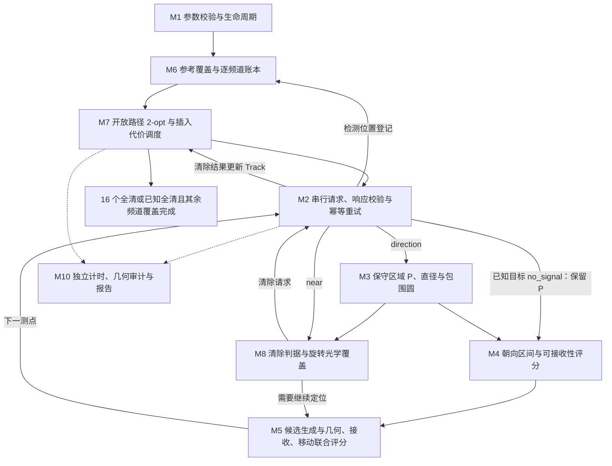

# v2 改进与验证报告

代码在 macOS 完成，并通过 30 对自建场景的离线验证；2026-09-11 已在 Windows 官方模拟器 v1.1 完成 Q3、Q4 各一次演练，分别清除 14/14、16/16，未使用正式测试机会。模型依据及覆盖证明见 [DESIGN.md](DESIGN.md)，运行命令见 [README.md](README.md)。

## 官方模拟器演练结果

两场于北京时间 2026-09-11 12:18–12:19 完成，使用提交 `2b5eaf2` 的原始 v2 默认配置，运行前后源码指纹均与 macOS 离线验证一致。Q3 通过 Python 入口运行，Q4 通过 `run_practice.ps1` 包装器运行。

| 题型 | 测试案例编码 | 清除数 / 总数 | 清除比例 | 虚拟总时间（秒） | 平均定位清除时间（秒/个） | 程序现实时间近似值（秒） |
| --- | --- | ---: | ---: | ---: | ---: | ---: |
| Q3 | `2EDD-M7JS-82KD-48A6` | 14/14 | 100% | 4012.137519 | 286.58 | 1.128 |
| Q4 | `3J8X-EE29-BDXF-94DN` | 16/16 | 100% | 9977.434454 | 623.59 | 2.914 |

Q3 为全向 14 个、定向 0 个；Q4 为全向 3 个、定向 13 个，来自结束界面的实际总数。清除数由去重后的成功 `/clear` 响应统计，并与界面指令表核对。平均时间严格为整场 `/exit` 虚拟时间除以清除数，包含巡检、失败动作与结束前排查。现实时间为 `/exit` 与 `/enter` 响应的服务端时间戳差（`server_timestamp_proxy`），不是界面精确程序耗时，也不是由取整的剩余时间反推。

两场独立日志重放均通过；计时复算误差分别为 0.000001352 秒与 0.000001176 秒。已核对公开定位多边形的包围圆清除证据；官方源坐标不公开，不能像离线场景一样审计真值包含性。Q3 以覆盖排查完成且已知目标全清停止，Q4 清除 16 个达到题给上限停止。

### 耗时、清除进度与路线

| 诊断指标（非官方单独计分项） | Q3 | Q4 |
| --- | ---: | ---: |
| 移动路程（m） | 16825.69 | 40997.17 |
| 检测次数 | 97 | 287 |
| 频道切换次数 | 92 | 263 |
| 无信号比例 | 69.07% | 88.50% |
| 清除尝试次数 | 14 | 16 |
| 清除失败次数 | 0 | 0 |
| 光学覆盖回退次数 | 0 | 0 |
| 拒绝请求 / 通信错误 | 0 / 0 | 0 / 0 |
| 最后清除后耗时（秒） | 0.00 | 0.00 |

移动仍占 Q3 总时间的 83.87%、Q4 的 82.18%。两场未触发光学覆盖回退，但每次清除仍包含题给 3 秒光学定位成本，不能把“无回退”写成“无光学定位耗时”。本次最后一次清除前已经完成必要巡检，因此清除后的确认时间为零，不代表未知频道的排查成本消失。

Q4 从第 6 个到第 7 个清除之间有约 3918.08 秒虚拟时间的进度平台，说明即使无失败清除，巡检与目标调度仍有显著成本；仅靠清除成功率不能解释整场效率。

路线来自公开请求中的机器人坐标，星号是成功清除时的机器人位置，标号是频道；真源在其 20 m 清除范围内，星号不能当作真源精确坐标。虚线为半径 1800 m 的目标区域边界，圆外巡检点属于覆盖计划。

### 与 v1 的比较范围

v1 官方 Q3、Q4 分别为 380.40、1103.17 秒/个，v2 本次为 286.58、623.59 秒/个。这只是不同随机案例的实测记录：Q3 总数从 13 变为 14，Q4 从全定向 16 个变为全向 3 个与定向 13 个；不能据此给出官方同场景改进百分比。算法改进幅度应参考下文 30 对相同自建场景的配对结果。每种题型只有一次 v2 官方演练，不能据此估计官方总体成功率。

本次每局的脱敏界面文本、完整公开通信日志、决策、配置、指标与独立审计分别保存在 [Q3 证据目录](runs/official_q3_001/) 和 [Q4 证据目录](runs/official_q4_001/)。没有构造综合分数，也没有执行正式测试。

模拟器显示原始加密日志已保存：Q3 为 `practice-p3-2328004982718451161-2EDD-M7JS-82KD-48A6.jlog`（30.5 KiB），Q4 为 `practice-p4-4276927621161090366-3J8X-EE29-BDXF-94DN.jlog`（64.1 KiB）。本次尝试 UI 导出时出现“无法打开目录选择窗口，请稍后重试”，因此 `.jlog` 未导出到仓库；公开 JSONL 不能替代原始加密日志，也不据此声称正式上传完成。

## 对 v1 问题的处理

| v1 报告提出的问题 | 本版实现 | 验证入口 |
| --- | --- | --- |
| 定向失信号后大范围光学搜索 | 正观测朝向交集、保证距离内负观测约束、保留全向分支、安全接收凸包与正负观测间分数插值；光学回退按区域长轴旋转 | `visibility.py`、`planning.py`、方向/失信号测试 |
| 未知频道排查和末期折返 | Q3 巡检环 1400→1150 m、逐频道整格覆盖与沿途扫描；Q4 方格 45 点→三角形 31 点 | `coverage.py`、全朝向边界覆盖测试 |
| 目标顺序与测点相互独立 | 开放路径 2-opt、目标插入代价、沿巡检路线给已知目标补充观测 | `routing.py`、`strategy.py`、路径长度测试 |
| 初步基准过小 | 30 个固定案例，涵盖 10–16 个源、边界、朝外、切向、混合、全定向、聚集、重合、极端固定误差 | `configs/scenarios.json`、配对运行与独立审计 |

v1 原代码、原始材料、exe 和历史证据未修改；v2 直接复用稳定几何、通信与记录方法，独立评价继续调用全局 Benchmark。

## 模块化技术细节与算法实现

本节按实际代码模块说明本次默认 v2 的算法、输入输出和决策过程。两场官方演练的参数已完整归档在各局 `metadata.json`；[configs/default.json](configs/default.json) 为 `{}`，表示使用 [solver/config.py](solver/config.py) 中的默认值，并继承未覆盖的 v1 参数。下文将有几何依据的覆盖与清除条件、有限样本启发式和工程运行机制分别说明。

### 模块、算法与接口映射

| 编号 / 模块 | 实际使用的算法或机制 | 输入 → 输出 | 代码与主要函数 |
| --- | --- | --- | --- |
| M1 配置与生命周期 | 配置继承、物理常量与预算校验、状态管理、结束后自动评价 | CLI / JSON、进入响应 → 配置、有效剩余预算、运行状态 | [config.py](solver/config.py)：`Config.validate()`、`load_config()`；[runner.py](solver/runner.py)：`execute_run()` |
| M2 协议边界 | 串行 HTTP、幂等重试、UTF-8 与响应字段校验 | 动作 → 合法公开响应，或结果未知 / 失败状态 | [protocol.py](solver/protocol.py)：`CheckedTransport.send()`；复用 [v1 Client](../baseline_v1/baseline/protocol.py) |
| M3 几何与候选源采样 | 半平面裁剪、最远顶点对、最小包围圆；单调链凸包、点 / 线段退化判定、确定性位置采样 | 正观测、P、收信号位置 → 更新 P、D、包围圆、凸包与有限样本 | [geometry.py](solver/geometry.py)：复用 `clip_bearing()`、`enclosing_circle()`；新增 `convex_hull()`、`contains()`、`hypotheses()` |
| M4 可接收性建模 | 圆周区间求交、条件性负观测约束、全向 / 定向分支并存、凸包接收证据 | P、正观测、无信号位置、失败清除位置 → 有限状态集、`visibility_score`、接收保证标记 | [visibility.py](solver/visibility.py)：`arc()`、`intersect()`、`VisibilityModel.guaranteed()`、`score()` |
| M5 局部测点规划 | 接收侧前进与横移、正观测点凸组合、正负观测间插值、有限样本极小极大与加权排序 | Track、当前位置、下一巡检点 → 下一测点、候选数与评分分解 | [planning.py](solver/planning.py)：`candidates()`、`select_measurement()` |
| M6 全域覆盖与频道证据 | Q3 六边形环、整格覆盖位集；Q4 等边三角形铺网；逐频道覆盖账本 | 题型、全部检测位置 → 参考点、覆盖掩码与频道覆盖证据 | [coverage.py](solver/coverage.py)：`survey_points()`、`CoverageLedger.point_mask()`、`observe()`、`complete()` |
| M7 路径与任务调度 | 最近邻初始化、开放路径 2-opt、目标插入代价、延期定位与就地补测 | 待巡检点、已知 / 未知频道、包围圆 → 路线、下一任务及停止证据 | [routing.py](solver/routing.py)：`open_route()`、`insertion_cost()`；[strategy.py](solver/strategy.py)：`run()`、`scan_waypoint()`、`opportunistic_scan()` |
| M8 清除与光学回退 | 包围圆覆盖、估计中心试探、沿直径方向旋转的方格覆盖、失败位置去重 | P、near 响应、历史失败点 → 清除动作及可审计原因 | [strategy.py](solver/strategy.py)：`localize()`、`clear()`；[geometry.py](solver/geometry.py)：`oriented_optical_cover()` |
| M9 离线场景与配对执行 | 固定种子分层 / 压力场景、固定位置误差、同一协议替身、场景哈希配对 | 场景规范、算法版本 → 同场景两版运行证据 | [scenarios.py](solver/scenarios.py)：`create_sources()`、`scenario_hash()`、`ScenarioTransport`；[benchmark_suite.py](benchmark_suite.py) |
| M10 产物、评价与审计 | 原子 JSON 写入、源码清单哈希、独立日志重放、事后几何核验与指标聚合 | 事件、决策、配置、事后真值 / UI 总数 → metrics、audit、比较表和图表 | [artifacts.py](solver/artifacts.py)：`write_json()`、`source_manifest()`；[evaluation.py](solver/evaluation.py)：`evaluate_run()`；[verify_artifacts.py](verify_artifacts.py)：`audit()`；[make_figures.py](reporting/make_figures.py) |

### 模块关系与反馈流程

实线表示运行中的调用或观测反馈，虚线表示事后评价读取证据。M9 仅在离线套件中向 M2 提供模拟响应；官方运行时 M2 连接模拟器 HTTP 接口。

`Track` 在 v1 的 P、正观测、已测点和清除状态上增加 `misses` 与 `failed_clears`。正示向度继续调用 v1 几何更新；负观测和失败清除只进入样本筛选与排序，不删除保守多边形。逐频道覆盖账本独立维护已检测点、覆盖位集；一个频道是否可判不存在还要由策略检查它从未获得正示向度且未清除。

### M3 / M4：保守定位与可接收性约束

几何定位继续使用半径 1800 m 圆的外接正 64 边形、±1.01° 示向扇区及 1500 m 前向投影上界。直径通过 O(v²) 顶点对枚举求得；最小包围圆沿用二点 / 三点支撑圆枚举与全顶点包含检查，最坏 O(v⁴)。v2 新增单调链凸包：对 n 个收信号位置排序后构造上下链，总复杂度 O(n log n)，并用 `contains()` 处理凸包退化为点或线段的情况。

接收模型的有限源位置由 `hypotheses()` 构造，包括 P 的顶点平均位置、全部顶点、相邻顶点中点、顶点与平均位置的中点，去重后逐一计算约束。这里的顶点平均位置与 M5 用于预测的包围圆中心是两种不同取点方式。

对每个假想源 q，`VisibilityModel` 执行以下步骤：

1. 由正观测位置 s 计算接收半径下界 `R_low(q) = max(1000, max distance(q, s))`；排除目标圆外、下界超过 1500 m、或距曾失败清除点不超过 20 m 的样本。
2. 每个收信号位置给出以 `bearing(q, s)` 为中心、宽 180° 的可能朝向区间。`arc()` 拆分跨越 0° 的区间，`intersect()` 对历史区间逐次求交。
3. 只有无信号位置 t 满足 `distance(q, t) ≤ R_low(q)` 时，才对定向分支加入相反半平面的朝向约束；否则无信号可能仅由距离过远引起。严格角边界使用闭区间外包。
4. 同时维护全向分支的半径上界 `min(1500, min distance(q, t))`，检查是否存在相容半径。Q4 的全向与定向解释均可保留，不预先把所有频道判为定向。
5. 对候选测点，以可行朝向区间长度比例和半径区间的线性评分组合打分；两种分支均可行时取等权平均，再对有限源样本求平均。没有可用样本时返回 0.5；零宽朝向区间也使用中性角度评分，不宣告真实区域为空。

上述 `visibility_score` 是人为规定权重的排序量，不是校准的接收概率或贝叶斯后验。独立的 `guaranteed()` 则检查测点是否在历史收信号位置的凸包内：同一源的接收圆盘与辐射闭半平面均为凸集，因此凸组合仍可接收。该保证与样本评分分开；对 Q3，P 的所有顶点距测点不超过 1000 m 也提供接收保证。详细推导见 [DESIGN.md](DESIGN.md)。

### M5：候选测点与联合评分

`candidates()` 先复用 v1 的首示向局部格点与包围圆周围 8 方位候选，再补充三类点：最近 3 个正观测位置向估计中心前进 40% / 70% / 90%，每处横移 `0、±min(100, r/2)` 米；最近 4 个正观测位置两两取中点；最近一次无信号位置与距其最近的正观测位置之间取 1/4、1/2、3/4 插值点。所有候选去重，并剔除距该频道任一已测位置不足 8 m 的点。这是有限插值探测，不是连续二分搜索。

对候选 s，以 P 顶点和包围圆中心作为假想源，对未来误差 `−ε、0、+ε` 枚举预测裁剪，取直径最大值 W(s)；距离 s 不超过 5 m 的假想源跳过示向模拟。设当前直径为 D、接收评分为 v(s)、当前位置为 x、包围圆中心为 c、下一巡检点为 w，默认评分为：

\[
J(s)=0.65\left[v(s)W(s)+(1-v(s))\,1.25D\right]
+0.04\|s-x\|+0.15\|s-c\|
+\begin{cases}0.02\|s-w\|,&w\text{ 存在},\\0,&\text{否则}.\end{cases}
\]

其中 0.65 为 `information_weight`，1.25 为 `miss_penalty`，0.04 为继承的 `movement_weight`，0.15 为 `onward_weight`；最后的 0.02 是代码内固定系数。Q3 满足全顶点距离条件时把 v(s) 设为 1。程序按 J 最小排序，平局按坐标打破；该式是几何残差、失信号代价和移动距离的启发式加权和，不等同于真实期望耗时，也没有连续最优性保证。

`next_measurement` 记录 `objective`、`predicted_worst_diameter_m`、`visibility_score`、`ranking_hypotheses`、`guaranteed_signal`、`guaranteed_range`、`travel_m` 和候选数。无可用候选时返回 `None`，策略记录 `local_candidates_exhausted` 并进入光学回退。

### M6：参考覆盖、位集与不存在证据

| 子模块 | 默认构造与计算 | 如何形成证据 |
| --- | --- | --- |
| Q3 参考巡检 | 原点 + 半径 1150 m 的正六边形顶点，共 7 点 | 完整扫描参考点可覆盖整个目标圆，仍保留独立于网格的结束依据 |
| Q3 自适应覆盖 | 150 m 方格；保留与目标圆相交的整格，包括跨边界部分；测点距一格所有角点均 ≤ `1000−1e-7` m 才标记该格 | `point_mask()` 缓存位置覆盖的位集，`observe()` 逐频道按位 OR；全位覆盖给出整域接收覆盖 |
| Q4 参考巡检 | 保留与目标圆相交的边长 980 m 等边三角形的所有顶点，默认 31 点 | 三角形顶点距其中源均小于 1000 m，且任一过源闭半平面至少含一个顶点 |
| 频道是否不存在 | `complete()` 检查参考点全覆盖，或 Q3 的整格位集全覆盖 | 策略仅对未收到正示向度且未清除的频道记录 `absence_certificate`；Q4 不使用圆盘负观测排除 |

`disk_intersects_polygon()` 用原点包含性、顶点到原点距离及原点到边的最短距离判相交，保留圆边界相切单元。Q4 的外侧巡检点是覆盖构造的一部分。正观测和负观测都登记为检测位置，但已发现频道不会因覆盖完成而转为“不存在”。

### M7：开放路线、插入调度与停止

`open_route()` 先以最近邻构造不返回起点的开放路线，再最多执行 8 轮 2-opt：枚举并翻转连续子段，仅接受连接边总长严格减少的变化；允许翻转末段改变终点。一次候选区间扫描为 O(n²) 次边长比较，Python 列表翻转另有区间长度成本。它是局部改进法，不保证全局最短路线。

主循环从当前位置对剩余巡检点重新规划，并取首点 w。已知目标按包围圆中心 c 的插入代价排序：`distance(x,c) + distance(c,w) − distance(x,w) + 0.25r`；无下一巡检点时为 `distance(x,c) + 0.25r`。有巡检点且最小代价超过 `localize_detour_m=700` m 时先巡检，否则定位该目标。

`scan_waypoint()` 对未知频道扫描；对已知未清除目标，若新位置与历史测点间隔合格、r > 20 m 且接收评分 ≥ 0.75，则顺便补测。`opportunistic_scan()` 在局部定位结束后，仅针对 Q3，于当前点给新增整格覆盖占全部格数至少 12% 的未知频道补扫；不会在每次移动途中连续检测。频道顺序均优先保持当前频道，再按编号排序。

`Strategy.run()` 只在清除 16 个，或“已知目标全部清除且其余频道都有不存在证据”时记录 `stop_certificate`。候选评分低、一次无信号或已清除 10 个均不构成结束依据。没有未知频道后会清空剩余巡检计划，集中处理已知目标；参考点耗尽却仍有未知频道则报一致性错误。

### M8：清除判据与旋转光学覆盖

| 分支 | 默认条件与行为 | 保证范围 / 日志 |
| --- | --- | --- |
| 近距离清除 | `near` 后同点清除；若失败则报错 | 基于公开近距离响应，记录 `near` |
| 包围圆清除 | r ≤ 19.9 m 时在 c 清除，失败则报错 | 全部 P 被清除圆覆盖，记录 `guaranteed_enclosing_circle` |
| 中心试探 | 至少两次正观测且 r ≤ 45 m，c 距历史失败清除点均 ≥ 8 m | 启发式尝试；失败不删除 P，记录 `opportunistic_estimate` 与失败点 |
| 光学覆盖 | 单次 `localize()` 最多 12 轮，或候选耗尽后触发 | 记录 `optical_fallback`，随后逐点尝试 `guaranteed_grid_cover` |

光学回退以 P 的最远顶点对确定直径方向，比较原坐标系与该方向坐标系下的 27.5 m 相交方格中心集合，选中心数更少的一组。这里只比较两种坐标方向，不搜索全局最优旋转角。旋转保持距离，完整集合的覆盖半径为 `27.5/√2≈19.45 m`。先剔除与历史失败清除位置相同的中心（容差 `1e-8` m），再用最近邻访问；点数不超过 250 且启用路径优化时追加 2-opt，超过 250 只用最近邻。单个格点可清除失败；“保证”针对执行完整覆盖集合且 P 包含真值的情形。

### M1 / M2：运行与通信的实际机制

配置层继承 v1 后校验类型、有限数值、覆盖不等式，并固定题给目标圆、接收半径及清除半径。默认启用 `visibility_enabled`、`route_optimization`、`adaptive_coverage`、`triangular_coverage`、`oriented_optical`；本节和已报告默认结果均使用这些开启值。仓库中的消融配置只是可运行入口，本报告未据此宣称单模块收益。

协议层复用 v1 串行客户端：默认 5 s 超时、最多 2 次同 ID / 同内容重试、0.25 / 0.5 s 退避；新增 `CheckedTransport` 验证 UTF-8、响应类型、时钟、示向角范围与结果枚举。畸形响应转换为可重试传输错误，最终仍未知则标记 `uncertain`。拒绝响应不覆盖有效虚拟时钟，清除不切换检测频道。

`execute_run()` 从 `/enter` 返回的剩余现实时间中扣除进入请求及重试已经消耗的时间。每个动作前的 `guard()` 再检查完整请求重试预算；默认预留 25 s 退出时间，并保留 12000 动作、350000 s 虚拟预算。预算不足归档 `incomplete`；异常或中断归档 `failed`；运行完成却独立评价失败则标记 `failed_validation`。结果未知或中断时不发送新的退出动作。

### M9 / M10：配对验证与证据来源

`create_sources()` 生成固定种子随机、边界、朝外、切向、聚集、重合等场景；`ScenarioTransport` 复用 v1 物理引擎，加入固定正 / 负误差及重合位置的定向 near 修正。其 `alternating` 误差模式按固定位置哈希值的符号取 ±1°，不是按调用次数交替变号。两版通过同一个运行包装器执行，`scenario_hash()` 将场景规范和实际生成源共同哈希，用于确认配对输入一致。离线真值供模拟后端产生响应，并在结束后用于审计；不进入策略决策或官方后端。

`source_manifest()` 对运行源码、配置、复用的 v1 模块与 Benchmark 建立逐文件 SHA-256，先归一 CRLF / LF 再聚合，支持跨系统核对。`write_json()` 先写临时文件再替换目标，运行目录禁止复用。`evaluate_run()` 调用独立 [Benchmark.evaluate](../../Benchmark/evaluate.py) 重放请求、去重计时，按整场 T/K 聚合；`audit()` 另检查离线真值是否始终位于 P 内、包围圆清除是否覆盖所有顶点及不存在证据是否误删真实频道。

官方运行没有源坐标，因此其几何审计只核对公开区域和清除位置；UI 总数是事后补录证据。日志中的 `signal_miss`、`target_schedule`、`opportunistic_survey`、`absence_certificate`、`stop_certificate` 将上述模块的实际决策连接到评价结果。图表读取已有证据生成，本次两场官方运行没有触发光学回退；该模块已实现且在配对离线 Q4 中触发 4 次。算法未使用神经网络、强化学习或预训练模型。

## 配对结果

每一对使用相同源场景和误差规则，v1 采用原始默认参数。下表是各局平均时间 T/K 的均值，整场移动、检测、频道切换、失败清除和末期排查都计入。

| 题型 | 每版局数 | v1 全清 | v2 全清 | v1 秒/个 | v2 秒/个 | 均值变化 |
| --- | ---: | ---: | ---: | ---: | ---: | ---: |
| Q3 | 13 | 13/13 | 13/13 | 373.28 | 327.04 | -12.39% |
| Q4 | 17 | 17/17 | 17/17 | 1003.48 | 795.95 | -20.68% |

| 诊断（该题型所有局合计） | v1 | v2 |
| --- | ---: | ---: |
| Q3 失败清除尝试 | 27 | 38 |
| Q3 光学回退次数 | 0 | 0 |
| Q4 失败清除尝试 | 1147 | 34 |
| Q4 光学回退次数 | 33 | 4 |

Q4 失信号与光学回退成本明显降低；Q3 失败清除尝试从 27 次升至 38 次，说明时间改善并不意味着每个诊断都改善。末期确认时间下降也受到任务排列顺序影响，不能从总时间中扣除或单独当作性能结论。

## 保留的退步案例

| 场景 | v2 平均时间相对 v1 |
| --- | ---: |
| `q3_boundary` | +30.20% |
| `q4_legacy_20260911` | +32.08% |
| `q4_stratified_n16` | +3.82% |
| `q4_tangent_positive` | +10.77% |

4 个场景变慢，但都完成全清。当前候选评分、巡检环半径及延期定位权重属于启发式，尚不保证逐案例改进。所有 30 对均保留在 [COMPARISON.md](runs/validation_20260911/COMPARISON.md) 和 [suite.json](runs/validation_20260911/suite.json)，没有排除退步案例。

## 验证与边界

- v2：28 项测试通过，其中 25 项几何/策略/生命周期测试，3 项 CLI/真实本机 HTTP 测试。HTTP 使用随机回环端口的测试替身，四接口按附件样例累计 199 秒。
- v1：11 项原回归测试通过；独立 Benchmark：7 项测试通过。
- 30 对共 60 局均全清，独立计时重放与几何审计通过；审计核对每个定位多边形仍包含离线真值，以及每次保证清除确实覆盖全部顶点。
- 开发主测试环境为 macOS/Python 3.14；另在 Python 3.12 执行策略测试，所有源文件通过 Python 3.10 语法兼容检查。此次 Windows/Python 3.12.9 实机重新运行 v2 全部 28 项测试通过，并完成官方 exe 演练及 PowerShell 包装器实测；两局独立计时、公开几何证据与当前源码一致性审计均通过。
- 源与检测点重合时，对自建测试替身的闭半平面 near 判定作了退化修正，两版使用同一修正。现有 v1 旧实验不重算、不覆盖。
- 正式模式不会填写未知总数；演练 UI 总数若否定全清，验证返回失败。预算不足、畸形响应、丢失响应结果未知、近距离或包围圆保证失效都有明确失败路径。

这套有限场景是自建测试分布，不代表官方随机生成规律。不能把离线均值当作官方演练成绩或正式结果，也没有构造题目未公布的总分。

## 复现与证据归档

算法入口均只依赖 Python 标准库。使用 README 中的 `--dry-run` 检查导入与参数，再在 Windows 模拟器界面启动新的演练并运行 official 命令，不能复用本次已结束案例。当前归档包含已审核的离线套件与上述两场官方演练；其他新运行仍默认忽略。`record_result.py` 用于结束后补录 UI 实际总数与证据。

图表使用与 v1 相同的 Matplotlib 样式，PNG 嵌入正文，SVG 和 [图表源数据](report_data.json) 同时保存。重建五组图表运行 `python experiments/baseline_v2/reporting/make_figures.py`，依赖见 `../baseline_v1/requirements-report.txt`。该脚本位于独立的 `reporting/` 目录，未改变运行源码清单及既有指纹；v1 图表与历史证据保持原样。

本次证据的父 Git 提交保存在每局 metadata 中；真正标识所运行新增代码的是源码指纹（包括复用的 v1 和 Benchmark 文件，CRLF 归一为 LF）：

`07284746dbed216cd04bcf03f9645f874ce5dfcdbbdc584fe532d509d798f397`

独立审计明细：[audit.json](runs/validation_20260911/audit.json)。运行记录含原始请求/响应、决策、配置、来源和事后离线真值，可再次执行 `verify_artifacts.py --require-current-source` 校验源码一致性。
