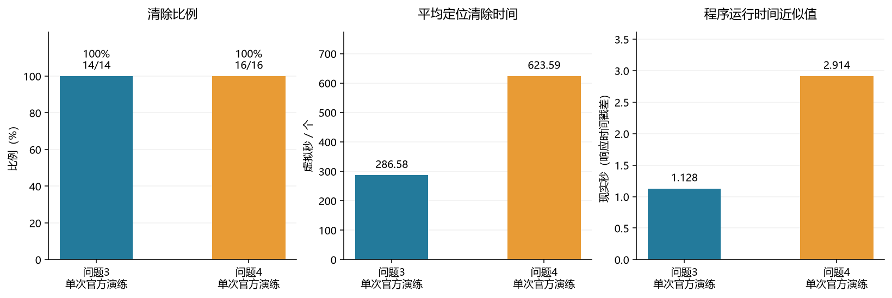
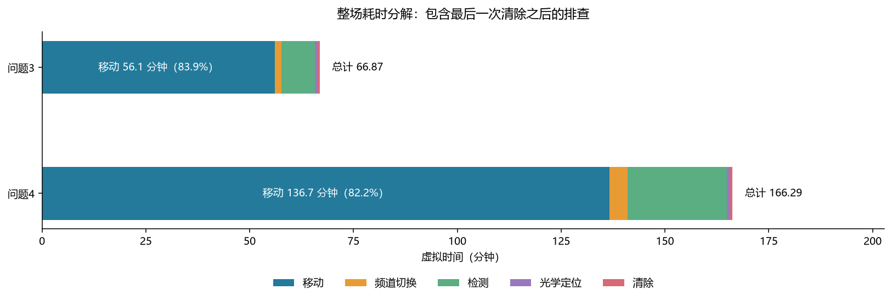
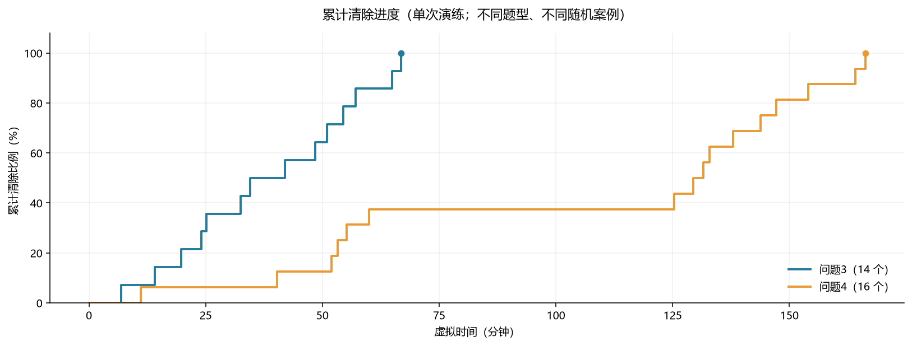
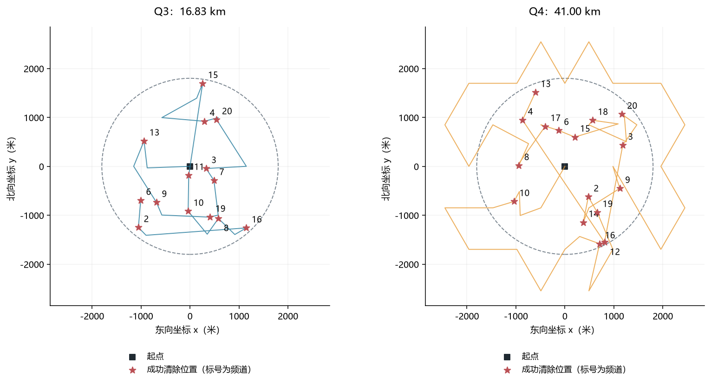
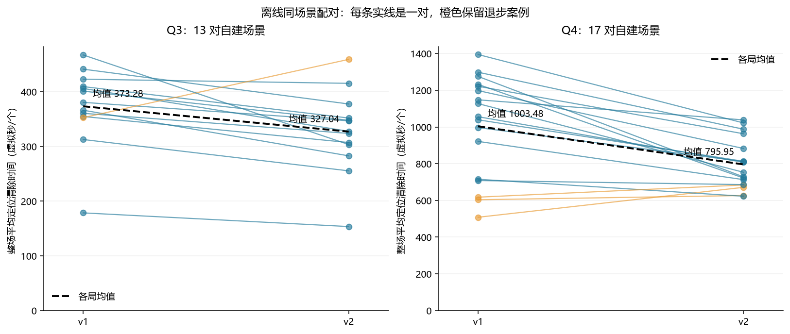

# v2 改进与验证报告

代码在 macOS 完成，并通过 30 对自建场景的离线验证；2026-09-11 已在 Windows 官方模拟器 v1.1 完成 Q3、Q4 各一次演练，分别清除 14/14、16/16，未使用正式测试机会。模型依据及覆盖证明见 [DESIGN.md](DESIGN.md)，运行命令见 [README.md](README.md)。

## 官方模拟器演练结果

两场于北京时间 2026-09-11 12:18–12:19 完成，使用提交 `2b5eaf2` 的原始 v2 默认配置，运行前后源码指纹均与 macOS 离线验证一致。Q3 通过 Python 入口运行，Q4 通过 `run_practice.ps1` 包装器运行。

| 题型 | 测试案例编码 | 清除数 / 总数 | 清除比例 | 虚拟总时间（秒） | 平均定位清除时间（秒/个） | 程序现实时间近似值（秒） |
| --- | --- | ---: | ---: | ---: | ---: | ---: |
| Q3 | `2EDD-M7JS-82KD-48A6` | 14/14 | 100% | 4012.137519 | 286.58 | 1.128 |
| Q4 | `3J8X-EE29-BDXF-94DN` | 16/16 | 100% | 9977.434454 | 623.59 | 2.914 |

Q3 为全向 14 个、定向 0 个；Q4 为全向 3 个、定向 13 个，来自结束界面的实际总数。清除数由去重后的成功 `/clear` 响应统计，并与界面指令表核对。平均时间严格为整场 `/exit` 虚拟时间除以清除数，包含巡检、失败动作与结束前排查。现实时间为 `/exit` 与 `/enter` 响应的服务端时间戳差（`server_timestamp_proxy`），不是界面精确程序耗时，也不是由取整的剩余时间反推。

两场独立日志重放均通过；计时复算误差分别为 0.000001352 秒与 0.000001176 秒。已核对公开定位多边形的包围圆清除证据；官方源坐标不公开，不能像离线场景一样审计真值包含性。Q3 以覆盖排查完成且已知目标全清停止，Q4 清除 16 个达到题给上限停止。

### 耗时、清除进度与路线

| 诊断指标（非官方单独计分项） | Q3 | Q4 |
| --- | ---: | ---: |
| 移动路程（m） | 16825.69 | 40997.17 |
| 检测次数 | 97 | 287 |
| 频道切换次数 | 92 | 263 |
| 无信号比例 | 69.07% | 88.50% |
| 清除尝试次数 | 14 | 16 |
| 清除失败次数 | 0 | 0 |
| 光学覆盖回退次数 | 0 | 0 |
| 拒绝请求 / 通信错误 | 0 / 0 | 0 / 0 |
| 最后清除后耗时（秒） | 0.00 | 0.00 |

移动仍占 Q3 总时间的 83.87%、Q4 的 82.18%。两场未触发光学覆盖回退，但每次清除仍包含题给 3 秒光学定位成本，不能把“无回退”写成“无光学定位耗时”。本次最后一次清除前已经完成必要巡检，因此清除后的确认时间为零，不代表未知频道的排查成本消失。

Q4 从第 6 个到第 7 个清除之间有约 3918.08 秒虚拟时间的进度平台，说明即使无失败清除，巡检与目标调度仍有显著成本；仅靠清除成功率不能解释整场效率。

路线来自公开请求中的机器人坐标，星号是成功清除时的机器人位置，标号是频道；真源在其 20 m 清除范围内，星号不能当作真源精确坐标。虚线为半径 1800 m 的目标区域边界，圆外巡检点属于覆盖计划。

### 与 v1 的比较范围

v1 官方 Q3、Q4 分别为 380.40、1103.17 秒/个，v2 本次为 286.58、623.59 秒/个。这只是不同随机案例的实测记录：Q3 总数从 13 变为 14，Q4 从全定向 16 个变为全向 3 个与定向 13 个；不能据此给出官方同场景改进百分比。算法改进幅度应参考下文 30 对相同自建场景的配对结果。每种题型只有一次 v2 官方演练，不能据此估计官方总体成功率。

本次每局的脱敏界面文本、完整公开通信日志、决策、配置、指标与独立审计分别保存在 [Q3 证据目录](runs/official_q3_001/) 和 [Q4 证据目录](runs/official_q4_001/)。没有构造综合分数，也没有执行正式测试。

模拟器显示原始加密日志已保存：Q3 为 `practice-p3-2328004982718451161-2EDD-M7JS-82KD-48A6.jlog`（30.5 KiB），Q4 为 `practice-p4-4276927621161090366-3J8X-EE29-BDXF-94DN.jlog`（64.1 KiB）。本次尝试 UI 导出时出现“无法打开目录选择窗口，请稍后重试”，因此 `.jlog` 未导出到仓库；公开 JSONL 不能替代原始加密日志，也不据此声称正式上传完成。

## 对 v1 问题的处理

| v1 报告提出的问题 | 本版实现 | 验证入口 |
| --- | --- | --- |
| 定向失信号后大范围光学搜索 | 正观测朝向交集、保证距离内负观测约束、保留全向分支、安全接收凸包与折半探测；光学回退按区域长轴旋转 | `visibility.py`、`planning.py`、方向/失信号测试 |
| 未知频道排查和末期折返 | Q3 巡检环 1400→1150 m、逐频道整格覆盖与沿途扫描；Q4 方格 49 点→三角形 31 点 | `coverage.py`、全朝向边界覆盖测试 |
| 目标顺序与测点相互独立 | 开放路径 2-opt、目标插入代价、沿巡检路线给已知目标补充观测 | `routing.py`、`strategy.py`、路径长度测试 |
| 初步基准过小 | 30 个固定案例，涵盖 10–16 个源、边界、朝外、切向、混合、全定向、聚集、重合、极端固定误差 | `configs/scenarios.json`、配对运行与独立审计 |

v1 原代码、原始材料、exe 和历史证据未修改；v2 直接复用稳定几何、通信与记录方法，独立评价继续调用全局 Benchmark。

## 配对结果

每一对使用相同源场景和误差规则，v1 采用原始默认参数。下表是各局平均时间 T/K 的均值，整场移动、检测、频道切换、失败清除和末期排查都计入。

| 题型 | 每版局数 | v1 全清 | v2 全清 | v1 秒/个 | v2 秒/个 | 均值变化 |
| --- | ---: | ---: | ---: | ---: | ---: | ---: |
| Q3 | 13 | 13/13 | 13/13 | 373.28 | 327.04 | -12.39% |
| Q4 | 17 | 17/17 | 17/17 | 1003.48 | 795.95 | -20.68% |

| 诊断（该题型所有局合计） | v1 | v2 |
| --- | ---: | ---: |
| Q3 失败清除尝试 | 27 | 38 |
| Q3 光学回退次数 | 0 | 0 |
| Q4 失败清除尝试 | 1147 | 34 |
| Q4 光学回退次数 | 33 | 4 |

Q4 失信号与光学回退成本明显降低；Q3 失败清除尝试从 27 次升至 38 次，说明时间改善并不意味着每个诊断都改善。末期确认时间下降也受到任务排列顺序影响，不能从总时间中扣除或单独当作性能结论。

## 保留的退步案例

| 场景 | v2 平均时间相对 v1 |
| --- | ---: |
| `q3_boundary` | +30.20% |
| `q4_legacy_20260911` | +32.08% |
| `q4_stratified_n16` | +3.82% |
| `q4_tangent_positive` | +10.77% |

4 个场景变慢，但都完成全清。当前候选评分、巡检环半径及延期定位权重属于启发式，尚不保证逐案例改进。所有 30 对均保留在 [COMPARISON.md](runs/validation_20260911/COMPARISON.md) 和 [suite.json](runs/validation_20260911/suite.json)，没有排除退步案例。

## 验证与边界

- v2：28 项测试通过，其中 25 项几何/策略/生命周期测试，3 项 CLI/真实本机 HTTP 测试。HTTP 使用随机回环端口的测试替身，四接口按附件样例累计 199 秒。
- v1：11 项原回归测试通过；独立 Benchmark：7 项测试通过。
- 30 对共 60 局均全清，独立计时重放与几何审计通过；审计核对每个定位多边形仍包含离线真值，以及每次保证清除确实覆盖全部顶点。
- 开发主测试环境为 macOS/Python 3.14；另在 Python 3.12 执行策略测试，所有源文件通过 Python 3.10 语法兼容检查。此次 Windows/Python 3.12.9 实机重新运行 v2 全部 28 项测试通过，并完成官方 exe 演练及 PowerShell 包装器实测；两局独立计时、公开几何证据与当前源码一致性审计均通过。
- 源与检测点重合时，对自建测试替身的闭半平面 near 判定作了退化修正，两版使用同一修正。现有 v1 旧实验不重算、不覆盖。
- 正式模式不会填写未知总数；演练 UI 总数若否定全清，验证返回失败。预算不足、畸形响应、丢失响应结果未知、近距离或包围圆保证失效都有明确失败路径。

这套有限场景是自建测试分布，不代表官方随机生成规律。不能把离线均值当作官方演练成绩或正式结果，也没有构造题目未公布的总分。

## 复现与证据归档

算法入口均只依赖 Python 标准库。使用 README 中的 `--dry-run` 检查导入与参数，再在 Windows 模拟器界面启动新的演练并运行 official 命令，不能复用本次已结束案例。当前归档包含已审核的离线套件与上述两场官方演练；其他新运行仍默认忽略。`record_result.py` 用于结束后补录 UI 实际总数与证据。

图表使用与 v1 相同的 Matplotlib 样式，PNG 嵌入正文，SVG 和 [图表源数据](report_data.json) 同时保存。重建五组图表运行 `python experiments/baseline_v2/reporting/make_figures.py`，依赖见 `../baseline_v1/requirements-report.txt`。该脚本位于独立的 `reporting/` 目录，未改变运行源码清单及既有指纹；v1 图表与历史证据保持原样。

本次证据的父 Git 提交保存在每局 metadata 中；真正标识所运行新增代码的是源码指纹（包括复用的 v1 和 Benchmark 文件，CRLF 归一为 LF）：

`07284746dbed216cd04bcf03f9645f874ce5dfcdbbdc584fe532d509d798f397`

独立审计明细：[audit.json](runs/validation_20260911/audit.json)。运行记录含原始请求/响应、决策、配置、来源和事后离线真值，可再次执行 `verify_artifacts.py --require-current-source` 校验源码一致性。
