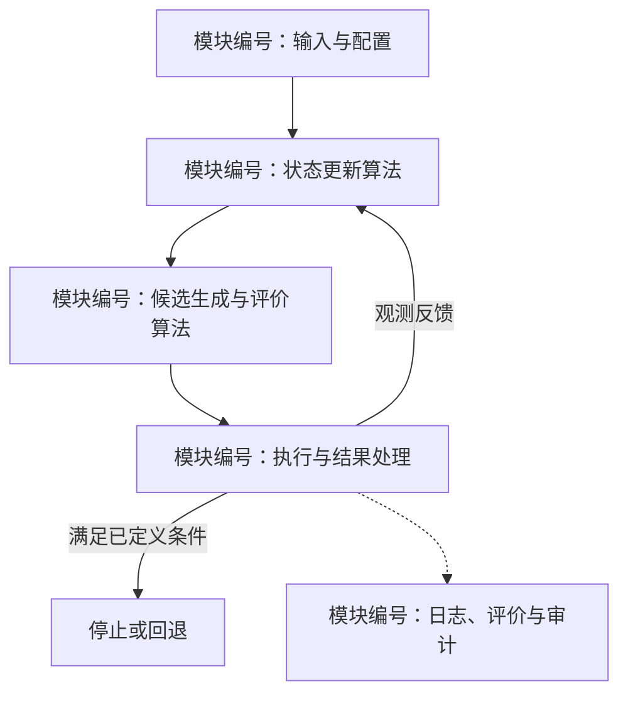

# 实验记录（空模板）

- 日期与时间（时区）：待记录
- 问题 / 演练或正式：待记录
- Git 提交：待记录
- 配置文件与版本：待记录
- 模拟器 SHA-256：待记录
- 案例编码：待记录
- 清除个数 / 演练结束后获知的总数：待记录
- 清除比例：待记录
- 虚拟定位清除总时间（秒）：待记录
- 平均定位清除时间（秒）：待记录
- 现实程序运行时间（秒）：待记录
- 结束原因：待记录
- 本地请求响应记录：待记录
- 正式导出日志原文件名（如适用）：待记录
- 核验情况及备注：待记录

## 模块化技术细节与算法实现（报告必填）

每次实验报告必须按实际代码模块客观说明所用算法种类与处理思路。本节是当前实现的技术说明，不写成 tips、调参建议、待办清单或只列库名；改进建议另设章节。使用本模板时，以运行时配置和源码版本为依据填写以下内容，删除占位文字。

### 1. 实现范围与模块映射

记录报告对应的代码版本 / 源码指纹、配置来源和启用开关；区分继承复用、新增、替换与关闭的模块。物理常量、配置默认值和本次实际取值应能区分，不能用后续代码描述历史实验。

| 模块编号 / 职责 | 算法名称或机制类型 | 处理思路 | 输入 → 输出 | 文件相对链接与类 / 函数 | 本次关键参数 / 启用状态 |
| --- | --- | --- | --- | --- | --- |
| 待填写 | 待填写具体方法，如半平面裁剪、离散极小极大、开放路径 2-opt | 待填写实际计算步骤和选择依据 | 待填写数据结构、状态或结果 | 待填写可定位的实现入口 | 待填写取值、单位和来源 |

模块应覆盖本次实际参与的配置与生命周期、协议、几何 / 状态估计、测点或动作规划、全域覆盖、路径与任务调度、清除与回退、离线场景、评价与证据归档；不适用的模块说明原因。第三方库与工程机制可以列出，但不能代替核心算法说明。

### 2. 各模块的算法过程

按上表模块编号逐项展开，至少说明：

- 算法类别和实际步骤：如何初始化、更新状态、生成候选、筛选和选择；给出目标函数、几何条件或足以复现决策的伪代码。
- 输入输出和调用位置：哪些信息来自公开响应，哪些是估计或历史状态，输出由哪个模块消费；链接到对应文件并写出函数名。
- 关键参数与触发条件：单位、实际阈值、迭代上限、平局处理、结束与回退条件，以及失败如何记录。
- 依据与适用边界：区分几何 / 逻辑保证、有限样本预测、启发式评分、经验结果；只对有依据的实现给出复杂度和最优性结论。不得把评分写成真实概率、外包络写成真值或有限测试写成普遍保证。
- 验证证据：对应的日志事件 / 字段、测试或审计入口；区分“已实现但本次未触发”“本次实际触发”和“仅离线验证”，未进行的消融不填写效果结论。

### 3. 模块关系与算法流程可视化

至少提供一幅与上述模块编号一致的模块依赖图、数据流图或算法流程图。静态节点关系优先使用仓库可渲染的 Mermaid；关键标签必须写出模块职责和算法，箭头注明输入输出、反馈或触发条件。图下补充简短文字说明，使无法渲染图形的阅读环境仍可理解流程。

此图仅为填写示例，必须替换为本次实际模块和调用关系。若另存图像或交互页面，正文仍需包含可直接阅读的说明，使用仓库内相对链接并保存可维护的源文件；不得仅链接到会话中的临时可视化。

### 4. 报告生成与更新检查

- 本节必须写入该实验的主报告原文件；更新报告时同时更新它实际使用的生成模板或内容来源，使重新生成不会丢失技术说明。
- 核对所有算法名称、函数名、公式系数、配置开关和流程分支与对应运行版本一致，区分两个实验的实现差异。
- 检查文件链接、图表语法和报告生成结果；说明新增技术章节不改变既有实验指标或原始证据。若重新实验，另建运行目录。
- 样式与详略可参考 [v1 报告](baseline_v1/REPORT.md) 和 [v2 报告](baseline_v2/REPORT.md)，不能复制其他版本的算法作为本次事实。
