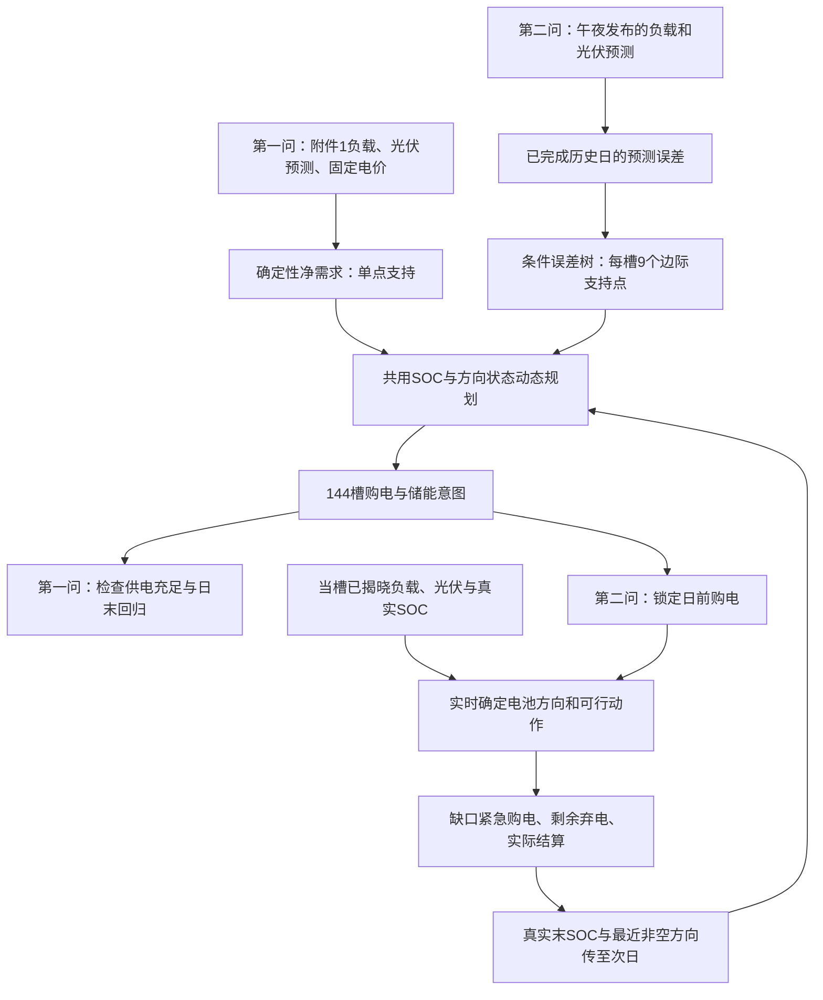

# 第一问至第二问：决策树条件误差与储能动态规划统一建模方案

更新日期：2026-09-13。

本文依据 exp006 报告、对应实现、原题和本次用户决策，汇总新的第一、第二问建模路线。本文是方案说明，不代表已完成第一问改写、第二问新版本运行或工作簿重新计算；exp006 原有结果仍保留其原方案身份。

## 1. 本次统一决定与适用边界

1. 第一问和第二问统一使用 exp006 的储能状态动态规划思想，不再以原线性规划作为拟采用的主求解器。
2. 第二问继承“冻结预测—条件误差树—边际需求支持—动态规划—实际执行—费用结算”的主线。
3. 电池实际充放电方向允许根据当槽已观测的负载和光伏改变，不再被日前意图方向锁死；日前购电量仍保持锁定。
4. 电池操作强度纳入方案选择，与真实购电费共同评价。
5. 费用容忍方向待澄清：用户原话为“允许一定的费用降幅来约束电池操作”。这可能指允许适度费用增幅，也可能指费用必须下降；本文不擅自将其改写为已批准的涨价比例。费用容忍参数及其正负范围均待确认。
6. “尽可能以 exp006 为准”不能取消题面硬约束。第一问必须满足日初、日末储电量相同；第二问没有这一每日回归约束。

**模型准确名称：基于条件误差决策树与离散储能动态规划的购电调度方法。** 决策树估计不确定性，动态规划选择购电与储能动作；不是一棵树直接输出所有购电决策，也不是强化学习。

第一问缺少可供训练误差树的历史预测—实际配对资料，因此采用该统一框架的确定性特例。不能为了名称统一，虚构误差样本或将第二问全年实际值用于训练第一问。

## 2. 原理与两问的衔接

电池具有跨时段作用：现在多充一度电，会改变以后可以放多少电。因此，不能只逐时点判断电价高低，而要把当前储电量作为状态，比较当前动作及其后续影响。

动态规划的做法是：把允许储电量划成网格，从一天末尾往前计算每个状态的最低后续代价，再从真实日初状态出发还原一整天的购电和储能计划。

第一问将题目给定的负载和光伏预测作为确定输入。第二问面对预测误差，先让决策树寻找“在类似时刻、预测净负载、预测光伏和电价条件下，过去通常偏差多少”，再把这种误差分布交给同一个动态规划框架。

| 内容 | 第一问 | 第二问 |
|---|---|---|
| 输入 | 附件1固定电价、负载和一天光伏预测 | 附件1固定电价、附件2历史实际与因果预测 |
| 不确定性 | 按给定预测建立确定性计划 | 决策树估计条件预测误差 |
| 主求解方法 | 离散储能动态规划 | 条件边际支持下的储能动态规划 |
| 日末条件 | 日末储电量严格等于日初 | 真实状态连续跨日，不每日复位 |
| 5倍紧急购电 | 不引入第二问的紧急购电规则 | 按当槽电价5倍结算实际缺口 |
| 实时动作 | 原题计划模型不凭空引入未知实际序列 | 允许按当槽实际改变充放电方向 |
| 输出 | result1.xlsx | result2.xlsx，334个评价日 |

## 3. 统一时间、变量与物理模型

### 3.1 时间与变量

一天划分为 (T=144) 个时段，

$$
\Delta t=\frac16\ \mathrm{h},\qquad t=0,\ldots,143.
$$

表中00:10是00:00—00:10区间终点，24:00是最后区间终点。以下 (s_t) 表示第 (t) 段开始时储电量，(s_{144}) 是24:00储电量。

| 符号 | 意义 | 单位 |
|---|---|---|
| (L_t,V_t) | 实际负载、光伏功率 | kW |
| (\hat L_t,\hat V_t) | 决策时已知或已发布的功率预测 | kW |
| (n_t=(L_t-V_t)\Delta t) | 实际净需求，允许为负 | kWh |
| (\hat n_t=(\hat L_t-\hat V_t)\Delta t) | 预测净需求 | kWh |
| (p_t) | 已知电价 | 元/kWh |
| (g_t) | 日前计划购电量，非负 | kWh |
| (c_t,d_t) | 交流母线侧充电、放电量，均非负 | kWh |
| (s_t) | 电池内部储电量；本文用SOC指代该能量状态 | kWh |
| (e_t,w_t) | 紧急购电量、未利用剩余电量 | kWh |
| (m_t\in\{-1,0,1\}) | 最近一次非空动作方向，正为充电 | 无量纲 |

净电池功率定义为

$$
P_t^{\mathrm{bat}}=\frac{c_t-d_t}{\Delta t}=6(c_t-d_t).
$$

充电为正、放电为负。不能用SOC差分直接代替母线侧功率，因为SOC递推包含效率损失。

### 3.2 设备与能量守恒

继承 exp006：容量12000 kWh，允许储电量1200—10800 kWh，最大充放电功率5000 kW。90%按往返效率解释，单向对称取

$$
\eta_c=\eta_d=\sqrt{0.9}.
$$

这是沿用的建模解释，不能写成题面已毫无歧义地规定单向效率。

$$
s_{t+1}=s_t+\eta_c c_t-\frac{d_t}{\eta_d},
$$

$$
1200\le s_t\le10800,\quad
0\le c_t,d_t\le\frac{5000}{6},\quad c_td_t=0.
$$

第二问的实际功率平衡转换成电量后为

$$
g_t+e_t+d_t=n_t+c_t+w_t,\qquad e_t,w_t\ge0.
$$

不设置售电收入。(w_t) 是总剩余，既可能来自光伏，也可能含已付费但未利用的购电，不能全部标作“弃光”。

### 3.3 通过状态转移保证充放电互斥

令网格上的动作是从 $s$ 转移到 $s'$，定义

$$
c(s,s')=\frac{(s'-s)_+}{\eta_c},\qquad
d(s,s')=\eta_d(s-s')_+.
$$

每个转移只可能充电、放电或空闲，自然满足互斥。剔除超过单槽功率上限的转移。

网格继承50 kWh，并增加25 kWh精度检查；必须额外插入精确日初SOC及上下界，不能把真实初值四舍五入。50 kWh是现有实现参数，不是已证明的最佳网格。

## 4. 电池操作与费用之间怎样权衡

### 4.1 先分清三个不同指标

$$
H=\sum_t(c_t+d_t),\qquad
TV=\sum_t|P_t^{\mathrm{bat}}-P_{t-1}^{\mathrm{bat}}|.
$$

$H$ 为交流侧吞吐，$TV$ 为净功率总变差。反转次数 $R$ 按 exp006 口径：去掉空闲动作，再计相邻非空方向变化。停机后恢复同方向不计反转。

减少吞吐不等于减少功率跳变，减少反转也不等于延长同样比例的寿命。等效满循环仅为运行强度指标：

$$
EFC=\frac{\eta_c\sum c_t+\sum d_t/\eta_d}{2\times12000}.
$$

### 4.2 继承的规划偏好

exp006 使用阶段操作代价

$$
\ell_{\mathrm{op}}=\lambda_H(c+d)+\lambda_R
\mathbf 1\{m\,\operatorname{sign}(s'-s)=-1\},
$$

参考参数为 $\lambda_H=0.002$ 元/交流侧kWh、$\lambda_R=0.05$ 元/次。它们只用于规划权衡，不计入题目真实购电费，也不是测得的电池折旧单价。

若需要直接减少功率跳变，可另研究 $\lambda_{TV}|P_t-P_{t-1}|$，但必须把上一槽功率加入DP状态；只保存最近非空方向不足以精确计算该项。此扩展不是 exp006 已实现功能，本文不将其默认为必选项。

### 4.3 费用边界与参数选择

用相同输入、物理规则、执行器和评价时期下的纯费用对照得到参考费用 $C_{\mathrm{ref}}$，候选策略需满足

$$
C_{\mathrm{actual}}\le(1+\varepsilon)C_{\mathrm{ref}}.
$$

若用户确认允许费用增加，则 $\varepsilon\ge0$；若要求费用不增加，则取0或进一步要求降费。具体比例未批准，不填写虚构值。

实施时可对操作权重做有限候选搜索，在满足费用边界的方案中比较吞吐、反转和功率总变差。软惩罚本身不能保证费用上限；尤其第二问，必须按真实执行回放检查，且历史验证通过不能保证未来费用也满足上限。第二问不得用全年测试成绩反复挑权重，再把同一年结果当作独立验证。

当前没有批准把三个操作指标合成某个固定加权分数，结果应并列报告；采用何种排序或权重需在新实验前冻结。

## 5. 第一问：确定性日循环动态规划

### 5.1 输入与风险模块

只使用附件1给定的144槽电价、负载与光伏预测。以

$$
\hat n_t=(L_t-\hat V_t)/6
$$

构造确定性净需求。统一接口中令需求支持为一个点 $x_{t1}=\hat n_t$、概率为1；不训练没有历史标签支持的误差树。

因此，第一问与第二问共享动态规划求解框架，但第一问不是已经拟合了一棵有统计意义的条件误差树。若将来额外提供第一问可合法使用的历史误差资料，可单列风险扩展，不能混入原题基本结果。

### 5.2 对给定电池动作计算购电

第一问必须满足预测条件下供电不低于负载，不使用第二问的紧急补购来掩盖计划不足。对于可行转移 $s\to s'$，

$$
g_t(s,s')=\max\{0,\hat n_t+c(s,s')-d(s,s')\},
$$

$$
w_t=g_t+d-\hat n_t-c\ge0.
$$

相应实际用于报告的计划费用为 $p_tg_t$。不引入0.8风险分位数、5倍紧急费用或虚构实际误差。

### 5.3 日末回归与递推

日初储电量取题给初始值 $s_0=6000$ kWh，强制

$$
s_{144}=s_0.
$$

若以其他初值分析敏感性，必须单列，不能替换题给基础结果。

终端价值为

$$
V_{144}(s,m)=
\begin{cases}
0,&s=s_0,\\
+\infty,&s\ne s_0.
\end{cases}
$$

令 $a=\operatorname{sign}(s'-s)$，空闲时 $m'=m$，非空时 $m'=a$。递推为

$$
V_t(s,m)=\min_{s'\in\mathcal A(s)}
\left[p_tg_t(s,s')+\ell_{\mathrm{op}}(s,s',m)+V_{t+1}(s',m')\right].
$$

从 $(s_0,m_0)$ 回溯得到144槽的 $g,c,d,s$。纯费用基准将操作权重设为0；在其基础上按第4节评估操作约束的代价。

题目为每日重复运行，评价反转和功率总变差时应包含24:00到次日首槽的连接。若要在优化目标中精确计入循环反转，应枚举循环起始的上一非空方向并要求终端方向与之相容；若优化循环功率总变差，还需保存首、末功率并计入连接项。不能把 $m_0=0$ 的单日开头免罚结果称为已精确优化了循环切换。

### 5.4 计算步骤与交付

1. 检查144槽输入、时标和单位，生成净需求。
2. 建立SOC网格、可行动作及日末严格回归条件。
3. 先做纯费用DP，再计算候选操作权重下的方案。
4. 检查购电费用与操作指标，按已确认的费用边界选择；不凭图形主观挑最平滑方案。
5. 以原始精度核验每槽平衡、功率/SOC边界、互斥和首末储电量相同。
6. 填写 result1.xlsx：144槽计划购电、六个4小时段充放电、0:00与24:00储电量，并列出题目指定六个10分钟购电区间和全天费用。

第一问只有一天输入，绘制完整144点即可；不得伪造全年实测曲线。若展示重复日运行，应标为重复情景。

## 6. 第二问：条件误差树、风险购电与实时执行

### 6.1 预测层继承 exp006 的输入选择

优先复用 exp004 无季节、种子42的冻结负载/PV预测，每天零点输出144×2 kW。原预测为周期基础曲线加短序列卷积网络残差：负载基线取上周同槽，光伏基线取昨日同槽，历史输入为过去7个完整日。预测非负，光伏夜间规则只用过去资料。

“无季节”指不使用该实验新增的年内趋势修正，不等于没有日内、周内规律。本次不把预测网络替换为树；条件误差树是预测之后新增的风险估计环节。

预测训练、标准化和早停沿用原冻结信息边界。不能用当日实际或全年季节信息制定当日购电计划。原预测中已有费用导向偏好，误差树仍应使用对应发布预测的真实历史残差，不能把其偏差再次作为额外无来源加成。

### 6.2 构造训练样本与条件树

对已经完整揭晓的历史日，计算

$$
r_t=n_t-\hat n_t.
$$

正误差表示低估净需求。特征为

$$
z_t=\left(\sin\frac{2\pi t}{144},\cos\frac{2\pi t}{144},
\hat n_t,\hat V_t/6,p_t\right).
$$

每天用最近最多28个完整历史日，训练平方误差准则的回归树，最大深度5、叶节点至少48个槽位、树随机状态42。它将条件相似的误差分组；后续取叶节点误差分位数，不只是使用叶节点均值。

历史有效发布日少于两个时，继承 exp006 的因果周期误差回退：负载用昨日与上周同槽均值，光伏用昨日；不足一周时负载用昨日。明确记录此时误差来自周期基线，不冒充神经网络预测残差。

### 6.3 每个时段构造九点边际支持

对于目标槽落入的叶节点，取

$$
q_j=\frac{j+0.5}{9},\quad j=0,\ldots,8,
$$

$$
x_{tj}=\hat n_t+Q_{\mathrm{leaf}}(q_j),\quad \pi_j=1/9.
$$

叶内分位数采用线性插值。九列只是各时点的需求边际分位点，不是九条连续日场景，也没有完整刻画连续阴天或连续高负载误差的时间相关性。

### 6.4 给定电池动作后的购电闭式解

对于固定的计划动作 $c,d$，继承 exp006 的阶段代理费用：

$$
F_t(g;c,d)=p_t\left[g+5\sum_{j=1}^{9}\pi_j(x_{tj}+c-d-g)_+\right].
$$

多买电的边际计划费用是 $p_t$，不足部分的边际紧急费用是 $5p_t$，由此得到

$$
g_t^*(c,d)=\max\left\{0,Q_{0.8}(x_{t\cdot})+c-d\right\}.
$$

这里的0.8不是经验拍定的安全系数，而是该固定动作代理费用下由1:5价格关系导出的分位水平。离散九点分布取 `inverted_cdf` 分位数，选中第八小支持点；该点对应叶内约0.8333分位，不能声称压缩后仍精确等于原始叶分布的0.8分位。

该闭式解只对固定动作代理成立。当实际电池会根据观测改变方向或数量时，它不再是实际闭环费用的精确最优购电公式。

### 6.5 储能动态规划

以真实日初SOC及上一非空方向为初始状态。将 $g_t^*$ 代回阶段费用，得到 $F_t^*(s,s')$：

$$
V_t(s,m)=\min_{s'\in\mathcal A(s)}
\left[F_t^*(s,s')+\ell_{\mathrm{op}}(s,s',m)+V_{t+1}(s',m')\right].
$$

普通日继承终端库存价值近似

$$
V_{144}(s,m)=-\frac{\min_t p_t}{\eta_c}(s-1200).
$$

评价最后一天终端价值为0。不强制每天回到6000 kWh，也不强制日初日末相同。终端价值只参与规划，不冲减真实账单。exp006 中去掉该终值的对照成绩相同，不能宣称它已经证明有收益。

### 6.6 根据本次决定修改执行规则

日前 $g_t$ 全天锁定。第 $t$ 槽只在该槽实际值揭晓后，计算

$$
B_t=g_t+\frac{V_t-L_t}{6}=g_t-n_t.
$$

本次采用允许按实际余缺响应的执行基线：

若 $B_t\ge0$，

$$
c_t=\min\left\{B_t,\frac{5000}{6},\frac{10800-s_t}{\eta_c}\right\},
\quad d_t=e_t=0,\quad w_t=B_t-c_t.
$$

若 $B_t<0$，

$$
d_t=\min\left\{-B_t,\frac{5000}{6},(s_t-1200)\eta_d\right\},
\quad c_t=w_t=0,\quad e_t=-B_t-d_t.
$$

这允许“日前计划充电、实际需要放电”以及相反情况，不再以原意图动作作为上限；仍满足真实SOC、功率与互斥约束。不用紧急购电主动充电，不增加售电。

该规则对应 exp006 已测的旧执行机制。新一轮应在每个次日零点使用该执行器自己的真实末SOC重新规划，而不能只套用原正式组全年购电档案；后者仅用于隔离执行影响的控制实验。

**操作偏好在规划层考虑，实际指标必须重新核算。** 放开实时响应后，不能保证实际反转或吞吐按计划同步减少。若需要进一步限制实时动作，应在允许改变方向的前提下另设控制规则并验证费用影响，不能把方向锁定悄悄加回。

原2 kWh死区不作为新版默认硬要求，因为它会放弃小额补缺或充电。保留为可选敏感性设置；若启用，将小于阈值的动作置零后，必须重新计算紧急购电、剩余与SOC。不能同时声称已逐字复现旧贪心执行。

### 6.7 真实费用与每日循环

$$
C_{\mathrm{actual}}=\sum_{D,t}p_tg_{D,t}+5p_te_{D,t}.
$$

计划购电全部计费，即使未使用也不能扣除。操作罚项、规划库存价值均不进入此账单；不引入第三问的日内调整费。

每日流程：

1. 午夜读取真实日初SOC、上一非空方向及已发布预测。
2. 仅用已经完成的历史日更新误差树和需求支持。
3. 运行DP，保存144槽购电、储能意图及代理目标。
4. 锁定购电；逐槽读取实际并按第6.6节执行。
5. 保存真实动作、SOC、紧急购电、剩余和费用。
6. 当日完整揭晓后，才允许将该日误差加入后续训练。
7. 真实日末状态传递下一天，不用计划末状态替代。

正式评价继承2月1日至12月31日334日、48096槽。1月1日从6000 kWh预热；为了与 exp006 公平比较，沿用冻结的一月档案，2月1日初始SOC为1421.7991105135516 kWh。该预热不是本次新DP的运行成绩；若重新采用新方法预热，应单列完整新实验并说明初态变化。

## 7. 哪些已测，哪些还需重新实现或验证

| 项目 | 状态 |
|---|---|
| 第二问条件误差树、九点支持、SOC动态规划 | exp006 已实现 |
| exp006 原正式组的意图裁剪执行 | 已测，但与本次允许实时改变方向的决定不同 |
| 树DP＋旧执行且逐日重新规划 | exp006 已有单种子对照，适合作为新版起点 |
| 第一问严格日末回归的DP改写 | 本文给出方案，未在本次任务运行 |
| 第一问循环反转边界的精确优化 | 需补充实现与检查，不能直接沿用第二问终端条件 |
| 允许费用变化的方向、比例及操作指标选择 | 待确认并在新实验前冻结 |
| 新版执行下操作权重的有效性 | 需重新验证，不能沿用旧正式组反转降幅 |
| 直接功率变化罚项或爬坡约束 | 可选研究，exp006 未实现 |

第二问现有证据（同预测、同334日）为：

| 方案 | 总费用/元 | 非空方向反转/次 | 功率总变差/kW |
|---|---:|---:|---:|
| exp004 无季节基线 | 13,611,587.83 | 7,715 | 33,430,432.92 |
| exp006 原正式树DP＋意图执行 | 14,066,257.48 | 2,729 | 30,451,039.14 |
| exp006 树DP＋旧执行、逐日重规划 | 13,534,196.73 | 6,755 | 32,666,146.33 |

这些是已有方案结果，不是本文整套新方案的重新计算结果。不能将本次修改后的方案套上原正式组64.63%的反转改善，也不能把同一算法在第二问的成绩当作第一问成绩。

## 8. 验证、图表与交付要求

### 8.1 必要核验

- 第一问：144槽完整性、每槽供电充足、交流侧平衡、SOC递推、功率与储电量边界、互斥、日末精确回归。
- 第二问：全部评价槽核验同一物理口径、购电锁定、真实SOC跨日衔接、无未来信息参与计划、紧急费用独立重算。
- 动态规划：用小规模穷举核对递推；比较50/25 kWh网格；可行性通过不等于连续问题全局最优。
- 费用权衡：真实费用和辅助罚项分开；明确费用基准、范围及验证期，不以代理目标充当实际费用上限证书。
- 执行对照：区分“固定购电只换执行”与“换执行后每天重新规划”，后者还会改变后续购电。

### 8.2 电池波动图与指标

第一问画完整日净充放电功率。第二问固定抽样种子，从334个评价日中不放回抽至少四天，各方案使用相同日期；另外绘制全部评价点，若拼接真实一月预热，则绘制全年52560点并标明预热。

不做隐藏突变的平滑或降采样。保留充电、放电、净功率和相邻功率差的原始数据，至少报告吞吐、EFC、非空反转、功率总变差、平均绝对功率差、P95及最大跳变。若同时报告相邻槽直接反转，应与去空闲后反转分开命名。

第一问重复日指标含午夜首尾连接；第二问按连续评价期计算，含评价内部跨午夜变化，不将预热混入评价。变化量单位为kW/相邻10分钟槽；除以10后才是kW/min。

### 8.3 交付清单

第一问交付 result1.xlsx、题目表1—2、每日功率图、费用与操作指标；第二问交付 result2.xlsx、四个指定日期表1—3、334日逐槽档案、随机日及全年功率图、费用与操作对照、种子稳定性及网格敏感性。新结果需使用新记录标识，不能覆盖 exp006 冻结成绩。

## 9. 可用于论文概述的表述

本文采用统一的储能状态动态规划框架处理前两问。第一问依据给定负载与光伏预测，建立满足日初日末储电量相等的确定性日循环购电模型；第二问在相同储能状态框架上，引入决策树对历史净负载预测误差进行条件划分，以叶节点分位数构造逐时点需求支持，并通过离散动态规划形成日前购电与储能计划。执行阶段固定日前购电量，依据当槽实际供需和真实储电量调整充放电方向与数量，缺口按题定价格紧急补购。购电费用与电池操作强度分别核算，并在明确的费用条件下选择操作更合理的方案。

上述方法对给定离散代理问题求优，尚不构成连续随机运行问题的全局最优证明；电池操作改善也不等同于已证实的寿命收益。

## 10. 依据与追溯

- [原始题目：第一问、第二问与附录](../C题/C题.md)
- [exp006 完整报告](../reports/experiments/exp006/report.md)
- [exp006 方法与公式](../reports/experiments/exp006/methods.md)
- [exp006 条件误差树实现](../experiments/problem2/tree_planning/risk.py)
- [exp006 动态规划与两种执行实现](../experiments/problem2/tree_planning/model.py)
- [exp004 冻结预测说明](../reports/experiments/exp004/methods.md)

旧稿中的三层词典序第一问、旧线性规划主线和 exp006 的方向意图上限，与本次采用的方案不一致时，以本文明确的新方案说明为准；原题硬约束优先。本次仅整理本文，未批量改写其他论文稿、源代码或历史报告。
