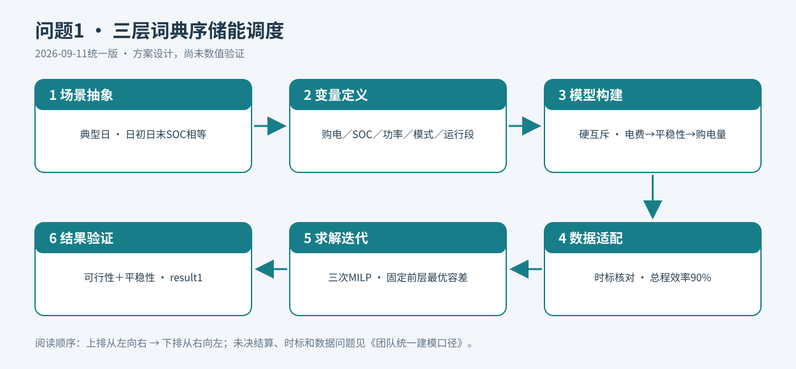
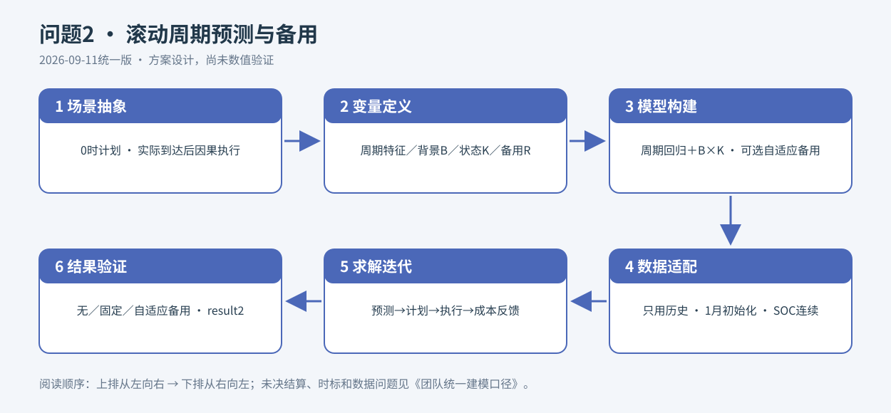
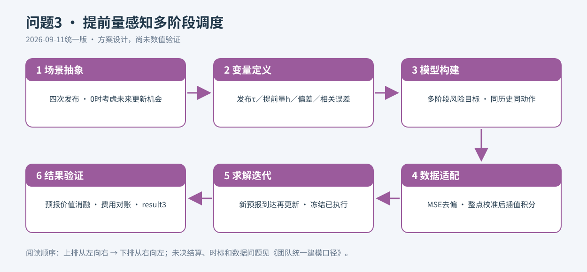
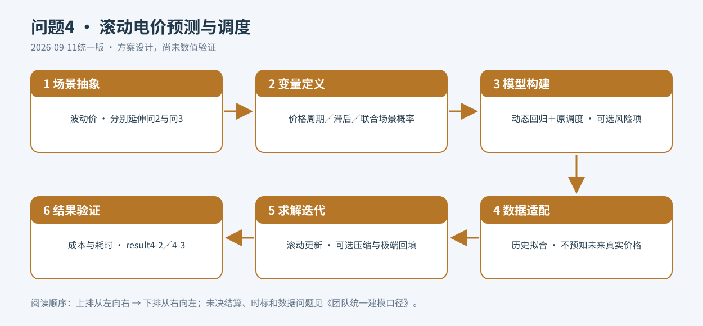

# 第二阶段：各小问模型构建与创新设计
> 2026-09-13版本说明：以下保留2026-09-11历史设计，尚未按exp003/004/006重写。其路线、未决结算与“未实现”状态不代表当前进度；现行说明见[团队统一建模口径](团队统一建模口径.md)和[整体进度](../整体思路与进度同步_2026-09-13.md)。
2026-09-11统一版。以队友第四轮及最终交接为准，依据与未决事项见[团队统一建模口径](团队统一建模口径.md)。本文件是方案设计，未实现求解，未验证收益；旧模型不再作为主线。

## 统一约束与汇总
四问均采用总程效率90%、ηc=ηd=√0.9、充放电硬互斥。记Δt=1/6 h，ℓ=LΔt、v=VΔt；g为日前购电量，q为调整后总量，e为紧急购电量，E为储电量。交流侧功率Pc、Pd满足：
- q+e+v+PdΔt=ℓ+PcΔt+w，无调整时q=g。
- E_next=E+ηc PcΔt−PdΔt/ηd，1200≤E≤10800。
- 0≤Pc≤5000zc，0≤Pd≤5000zd，zc+zd≤1，zc、zd∈{0,1}。
w是总未利用电量，可能含已付费剩余购电，不得全部称弃光。不设售电收益。预测计划与实际执行分别满足平衡，实际执行只能使用当时可见信息。

| 问题序号 | 问题描述 | 整体解题思路 | 建模模型 | 理由和创新点 |
|---|---|---|---|---|
| 1 | 典型日购电与储能优化 | 电费→运行平稳性→购电量 | 考虑运行平稳性的三层词典序储能调度模型 | 方向①算法改进：在经济等优空间减少波动、启动和短段，含跨午夜连接 |
| 2 | 历史信息下全年日前计划与缺口应对 | 滚动周期预测＋因果执行，成本反馈校准备用 | 滚动周期预测与自适应备用调度模型 | 方向①算法改进：根据相关累积缺口和历史执行费用更新备用，不固定留存比例 |
| 3 | 多次预报下的购电调整 | 提前量条件误差→相关路径→考虑未来更新的多阶段决策 | 预测提前量感知的多阶段风险调度模型 | 方向①算法改进：0时就权衡后续更新机会，误差校准随发布与提前量变化 |
| 4 | 波动电价下重算问2、3 | 因果预测价格，分别继承两问信息边界 | 多周期动态回归驱动的滚动电价预测与调度模型 | 方向①算法改进：可选成本敏感场景压缩与极端回填，平衡风险保留与求解成本 |

Fourier、回归、MPC、CVaR都是既有工具，不作为原创成果；表中创新是本题算法设计与验证方向，不保证获奖或性能提升。

## 问题1：考虑运行平稳性的三层词典序储能调度模型
### ① 核心原理
先找到最低电费，再从经济等优方案中选少跳变、少启动、少短运行段的方案，最后从前两层等优方案中减少购电量。平稳性是工程代理指标，不直接等于电池延寿。

### ② 场景适配性
附件1提供确定性典型日，144时段与单电池适合MILP。日初日末SOC相等意味着重复运行，午夜功率与模式衔接也应纳入平稳性。

### ③ 真实创新点
方向①算法改进：经济最优空间的分层选择与环形日边界运行质量联合设计，避免随意混合成本权重牺牲经济主目标。相比仅优化电费，有望改善运行质量；若最优解唯一，则未必有改善空间，不能宣称电费比首层最优更低。

### ④ 模型局限性＋规避方案
权重、参考长度与归一化决定偏好，须报告原始指标并做敏感性；开启但零功率会扭曲启动/段长统计，需完整逻辑编码及有依据的有效功率阈值并检验阈值影响。短段和跨午夜编码需用手工序列测试。报告容差及MIP gap；额外允许电费增加只能作为独立近优情景。无寿命标定或排放因子，不报寿命/减碳数值。

### ⑤ 建模核心过程
1. **场景抽象**：确定性重复日、无售电、单储能；日初日末E均6000。
2. **变量定义**：g、Pc、Pd、E、模式zc/zd、总剩余w；净功率Pnet=Pd−Pc；启动变量、连续运行段长度Lj。
3. **模型构建**：首层F1=Σp_t g_t；次层F2=wV V/Vref+wN N/Nref+wB B/Bref，其中V=Σ|Pnet_t−Pnet_prev|，首段prev为第144段；N为充/放启动次数；B=Σj max(0,Lref−Lj)，跨午夜相连同模式合并成段。权重非负，参考量严格正。在F1≤F1*+ε1下求F2*，再在前两层最优值容差内求F3=Σg_t。绝对值辅助变量、启停上下界及段长编码须完整。
4. **数据适配**：附件1功率转电量，先验证时标；总程效率按统一假设，不能各方向取0.9。
5. **求解迭代**：连续三次MILP，固定前层最优值容差，复用可行解；容差不等于任意经济让步。
6. **结果验证**：能量平衡、SOC、互斥、周期边界、三层目标与仅经济基线比较；输出result1.xlsx及指定汇总表。

## 问题2：滚动周期预测与自适应备用调度模型
### ① 核心原理
先描述日/周/年用电周期，再分别跟踪光伏慢变背景与近期发电状态。可选备用算法将连续预测缺口转为需留存的电池能量，用历史真实购电费用更新参数，而不只追求预测误差最小。

### ② 场景适配性
附件2仅有一年数据、2月开始输出，必须从1月启动并逐日更新。低自由度周期结构符合早期小样本特点；5倍紧急购电使两侧预测误差的经济代价不对称，适合成本反馈备用。

### ③ 真实创新点
方向①算法改进：“购电成本反馈驱动的自适应储能备用算法”。回归和状态平滑只是基础；创新落点是相关累积缺口→能量备用→历史因果成本校准闭环。先实现无备用基线，再对比固定和自适应备用，未验证前不声称降本。

### ④ 模型局限性＋规避方案
1月不能识别全年季节形状，年项强收缩并滚动更新；全年季节曲线已知仅作辅助情景。光伏B、K尺度不唯一，应固定K历史中心尺度并约束B平滑；近零背景不参与比值更新。不能从出力断言降雨原因。风险分位小样本不稳，用历史分块重采样和窗口敏感性；备用可软化而物理下界不能软化。冷启动和年末终端价值须单列检验。

### ⑤ 建模核心过程
1. **场景抽象**：每日0时只见历史，计划144段购电；实际到达后因果执行储能并用紧急电补缺。
2. **变量定义**：Lhat、Vhat；光伏背景B、短期状态K；电量残差r=(ℓ−v)−(ℓhat−vhat)；备用R及θ=(分位β、预测跨度H、历史窗口等)。
3. **模型构建**：Lhat=β0+fday(t)+fweek(weekday,t)+fyear(dayofyear)+φ1 L前1日同刻+φ7 L前7日同刻；日项低阶Fourier、年项低自由度，局部水平不与截距冗余。Vhat=B×K，K由近期实际/背景比EWMA或状态空间更新，夜间零、白天非负。可选R_t=clip{Qβ[max(0,max_{1≤k≤H}Σ_{j=0}^{k−1}r_{t+j})]/ηd,0,Rmax}；历史相关路径计算累计风险。预计E_t≥1200+R_t，备用可松弛；实际危急可消耗至1200。评价总费用Σ(p g+5p e)，不得把真实未来e喂入计划。
4. **数据适配**：1月因果初始化，2月起预测后再追加当日实际；季节、归一化、残差、超参数均只用过去。历史扩展可加近期权重，不提前读取全年峰值容量。
5. **求解迭代**：过去内层滚动验证选θ→日前优化→逐段因果执行→结算→更新；三种备用方案使用相同执行规则。
6. **结果验证**：MAE/RMSE、全年费、紧急量、备用利用率、物理违规；无/固定/自适应备用消融；连续SOC输出334天result2.xlsx及指定四日。

## 问题3：预测提前量感知的多阶段风险调度模型
### ① 核心原理
近远期预报的误差不同，远期又有后续更新机会，因此0时就权衡“现在购电、未来调整、紧急补足”，而不是一次性为所有远期风险买保险。

### ② 场景适配性
附件3的四次发布与24个提前量支持分组校准；多阶段信息约束对应真实发布顺序；相关误差路径对应SOC对连续缺口的累积响应。

### ③ 真实创新点
方向①算法改进：提前量条件校准与未来预报更新机会联动。采用统一误差/提前量误差、不考虑/考虑未来更新的消融，验证实际价值。可选事件触发只是减少调整/计算的工程增强，不保证超过允许保持不动的精确固定更新策略。

### ④ 模型局限性＋规避方案
MSE含偏差，不能直接把RMSE当标准差；昼夜混杂可能伪造提前量规律，比较时控制目标时刻、稀疏组向总体收缩，不强制单调。独立采样低估持续缺口，应保存时间相关。未来预报创新需历史版本校准，不能在0时偷看测试日未来发布。交接目录未附独立MSE数值表，后续从附件2/3复算。下调退款和多次交易基准尚未确认，须先锁定账本，再作另一解释的敏感性。

### ⑤ 建模核心过程
1. **场景抽象**：0时计划，6/12/18时按新信息调整，已执行冻结，实际SOC连续。
2. **变量定义**：τ为发布时刻、h=1,…,24；ετ,h=Vτ+h−Vhatτ,h；偏差b、方差σ²、相关路径z；场景购电q、紧急e和SOC。
3. **模型构建**：b=Eε，MSE=Eε²，σ²=MSE−b²，采用一致分母；V^s=max(0,Vhat+b+σz_path)，截断后再验证校准。累计能量误差方差Δt²1ᵀΣ1。目标min Cday+E[C_adj+C_emergency]+λCVaRα(C_total)；CVaR可用ζ+Σπ_s u_s/(1−α)、u_s≥C_s−ζ、u_s≥0线性化。树节点同历史同动作，未来预报到时才揭示。可选D_s=C_keep−C_adjust，经验下分位Qγ(D)>δ才触发，调整费仅计一次；这不是95%置信保证。
4. **数据适配**：发布时刻/目标时刻对齐，只有已实现目标的残差能训练；先在小时整点校准，再非负不过冲插值积分到10分钟，不能把整点功率当小时均值或把六段误差独立采样。
5. **求解迭代**：0时解含未来更新机会的计划，每次发布重校准再求解，冻结既有执行并按统一交易基准记账。正式计算前确定A不退款另罚或B退款后罚，见统一口径。
6. **结果验证**：误差覆盖/相关、费用重算；无更新/仅6时/加12时/加18时消融；固定更新允许保持，触发版另报耗时。result3.xlsx的q是调整后总量，不是q−g。

## 问题4：多周期动态回归驱动的滚动电价预测与调度模型
### ① 核心原理
价格也需预测，储能的购买时机随价格风险变化。在问2、3结构上加入严格滚动价格预测；可选场景压缩优先保留真正影响购电成本的路径，再回填遗漏的极端风险。

### ② 场景适配性
附件4有日/周/季节时序结构；主方案暂按实时逐步揭示，不预知当日真实144点价格。4-2不取附件3，4-3只取已发布版本，保持额外信息比较公平。

### ③ 真实创新点
方向①算法改进：可选“成本敏感场景压缩与极端场景回填”，用决策损失而非纯几何距离选择路径，保留高价且高净负荷等压力场景，独立历史验证池发现遗漏后回填。无计算瓶颈可不压缩；与全场景、随机抽样、普通压缩对照，不能声称压缩必然提高精度。

### ④ 模型局限性＋规避方案
早期季节弱识别用强收缩；高价难预测需单报尾部误差。独立负载/光伏/价格采样破坏共振，采用联合残差分块但不臆断本地净负荷决定市场价格。压缩可能漏尾部，做压力保留、概率归一化和回填；拟合、调参/回填、最终测试时间隔离，禁止拿测试结果反向选场景。价格可见性和合同定价须明确，已知全日电价仅辅助，已执行/已结算交易不能追溯更改。

### ⑤ 建模核心过程
1. **场景抽象**：因果预测价格，分别重算问2和问3，维持原有信息权限及物理约束。
2. **变量定义**：phat及周期/滞后参数，联合残差路径、场景概率π、代表与压力场景集合。
3. **模型构建**：phat=α0+gday+gweek+gyear+ψ1 p前1日同刻+ψ7 p前7日同刻，局部水平避免冗余。预测价格用于计划，到达价格按统一交易规则执行/结算。可选期望成本＋CVaR；压缩距离兼顾缺口、峰价和储能约束活跃性，压力场景保留，重分配概率Σπ=1。
4. **数据适配**：1月初始化、逐日扩展更新；如取净负荷协变量，只取预测净负荷。4-2禁用额外光伏预报、4-3只用已发布版本。
5. **求解迭代**：预测→可选压缩→优化→过去验证池因果执行→可选回填遗漏高损失路径；按计算预算或风险收敛停止。当期实际到达后更新，冻结既有动作。
6. **结果验证**：昨日同刻/上周同刻/多周期预测比较，MAE/RMSE、高价误差、总费用、紧急购电；压缩精度—耗时对照，输出result4-2.xlsx和result4-3.xlsx。

## 实施与验收
先确认时间映射、结算及价格可见性→共用约束和問1→问2因果回测→问3多阶段更新→问4价格预测。每次只引入可辨认的改动，增强模块逐项消融。原始模板不改，结果附输入版本、参数、容差、信息日志、执行规则和费用对账。本次没有生成数值答案工作簿。
