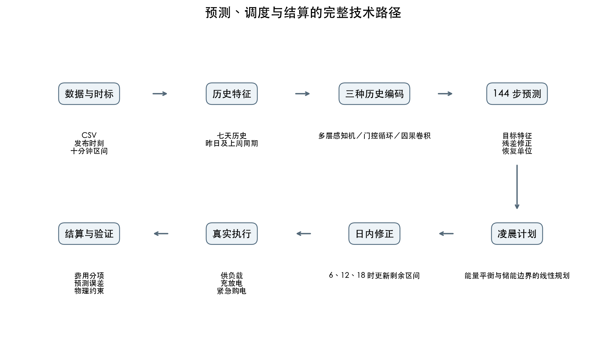
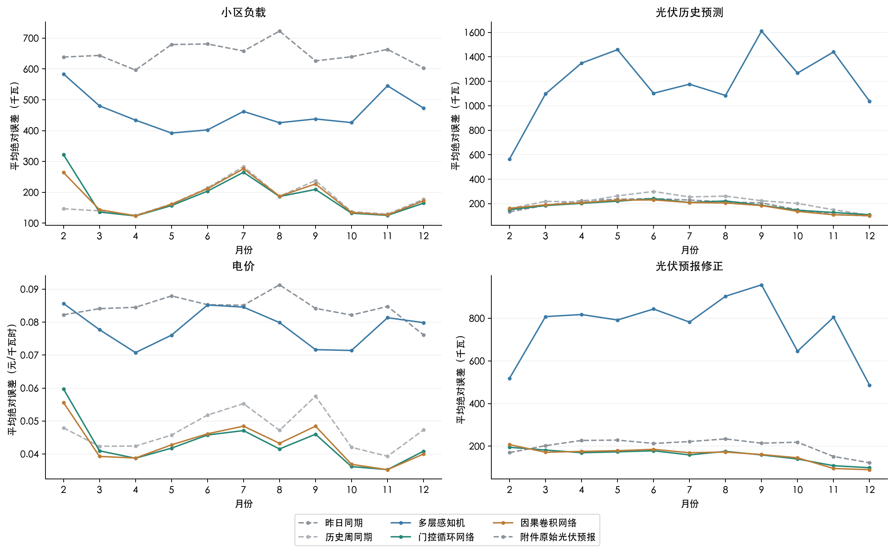
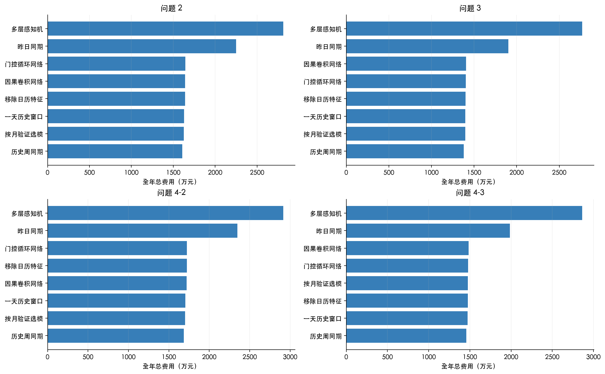
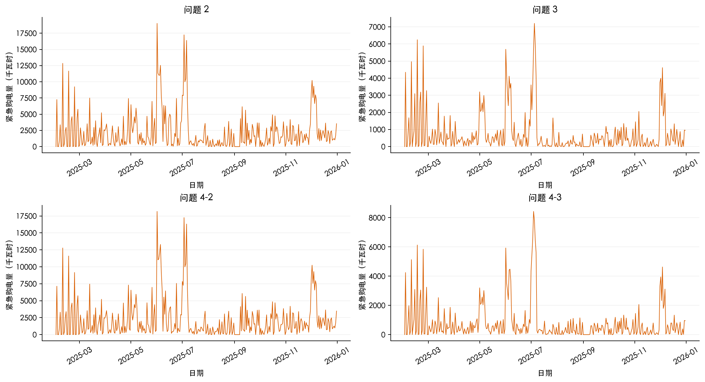
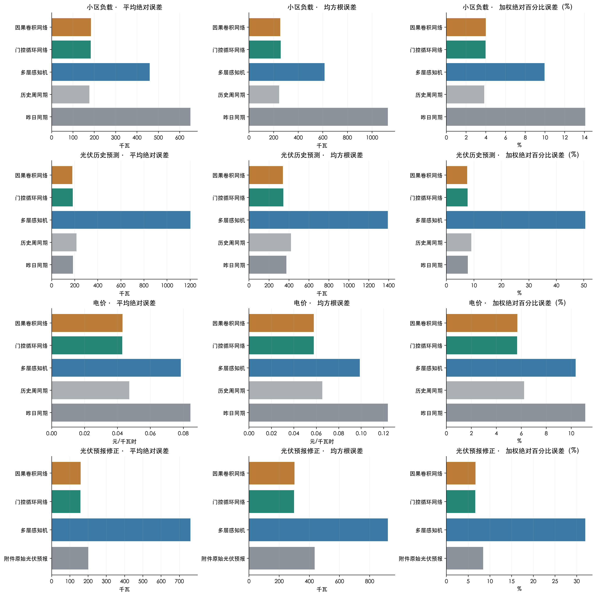
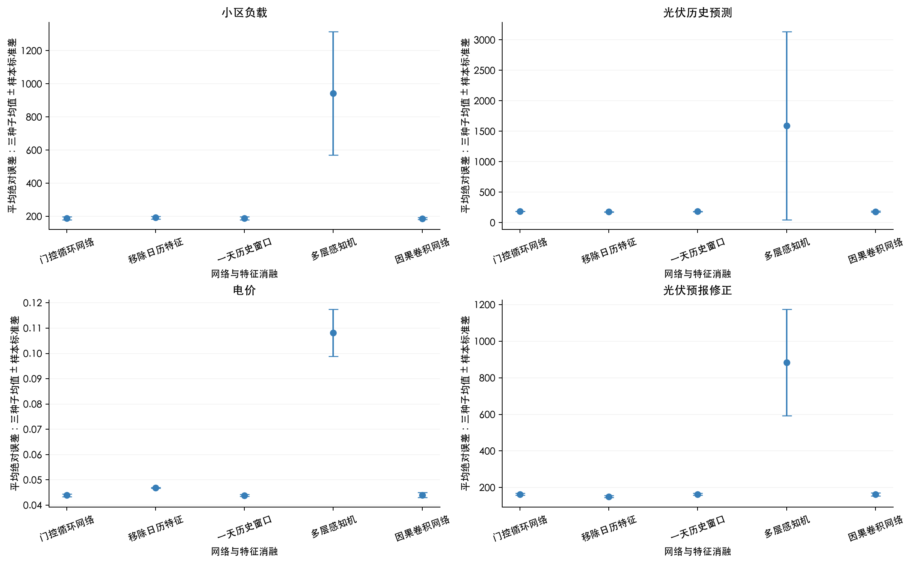
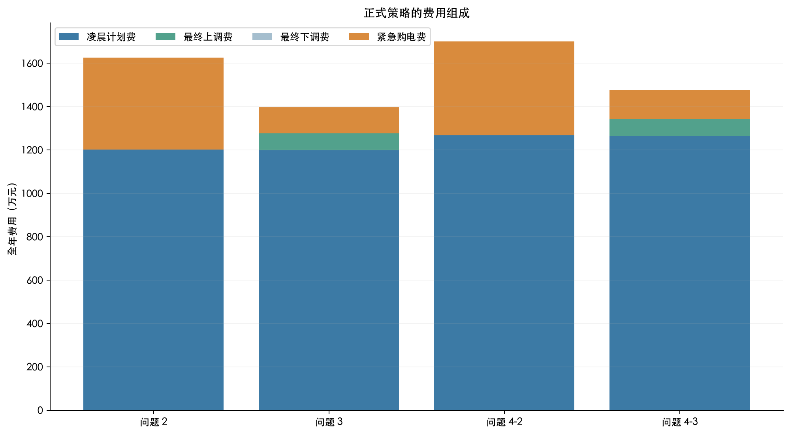
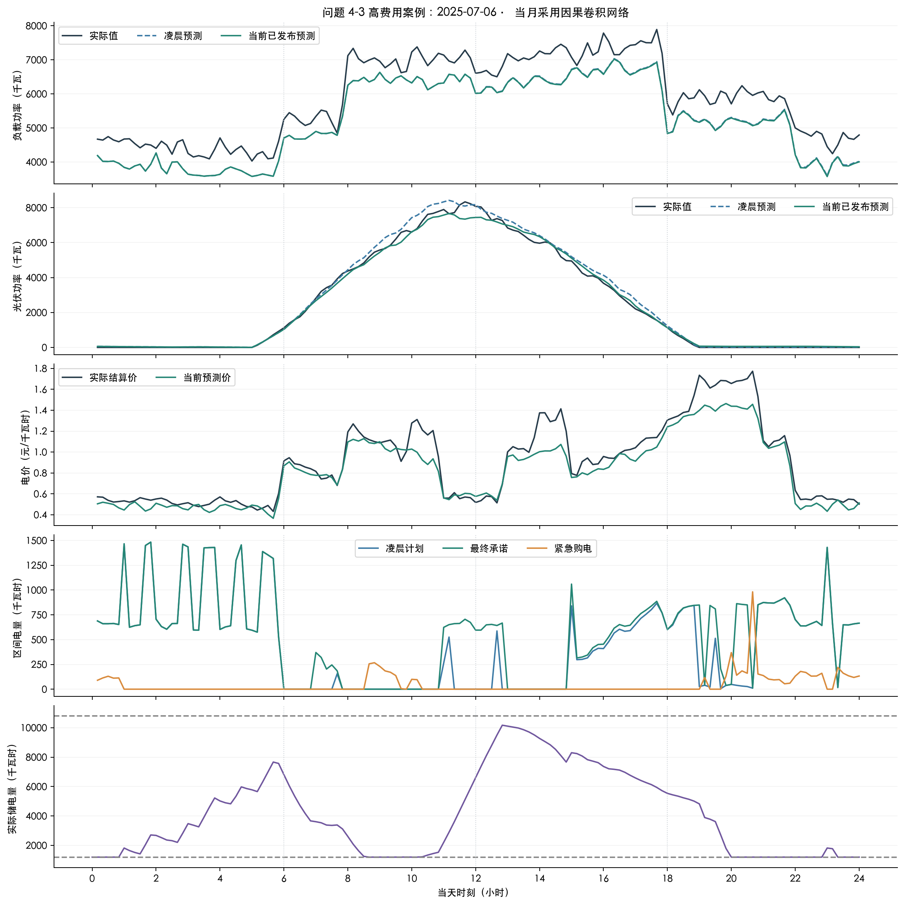

# 首轮神经网络预测与基础调度实验报告

## 1. 结论与成绩

正式评估覆盖 2025 年 2 月 1 日至 12 月 31 日，共 334 天。三种网络和两个特征消融均完成 11 个月、三个随机种子的训练，共 165 组。正式策略按月依据此前验证期总费用选择网络，采用三个种子预测的平均值。

| 问题 | 总费用（元） | 紧急购电（千瓦时） | 相对昨日基线节省（%） | 相对周同期基线节省（%） |
|---|---|---|---|---|
| 问题 2 | 16,258,308.22 | 728,394.12 | 27.71 | -1.20 |
| 问题 3 | 13,957,164.84 | 244,945.00 | 26.62 | -1.32 |
| 问题 4-2 | 17,012,164.41 | 724,372.46 | 27.49 | -0.90 |
| 问题 4-3 | 14,769,217.03 | 262,929.18 | 25.66 | -1.37 |

节省率为负表示费用高于昨日基线。所有方案使用同一物理约束与结算规则；本轮不预设神经网络一定优于简单基线。

四个正式问题中，4 个相对昨日同期基线减少了总费用，0 个优于历史周同期基线。本轮正式神经网络策略均未超过历史周同期基线，因此不能据此宣布神经网络已是费用最优方案。各网络与两种历史基线的完整费用比较见第六部分及配套图表。

## 2. 题目指标及信息边界

问题 2 在凌晨预测负载和光伏，使用固定日内电价。问题 3 增加四次已发布光伏预报及三次可选日内调整。问题 4 主结果预测未来电价，已知当天价格只作为单独对照。

每个自然日有 144 个十分钟区间。充放电效率各为 90%，储电范围为 1200—10800 千瓦时，最大充放电功率为 5000 千瓦。1 月 1 日从 6000 千瓦时开始，1 月使用因果历史基线预热。每日储电状态连续传递，没有每日重置或日初日末相等条件。

总费用包括原计划费、最终调整相对原计划的上调费和下调费、紧急购电费。原计划不退款，上调价格为 1.5 倍，下调另收 0.5 倍，紧急购电价格为 5 倍。多次更新只对最终执行量相对原计划结算一次。预测误差以平均绝对误差、均方根误差和加权绝对百分比误差度量，精确定义见技术讲解。

## 3. 数据与时间验证

三个实测数据表各包含 365 天乘 144 个数值，光伏预报有 365 天乘四次发布乘 24 个提前小时。数值区无缺失。原始日期空白仅存在于预报表同一天的后续行，已按日期向下填充。

数据中的 00:10 对应 00:00—00:10。结果模板原来的时段文字整体偏移十分钟，生成文件已改为自然日表头；原始模板字节不变。训练窗口、验证窗口和标签完成时刻分别检查，改变未来实测值及后来发布预报的测试不得改变此前特征或计划。年底超出已知真实值范围的预测不计入误差。

输入文件的 SHA-256 校验值保存在随报告提供的 data_hashes.json。

## 4. 逐步技术讲解

### 4.1 先把“今天知道什么”说清楚

把全年按十分钟切成连续区间。2025 年 1 月 1 日 00:00 是起点，此后每完成一个区间，索引增加一。凌晨制定计划时，只能读取此前已经完成区间的负载、实际光伏和电价。6:00 收到新预报时，可以再读取当天已经过去六小时的实测数据以及这一版预报，但不能读取当天 6:00 之后的实际发电量。

CSV 中的 00:10 被解释为 00:00—00:10 区间的终点。因此一个自然日恰好有 144 个区间，最后一个区间是 23:50—24:00。程序同时保存区间起点、终点的定义和预报发布索引，不能仅凭一个“时间”列混合这三种含义。

附件 3 每行是一次发布、后面 24 列是未来 1 至 24 小时的整点功率。先把它们还原为“发布时刻加提前小时数”的目标时刻，再连接相邻整点预测，取每十分钟的线性插值。第一个整点之前，用发布时刻之前最后一个已完成区间的实测光伏作为左端点。这样每个整点仍精确等于附件预报值，也没有借用未来实测值。这里把整点预报解释为时刻功率，并没有另行声称小时平均电量守恒。

### 4.2 一次预测的输入长什么样

一次预测要输出未来 144 个数。模型有两组输入。第一组是过去七天的历史：先把每六个十分钟数值平均为一小时，再得到 168 个按时间排列的小时值。这能保留日周期和较长趋势，同时降低循环网络的计算量。第二组是每个未来目标时刻已经知道的特征：日内正弦与余弦、星期正弦与余弦、预测提前量、昨日同一时刻值、上周同一时刻值和基准预测。

时间用正弦和余弦表示，是因为 23:50 与次日 00:00 应当很接近。直接输入小时整数会让 23 与 0 看起来相差很远，而圆周坐标能自然连接午夜边界。星期也按七天的圆周编码。提前量除以 144，表示我们正在预测未来一天中的哪个位置。

负载、历史光伏和电价的基准预测使用昨日同期值；光伏修正模型的基准使用本次已发布预报的十分钟插值。模型学习“在基准之上应该加多少或减多少”，而不必从零重新学出整条曲线。所有滞后值都以未来目标时刻向前减一天或七天得到。因为预测只跨未来一天，昨日同期值最晚也属于发布前已经完成的区间。

每种架构包含四个参数相互独立的预测分支，分别处理负载、历史光伏、电价和预报修正。负载分支不读取电价数值，问题 2 的光伏分支也不读取附件 3 的未来预报。四个分支只共享已知的日历与提前量特征，使用一个训练容器批量计算，因此不会通过共享数值编码器混入题目不允许的输入。

### 4.3 为什么要标准化和学习残差

负载和光伏通常以数千千瓦计量，电价则以元每千瓦时计量。直接把这几种数值放进同一个平方误差目标，会让量纲较大的目标占据损失的大部分。程序只在本月训练截止时刻之前计算每个变量的均值 μ 和标准差 σ，然后把历史输入变成 `(原始值 − μ) / σ`。

设真实目标为 y，基准预测为 b，网络输出的标准化修正量为 r，最终预测为 `max(0, b + σr)`。训练标签是 `(y − b) / σ`，不是未来真实值本身。均方误差损失就是网络输出与这一标准化残差之差的平方，再对训练样本、144 个目标区间和四个分支取平均。负值截断在恢复单位后执行，不借用全年实测最大值来限制预测上界。

### 4.4 多层感知机怎样作出预测

多层感知机首先把 168 个小时值展开为一条向量。第一层有 64 个单元，每个单元计算一组历史值的加权和，再加上偏置。随后使用整流线性函数：正数保留，负数变为零。这使模型能够描述线性加权无法表达的组合关系。第二层把 64 个数进一步变为 32 个数，形成对历史的压缩表示。

这 32 个历史表示被复制到未来 144 个目标位置。每个位置再拼接该目标的日历、提前量和滞后特征，经过一个 32 单元隐藏层与一个线性输出单元，得到该时刻的修正量。所有未来位置使用同一组输出层参数，但输入的目标时间和滞后值不同，因此能输出不同的预测。

### 4.5 门控循环网络怎样记住历史

门控循环网络按照小时顺序读取数据，每读入一个小时就更新一次包含 32 个数的隐藏状态。它用两种门来决定哪些历史需要保留。更新门控制旧状态与新候选状态的混合比例；重置门控制构造候选状态时使用多少旧信息。

本实现使用 Keras 默认的“循环线性变换之后施加重置门”形式。把向量写成行向量，其计算为：`z = sigmoid(xWz + biz + h旧Uz + brz)`，`r = sigmoid(xWr + bir + h旧Ur + brr)`，`h候选 = tanh(xWh + bih + r × (h旧Uh + brh))`，`h新 = z × h旧 + (1 − z) × h候选`。其中 x 是当前小时输入，h 是隐藏状态，W、U 是训练得到的输入和循环权重；bi 与 br 分别是输入、循环偏置，乘号表示逐元素相乘，紧邻的向量和矩阵表示矩阵乘法。sigmoid 把门值压到 0 至 1，tanh 把候选值压到 −1 至 1。z 越接近 1，旧状态保留得越多；r 越接近 0，构造候选状态时采用的循环信息越少。

读取全部历史后，最后的隐藏状态被当作 32 维历史表示。后面的复制、拼接目标特征和输出修正量步骤，与多层感知机一致。这样比较的主要差异是历史如何编码，而不是偷偷换了一套调度或计费方法。

### 4.6 因果一维卷积网络怎样观察不同时间尺度

一维卷积沿时间轴滑动一个小窗口，每个窗口把若干历史时点加权组合，得到新的特征。这里使用四层卷积，每层 32 个通道，卷积核宽度为 3。四层的膨胀率依次为 1、2、4、8：第一层查看相邻小时，后续层逐渐跳着取样，扩大能够连接的时间跨度。

“因果”意味着某个历史位置的卷积结果只使用该位置及其之前的数据，不使用它右侧尚未出现的值。经过四层后，对历史位置做平均池化，得到 32 维历史表示，再进入与其他模型相同的逐目标输出层。平均池化确实使用了本次发布前的全部历史，所以该网络的预测原点信息边界仍然是发布时刻，而不是卷积中间某个位置。

四层卷积中单个末层位置的感受野为 `1 + 2 × (1 + 2 + 4 + 8) = 31` 小时。七天历史的作用来自对各位置局部表示的平均，并不意味着一个卷积位置已经直接联合计算全部 168 小时。这个结构差异也是对照实验需要检验的内容。

### 4.7 参数是怎样训练出来的

先按时间构造样本：每隔六小时取一个预测原点，历史窗口完全位于原点之前，标签是随后 24 小时的实际值。只有标签已经全部实现的窗口才进入训练或验证。一个批次最多有 64 个预测原点，程序计算预测残差、平方损失以及损失对每个参数的梯度。

这里的“梯度”是损失对一个参数的局部变化率。若某个输出修正量 r 的标准化真实残差为 q，单项平方损失为 `(r−q)²`，它对 r 的导数就是 `2(r−q)`；对整个批次取平均时，还要除以参与平均的标量数。在线性层 `输出 = 输入 × 权重 + 偏置` 中，权重梯度等于输入与输出梯度的乘积，偏置梯度就是输出梯度。梯度继续沿各层计算关系向前传递；遇到整流线性函数时，正输入处导数为一，负输入处为零。循环网络还要沿各小时的状态更新链条传递梯度。TensorFlow 自动记录这些运算并应用链式法则，最终得到每个权重应该向哪个方向移动。

自适应矩估计优化器会记录梯度的平滑平均和梯度平方的平滑平均，用它们调整各参数的更新步长。初始学习率为 0.001。一个训练轮次遍历一次全部训练样本；最多运行 60 轮。当验证损失连续六轮没有降低时停止，并恢复验证损失最小那一轮的参数。随机种子影响参数初始化和训练样本顺序，所以每种配置重复三个种子。

具体来说，第 t 次更新得到参数梯度 g 后，计算 `m新 = 0.9m旧 + 0.1g` 和 `v新 = 0.999v旧 + 0.001g²`。m 是梯度方向的平滑记忆，v 是梯度大小平方的平滑记忆。由于二者从零开始，还要用 `m新/(1−0.9^t)` 与 `v新/(1−0.999^t)` 修正初始偏小的问题。随后沿平滑梯度的反方向更新参数，步长随梯度平方的平方根缩放。Keras 的实现等价于用 `αt = 0.001 × sqrt(1−0.999^t)/(1−0.9^t)`，执行 `参数新 = 参数旧 − αt × m新/(sqrt(v新)+0.0000001)`。分母中的小正数避免除零。这里的 t 是批次更新次数，不是训练轮数。

每个月从头训练。最近七个完整日期保留为验证，模型训练和标准化均不使用这一周。三种网络比较时，这一周的日期、初始储电量和调度规则相同。对三个种子的预测取平均后，分别回放这一周，选择总购电费用最低的网络供随后一个月使用。月内不根据新出现的成绩回头更换月初已选定的网络。由于正式评估随时间滚动，后一个月可以学习前一个月已经实现的数据；这是在线可执行的扩展历史回测，不是固定不变的训练集。

完整 24 小时标签跨过月初的三个验证原点不进入早停损失。为了仍然回放验证最后一天的 6、12、18 时调整，程序载入已经选定的权重，对这三个原点单独推理，调度只使用月初之前的剩余区间。验证回放是在月初利用过去一周进行的模型选择，属于回顾式验证；正式的 2—12 月成绩才是随后未参与当月选择的评价结果。四个独立参数分支共用一个早停轮次，其标准是四个标准化目标损失的平均。

### 4.8 怎样把预测变成购电计划

每个十分钟区间以电量而不是功率进行计算。5000 千瓦的充放电功率上限，对应每个区间最多 `5000 ÷ 6 = 833.3333` 千瓦时。设 G 为计划购电量、C 为充电量、D 为向负载侧输出的放电量、W 为无法继续使用的剩余电量、S 为储电量；预测负载与光伏功率分别为 L 和 P。

区间的预测能量平衡是 `G + P/6 + D = L/6 + C + W`。储电量递推是 `S下一时刻 = S当前 + 0.9C − D/0.9`。例如，充入 100 千瓦时只能增加 90 千瓦时储电量；向负载输出 90 千瓦时需要从储能内部扣除 100 千瓦时。每个时刻把储电量限制在 1200 至 10800 千瓦时之间，并限制 C、D 非负且不超过 833.3333。

在凌晨计划阶段，目标是让 `各时段电价 × 计划购电量` 的总和最小。上述关系均为线性，所以使用线性规划求解器，而不是让神经网络直接猜一个可能违反物理约束的充放电动作。为处理数值上退化的同时充放电，求解目标加入极小的吞吐量权重；随后保持储电变化不变地抵消同时充放电，并将减少损耗产生的余量转入剩余电量。该权重不进入实际费用结算。

本轮没有额外的风险缓冲或日末储能价值项，也没有强行令每日初末储电量相等。因此它建立的是统一、清晰的基础调度对照，不能把它称作已经求出的最优风险调度。各方案必须同时披露期末储电量，以便识别储能边界对费用比较的影响。

### 4.9 日内调整与真实执行怎样衔接

问题 3 在 6:00、12:00、18:00 收到新预报后，保留已经执行的区间，以当前真实储电量作为新起点，重新优化当天剩余区间。调整变量相对凌晨原计划定义，后续预报版本不重复收费。问题 4 的主结果在优化时使用预测电价，结算时才使用相应区间的真实电价；已知当天电价的对照是另一种信息条件，不混入主结果。

真实执行时先用已承诺购电和当前光伏满足负载。有剩余就按储能边界充电，无法存下的电量记为剩余；有缺口就按功率和储电量边界放电，仍不足的部分紧急购电。这个固定规则只使用当前区间的实测值，不看之后的负载或光伏。储电量按照实际充放电逐区间传递，不用预测储电量覆盖真实状态。

计划中的充放电是用于求解购电量的预测轨迹；导出文件中的充放电是上述实际执行轨迹。这一区别很重要：预测误差既影响紧急购电，也可能使实际储电状态偏离计划，并影响之后的调整。

### 4.10 费用怎样算，指标怎样解释

本轮采用已确认的结算假设。设凌晨原计划为 G0，区间执行前最终调整购电量为 GA，紧急购电量为 E，实际交易电价为 p。区间总费为 `pG0 + 1.5p max(GA−G0,0) + 0.5p max(G0−GA,0) + 5pE`。原计划费用全额支付，下调不退原价。因此，在允许处理剩余电量的本轮模型中，下调通常无法减少费用；不能把这一结论扩展到有退款的其他结算制度。

平均绝对误差是每个预测误差绝对值的平均，单位与目标变量相同。均方根误差先平方、再平均、最后开平方，对少数大误差更敏感。加权绝对百分比误差为 `100 × 绝对误差之和 ÷ 真实值绝对值之和`。它避免逐点除以夜间零光伏，但分母为零时仍记为不可计算。光伏同时报告全天和真实发电功率大于零的区间，避免夜间大量零值掩盖白天问题；这一筛选只用于评价，不进入预测。

对重叠的多次发布预报，每个“发布时刻—目标时刻”组合都是一个预测记录。越靠近年底，部分未来目标超出附件范围，这些目标保留预测但不进入误差统计。年度指标从误差总和与样本数重新汇总，不能简单平均不同样本数的月度均方根误差。三个随机种子的波动反映训练随机性，不能被当作时间序列样本相互独立的置信区间。

月度误差按预测发布月份归属；月末发布、目标落在次月的预测仍属于发布月。决策时刻表示信息截止边界，回测没有把模型训练耗时进一步换算成计划提交的延迟。报告中的耗时是本机实际墙钟时间，反映运行时的系统负载，不是独占设备的速度基准。

最后分别比较预测误差、总费用和紧急购电量。均方误差训练关注平均预测精度，题目却对紧急购电收取五倍电价。小幅低估高价时段的负载，可能比大幅高估低价时段更昂贵。因此，“误差更小”并不自动推出“费用更低”，需要由同一套实际回放给出证据。




## 5. 实验设置

多层感知机的历史编码为 64、32 个隐藏单元；门控循环网络为 32 个循环单元；因果卷积为四层、每层 32 通道、卷积核宽度 3、膨胀率 1、2、4、8。每个分支都连接 32 单元的逐目标隐藏层和线性残差输出层。

批量大小 64，学习率 0.001，最多训练 60 轮，验证连续六轮不改善则停止，恢复验证损失最低轮次。每月从头拟合，不将验证周重新并入训练；随机种子为 42、2026、3407。两个特征消融分别移除日历周期和把小时历史缩短为一天；后者保留共同的昨日、上周同期目标特征。

GPU 环境为 Apple M5、TensorFlow 2.18.1、Metal 1.2.0、单精度浮点数，关闭即时编译。每组训练均核查输出设备、参数更新和保存读取一致性。累计训练调用耗时为 98.36 分钟，不包括数据准备、保存、报告与调度。73 组达到 60 轮上限，因此不能声称所有模型已经完全收敛。

训练设备及每轮损失见 training_metadata.json。种子均值、标准差与每个种子的具体成绩均保存为 CSV；种子标准差不作为时间序列的独立样本置信区间。

### 每个月实际选用的网络

| 月份 | 问题 2 | 问题 3 | 问题 4-2 | 问题 4-3 |
|---|---|---|---|---|
| 2 | 因果卷积网络 | 因果卷积网络 | 因果卷积网络 | 因果卷积网络 |
| 3 | 门控循环网络 | 门控循环网络 | 门控循环网络 | 门控循环网络 |
| 4 | 门控循环网络 | 因果卷积网络 | 门控循环网络 | 因果卷积网络 |
| 5 | 门控循环网络 | 门控循环网络 | 门控循环网络 | 门控循环网络 |
| 6 | 门控循环网络 | 门控循环网络 | 因果卷积网络 | 门控循环网络 |
| 7 | 因果卷积网络 | 门控循环网络 | 因果卷积网络 | 因果卷积网络 |
| 8 | 门控循环网络 | 因果卷积网络 | 门控循环网络 | 因果卷积网络 |
| 9 | 门控循环网络 | 门控循环网络 | 门控循环网络 | 门控循环网络 |
| 10 | 门控循环网络 | 门控循环网络 | 门控循环网络 | 门控循环网络 |
| 11 | 因果卷积网络 | 因果卷积网络 | 因果卷积网络 | 因果卷积网络 |
| 12 | 因果卷积网络 | 因果卷积网络 | 因果卷积网络 | 因果卷积网络 |

## 6. 结果及失败案例

### 6.1 全年预测成绩

| 模型 | 目标 | 平均绝对误差 | 均方根误差 | 加权绝对百分比误差（%） |
|---|---|---|---|---|
| 门控循环网络 | 小区负载 | 183.1992 | 256.9010 | 3.9668 |
| 门控循环网络 | 电价 | 0.0429 | 0.0577 | 5.6669 |
| 门控循环网络 | 光伏历史预测 | 182.2730 | 343.7619 | 7.6600 |
| 门控循环网络 | 光伏预报修正 | 157.9446 | 298.4914 | 6.6376 |
| 移除日历特征 | 小区负载 | 189.0572 | 271.2606 | 4.0937 |
| 移除日历特征 | 电价 | 0.0464 | 0.0630 | 6.1249 |
| 移除日历特征 | 光伏历史预测 | 175.7582 | 343.0385 | 7.3862 |
| 移除日历特征 | 光伏预报修正 | 148.1544 | 291.2325 | 6.2262 |
| 一天历史窗口 | 小区负载 | 182.0263 | 254.2692 | 3.9414 |
| 一天历史窗口 | 电价 | 0.0429 | 0.0576 | 5.6603 |
| 一天历史窗口 | 光伏历史预测 | 180.9266 | 341.5938 | 7.6034 |
| 一天历史窗口 | 光伏预报修正 | 158.2142 | 298.8198 | 6.6489 |
| 附件原始光伏预报 | 光伏预报修正 | 200.7022 | 434.9125 | 8.4345 |
| 多层感知机 | 小区负载 | 459.2575 | 613.8496 | 9.9443 |
| 多层感知机 | 电价 | 0.0785 | 0.0988 | 10.3587 |
| 多层感知机 | 光伏历史预测 | 1,202.8424 | 1,392.4085 | 50.5493 |
| 多层感知机 | 光伏预报修正 | 760.9684 | 921.0845 | 31.9796 |
| 因果卷积网络 | 小区负载 | 184.0268 | 252.9883 | 3.9847 |
| 因果卷积网络 | 电价 | 0.0431 | 0.0578 | 5.6824 |
| 因果卷积网络 | 光伏历史预测 | 179.1558 | 339.9523 | 7.5290 |
| 因果卷积网络 | 光伏预报修正 | 159.0286 | 301.9075 | 6.6832 |
| 历史周同期 | 小区负载 | 176.7466 | 244.2753 | 3.8271 |
| 历史周同期 | 电价 | 0.0471 | 0.0653 | 6.2216 |
| 历史周同期 | 光伏历史预测 | 214.8319 | 420.1525 | 9.0283 |
| 昨日同期 | 小区负载 | 650.5052 | 1,128.9924 | 14.0854 |
| 昨日同期 | 电价 | 0.0844 | 0.1239 | 11.1319 |
| 昨日同期 | 光伏历史预测 | 185.4436 | 375.3297 | 7.7932 |

负载与光伏误差单位为千瓦，电价误差单位为元每千瓦时。表中是三个种子平均预测的误差，不能等同于三个种子各自误差的平均。所有种子的逐项成绩和真实发电区间成绩见 annual_forecast_metrics.csv。


#### 实际发电区间的预测误差

| 模型 | 光伏目标 | 平均绝对误差（千瓦） | 均方根误差（千瓦） | 加权绝对百分比误差（%） |
|---|---|---|---|---|
| 门控循环网络 | 光伏历史预测 | 309.9818 | 459.0843 | 7.2815 |
| 门控循环网络 | 光伏预报修正 | 263.9614 | 397.6042 | 6.2004 |
| 移除日历特征 | 光伏历史预测 | 306.2206 | 458.6131 | 7.1931 |
| 移除日历特征 | 光伏预报修正 | 255.9793 | 388.8531 | 6.0129 |
| 一天历史窗口 | 光伏历史预测 | 308.2847 | 456.2124 | 7.2416 |
| 一天历史窗口 | 光伏预报修正 | 263.9743 | 397.9875 | 6.2007 |
| 附件原始光伏预报 | 光伏预报修正 | 354.6935 | 580.9239 | 8.3317 |
| 多层感知机 | 光伏历史预测 | 1,112.7256 | 1,315.7998 | 26.1379 |
| 多层感知机 | 光伏预报修正 | 752.1125 | 923.4726 | 17.6671 |
| 因果卷积网络 | 光伏历史预测 | 306.0423 | 453.9826 | 7.1889 |
| 因果卷积网络 | 光伏预报修正 | 267.4589 | 402.3918 | 6.2826 |
| 历史周同期 | 光伏历史预测 | 384.1180 | 561.9671 | 9.0229 |
| 昨日同期 | 光伏历史预测 | 331.7652 | 502.0246 | 7.7932 |

#### 正式策略的费用与约束

| 问题 | 计划费（元） | 上调费（元） | 下调费（元） | 紧急购电费（元） | 违反数 | 评估起始储电量 | 评估末储电量 | 求解与执行合计秒数 |
|---|---|---|---|---|---|---|---|---|
| 2 | 12,025,380.56 | 0.00 | 0.00 | 4,232,927.66 | 0 | 8,347.72 | 1,200.00 | 1.20 |
| 3 | 11,982,586.37 | 782,307.21 | 0.00 | 1,192,271.27 | 0 | 8,347.72 | 1,200.00 | 3.49 |
| 4-2 | 12,679,135.25 | 0.00 | 0.00 | 4,333,029.16 | 0 | 7,974.82 | 1,200.00 | 0.96 |
| 4-3 | 12,653,051.97 | 779,011.77 | 0.00 | 1,337,153.28 | 0 | 7,974.82 | 1,200.00 | 4.02 |

求解与执行耗时包含线性规划和固定规则回放，不包含模型训练。各方案训练调用的累计时间单独报告。

#### 是否修正附件光伏预报

| 问题 | 使用门控循环网络修正 | 总费用（元） | 紧急购电（千瓦时） |
|---|---|---|---|
| 3 | False | 13,948,176.62 | 198,049.33 |
| 3 | True | 14,038,836.21 | 248,015.31 |
| 4-3 | False | 14,711,423.55 | 204,740.24 |
| 4-3 | True | 14,796,760.90 | 253,333.23 |

这组对照保持门控循环网络负载与电价预测、日内更新时刻、计费及实际执行规则不变，只把光伏修正量设为零。


问题 3 中，修正光伏预报后的总费用相对直接使用附件预报变化 +0.65%。预测误差改善与决策费用改善应分别判断。

问题 4-3 中，修正光伏预报后的总费用相对直接使用附件预报变化 +0.58%。预测误差改善与决策费用改善应分别判断。
#### 预测成绩的具体含义

小区负载中，三种主要网络里平均绝对误差最低的是门控循环网络，为 183.1992 千瓦；最好的简单对照是历史周同期，为 176.7466 千瓦，网络相对变化为 +3.65%。

光伏历史预测中，三种主要网络里平均绝对误差最低的是因果卷积网络，为 179.1558 千瓦；最好的简单对照是昨日同期，为 185.4436 千瓦，网络相对变化为 -3.39%。

电价中，三种主要网络里平均绝对误差最低的是门控循环网络，为 0.0429 元/千瓦时；最好的简单对照是历史周同期，为 0.0471 元/千瓦时，网络相对变化为 -8.92%。

光伏预报修正中，三种主要网络里平均绝对误差最低的是门控循环网络，为 157.9446 千瓦；最好的简单对照是附件原始光伏预报，为 200.7022 千瓦，网络相对变化为 -21.30%。

这些全年排名只用于事后分析，不能替代每月的历史验证选模。多层感知机的弱项同样保留在表格和图中；本轮没有继续搜索其超参数，因此不能把一个固定配置的表现推广到所有多层感知机。





### 6.2 预报时刻消融

| 问题 | 使用的预报时刻 | 总费用（元） | 调整费用（元） | 紧急购电量（千瓦时） |
|---|---|---|---|---|
| 3 | 0 | 16,267,384.43 | 0.00 | 731,948.01 |
| 3 | 0+6 | 14,887,916.04 | 444,419.96 | 433,971.23 |
| 3 | 0+6+12 | 14,645,797.27 | 478,026.51 | 390,176.96 |
| 3 | 0+6+12+18 | 13,957,164.84 | 782,307.21 | 244,945.00 |
| 4-3 | 0 | 16,989,400.92 | 0.00 | 719,458.73 |
| 4-3 | 0+6 | 15,702,071.19 | 437,024.90 | 448,883.32 |
| 4-3 | 0+6+12 | 15,442,064.96 | 479,913.43 | 403,253.51 |
| 4-3 | 0+6+12+18 | 14,769,217.03 | 779,011.77 | 262,929.18 |

这些对照保持月初所选网络不变，只改变预报使用时刻，因此可以检验额外预报在本轮执行规则下的实际价值。


问题 3 中，使用全部四次预报相对只使用凌晨预报的费用变化为 -14.20%；本轮费用最低的预报时刻组合是 0+6+12+18，总费用为 13,957,164.84 元。

问题 4-3 中，使用全部四次预报相对只使用凌晨预报的费用变化为 -13.07%；本轮费用最低的预报时刻组合是 0+6+12+18，总费用为 14,769,217.03 元。

这些是统一规则下的事后对照结果；正式工作簿使用预先规定的四次预报方案。

### 6.3 价格可见性对照

| 问题 | 当天电价提前已知 | 总费用（元） | 紧急购电（千瓦时） |
|---|---|---|---|
| 4-2 | False | 17,012,164.41 | 724,372.46 |
| 4-2 | True | 17,034,674.43 | 750,341.38 |
| 4-3 | False | 14,769,217.03 | 262,929.18 |
| 4-3 | True | 14,678,312.49 | 271,040.91 |

已知价格对照仍然使用负载和光伏预测，并非所有未来信息都已知的理论下界。

### 6.4 高费用日期与限制

| 问题 | 费用最高日期 | 总费用（元） | 计划费（元） | 紧急购电费（元） | 紧急购电量（千瓦时） |
|---|---|---|---|---|---|
| 4-2 | 2025-07-06 | 164,149.77 | 48,759.61 | 115,390.16 | 16,311.75 |
| 2 | 2025-07-03 | 141,643.93 | 40,262.76 | 101,381.16 | 17,251.34 |
| 4-3 | 2025-07-06 | 103,555.93 | 47,415.85 | 36,363.71 | 6,461.82 |
| 3 | 2025-07-06 | 86,792.83 | 39,192.45 | 28,807.23 | 5,994.98 |

费用最高的日期不一定是预测误差最大的日期，因为负载、电价、光伏和当时储电状态共同影响结果。当前模型没有气象输入、风险缓冲、储能寿命费用或日末储能价值项；均方误差也没有直接表示五倍紧急购电的非对称代价。单年数据不足以证明跨年份泛化。

题目要求的四个日期及全部指定十分钟时段、四小时充放电、日初日末储电量和紧急购电明细见配套 specified_dates.md。

### 逐区间检查高费用案例

问题 4-3 的最高费用日 2025-07-06 有 39 个紧急购电区间。其中，37 个区间在放电后达到储电下限，2 个区间达到放电功率上限，两类可以重叠。紧急购电量最大的区间为 20:30–20:40，电量为 981.7917 千瓦时。失败案例图把该日实际使用的最新预测、实际电价、原计划与最终购电、储能轨迹放在同一时间轴上，供逐项核对。

### 月初所选网络的统一预测评价

| 问题 | 目标 | 评价时段 | 平均绝对误差 | 均方根误差 | 加权绝对百分比误差（%） |
|---|---|---|---|---|---|
| 2 | 小区负载 | all | 180.2667 | 247.3351 | 3.9033 |
| 2 | 光伏历史预测 | all | 180.8766 | 341.7127 | 7.6013 |
| 2 | 光伏历史预测 | generating | 307.2031 | 456.2670 | 7.2162 |
| 3 | 小区负载 | all | 179.3211 | 244.7603 | 3.8828 |
| 3 | 光伏预报修正 | all | 157.2320 | 299.3900 | 6.6077 |
| 3 | 光伏预报修正 | generating | 264.5451 | 398.9862 | 6.2142 |
| 4-2 | 小区负载 | all | 180.9769 | 248.6076 | 3.9187 |
| 4-2 | 电价 | all | 0.0427 | 0.0573 | 5.6315 |
| 4-2 | 光伏历史预测 | all | 179.9092 | 340.2956 | 7.5607 |
| 4-2 | 光伏历史预测 | generating | 306.1522 | 454.4039 | 7.1915 |
| 4-3 | 小区负载 | all | 180.3854 | 247.2931 | 3.9059 |
| 4-3 | 电价 | all | 0.0428 | 0.0575 | 5.6491 |
| 4-3 | 光伏预报修正 | all | 158.1858 | 300.8193 | 6.6477 |
| 4-3 | 光伏预报修正 | generating | 265.7949 | 400.8888 | 6.2435 |

为跨实验比较保留稳定的正式策略标识。这张表统一评价所选网络每天四次发布的完整 24 小时预测；问题 2 和问题 4-2 的实际购电计划仍只使用凌晨预测。all 表示全天，generating 表示真实光伏功率大于零的区间。

## 7. 历次指标和技术路线对比

这是首次有正式训练成绩的实验，当前没有此前训练实验可供比较；昨日同期与历史周同期是本次对照，不是历史实验。新实验会读取 registry 中全部已有记录，同时比较数据、评价时期、计费、物理约束和技术路径。口径不同的实验列出差异，不混在同一排行榜。

| 实验 | 问题 | 总费用（元） | 可比性 |
|---|---|---|---|
| exp001 | 2 | 16,258,308.22 | 同口径 |
| exp001 | 3 | 13,957,164.84 | 同口径 |
| exp001 | 4-2 | 17,012,164.41 | 同口径 |
| exp001 | 4-3 | 14,769,217.03 | 同口径 |

本轮技术路径为：区间终点对齐 → 因果历史窗口与已发布预报 → 三种独立分支神经网络残差预测 → 三种子平均与月初验证费用选模 → 线性规划计划及日内重算 → 固定因果执行 → 逐区间独立结算。每个历史实验的完整路径保存在历史对比 CSV 中。旧报告保留生成时的比较快照，最新索引更新为全部实验。

相对变化按（本次值－此前值）／此前值绝对值计算，负值表示数值下降；期末储电量不按越小越好解释。全部历史预测与调度指标的逐项对比保存在 relative_comparison.csv。

## 8. 复现说明

代码提交：`46185b82feac52868e16e3e0742808f1c1a278c2`。数据校验值、环境版本、训练参数、选择结果和核验成绩随报告保留。[四个结果工作簿与逐区间档案](https://github.com/Vege114/CUMCM2026/tree/codex/neural-forecasting-v1/data/results/exp001)保存在实验分支；报告网页的数据已完整内嵌，可以独立浏览。下面的复现命令在 codex/neural-forecasting-v1 实验分支执行；上述提交固定训练与评估代码，报告生成器使用随本报告提供的版本。

```bash
uv sync --locked
uv run --locked python scripts/check_environment.py
uv run --locked python -m unittest discover -s tests -v
uv run --locked python -m experiments.common.neural_v1.train
uv run --locked python -m experiments.common.neural_v1.complete_validation
uv run --locked python -m experiments.common.neural_v1.evaluate
uv run --locked python -m experiments.common.neural_v1.export
uv run --locked python reports/build_report.py --experiment exp001
```

权重保存在被忽略的 runs 目录；代码和输入签名相同才允许恢复。预测归档使用显式发布索引、目标区间索引和目标变量顺序，定义见 prediction_archive.json。正式工作簿为 result2.xlsx、result3.xlsx、result4-2.xlsx、result4-3.xlsx。

所有工作簿的全天购电费表示包含计划、调整、紧急购电的总费；不同工作表的这个值不能再相加。verification.json 记录独立费用复算、能量平衡、连续储电和保存文件读取结果。

技术资料：[Apple Metal 插件](https://developer.apple.com/metal/tensorflow-plugin/)、[TensorFlow 时间序列教程](https://www.tensorflow.org/tutorials/structured_data/time_series)、[门控循环层接口](https://keras.io/api/layers/recurrent_layers/gru/)、[因果卷积层接口](https://keras.io/api/layers/convolution_layers/convolution1d/)、[SciPy 线性规划接口](https://docs.scipy.org/doc/scipy/reference/generated/scipy.optimize.linprog.html)。这些资料说明实现接口，实验结论来自本仓库实测结果。



[指定日期完整表格](specified_dates.md)









