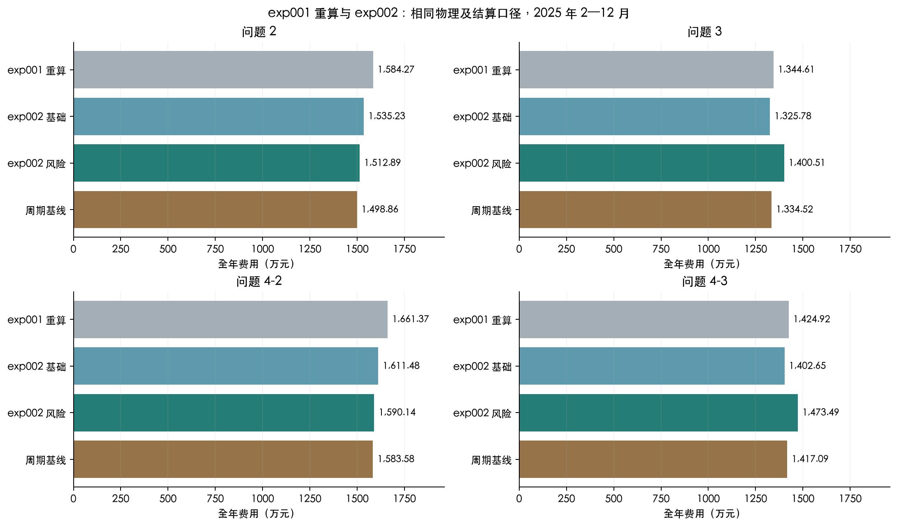
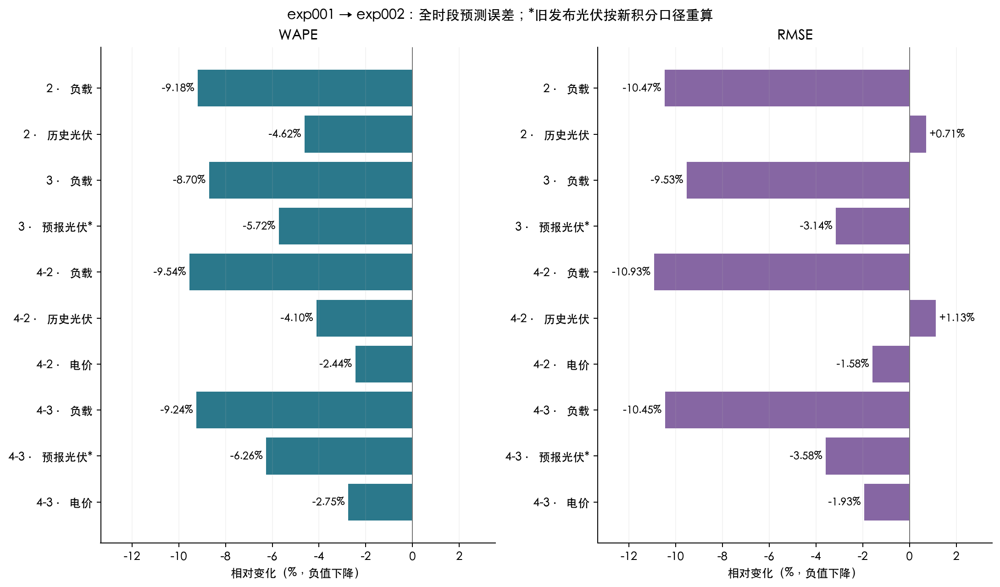

# exp002：固定轻量网络与多阶段风险调度

## 1. 结论与成绩

本轮固定四分支轻量网络，种子 42 是正式策略；另外两个种子用于稳定性评价。第一问沿用现有成果。正式评价为 2025 年 2 月 1 日至 12 月 31 日，共 334 天，每日 144 个区间。

已完成 33 组 GPU 训练，累计 11.2554 分钟；旧实验为 165 组、98.3616 分钟。训练组数减少 80%，这不代表完整风险调度也同样节省时间。全部回放已完成。

| 问题 | 原计划费/元 | 上调费/元 | 下调费/元 | 紧急购电费/元 | 总费用/元 | 紧急购电量/kWh |
|---|---|---|---|---|---|---|
| 2 | 11,755,724.5128 | 0.0000 | 0.0000 | 3,373,172.9400 | 15,128,897.4527 | 579,717.6630 |
| 3 | 11,689,414.7343 | 572,139.8932 | 1,101.8064 | 1,742,406.3419 | 14,005,062.7759 | 329,778.1349 |
| 4-2 | 12,432,922.1904 | 0.0000 | 0.0000 | 3,468,475.0107 | 15,901,397.2011 | 579,538.5193 |
| 4-3 | 12,374,774.0386 | 582,179.8409 | 905.3522 | 1,777,065.8931 | 14,734,925.1249 | 329,083.1511 |

固定正式种子的全年预测成绩：

| 预测目标 | MAE | RMSE | WAPE/% |
|---|---|---|---|
| 负载 | 163.7146 | 221.4438 | 3.5449 |
| 电价 | 0.0416 | 0.0564 | 5.4940 |
| 历史光伏 | 172.5278 | 344.1314 | 7.2505 |
| 光伏预报修正 | 158.2416 | 298.6576 | 6.6501 |

全年费用结论（均在本轮统一协议内比较）：

问题 2 正式总费用 15,128,897.4527 元，较历史重算降低 4.505%，较新预测基础调度降低 1.455%，较周期基线增加 0.936%。

问题 3 正式总费用 14,005,062.7759 元，较历史重算增加 4.157%，较新预测基础调度增加 5.636%，较周期基线增加 4.945%。

问题 4-2 正式总费用 15,901,397.2011 元，较历史重算降低 4.288%，较新预测基础调度降低 1.324%，较周期基线增加 0.414%。

问题 4-3 正式总费用 14,734,925.1249 元，较历史重算增加 3.409%，较新预测基础调度增加 5.051%，较周期基线增加 3.980%。

## 2. 题目指标及信息边界

平均绝对误差 MAE = Σ|ŷ−y|/N；均方根误差 RMSE = √(Σ(ŷ−y)²/N)；加权绝对百分比误差 WAPE = 100Σ|ŷ−y|/Σ|y|。负载与光伏单位为千瓦，电价为元/千瓦时。按误差和重新合并月份，不平均月度百分比。预测覆盖四个发布时刻的未来 24 小时；跨年无实测的目标从分母中排除。调度每区间只结算一次，故预测样本数与调度区间数不同。

四次发布的误差统计用于统一比较预测算法；问题 2、4-2 的实际调度始终只采用凌晨预测和全日计划。它们不会利用日内新预测修改购电量。

购电量及储能状态单位为千瓦时。费用 = 原计划全额费＋最终上调量×1.5×电价＋最终下调量×0.5×电价＋紧急购电量×5×电价。日内中间调整不重复计费。问题 4 的未来价格必须预测，实际价格到达后才用于结算。

充、放电效率均为 √0.9，储电量 1200—10800 千瓦时，交流侧功率上限 5000 千瓦。日末仅施加物理边界，从 1 月 1 日的 6000 千瓦时连续传递，不每日重置。问题 2、4-2 的特征、预测与场景不读取附件 3；问题 3、4-3 只读取已经发布的版本。

实测日费用的 CVaR90 取最贵 10% 概率质量，按边界日期的部分权重计算；它与每次优化中场景费用的 CVaR 是不同层级，分别标明。

## 3. 数据与时间验证

原始数据为 365 个自然日、每天 144 个十分钟区间。CSV 包含一列日期及 144 列区间终点值（00:10 至次日 00:00）；分离日期列后按自然日展开，得到 52560 条实际功率/价格记录。正式回放覆盖 48096 个区间。数据校验值保存于 data_hashes.json。

每个月初回看最近七个完整日期作为验证集，其起点为训练截止点，标签跨越截止点的发布样本剔除。检查点只在月初冻结；当月预测只用该月检查点。场景历史必须包括该历史日期所有预报版本的完整目标窗口，不能仅因日期已过去就读到其尚未实现的晚间目标。

风险权重在 2 月 1 日利用 1 月 25—31 日留出集选择。该留出集同时供二月检查点早停，因此一月校准不是独立的泛化成绩；正式二月及以后才是样本外回放。风险残差仍使用一月当时可以产生的周期基础预测，避免把二月模型倒灌为一月已经可用的模型。

额外扰动检查把二月及以后的实测与预报放大 100 倍，四个问题共 70 个一月决策时刻的预测、路径、概率与信息树逐值一致，训练标签和验证特征也不变。完整证据见 calibration_causality_check.json；购电非预见性另由小型可穷举实例核验。固定墙钟预算的两次搜索可能返回不同可行解，因此因果性检查比较信息和模型输入，并把数值求解重现性单独说明。

固定电价问题的树分支还额外检查了价格信息隔离：任意改变可变电价历史，问题 3 的实际供需场景与信息节点都必须不变。检查发现并修正过一次分支信息错误；受影响的六组问题 3 风险回放与其一月权重校准已作废重算。未受影响的缓存只有在源代码差异和逐月场景等价性通过检查后才保留，迁移记录见 causal_tree_fix_migration.json。所有正式成绩使用修正后的协议，训练仍为 33 组。

补充边界检查发现，非负裁剪之前的隐含误差不能当作已经观测到的发电或负载。修正后，观测与预报修订完全相同的路径不会分支；负载、光伏和价格裁剪均有回归测试。逐项比较保留了 10146 个等价日期，作废了 1694 个受影响日期，并重新校准问题 3、4-3，记录见 clipped_information_fix_migration.json。已知未来价格的反事实同样排除价格信息分支，记录见 known_price_information_migration.json。作废计算的耗时计入本轮总运行段，不隐藏重算成本。

一月历史基线诊断使用 1 月 8 日至 1 月 31 日 0 时的 93 个发布窗口，每个窗口的完整 24 小时标签都在一月内。只比较历史同期，不训练网络，也不使用二月以后的成绩选择路线。负载和电价的周同期误差更小，历史光伏的昨日同期误差更小；这一诊断支持方案中预先固定的周期组合。

| 变量 | 历史基线 | 一月 MAE | 一月 RMSE | 单位 | 一月 WAPE/% |
|---|---|---|---|---|---|
| 负载 | 昨日同期 | 640.1671 | 1,123.7427 | kW | 13.5347 |
| 历史光伏 | 昨日同期 | 112.9449 | 249.2186 | kW | 6.9855 |
| 电价 | 昨日同期 | 0.0837 | 0.1254 | 元/kWh | 9.7524 |
| 负载 | 上周同期 | 142.6758 | 178.0299 | kW | 3.0165 |
| 历史光伏 | 上周同期 | 127.9726 | 265.7849 | kW | 7.9150 |
| 电价 | 上周同期 | 0.0388 | 0.0491 | 元/kWh | 4.5269 |
| 负载 | 周期基础预测 | 142.6758 | 178.0299 | kW | 3.0165 |
| 历史光伏 | 周期基础预测 | 112.9449 | 249.2186 | kW | 6.9855 |
| 电价 | 周期基础预测 | 0.0388 | 0.0491 | 元/kWh | 4.5269 |

## 4. 逐步技术讲解

### 4.1 时间样本与周期基础预测

把每个十分钟区间的结束时刻作为记录时间。区间功率除以 6，才是该区间电量。发布时刻为 t，h 为从该时刻起的第 h 个未来区间，模型在发布时一次产生未来 144 个区间的预测。负载、电价先取上周同期；历史光伏先取昨日同期。问题 3、4-3 的光伏基础值来自当时已经发布的附件 3。固定这条路线的依据是题目提供的信息和正式评价前的 1 月，而非 exp001 的全年排名。

对某变量的基础预测记为 b(t,h)，网络学习真实值与它的差额。周期预测承担日内形状，网络只学习形状偏差、近期水平变化和周期信息。输出层权重及偏置从零开始，所以第一次参数更新前严格返回基础预测。

### 4.2 四个独立分支：16 → 32 → 16 → 1

每个发布样本包括 144 个未来区间。每一区间、每个变量有 16 项输入：日内正弦与余弦、星期正弦与余弦、发布时刻正弦与余弦、提前量、昨日同期、上周同期、最近观测、近 6/24/168 小时均值、近 24/168 小时标准差、基础预测。日历由时钟计算；均值、波动与滞后项只取发布前可观测历史。四个分支只读取对应变量的数据，光伏预报修正分支读取光伏历史及已经发布的光伏预报。

先用训练历史的均值 μ 与标准差 σ 标准化数值。两个隐藏层分别计算 a₁ = ReLU(W₁x+b₁) 与 a₂ = ReLU(W₂a₁+b₂)，最后给出标准化修正 r = W₃a₂+b₃。ReLU 将负输入置零，允许不同状态下使用不同的修正关系。最后预测为 max(0, b+σr)。四分支合计 4×[(16+1)×32+(32+1)×16+(16+1)×1] = 4356 个参数；一个检查点保存全部分支。

### 4.3 损失、参数更新与时间验证

标准化误差 e = (真实值−基础预测)/σ−r。Huber 损失在 |e|≤1 时为 e²/2，否则为 |e|−1/2；它兼顾小误差的精细拟合与大误差的较低敏感度。隐藏层同时使用 0.0001 的 L2 正则项。Adam 依据梯度的一阶与二阶移动平均缩放每个参数的更新，学习率 0.001。一个批次包含 64 个发布样本，最多 60 轮，验证损失连续 6 轮不改善即停止，并恢复验证损失最低时的权重。

四个分支的输入、隐藏层和输出权重彼此独立，训练目标取四分支的平均损失再加正则项。光伏预报修正只在 24 个小时目标点计损失，每点权重为 6，使其总权重与使用 144 个区间的分支一致。一个检查点使用统一的验证总目标选择早停轮次，因此分支共享保存轮次；这里的独立指特征及参数的分离，不表示四次独立早停。

每月从头训练。前一月末最近 7 个完整日期只用于验证，训练样本的整个标签窗口必须在训练边界之前结束；跨界样本剔除。标准化统计不使用验证集。进入当月之后冻结检查点，全年分别固定种子 42、2026、3407。33 组训练是 11 个月×3 种子；既不按全年成绩选网络，也不挑种子或平均三个种子。

### 4.4 光伏小时点校准与区间积分

附件 3 的 24 个值对应未来小时目标点。网络只在这些点训练光伏预报修正损失；取出 24 个修正后的小时点后，把发布前最近已观测光伏作为首段锚点，逐段线性连接。每个十分钟区间的平均功率等于该区间两端线性值的平均，再除以 6 得到电量。夜间约束依据发布前最多 28 天同一时刻的实际发电以及本次预报；不能查看未来实际日照。

旧实验档案已保存每个十分钟目标点的修正序列，历史重算保留这些点，并对相邻点与已观测首段锚点作梯形积分，得到区间平均功率。这个转换只影响历史重算，不改写旧预测文件。它没有倒推一个旧实验并未保存的小时校准模型；旧、新架构的生成方式不同，因此涉及预报修正的原登记预测分数需要单列可比性。

分解图中的修正量定义为“最终区间预测−基础区间预测”。光伏的这项差值包含非负裁剪、夜间约束及小时点到十分钟区间的积分，与最终送入调度器的功率严格对应。

### 4.5 联合误差路径与信息逐步揭示

在每次决策时，从过去最多 56 个已经完整实现的日期收集负载、光伏、电价的联合残差，以及同一天 0、6、12、18 时预报修订。1 月没有正式网络时采用因果基础预测残差；进入正式月份后逐步使用当时已冻结的网络残差。一个历史日期的四个发布窗口全部实现后才允许成为样本，防止晚间 24 小时窗口越过当前信息截止时刻。

联合抽取整日残差可以保留同一天的变量相关性和时序变化。发布时刻、提前量分组的均值与方差用 n/(n+28) 向总体统计收缩，小样本不会完全主导误差估计。最多均匀选取 16 个历史日期。当前预测加上这些联合误差，形成未来实际路径；历史预报修订形成模拟的未来信息。

问题 3、4-3 的场景树仅在 6、12、18 时分支。用于分支的特征是届时已经揭示的实际前缀和新发布预报的变化，而非整条未来真实误差。以第一主成分作平衡二分，样本不足或变化相同则不分支。16 条路径通常对应 1→2→4→8 个信息节点，末段每节点仍有条件误差。共享同一信息节点的路径必须共享购电决策；未来真实附件预报从不传入当前求解。问题 2、4-2 不读取附件 3，全天共用同一购电计划。

问题 3 的电价已知且固定，分支只使用负载和光伏的信息；问题 4-3 才纳入电价误差及价格预测变化。固定电价下不能把可变电价的历史误差模拟成未来可揭示信息。

观测前缀使用完成非负裁剪和夜间约束后的实际场景路径。两个负光伏误差若最终都对应零发电，就不能凭裁剪前的隐含差异产生不同决策分支。额外的“已知未来价格”反事实也排除价格揭示，只用于诊断，不作为正式策略。

### 4.6 费用目标与精确因果储能执行

场景 s 的完整费用记为 Cₛ，概率 pₛ。目标为 ΣpₛCₛ + λ[ζ + Σpₛuₛ/(1−0.9)]，其中 uₛ≥Cₛ−ζ、uₛ≥0。中括号是 90% 条件尾部平均费用：关注最昂贵的最后 10% 概率质量。λ 只在 1 月验证回放中从 0、0.1、0.3 选择一次，依据实际总费用最小，并列取小值。λ=0 仍保留场景期望费用和未来更新机会。

对于区间购电 g、实际负载 L/6、实际光伏 V/6，净盈余 q=g+V/6−L/6。q≥0 时，充电 c=min(q,5000/6,(10800−E)/η)，放电为零，剩余弃电；q<0 时，放电 d=min(−q,5000/6,(E−1200)η)，充电为零，不足部分紧急购电。η=√0.9，下一状态 E′=E+ηc−d/η。这里 c、d 均为交流侧电量。

混合整数模型用符号与最小值选择变量精确表达这些关系。储能动作由当前盈余、当前储电量唯一确定，不能在场景内预知未来后自由挑选充放电。实际回放调用同一规则，并独立重算能量平衡、功率上限、效率、互斥与跨日状态。日末只有物理边界，不重置储电量，也不强加人为期末目标。

### 4.7 两秒求解与可行解核验

SciPy 的 milp 接口调用 HiGHS。先用确定性可行购电候选确定因果控制器所在分段，在固定分段下求一个线性规划可行解；该步骤最多使用 0.5 秒。再把其目标值作为上界，使用剩余预算求完整场景混合整数模型，合计设置 2 秒的求解器预算，相对最优差距目标为 1%。模型组装、初始确定性候选与独立核验另行计时，因此一次实际决策总耗时可能超过 2 秒。

只接受通过独立线性约束、变量边界、整数性及逐场景贪心回放核验的解；否则退回确定性可行计划并记录原因。固定控制器区域中的可行解可能没有全局最优差距证书，不能把它称为全局最优。报告同时列出超时、证书达标、可行解来源和真正回退的比例。

`time_limit`、`mip_rel_gap`、求解状态及可为空的差距字段遵循 [SciPy 官方 milp 接口](https://docs.scipy.org/doc/scipy/reference/generated/scipy.optimize.milp.html)。本机实际运行版本记录于训练元数据的环境字段。

### 4.8 执行与逐项结算

凌晨计划 g⁰ 全额计费。最终执行前计划 g 相对 g⁰ 的增加按 1.5p 另计，减少按 0.5p 另计，紧急购电 e 按 5p 计费：C = Σ[p g⁰ + 1.5p max(g−g⁰,0) + 0.5p max(g⁰−g,0) + 5pe]。中间修订版本不重复累加。问题 4 优化时使用预测电价；实际价格到达后用于结算。已执行区间的动作与状态冻结，后续更新只重新求解剩余时间；允许保留原计划。

### 4.9 一个实际样本如何通过网络

3 月 20 日 0 时发布、目标为 10:00—10:10 的负载预测：基础值为 6615.2017 千瓦，训练历史标准差 σ 为 1442.8906 千瓦，网络输出的标准化修正为 -0.042426。还原后修正量为 -61.2159 千瓦，因此预测为 6553.9858 千瓦；事后观测为 6577.9956 千瓦。预测发布时没有读取这个事后观测。

该检查点第 1 轮训练目标（含 L2 正则）为 0.026786；共训练 60 轮，恢复第 60 轮，最低验证目标为 0.010782。16 项实际输入和完整数字保存于 worked_example.json。损失下降记录与“参数已更新”检查共同说明网络实际训练过，不能用它代替样本外费用评价。

[论文 SVG](figures/fixed-network-architecture.svg)

[论文 SVG](figures/baseline-correction-decomposition.svg)

[论文 SVG](figures/worked-example-training-loss.svg)

[论文 SVG](figures/scenario-information-tree.svg)

## 5. 实验设置

网络固定为四个独立的 16→32→16→1 分支，共 4356 个参数。11 个月×3 个种子 = 33 个正式训练组。Adam 学习率 0.001、批量 64、Huber 损失、最多 60 轮、早停耐心 6。20 组达到 60 轮上限，不能据此声称全部收敛。所有组验证了 GPU 输出、参数更新、零初始化及保存重载。

三层核心对照是“旧正式预测＋新口径基础调度”“新预测＋同一基础调度”“新预测＋风险调度”。旧网络不重新训练，按原月度正式选择读取档案。还保留昨日、周同期、周期基础和原始附件预报；种子 42 完成零风险权重、不预先考虑更新、原始光伏预报和 0/0+6/0+6+12/0+6+12+18 四种发布组合。问题 4 的已知价格仅是反事实诊断。

| 问题 | 风险权重 | 一月验证费用/元 | 是否选定 |
|---|---|---|---|
| 2 | 0.0000 | 381,530.4601 | 否 |
| 2 | 0.1000 | 381,463.9991 | 是 |
| 2 | 0.3000 | 381,558.5352 | 否 |
| 3 | 0.0000 | 349,965.1909 | 是 |
| 3 | 0.1000 | 350,261.1668 | 否 |
| 3 | 0.3000 | 350,295.9576 | 否 |
| 4-2 | 0.0000 | 428,287.9235 | 是 |
| 4-2 | 0.1000 | 428,447.3718 | 否 |
| 4-2 | 0.3000 | 428,635.0347 | 否 |
| 4-3 | 0.0000 | 388,783.1195 | 是 |
| 4-3 | 0.1000 | 389,432.3598 | 否 |
| 4-3 | 0.3000 | 393,507.6641 | 否 |

求解目标：期望费用＋λ×CVaR90，最多 16 条联合路径、56 天历史、两秒求解器预算、1% 相对差距目标。固定控制器区域 LP 给出可核验候选；未知最优差距保持空值。CPU 回放最初使用四个工作进程，保存并核验 5053 个已完成日期后以八个工作进程恢复；预测缓存共享复用，各求解器单线程。

| 实验 | 正式训练组数 | 累计训练分钟 |
|---|---|---|
| exp001 | 165 | 98.3616 |
| exp002 | 33 | 11.2554 |

旧实验的 165 组包含 11 个月×3 个种子×5 条训练路线，其中有三类候选网络和两个 GRU 结构消融；本轮只有一条固定架构路线。两轮时间对比反映完整训练清单的实际差异。本轮的风险权重、更新次数及原始光伏预报对照均复用预测，不再额外训练网络。

分阶段实测耗时（累计任务时间与墙钟时间不可直接相加）：

| 阶段 | 分钟 | 计时口径 |
|---|---|---|
| 训练 | 11.2554 | 33 组 GPU 训练任务累计，不含特征准备、预测及调度 |
| 月度预测 | 0.0567 | 33 个检查点首次推理累计，正式预测缓存只生成一次 |
| 一月风险校准 | 18.0398 | 4 个问题×3 权重×7 日期的组装、求解和回放任务累计，非并行墙钟时间；包含已作废的一次问题 3 初步校准；也包含裁剪信息修正前已作废的问题 3、4-3 校准 |
| 全年调度 | 222.8426 | 全部核心、基线、消融及三种子；累计全部已记录运行段，包含作废的问题 3、4-3 初步回放，不含暂停间隔 |
| 工作簿导出 | 0.2910 | 一次完整阶段的墙钟时间；不含此前预览或人工检查 |
| 报告构建 | 0.0949 | 一次完整阶段的墙钟时间；不含此前预览或人工检查 |

[论文 SVG](figures/training-count-and-time.svg)

## 6. 结果及失败案例

网页可按问题、月份、预测目标、种子、误差指标与实际发电时段筛选。全年预测原始分母、绝对误差和及平方误差和保存在 forecast_metrics.csv；图表与表格从同一数据重算。

| 预测方法 | 目标 | 时段 | MAE | RMSE | WAPE/% |
|---|---|---|---|---|---|
| 附件原始预报 | 光伏预报修正 | 全部区间 | 210.5371 | 438.9796 | 8.8478 |
| 附件原始预报 | 光伏预报修正 | 实际发电区间 | 371.5114 | 586.2570 | 8.7268 |
| 固定轻量网络 | 负载 | 全部区间 | 163.7146 | 221.4438 | 3.5449 |
| 固定轻量网络 | 电价 | 全部区间 | 0.0416 | 0.0564 | 5.4940 |
| 固定轻量网络 | 历史光伏 | 全部区间 | 172.5278 | 344.1314 | 7.2505 |
| 固定轻量网络 | 历史光伏 | 实际发电区间 | 307.4010 | 460.2616 | 7.2208 |
| 固定轻量网络 | 光伏预报修正 | 全部区间 | 158.2416 | 298.6576 | 6.6501 |
| 固定轻量网络 | 光伏预报修正 | 实际发电区间 | 277.0229 | 397.9423 | 6.5073 |
| 周期基础预测 | 负载 | 全部区间 | 176.7466 | 244.2753 | 3.8271 |
| 周期基础预测 | 电价 | 全部区间 | 0.0471 | 0.0653 | 6.2216 |
| 周期基础预测 | 历史光伏 | 全部区间 | 185.4436 | 375.3297 | 7.7932 |
| 周期基础预测 | 历史光伏 | 实际发电区间 | 331.7652 | 502.0246 | 7.7932 |
| 周期基础预测 | 光伏预报修正 | 全部区间 | 210.5371 | 438.9796 | 8.8478 |
| 周期基础预测 | 光伏预报修正 | 实际发电区间 | 371.5114 | 586.2570 | 8.7268 |
| 上周同期 | 负载 | 全部区间 | 176.7466 | 244.2753 | 3.8271 |
| 上周同期 | 电价 | 全部区间 | 0.0471 | 0.0653 | 6.2216 |
| 上周同期 | 历史光伏 | 全部区间 | 214.8319 | 420.1525 | 9.0283 |
| 上周同期 | 历史光伏 | 实际发电区间 | 384.1180 | 561.9671 | 9.0229 |
| 昨日同期 | 负载 | 全部区间 | 650.5052 | 1,128.9924 | 14.0854 |
| 昨日同期 | 电价 | 全部区间 | 0.0844 | 0.1239 | 11.1319 |
| 昨日同期 | 历史光伏 | 全部区间 | 185.4436 | 375.3297 | 7.7932 |
| 昨日同期 | 历史光伏 | 实际发电区间 | 331.7652 | 502.0246 | 7.7932 |

三个固定种子的各自全年预测误差。MAE、RMSE 的单位随目标分别为千瓦或元/千瓦时，WAPE 为百分比；这三组独立成绩不构成预测集成：

| 预测种子 | 目标 | 时段 | MAE | RMSE | WAPE/% |
|---|---|---|---|---|---|
| 42 | 负载 | 全部区间 | 163.7146 | 221.4438 | 3.5449 |
| 42 | 电价 | 全部区间 | 0.0416 | 0.0564 | 5.4940 |
| 42 | 历史光伏 | 全部区间 | 172.5278 | 344.1314 | 7.2505 |
| 42 | 历史光伏 | 实际发电区间 | 307.4010 | 460.2616 | 7.2208 |
| 42 | 光伏预报修正 | 全部区间 | 158.2416 | 298.6576 | 6.6501 |
| 42 | 光伏预报修正 | 实际发电区间 | 277.0229 | 397.9423 | 6.5073 |
| 2026 | 负载 | 全部区间 | 164.6359 | 223.2125 | 3.5649 |
| 2026 | 电价 | 全部区间 | 0.0413 | 0.0559 | 5.4535 |
| 2026 | 历史光伏 | 全部区间 | 172.8089 | 344.5120 | 7.2623 |
| 2026 | 历史光伏 | 实际发电区间 | 307.9276 | 460.7701 | 7.2332 |
| 2026 | 光伏预报修正 | 全部区间 | 158.0709 | 297.7826 | 6.6429 |
| 2026 | 光伏预报修正 | 实际发电区间 | 277.0399 | 396.7757 | 6.5077 |
| 3407 | 负载 | 全部区间 | 161.8316 | 218.7504 | 3.5041 |
| 3407 | 电价 | 全部区间 | 0.0412 | 0.0558 | 5.4428 |
| 3407 | 历史光伏 | 全部区间 | 170.0053 | 339.9638 | 7.1445 |
| 3407 | 历史光伏 | 实际发电区间 | 303.1502 | 454.6940 | 7.1210 |
| 3407 | 光伏预报修正 | 全部区间 | 157.9579 | 296.5392 | 6.6382 |
| 3407 | 光伏预报修正 | 实际发电区间 | 276.5346 | 395.0342 | 6.4958 |

以下均值与样本标准差（ddof=1）在三个种子的全年指标之间计算，不是先平均预测再评价。WAPE 的标准差单位为百分点：

| 目标 | 时段 | MAE 均值 | MAE 标准差 | RMSE 均值 | RMSE 标准差 | WAPE 均值/% | WAPE 标准差/百分点 |
|---|---|---|---|---|---|---|---|
| 负载 | 全部区间 | 163.3940 | 1.4294 | 221.1356 | 2.2469 | 3.5380 | 0.0310 |
| 电价 | 全部区间 | 0.0414 | 0.0002 | 0.0560 | 0.0003 | 5.4634 | 0.0270 |
| 历史光伏 | 全部区间 | 171.7807 | 1.5439 | 342.8691 | 2.5232 | 7.2191 | 0.0649 |
| 历史光伏 | 实际发电区间 | 306.1596 | 2.6195 | 458.5752 | 3.3709 | 7.1917 | 0.0615 |
| 光伏预报修正 | 全部区间 | 158.0901 | 0.1428 | 297.6598 | 1.0646 | 6.6437 | 0.0060 |
| 光伏预报修正 | 实际发电区间 | 276.8658 | 0.2870 | 396.5841 | 1.4634 | 6.5036 | 0.0067 |

三种子费用稳定性，标准差为样本标准差（ddof=1），不用于挑选正式种子。费用波动同时包含预测差异和限时求解的运行差异；三个重复不足以宣称广泛的统计显著性：

| 问题 | 费用均值/元 | 费用标准差/元 | 日费用CVaR90均值/元 | 尾部费用标准差/元 |
|---|---|---|---|---|
| 2 | 15,204,235.0095 | 66,730.6327 | 83,572.7947 | 655.0438 |
| 3 | 14,034,475.2264 | 44,346.7532 | 69,308.5326 | 167.3782 |
| 4-2 | 15,966,538.5701 | 56,503.4304 | 93,794.3790 | 611.4031 |
| 4-3 | 14,755,800.5925 | 38,105.5791 | 79,909.8698 | 278.3781 |

| 问题 | 最差日期 | 最差日费用/元 | 日费用CVaR90/元 | 期末储电量/kWh | 求解次数 | 超时次数 | 回退次数 | 区域LP候选采用次数 | 差距≤1%次数 | 组装求解执行秒数 |
|---|---|---|---|---|---|---|---|---|---|---|
| 2 | 2025-06-01 | 138,575.9787 | 83,083.7379 | 1,200.0000 | 334.0000 | 334.0000 | 0.0000 | 334.0000 | 0.0000 | 907.7402 |
| 3 | 2025-07-06 | 110,828.2260 | 69,501.1979 | 1,200.0000 | 1,336.0000 | 1,336.0000 | 0.0000 | 1,336.0000 | 0.0000 | 3,355.8207 |
| 4-2 | 2025-07-06 | 161,116.9088 | 93,158.9881 | 1,200.0000 | 334.0000 | 334.0000 | 0.0000 | 334.0000 | 0.0000 | 927.9434 |
| 4-3 | 2025-07-06 | 126,344.4667 | 80,214.8642 | 1,200.0000 | 1,336.0000 | 1,335.0000 | 0.0000 | 1,336.0000 | 0.0000 | 3,356.1860 |

[指定四日的完整表格](specified_dates.md)。全年紧急购电时段见 emergency_periods.csv，四小时充放电量见 battery_blocks.csv。超时不等同于回退；只有没有任何通过独立核验的可行解时才回退。采用区域 LP 候选且无全局差距时，报告不作最优性承诺。

预测误差并非全面改善。与旧正式预测按同一口径比较，问题 2 的历史光伏在全部区间的 RMSE 增加 0.708%；问题 2 的历史光伏在实际发电区间的 RMSE 增加 0.875%；问题 4-2 的历史光伏在全部区间的 RMSE 增加 1.127%；问题 4-2 的历史光伏在实际发电区间的 RMSE 增加 1.289%。这表明全年 WAPE 的下降不能代替大误差和实际发电时段的检查。

全部种子 42 对照的全年成绩（权重为零与正式策略相同时复用同一回放）：

| 问题 | 方案 | 全年费用/元 | 日费用CVaR90/元 | 紧急购电/kWh | 回退次数 |
|---|---|---|---|---|---|
| 2 | 周期基础预测 | 14,988,614.2346 | 84,837.2764 | 549,745.6303 | 0.0000 |
| 2 | 本轮正式策略 | 15,128,897.4527 | 83,083.7379 | 579,717.6630 | 0.0000 |
| 2 | 风险权重为零 | 15,131,599.3693 | 83,095.2640 | 580,555.8783 | 0.0000 |
| 2 | 新预测＋基础调度 | 15,352,302.2799 | 84,488.0593 | 628,285.6174 | 0.0000 |
| 2 | 上周同期 | 15,646,954.3403 | 91,843.8192 | 661,866.3442 | 0.0000 |
| 2 | 旧正式预测＋基础调度 | 15,842,654.1907 | 92,651.6369 | 730,041.0881 | 0.0000 |
| 2 | 昨日同期 | 22,106,599.0342 | 207,886.2804 | 2,003,044.1170 | 0.0000 |
| 3 | 新预测＋基础调度 | 13,257,848.3582 | 63,898.8914 | 168,559.6631 | 0.0000 |
| 3 | 周期基础预测 | 13,345,156.4925 | 64,954.4214 | 155,997.4995 | 0.0000 |
| 3 | 上周同期 | 13,345,156.4925 | 64,954.4214 | 155,997.4995 | 0.0000 |
| 3 | 旧正式预测＋基础调度 | 13,446,145.2166 | 66,415.1306 | 205,236.0662 | 0.0000 |
| 3 | 不预先考虑更新 | 13,952,693.3726 | 69,427.8003 | 308,841.4445 | 0.0000 |
| 3 | 原始光伏预报 | 13,991,912.6217 | 68,272.8304 | 298,827.0346 | 0.0000 |
| 3 | 本轮正式策略 | 14,005,062.7759 | 69,501.1979 | 329,778.1349 | 0.0000 |
| 3 | 风险权重为零 | 14,005,062.7759 | 69,501.1979 | 329,778.1349 | 0.0000 |
| 3 | 0、6、12 时发布 | 14,895,037.8592 | 77,958.8550 | 505,799.6445 | 0.0000 |
| 3 | 0、6 时发布 | 15,120,923.4968 | 80,642.3731 | 549,068.6656 | 0.0000 |
| 3 | 只在凌晨发布 | 15,277,961.2694 | 82,397.7904 | 595,919.7701 | 0.0000 |
| 3 | 昨日同期 | 18,602,321.5577 | 155,708.8155 | 1,140,285.2468 | 0.0000 |
| 4-2 | 周期基础预测 | 15,835,805.9479 | 95,478.6276 | 546,224.9728 | 0.0000 |
| 4-2 | 已知未来价格（反事实） | 15,851,546.7529 | 93,015.9376 | 606,180.3382 | 0.0000 |
| 4-2 | 本轮正式策略 | 15,901,397.2011 | 93,158.9881 | 579,538.5193 | 0.0000 |
| 4-2 | 风险权重为零 | 15,901,397.2011 | 93,158.9881 | 579,538.5193 | 0.0000 |
| 4-2 | 新预测＋基础调度 | 16,114,809.6566 | 94,639.4864 | 625,692.5069 | 0.0000 |
| 4-2 | 上周同期 | 16,466,602.5293 | 101,200.4241 | 653,238.4215 | 0.0000 |
| 4-2 | 旧正式预测＋基础调度 | 16,613,721.6045 | 102,959.2739 | 727,997.2776 | 0.0000 |
| 4-2 | 昨日同期 | 23,121,600.9605 | 224,681.9582 | 1,992,046.8916 | 0.0000 |
| 4-3 | 新预测＋基础调度 | 14,026,450.8280 | 74,420.3692 | 176,842.0583 | 0.0000 |
| 4-3 | 周期基础预测 | 14,170,862.8544 | 76,139.2549 | 163,610.4891 | 0.0000 |
| 4-3 | 上周同期 | 14,170,862.8544 | 76,139.2549 | 163,610.4891 | 0.0000 |
| 4-3 | 旧正式预测＋基础调度 | 14,249,194.6053 | 77,647.3034 | 225,579.3692 | 0.0000 |
| 4-3 | 已知未来价格（反事实） | 14,622,448.9989 | 79,652.3454 | 343,696.2475 | 0.0000 |
| 4-3 | 不预先考虑更新 | 14,674,803.0360 | 80,107.6890 | 305,182.1882 | 0.0000 |
| 4-3 | 本轮正式策略 | 14,734,925.1249 | 80,214.8642 | 329,083.1511 | 0.0000 |
| 4-3 | 风险权重为零 | 14,734,925.1249 | 80,214.8642 | 329,083.1511 | 0.0000 |
| 4-3 | 原始光伏预报 | 14,737,745.5048 | 79,546.2071 | 299,312.3202 | 0.0000 |
| 4-3 | 0、6、12 时发布 | 15,706,008.7650 | 88,990.1875 | 515,719.4186 | 0.0000 |
| 4-3 | 0、6 时发布 | 15,868,815.1020 | 91,578.6309 | 545,946.8555 | 0.0000 |
| 4-3 | 只在凌晨发布 | 16,021,905.3379 | 93,280.1259 | 589,345.1853 | 0.0000 |
| 4-3 | 昨日同期 | 19,447,660.4777 | 168,619.9870 | 1,132,274.5827 | 0.0000 |
三个固定种子的各自全年成绩：

| 问题 | 种子 | 全年费用/元 | 日费用CVaR90/元 | 期末储电量/kWh |
|---|---|---|---|---|
| 2 | 42 | 15,128,897.4527 | 83,083.7379 | 1,200.0000 |
| 2 | 2026 | 15,255,909.7416 | 84,317.0230 | 1,203.8753 |
| 2 | 3407 | 15,227,897.8343 | 83,317.6231 | 1,200.0000 |
| 3 | 42 | 14,005,062.7759 | 69,501.1979 | 1,200.0000 |
| 3 | 2026 | 14,012,879.7254 | 69,198.9511 | 1,200.0000 |
| 3 | 3407 | 14,085,483.1780 | 69,225.4489 | 1,200.0000 |
| 4-2 | 42 | 15,901,397.2011 | 93,158.9881 | 1,200.0000 |
| 4-2 | 2026 | 16,002,285.6021 | 94,378.5750 | 1,200.0000 |
| 4-2 | 3407 | 15,995,932.9070 | 93,845.5738 | 1,200.0000 |
| 4-3 | 42 | 14,734,925.1249 | 80,214.8642 | 1,200.0000 |
| 4-3 | 2026 | 14,732,694.3804 | 79,845.2828 | 1,200.0000 |
| 4-3 | 3407 | 14,799,782.2721 | 79,669.4624 | 1,200.0000 |
正式种子四个问题共 3340 次风险求解，其中 3339 次超时、0 次回退，0 次有不超过 1% 的全局差距证书。两秒预算限制的是求解器阶段；组装、可行初始计划及独立核验另计。费用结果可以比较，不能把全部可行解称为全局最优解。

2 秒是传给求解接口的预算设置；实测求解调用平均为 2.088—2.104 秒，可能略超过设置值。图表使用实测值，没有把它截断为 2 秒；完整调用耗时与差距保存在 solver_metrics.csv。

失败案例按各问题最贵的实际日期固定选择。费用同时受真实净需求、电价、预测误差及日前计划影响；下图用于定位误差和储能不足的时段，不能单凭最贵日期归因于网络。预测误差降低也不保证结算费用降低，因为上调、下调与紧急购电具有不同代价。区间电量画在区间中点，储能轨迹使用 00:00—24:00 的 145 个实际状态节点。

问题 3 的风险调度较同预测基础调度多花 747,214.4177 元。实测费用变化分别为：原计划 +85,808.3847 元，上调 -233,694.6497 元，下调 -3,449.7464 元，紧急购电 +898,550.4290 元。这是可核算的费用来源；仅凭本轮结果，不能把原因唯一归于场景近似、信息树或求解时限中的某一项。

问题 4-3 的风险调度较同预测基础调度多花 708,474.2969 元。实测费用变化分别为：原计划 +82,849.3723 元，上调 -250,657.0415 元，下调 -5,006.7350 元，紧急购电 +881,288.7011 元。这是可核算的费用来源；仅凭本轮结果，不能把原因唯一归于场景近似、信息树或求解时限中的某一项。

[论文 SVG](figures/annual-three-error-metrics.svg)

[论文 SVG](figures/monthly-forecast-error.svg)

[论文 SVG](figures/lead-and-generating-error.svg)

[论文 SVG](figures/cost-components.svg)

[论文 SVG](figures/failure-case-and-storage.svg)

[论文 SVG](figures/cost-versus-tail-risk.svg)

[论文 SVG](figures/solver-gap-and-fallback.svg)

[论文 SVG](figures/daily-emergency-and-monthly-cost.svg)

## 7. 历次指标和技术路线对比

自动读取此前全部 1 次登记实验，原记录保持不变。正式策略按其角色匹配，网络名称不必相同。调度比较检查效率、结算、预热、时标与执行规则；预测误差另检查评价期、目标语义与数据，不因为电池效率变化就把负载误差判为不可比。

### 7.1 全年费用：历史重算、预测变化与调度变化

本节固定比较 2025 年 2—12 月四个问题，独立于页首问题和月份筛选。exp001 重算保留旧月度正式预测选择；exp002 基础和风险均使用正式种子 42。四种方案采用相同的新物理与结算口径，周期基线也放入图中。原登记费用因协议不同，仅保留在本节明细表，不混入排名。

[论文 SVG](figures/history-cost-comparison.svg)

### 7.2 预测误差：WAPE 与 RMSE 同时比较

负值表示误差下降，正值表示上升；相对变化按（本次−此前）/此前绝对值计算。默认展示全时段，网页可切换实际发电时段。星号标注的发布光伏先将旧预测按新积分口径重算；原值、指标及口径保留在图表数据来源和本节完整比较表中。全时段 WAPE 均下降，但问题 2、4-2 的历史光伏 RMSE 分别增加 0.708%、1.127%，不能据此宣称所有误差都改善。

[论文 SVG](figures/history-forecast-relative-change.svg)

### 7.3 训练规模与实测耗时

训练组数从 165 组降至 33 组；累计 GPU 训练时间从 98.3616 分钟降至 11.2554 分钟。旧实验包含三种候选网络及两个特征消融，故共五条训练路线；本轮固定一条。这里比较各实验完整训练任务的累计值，不是同等任务量的硬件速度比较，也不代表端到端加速。本轮全部调度实验累计 222.8426 分钟，分阶段计时范围见第五部分。

[论文 SVG](figures/training-count-and-time.svg)

### 7.4 历史明细与可比性

| 实验 | 问题 | 原登记费用/元 | 技术路线 | 可比性说明 |
|---|---|---|---|---|
| exp001 | 2 | 16,258,308.2174 | 区间终点对齐 → 因果历史窗口与已发布预报 → 三种独立分支神经网络残差预测 → 三种子平均与月初验证费用选模 → 线性规划计划及日内重算 → 固定因果执行 → 逐区间独立结算 | 原记录保留；效率、光伏积分、执行与预热协议不同，不直接排名 |
| exp001 | 3 | 13,957,164.8401 | 区间终点对齐 → 因果历史窗口与已发布预报 → 三种独立分支神经网络残差预测 → 三种子平均与月初验证费用选模 → 线性规划计划及日内重算 → 固定因果执行 → 逐区间独立结算 | 原记录保留；效率、光伏积分、执行与预热协议不同，不直接排名 |
| exp001 | 4-2 | 17,012,164.4096 | 区间终点对齐 → 因果历史窗口与已发布预报 → 三种独立分支神经网络残差预测 → 三种子平均与月初验证费用选模 → 线性规划计划及日内重算 → 固定因果执行 → 逐区间独立结算 | 原记录保留；效率、光伏积分、执行与预热协议不同，不直接排名 |
| exp001 | 4-3 | 14,769,217.0270 | 区间终点对齐 → 因果历史窗口与已发布预报 → 三种独立分支神经网络残差预测 → 三种子平均与月初验证费用选模 → 线性规划计划及日内重算 → 固定因果执行 → 逐区间独立结算 | 原记录保留；效率、光伏积分、执行与预热协议不同，不直接排名 |

旧正式预测经新光伏积分、共同一月预热和新储能协议后重新回放，形成“旧正式预测＋基础调度”。它与“新预测＋基础调度”的差异用于辨认预测贡献；再与正式风险调度比较，辨认调度贡献。历史重算不是旧实验原成绩，不覆盖旧注册记录。发布预报积分转换单独记录在 prediction_archive.json 与本轮协议。

正式预测的全年 WAPE 对比（光伏按新积分口径重算；完整 MAE/RMSE 见 CSV）：

| 问题 | 变量 | 旧正式预测/% | 新正式预测/% | 相对变化/% | 口径 |
|---|---|---|---|---|---|
| 2 | 负载 | 3.9033 | 3.5449 | -9.1820 | 同口径正式预测；保留旧月度选择 |
| 2 | 历史光伏 | 7.6013 | 7.2505 | -4.6158 | 同口径正式预测；保留旧月度选择 |
| 3 | 负载 | 3.8828 | 3.5449 | -8.7031 | 同口径正式预测；保留旧月度选择 |
| 3 | 光伏预报修正 | 7.0532 | 6.6501 | -5.7157 | 同评价区间与单位的历史重算；旧光伏十分钟点积分 |
| 4-2 | 负载 | 3.9187 | 3.5449 | -9.5384 | 同口径正式预测；保留旧月度选择 |
| 4-2 | 历史光伏 | 7.5607 | 7.2505 | -4.1029 | 同口径正式预测；保留旧月度选择 |
| 4-2 | 电价 | 5.6315 | 5.4940 | -2.4424 | 同口径正式预测；保留旧月度选择 |
| 4-3 | 负载 | 3.9059 | 3.5449 | -9.2418 | 同口径正式预测；保留旧月度选择 |
| 4-3 | 光伏预报修正 | 7.0939 | 6.6501 | -6.2560 | 同评价区间与单位的历史重算；旧光伏十分钟点积分 |
| 4-3 | 电价 | 5.6491 | 5.4940 | -2.7460 | 同口径正式预测；保留旧月度选择 |

三层核心调度对照（相同新物理与结算协议，全部固定种子 42）：

| 问题 | 方案 | 总费用/元 | 日费用CVaR90/元 | 紧急购电/kWh |
|---|---|---|---|---|
| 2 | 新预测＋基础调度 | 15,352,302.2799 | 84,488.0593 | 628,285.6174 |
| 2 | 本轮正式策略 | 15,128,897.4527 | 83,083.7379 | 579,717.6630 |
| 2 | 旧正式预测＋基础调度 | 15,842,654.1907 | 92,651.6369 | 730,041.0881 |
| 3 | 新预测＋基础调度 | 13,257,848.3582 | 63,898.8914 | 168,559.6631 |
| 3 | 旧正式预测＋基础调度 | 13,446,145.2166 | 66,415.1306 | 205,236.0662 |
| 4-2 | 本轮正式策略 | 15,901,397.2011 | 93,158.9881 | 579,538.5193 |
| 4-2 | 新预测＋基础调度 | 16,114,809.6566 | 94,639.4864 | 625,692.5069 |
| 4-2 | 旧正式预测＋基础调度 | 16,613,721.6045 | 102,959.2739 | 727,997.2776 |
| 4-3 | 新预测＋基础调度 | 14,026,450.8280 | 74,420.3692 | 176,842.0583 |
| 4-3 | 旧正式预测＋基础调度 | 14,249,194.6053 | 77,647.3034 | 225,579.3692 |
| 3 | 本轮正式策略 | 14,005,062.7759 | 69,501.1979 | 329,778.1349 |
| 4-3 | 本轮正式策略 | 14,734,925.1249 | 80,214.8642 | 329,083.1511 |
两步变化的费用分项（本步减前一步，负值表示节省；预测变化保持基础调度相同，调度变化保持新预测相同）：

| 问题 | 步骤 | 原计划变化/元 | 上调变化/元 | 下调变化/元 | 紧急购电变化/元 | 总费变化/元 |
|---|---|---|---|---|---|---|
| 2 | 预测变化 | 64,574.8290 | 0.0000 | 0.0000 | -554,926.7397 | -490,351.9108 |
| 2 | 调度变化 | 77,871.6517 | 0.0000 | 0.0000 | -301,276.4789 | -223,404.8272 |
| 3 | 预测变化 | 76,561.0236 | -100,017.7394 | 177.1284 | -165,017.2711 | -188,296.8585 |
| 3 | 调度变化 | 85,808.3847 | -233,694.6497 | -3,449.7464 | 898,550.4290 | 747,214.4177 |
| 4-2 | 预测变化 | 87,281.8221 | 0.0000 | 0.0000 | -586,193.7699 | -498,911.9479 |
| 4-2 | 调度变化 | 73,022.5492 | 0.0000 | 0.0000 | -286,435.0047 | -213,412.4555 |
| 4-3 | 预测变化 | 86,674.5412 | -65,648.9510 | -14.6899 | -243,754.6776 | -222,743.7773 |
| 4-3 | 调度变化 | 82,849.3723 | -250,657.0415 | -5,006.7350 | 881,288.7011 | 708,474.2969 |

## 8. 复现说明

统一入口：`.venv/bin/python -m experiments.common.neural_v2.run STAGE`。STAGE 依次为 prepare、train、predict、calibrate、replay、export、report；也支持 all。训练强制 GPU，各阶段可独立恢复，配置或源代码签名变化会拒绝复用旧缓存。详细命令、导出依赖及缓存约定见 experiments/common/neural_v2/README.md。

正式结果为 result2.xlsx、result3.xlsx、result4-2.xlsx、result4-3.xlsx。购电表的全天总费用已包含原计划、最终净调整和紧急购电，多个工作表中的重复总费用不能相加。逐日 CSV、指定日期表格、论文 PNG/SVG、四个工作簿和离线 report.html 同包交付；体积较大的逐区间 NPZ 留在实验分支的 data/results/exp002。主分支报告和全部网页筛选可以独立使用。

复现边界：有上限的混合整数求解会受到机器速度影响；固定种子与数据并不能保证每次在同一秒数预算下找到同一可行解。已有缓存可精确恢复已完成回放，从头重算需重新报告求解状态与耗时。所有最终核验结果保存为 verification.json、unit_tests.txt、browser_checks.json 和 consistency_checks.json。

本次冻结实验代码提交：`ab359643a10d584546f3c397d021f3ae44487a49`。预测检查点、上游档案、数据与源代码的 SHA-256 见 prediction_archive.json、data_hashes.json、source_hashes.json。
