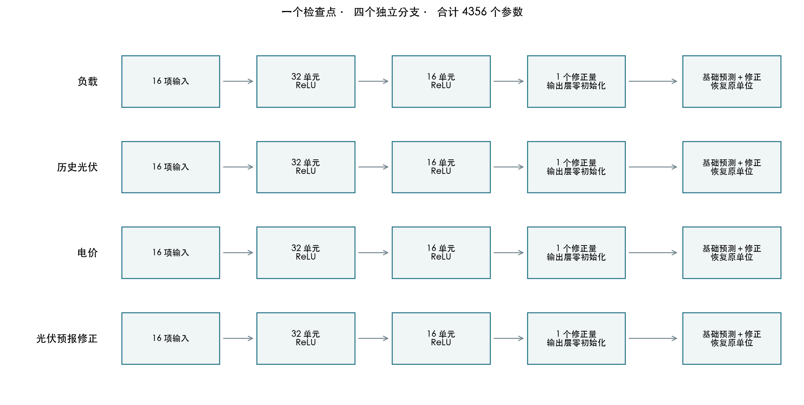
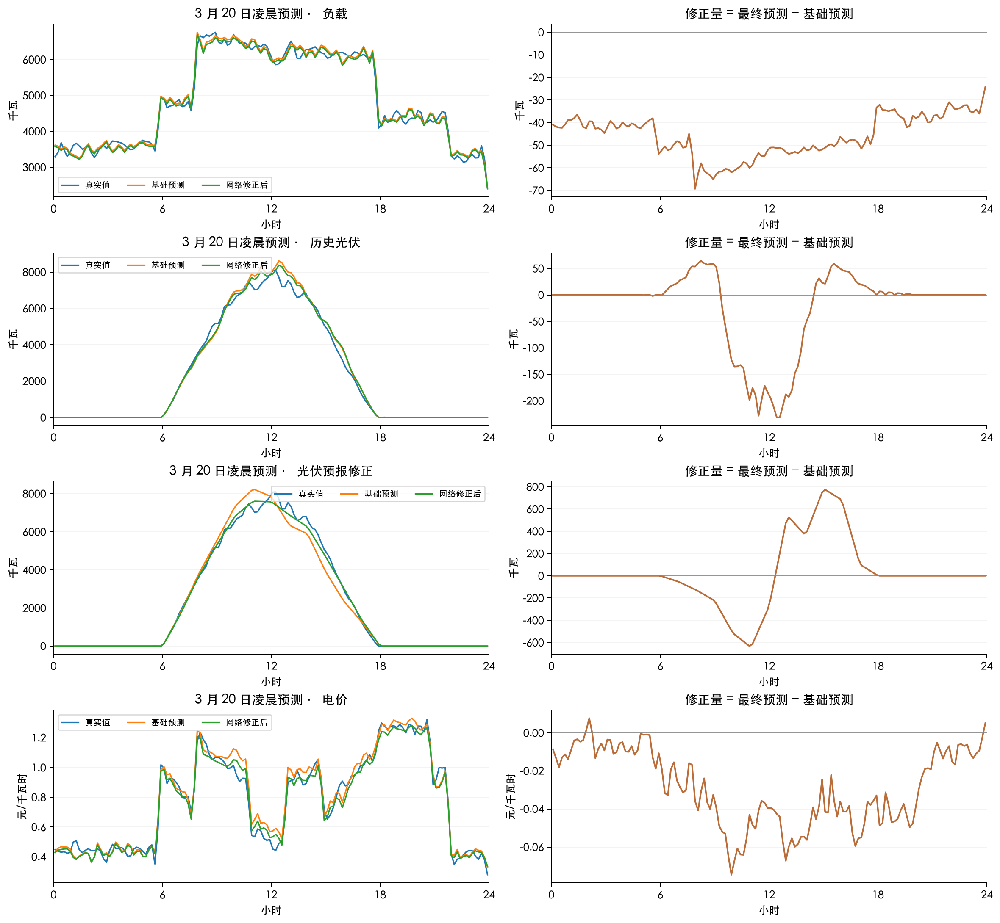
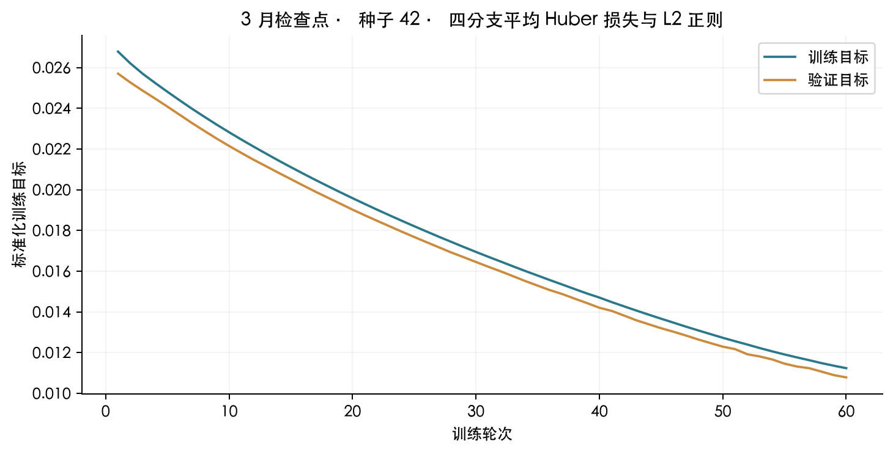
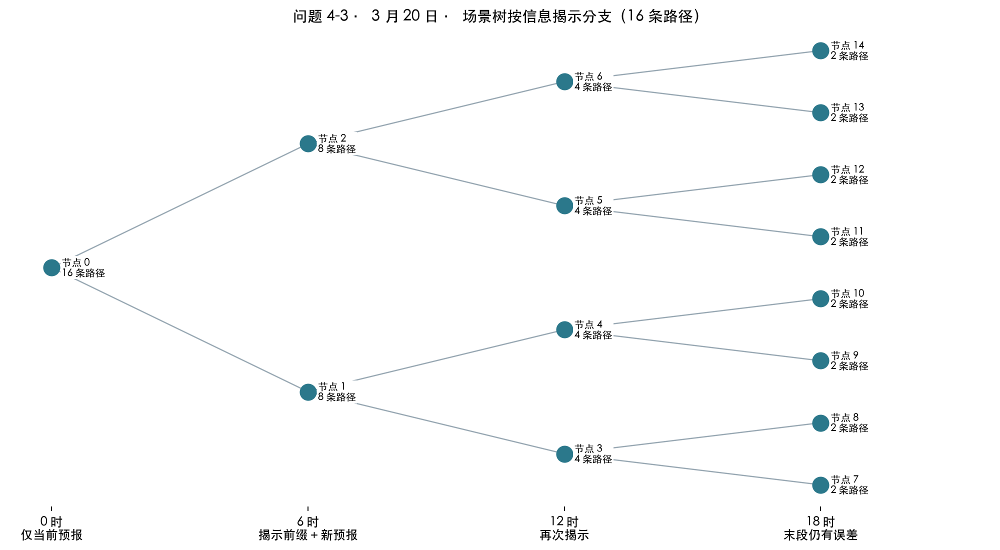

## 4. 逐步技术讲解

### 4.1 时间样本与周期基础预测

把每个十分钟区间的结束时刻作为记录时间。区间功率除以 6，才是该区间电量。发布时刻为 t，h 为从该时刻起的第 h 个未来区间，模型在发布时一次产生未来 144 个区间的预测。负载、电价先取上周同期；历史光伏先取昨日同期。问题 3、4-3 的光伏基础值来自当时已经发布的附件 3。固定这条路线的依据是题目提供的信息和正式评价前的 1 月，而非 exp001 的全年排名。

对某变量的基础预测记为 b(t,h)，网络学习真实值与它的差额。周期预测承担日内形状，网络只学习形状偏差、近期水平变化和周期信息。输出层权重及偏置从零开始，所以第一次参数更新前严格返回基础预测。

### 4.2 四个独立分支：16 → 32 → 16 → 1

每个发布样本包括 144 个未来区间。每一区间、每个变量有 16 项输入：日内正弦与余弦、星期正弦与余弦、发布时刻正弦与余弦、提前量、昨日同期、上周同期、最近观测、近 6/24/168 小时均值、近 24/168 小时标准差、基础预测。日历由时钟计算；均值、波动与滞后项只取发布前可观测历史。四个分支只读取对应变量的数据，光伏预报修正分支读取光伏历史及已经发布的光伏预报。

先用训练历史的均值 μ 与标准差 σ 标准化数值。两个隐藏层分别计算 a₁ = ReLU(W₁x+b₁) 与 a₂ = ReLU(W₂a₁+b₂)，最后给出标准化修正 r = W₃a₂+b₃。ReLU 将负输入置零，允许不同状态下使用不同的修正关系。最后预测为 max(0, b+σr)。四分支合计 4×[(16+1)×32+(32+1)×16+(16+1)×1] = 4356 个参数；一个检查点保存全部分支。

### 4.3 损失、参数更新与时间验证

标准化误差 e = (真实值−基础预测)/σ−r。Huber 损失在 |e|≤1 时为 e²/2，否则为 |e|−1/2；它兼顾小误差的精细拟合与大误差的较低敏感度。隐藏层同时使用 0.0001 的 L2 正则项。Adam 依据梯度的一阶与二阶移动平均缩放每个参数的更新，学习率 0.001。一个批次包含 64 个发布样本，最多 60 轮，验证损失连续 6 轮不改善即停止，并恢复验证损失最低时的权重。

四个分支的输入、隐藏层和输出权重彼此独立，训练目标取四分支的平均损失再加正则项。光伏预报修正只在 24 个小时目标点计损失，每点权重为 6，使其总权重与使用 144 个区间的分支一致。一个检查点使用统一的验证总目标选择早停轮次，因此分支共享保存轮次；这里的独立指特征及参数的分离，不表示四次独立早停。

每月从头训练。前一月末最近 7 个完整日期只用于验证，训练样本的整个标签窗口必须在训练边界之前结束；跨界样本剔除。标准化统计不使用验证集。进入当月之后冻结检查点，全年分别固定种子 42、2026、3407。33 组训练是 11 个月×3 种子；既不按全年成绩选网络，也不挑种子或平均三个种子。

### 4.4 光伏小时点校准与区间积分

附件 3 的 24 个值对应未来小时目标点。网络只在这些点训练光伏预报修正损失；取出 24 个修正后的小时点后，把发布前最近已观测光伏作为首段锚点，逐段线性连接。每个十分钟区间的平均功率等于该区间两端线性值的平均，再除以 6 得到电量。夜间约束依据发布前最多 28 天同一时刻的实际发电以及本次预报；不能查看未来实际日照。

旧实验档案已保存每个十分钟目标点的修正序列，历史重算保留这些点，并对相邻点与已观测首段锚点作梯形积分，得到区间平均功率。这个转换只影响历史重算，不改写旧预测文件。它没有倒推一个旧实验并未保存的小时校准模型；旧、新架构的生成方式不同，因此涉及预报修正的原登记预测分数需要单列可比性。

分解图中的修正量定义为“最终区间预测−基础区间预测”。光伏的这项差值包含非负裁剪、夜间约束及小时点到十分钟区间的积分，与最终送入调度器的功率严格对应。

### 4.5 联合误差路径与信息逐步揭示

在每次决策时，从过去最多 56 个已经完整实现的日期收集负载、光伏、电价的联合残差，以及同一天 0、6、12、18 时预报修订。1 月没有正式网络时采用因果基础预测残差；进入正式月份后逐步使用当时已冻结的网络残差。一个历史日期的四个发布窗口全部实现后才允许成为样本，防止晚间 24 小时窗口越过当前信息截止时刻。

联合抽取整日残差可以保留同一天的变量相关性和时序变化。发布时刻、提前量分组的均值与方差用 n/(n+28) 向总体统计收缩，小样本不会完全主导误差估计。最多均匀选取 16 个历史日期。当前预测加上这些联合误差，形成未来实际路径；历史预报修订形成模拟的未来信息。

问题 3、4-3 的场景树仅在 6、12、18 时分支。用于分支的特征是届时已经揭示的实际前缀和新发布预报的变化，而非整条未来真实误差。以第一主成分作平衡二分，样本不足或变化相同则不分支。16 条路径通常对应 1→2→4→8 个信息节点，末段每节点仍有条件误差。共享同一信息节点的路径必须共享购电决策；未来真实附件预报从不传入当前求解。问题 2、4-2 不读取附件 3，全天共用同一购电计划。

问题 3 的电价已知且固定，分支只使用负载和光伏的信息；问题 4-3 才纳入电价误差及价格预测变化。固定电价下不能把可变电价的历史误差模拟成未来可揭示信息。

观测前缀使用完成非负裁剪和夜间约束后的实际场景路径。两个负光伏误差若最终都对应零发电，就不能凭裁剪前的隐含差异产生不同决策分支。额外的“已知未来价格”反事实也排除价格揭示，只用于诊断，不作为正式策略。

### 4.6 费用目标与精确因果储能执行

场景 s 的完整费用记为 Cₛ，概率 pₛ。目标为 ΣpₛCₛ + λ[ζ + Σpₛuₛ/(1−0.9)]，其中 uₛ≥Cₛ−ζ、uₛ≥0。中括号是 90% 条件尾部平均费用：关注最昂贵的最后 10% 概率质量。λ 只在 1 月验证回放中从 0、0.1、0.3 选择一次，依据实际总费用最小，并列取小值。λ=0 仍保留场景期望费用和未来更新机会。

对于区间购电 g、实际负载 L/6、实际光伏 V/6，净盈余 q=g+V/6−L/6。q≥0 时，充电 c=min(q,5000/6,(10800−E)/η)，放电为零，剩余弃电；q<0 时，放电 d=min(−q,5000/6,(E−1200)η)，充电为零，不足部分紧急购电。η=√0.9，下一状态 E′=E+ηc−d/η。这里 c、d 均为交流侧电量。

混合整数模型用符号与最小值选择变量精确表达这些关系。储能动作由当前盈余、当前储电量唯一确定，不能在场景内预知未来后自由挑选充放电。实际回放调用同一规则，并独立重算能量平衡、功率上限、效率、互斥与跨日状态。日末只有物理边界，不重置储电量，也不强加人为期末目标。

### 4.7 两秒求解与可行解核验

SciPy 的 milp 接口调用 HiGHS。先用确定性可行购电候选确定因果控制器所在分段，在固定分段下求一个线性规划可行解；该步骤最多使用 0.5 秒。再把其目标值作为上界，使用剩余预算求完整场景混合整数模型，合计设置 2 秒的求解器预算，相对最优差距目标为 1%。模型组装、初始确定性候选与独立核验另行计时，因此一次实际决策总耗时可能超过 2 秒。

只接受通过独立线性约束、变量边界、整数性及逐场景贪心回放核验的解；否则退回确定性可行计划并记录原因。固定控制器区域中的可行解可能没有全局最优差距证书，不能把它称为全局最优。报告同时列出超时、证书达标、可行解来源和真正回退的比例。

`time_limit`、`mip_rel_gap`、求解状态及可为空的差距字段遵循 [SciPy 官方 milp 接口](https://docs.scipy.org/doc/scipy/reference/generated/scipy.optimize.milp.html)。本机实际运行版本记录于训练元数据的环境字段。

### 4.8 执行与逐项结算

凌晨计划 g⁰ 全额计费。最终执行前计划 g 相对 g⁰ 的增加按 1.5p 另计，减少按 0.5p 另计，紧急购电 e 按 5p 计费：C = Σ[p g⁰ + 1.5p max(g−g⁰,0) + 0.5p max(g⁰−g,0) + 5pe]。中间修订版本不重复累加。问题 4 优化时使用预测电价；实际价格到达后用于结算。已执行区间的动作与状态冻结，后续更新只重新求解剩余时间；允许保留原计划。

### 4.9 一个实际样本如何通过网络

3 月 20 日 0 时发布、目标为 10:00—10:10 的负载预测：基础值为 6615.2017 千瓦，训练历史标准差 σ 为 1442.8906 千瓦，网络输出的标准化修正为 -0.042426。还原后修正量为 -61.2159 千瓦，因此预测为 6553.9858 千瓦；事后观测为 6577.9956 千瓦。预测发布时没有读取这个事后观测。

该检查点第 1 轮训练目标（含 L2 正则）为 0.026786；共训练 60 轮，恢复第 60 轮，最低验证目标为 0.010782。16 项实际输入和完整数字保存于 worked_example.json。损失下降记录与“参数已更新”检查共同说明网络实际训练过，不能用它代替样本外费用评价。

[论文 SVG](figures/fixed-network-architecture.svg)

[论文 SVG](figures/baseline-correction-decomposition.svg)

[论文 SVG](figures/worked-example-training-loss.svg)

[论文 SVG](figures/scenario-information-tree.svg)
