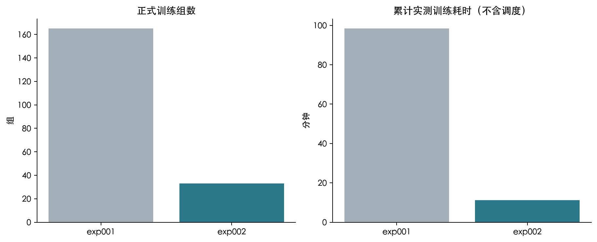

## 5. 实验设置

网络固定为四个独立的 16→32→16→1 分支，共 4356 个参数。11 个月×3 个种子 = 33 个正式训练组。Adam 学习率 0.001、批量 64、Huber 损失、最多 60 轮、早停耐心 6。20 组达到 60 轮上限，不能据此声称全部收敛。所有组验证了 GPU 输出、参数更新、零初始化及保存重载。

三层核心对照是“旧正式预测＋新口径基础调度”“新预测＋同一基础调度”“新预测＋风险调度”。旧网络不重新训练，按原月度正式选择读取档案。还保留昨日、周同期、周期基础和原始附件预报；种子 42 完成零风险权重、不预先考虑更新、原始光伏预报和 0/0+6/0+6+12/0+6+12+18 四种发布组合。问题 4 的已知价格仅是反事实诊断。

| 问题 | 风险权重 | 一月验证费用/元 | 是否选定 |
|---|---|---|---|
| 2 | 0.0000 | 381,530.4601 | 否 |
| 2 | 0.1000 | 381,463.9991 | 是 |
| 2 | 0.3000 | 381,558.5352 | 否 |
| 3 | 0.0000 | 349,965.1909 | 是 |
| 3 | 0.1000 | 350,261.1668 | 否 |
| 3 | 0.3000 | 350,295.9576 | 否 |
| 4-2 | 0.0000 | 428,287.9235 | 是 |
| 4-2 | 0.1000 | 428,447.3718 | 否 |
| 4-2 | 0.3000 | 428,635.0347 | 否 |
| 4-3 | 0.0000 | 388,783.1195 | 是 |
| 4-3 | 0.1000 | 389,432.3598 | 否 |
| 4-3 | 0.3000 | 393,507.6641 | 否 |

求解目标：期望费用＋λ×CVaR90，最多 16 条联合路径、56 天历史、两秒求解器预算、1% 相对差距目标。固定控制器区域 LP 给出可核验候选；未知最优差距保持空值。CPU 回放最初使用四个工作进程，保存并核验 5053 个已完成日期后以八个工作进程恢复；预测缓存共享复用，各求解器单线程。

| 实验 | 正式训练组数 | 累计训练分钟 |
|---|---|---|
| exp001 | 165 | 98.3616 |
| exp002 | 33 | 11.2554 |

旧实验的 165 组包含 11 个月×3 个种子×5 条训练路线，其中有三类候选网络和两个 GRU 结构消融；本轮只有一条固定架构路线。两轮时间对比反映完整训练清单的实际差异。本轮的风险权重、更新次数及原始光伏预报对照均复用预测，不再额外训练网络。

分阶段实测耗时（累计任务时间与墙钟时间不可直接相加）：

| 阶段 | 分钟 | 计时口径 |
|---|---|---|
| 训练 | 11.2554 | 33 组 GPU 训练任务累计，不含特征准备、预测及调度 |
| 月度预测 | 0.0567 | 33 个检查点首次推理累计，正式预测缓存只生成一次 |
| 一月风险校准 | 18.0398 | 4 个问题×3 权重×7 日期的组装、求解和回放任务累计，非并行墙钟时间；包含已作废的一次问题 3 初步校准；也包含裁剪信息修正前已作废的问题 3、4-3 校准 |
| 全年调度 | 222.8426 | 全部核心、基线、消融及三种子；累计全部已记录运行段，包含作废的问题 3、4-3 初步回放，不含暂停间隔 |
| 工作簿导出 | 0.2910 | 一次完整阶段的墙钟时间；不含此前预览或人工检查 |
| 报告构建 | 0.0949 | 一次完整阶段的墙钟时间；不含此前预览或人工检查 |

[论文 SVG](figures/training-count-and-time.svg)
