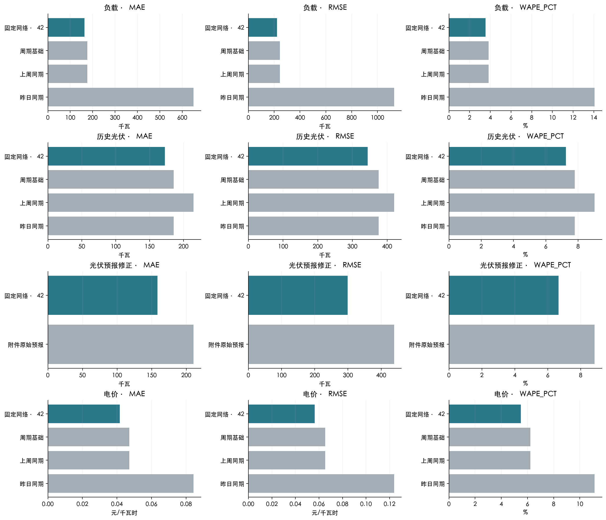
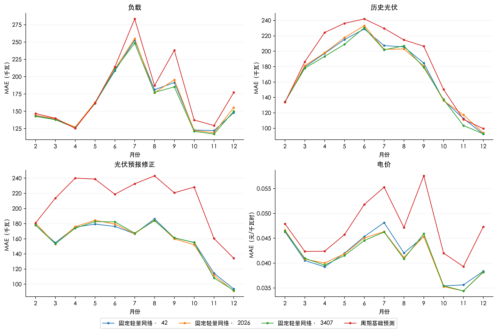
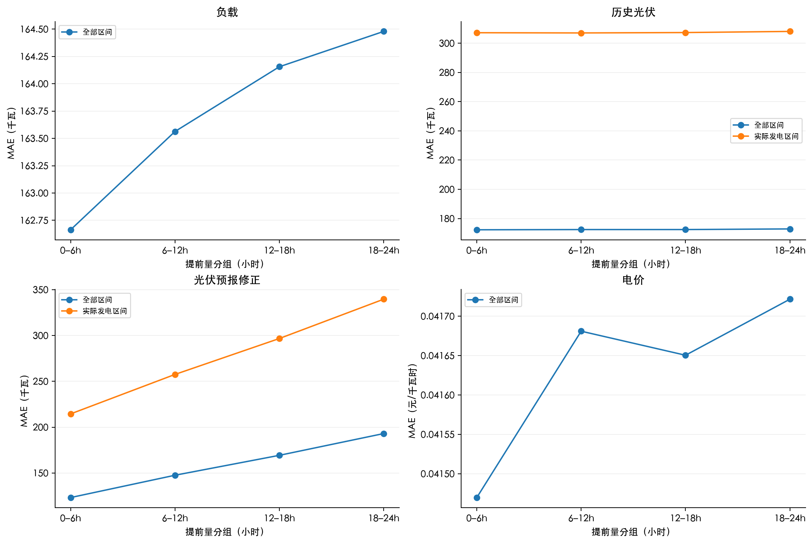
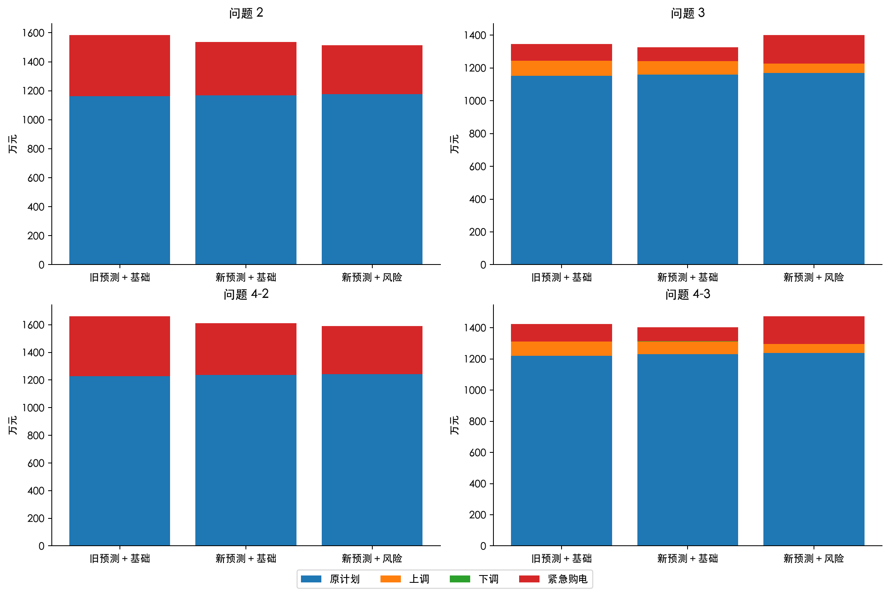
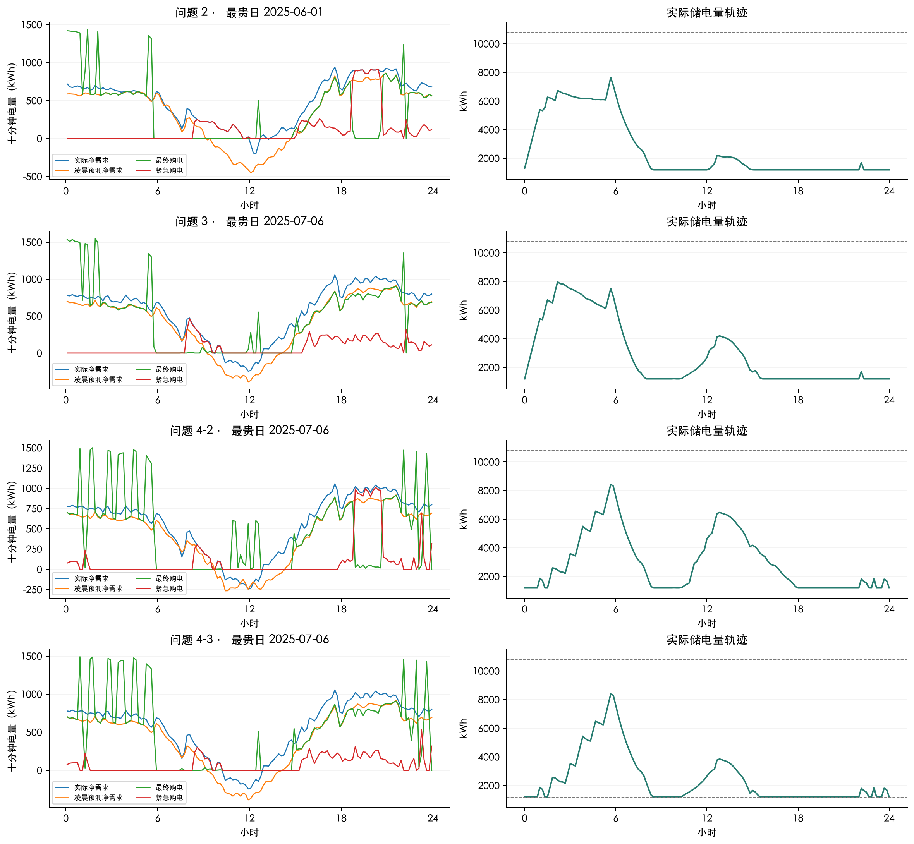
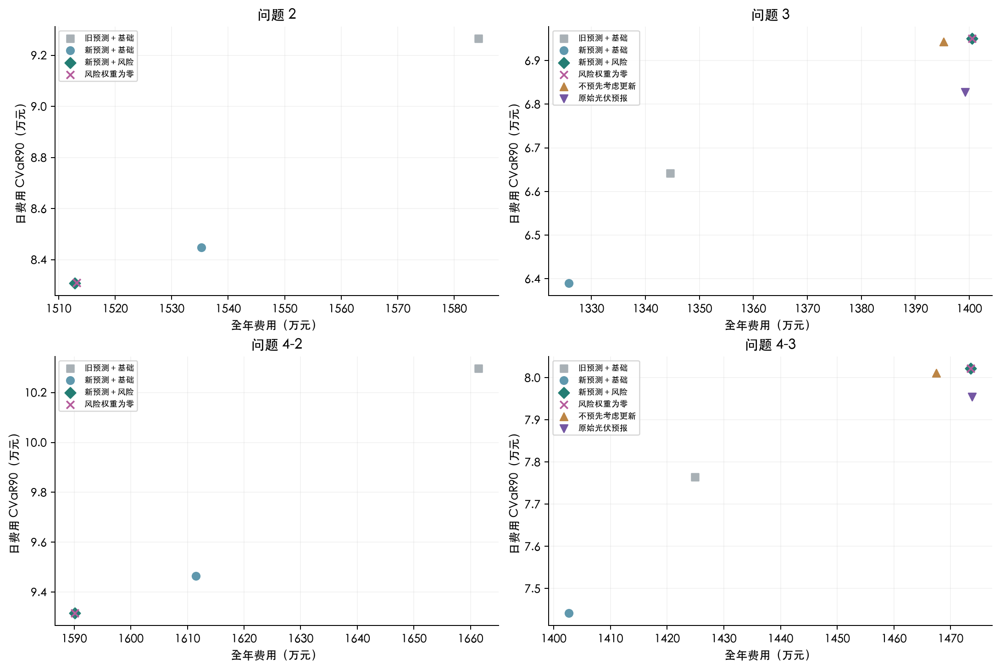
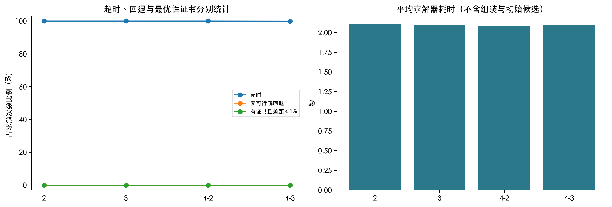
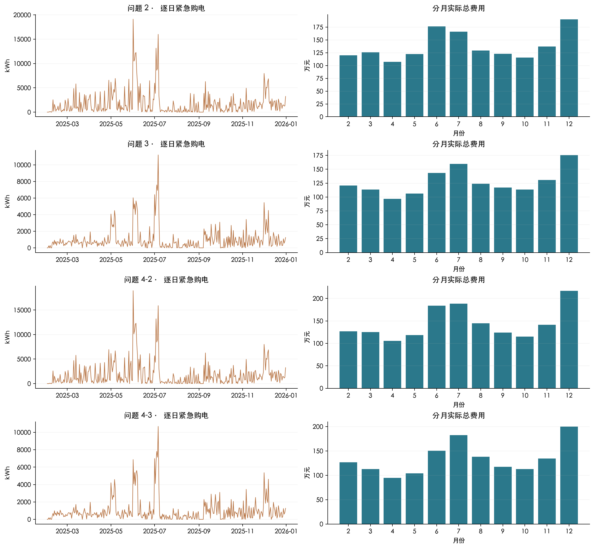

## 6. 结果及失败案例

网页可按问题、月份、预测目标、种子、误差指标与实际发电时段筛选。全年预测原始分母、绝对误差和及平方误差和保存在 forecast_metrics.csv；图表与表格从同一数据重算。

| 预测方法 | 目标 | 时段 | MAE | RMSE | WAPE/% |
|---|---|---|---|---|---|
| 附件原始预报 | 光伏预报修正 | 全部区间 | 210.5371 | 438.9796 | 8.8478 |
| 附件原始预报 | 光伏预报修正 | 实际发电区间 | 371.5114 | 586.2570 | 8.7268 |
| 固定轻量网络 | 负载 | 全部区间 | 163.7146 | 221.4438 | 3.5449 |
| 固定轻量网络 | 电价 | 全部区间 | 0.0416 | 0.0564 | 5.4940 |
| 固定轻量网络 | 历史光伏 | 全部区间 | 172.5278 | 344.1314 | 7.2505 |
| 固定轻量网络 | 历史光伏 | 实际发电区间 | 307.4010 | 460.2616 | 7.2208 |
| 固定轻量网络 | 光伏预报修正 | 全部区间 | 158.2416 | 298.6576 | 6.6501 |
| 固定轻量网络 | 光伏预报修正 | 实际发电区间 | 277.0229 | 397.9423 | 6.5073 |
| 周期基础预测 | 负载 | 全部区间 | 176.7466 | 244.2753 | 3.8271 |
| 周期基础预测 | 电价 | 全部区间 | 0.0471 | 0.0653 | 6.2216 |
| 周期基础预测 | 历史光伏 | 全部区间 | 185.4436 | 375.3297 | 7.7932 |
| 周期基础预测 | 历史光伏 | 实际发电区间 | 331.7652 | 502.0246 | 7.7932 |
| 周期基础预测 | 光伏预报修正 | 全部区间 | 210.5371 | 438.9796 | 8.8478 |
| 周期基础预测 | 光伏预报修正 | 实际发电区间 | 371.5114 | 586.2570 | 8.7268 |
| 上周同期 | 负载 | 全部区间 | 176.7466 | 244.2753 | 3.8271 |
| 上周同期 | 电价 | 全部区间 | 0.0471 | 0.0653 | 6.2216 |
| 上周同期 | 历史光伏 | 全部区间 | 214.8319 | 420.1525 | 9.0283 |
| 上周同期 | 历史光伏 | 实际发电区间 | 384.1180 | 561.9671 | 9.0229 |
| 昨日同期 | 负载 | 全部区间 | 650.5052 | 1,128.9924 | 14.0854 |
| 昨日同期 | 电价 | 全部区间 | 0.0844 | 0.1239 | 11.1319 |
| 昨日同期 | 历史光伏 | 全部区间 | 185.4436 | 375.3297 | 7.7932 |
| 昨日同期 | 历史光伏 | 实际发电区间 | 331.7652 | 502.0246 | 7.7932 |

三个固定种子的各自全年预测误差。MAE、RMSE 的单位随目标分别为千瓦或元/千瓦时，WAPE 为百分比；这三组独立成绩不构成预测集成：

| 预测种子 | 目标 | 时段 | MAE | RMSE | WAPE/% |
|---|---|---|---|---|---|
| 42 | 负载 | 全部区间 | 163.7146 | 221.4438 | 3.5449 |
| 42 | 电价 | 全部区间 | 0.0416 | 0.0564 | 5.4940 |
| 42 | 历史光伏 | 全部区间 | 172.5278 | 344.1314 | 7.2505 |
| 42 | 历史光伏 | 实际发电区间 | 307.4010 | 460.2616 | 7.2208 |
| 42 | 光伏预报修正 | 全部区间 | 158.2416 | 298.6576 | 6.6501 |
| 42 | 光伏预报修正 | 实际发电区间 | 277.0229 | 397.9423 | 6.5073 |
| 2026 | 负载 | 全部区间 | 164.6359 | 223.2125 | 3.5649 |
| 2026 | 电价 | 全部区间 | 0.0413 | 0.0559 | 5.4535 |
| 2026 | 历史光伏 | 全部区间 | 172.8089 | 344.5120 | 7.2623 |
| 2026 | 历史光伏 | 实际发电区间 | 307.9276 | 460.7701 | 7.2332 |
| 2026 | 光伏预报修正 | 全部区间 | 158.0709 | 297.7826 | 6.6429 |
| 2026 | 光伏预报修正 | 实际发电区间 | 277.0399 | 396.7757 | 6.5077 |
| 3407 | 负载 | 全部区间 | 161.8316 | 218.7504 | 3.5041 |
| 3407 | 电价 | 全部区间 | 0.0412 | 0.0558 | 5.4428 |
| 3407 | 历史光伏 | 全部区间 | 170.0053 | 339.9638 | 7.1445 |
| 3407 | 历史光伏 | 实际发电区间 | 303.1502 | 454.6940 | 7.1210 |
| 3407 | 光伏预报修正 | 全部区间 | 157.9579 | 296.5392 | 6.6382 |
| 3407 | 光伏预报修正 | 实际发电区间 | 276.5346 | 395.0342 | 6.4958 |

以下均值与样本标准差（ddof=1）在三个种子的全年指标之间计算，不是先平均预测再评价。WAPE 的标准差单位为百分点：

| 目标 | 时段 | MAE 均值 | MAE 标准差 | RMSE 均值 | RMSE 标准差 | WAPE 均值/% | WAPE 标准差/百分点 |
|---|---|---|---|---|---|---|---|
| 负载 | 全部区间 | 163.3940 | 1.4294 | 221.1356 | 2.2469 | 3.5380 | 0.0310 |
| 电价 | 全部区间 | 0.0414 | 0.0002 | 0.0560 | 0.0003 | 5.4634 | 0.0270 |
| 历史光伏 | 全部区间 | 171.7807 | 1.5439 | 342.8691 | 2.5232 | 7.2191 | 0.0649 |
| 历史光伏 | 实际发电区间 | 306.1596 | 2.6195 | 458.5752 | 3.3709 | 7.1917 | 0.0615 |
| 光伏预报修正 | 全部区间 | 158.0901 | 0.1428 | 297.6598 | 1.0646 | 6.6437 | 0.0060 |
| 光伏预报修正 | 实际发电区间 | 276.8658 | 0.2870 | 396.5841 | 1.4634 | 6.5036 | 0.0067 |

三种子费用稳定性，标准差为样本标准差（ddof=1），不用于挑选正式种子。费用波动同时包含预测差异和限时求解的运行差异；三个重复不足以宣称广泛的统计显著性：

| 问题 | 费用均值/元 | 费用标准差/元 | 日费用CVaR90均值/元 | 尾部费用标准差/元 |
|---|---|---|---|---|
| 2 | 15,204,235.0095 | 66,730.6327 | 83,572.7947 | 655.0438 |
| 3 | 14,034,475.2264 | 44,346.7532 | 69,308.5326 | 167.3782 |
| 4-2 | 15,966,538.5701 | 56,503.4304 | 93,794.3790 | 611.4031 |
| 4-3 | 14,755,800.5925 | 38,105.5791 | 79,909.8698 | 278.3781 |

| 问题 | 最差日期 | 最差日费用/元 | 日费用CVaR90/元 | 期末储电量/kWh | 求解次数 | 超时次数 | 回退次数 | 区域LP候选采用次数 | 差距≤1%次数 | 组装求解执行秒数 |
|---|---|---|---|---|---|---|---|---|---|---|
| 2 | 2025-06-01 | 138,575.9787 | 83,083.7379 | 1,200.0000 | 334.0000 | 334.0000 | 0.0000 | 334.0000 | 0.0000 | 907.7402 |
| 3 | 2025-07-06 | 110,828.2260 | 69,501.1979 | 1,200.0000 | 1,336.0000 | 1,336.0000 | 0.0000 | 1,336.0000 | 0.0000 | 3,355.8207 |
| 4-2 | 2025-07-06 | 161,116.9088 | 93,158.9881 | 1,200.0000 | 334.0000 | 334.0000 | 0.0000 | 334.0000 | 0.0000 | 927.9434 |
| 4-3 | 2025-07-06 | 126,344.4667 | 80,214.8642 | 1,200.0000 | 1,336.0000 | 1,335.0000 | 0.0000 | 1,336.0000 | 0.0000 | 3,356.1860 |

[指定四日的完整表格](specified_dates.md)。全年紧急购电时段见 emergency_periods.csv，四小时充放电量见 battery_blocks.csv。超时不等同于回退；只有没有任何通过独立核验的可行解时才回退。采用区域 LP 候选且无全局差距时，报告不作最优性承诺。

预测误差并非全面改善。与旧正式预测按同一口径比较，问题 2 的历史光伏在全部区间的 RMSE 增加 0.708%；问题 2 的历史光伏在实际发电区间的 RMSE 增加 0.875%；问题 4-2 的历史光伏在全部区间的 RMSE 增加 1.127%；问题 4-2 的历史光伏在实际发电区间的 RMSE 增加 1.289%。这表明全年 WAPE 的下降不能代替大误差和实际发电时段的检查。

全部种子 42 对照的全年成绩（权重为零与正式策略相同时复用同一回放）：

| 问题 | 方案 | 全年费用/元 | 日费用CVaR90/元 | 紧急购电/kWh | 回退次数 |
|---|---|---|---|---|---|
| 2 | 周期基础预测 | 14,988,614.2346 | 84,837.2764 | 549,745.6303 | 0.0000 |
| 2 | 本轮正式策略 | 15,128,897.4527 | 83,083.7379 | 579,717.6630 | 0.0000 |
| 2 | 风险权重为零 | 15,131,599.3693 | 83,095.2640 | 580,555.8783 | 0.0000 |
| 2 | 新预测＋基础调度 | 15,352,302.2799 | 84,488.0593 | 628,285.6174 | 0.0000 |
| 2 | 上周同期 | 15,646,954.3403 | 91,843.8192 | 661,866.3442 | 0.0000 |
| 2 | 旧正式预测＋基础调度 | 15,842,654.1907 | 92,651.6369 | 730,041.0881 | 0.0000 |
| 2 | 昨日同期 | 22,106,599.0342 | 207,886.2804 | 2,003,044.1170 | 0.0000 |
| 3 | 新预测＋基础调度 | 13,257,848.3582 | 63,898.8914 | 168,559.6631 | 0.0000 |
| 3 | 周期基础预测 | 13,345,156.4925 | 64,954.4214 | 155,997.4995 | 0.0000 |
| 3 | 上周同期 | 13,345,156.4925 | 64,954.4214 | 155,997.4995 | 0.0000 |
| 3 | 旧正式预测＋基础调度 | 13,446,145.2166 | 66,415.1306 | 205,236.0662 | 0.0000 |
| 3 | 不预先考虑更新 | 13,952,693.3726 | 69,427.8003 | 308,841.4445 | 0.0000 |
| 3 | 原始光伏预报 | 13,991,912.6217 | 68,272.8304 | 298,827.0346 | 0.0000 |
| 3 | 本轮正式策略 | 14,005,062.7759 | 69,501.1979 | 329,778.1349 | 0.0000 |
| 3 | 风险权重为零 | 14,005,062.7759 | 69,501.1979 | 329,778.1349 | 0.0000 |
| 3 | 0、6、12 时发布 | 14,895,037.8592 | 77,958.8550 | 505,799.6445 | 0.0000 |
| 3 | 0、6 时发布 | 15,120,923.4968 | 80,642.3731 | 549,068.6656 | 0.0000 |
| 3 | 只在凌晨发布 | 15,277,961.2694 | 82,397.7904 | 595,919.7701 | 0.0000 |
| 3 | 昨日同期 | 18,602,321.5577 | 155,708.8155 | 1,140,285.2468 | 0.0000 |
| 4-2 | 周期基础预测 | 15,835,805.9479 | 95,478.6276 | 546,224.9728 | 0.0000 |
| 4-2 | 已知未来价格（反事实） | 15,851,546.7529 | 93,015.9376 | 606,180.3382 | 0.0000 |
| 4-2 | 本轮正式策略 | 15,901,397.2011 | 93,158.9881 | 579,538.5193 | 0.0000 |
| 4-2 | 风险权重为零 | 15,901,397.2011 | 93,158.9881 | 579,538.5193 | 0.0000 |
| 4-2 | 新预测＋基础调度 | 16,114,809.6566 | 94,639.4864 | 625,692.5069 | 0.0000 |
| 4-2 | 上周同期 | 16,466,602.5293 | 101,200.4241 | 653,238.4215 | 0.0000 |
| 4-2 | 旧正式预测＋基础调度 | 16,613,721.6045 | 102,959.2739 | 727,997.2776 | 0.0000 |
| 4-2 | 昨日同期 | 23,121,600.9605 | 224,681.9582 | 1,992,046.8916 | 0.0000 |
| 4-3 | 新预测＋基础调度 | 14,026,450.8280 | 74,420.3692 | 176,842.0583 | 0.0000 |
| 4-3 | 周期基础预测 | 14,170,862.8544 | 76,139.2549 | 163,610.4891 | 0.0000 |
| 4-3 | 上周同期 | 14,170,862.8544 | 76,139.2549 | 163,610.4891 | 0.0000 |
| 4-3 | 旧正式预测＋基础调度 | 14,249,194.6053 | 77,647.3034 | 225,579.3692 | 0.0000 |
| 4-3 | 已知未来价格（反事实） | 14,622,448.9989 | 79,652.3454 | 343,696.2475 | 0.0000 |
| 4-3 | 不预先考虑更新 | 14,674,803.0360 | 80,107.6890 | 305,182.1882 | 0.0000 |
| 4-3 | 本轮正式策略 | 14,734,925.1249 | 80,214.8642 | 329,083.1511 | 0.0000 |
| 4-3 | 风险权重为零 | 14,734,925.1249 | 80,214.8642 | 329,083.1511 | 0.0000 |
| 4-3 | 原始光伏预报 | 14,737,745.5048 | 79,546.2071 | 299,312.3202 | 0.0000 |
| 4-3 | 0、6、12 时发布 | 15,706,008.7650 | 88,990.1875 | 515,719.4186 | 0.0000 |
| 4-3 | 0、6 时发布 | 15,868,815.1020 | 91,578.6309 | 545,946.8555 | 0.0000 |
| 4-3 | 只在凌晨发布 | 16,021,905.3379 | 93,280.1259 | 589,345.1853 | 0.0000 |
| 4-3 | 昨日同期 | 19,447,660.4777 | 168,619.9870 | 1,132,274.5827 | 0.0000 |
三个固定种子的各自全年成绩：

| 问题 | 种子 | 全年费用/元 | 日费用CVaR90/元 | 期末储电量/kWh |
|---|---|---|---|---|
| 2 | 42 | 15,128,897.4527 | 83,083.7379 | 1,200.0000 |
| 2 | 2026 | 15,255,909.7416 | 84,317.0230 | 1,203.8753 |
| 2 | 3407 | 15,227,897.8343 | 83,317.6231 | 1,200.0000 |
| 3 | 42 | 14,005,062.7759 | 69,501.1979 | 1,200.0000 |
| 3 | 2026 | 14,012,879.7254 | 69,198.9511 | 1,200.0000 |
| 3 | 3407 | 14,085,483.1780 | 69,225.4489 | 1,200.0000 |
| 4-2 | 42 | 15,901,397.2011 | 93,158.9881 | 1,200.0000 |
| 4-2 | 2026 | 16,002,285.6021 | 94,378.5750 | 1,200.0000 |
| 4-2 | 3407 | 15,995,932.9070 | 93,845.5738 | 1,200.0000 |
| 4-3 | 42 | 14,734,925.1249 | 80,214.8642 | 1,200.0000 |
| 4-3 | 2026 | 14,732,694.3804 | 79,845.2828 | 1,200.0000 |
| 4-3 | 3407 | 14,799,782.2721 | 79,669.4624 | 1,200.0000 |
正式种子四个问题共 3340 次风险求解，其中 3339 次超时、0 次回退，0 次有不超过 1% 的全局差距证书。两秒预算限制的是求解器阶段；组装、可行初始计划及独立核验另计。费用结果可以比较，不能把全部可行解称为全局最优解。

2 秒是传给求解接口的预算设置；实测求解调用平均为 2.088—2.104 秒，可能略超过设置值。图表使用实测值，没有把它截断为 2 秒；完整调用耗时与差距保存在 solver_metrics.csv。

失败案例按各问题最贵的实际日期固定选择。费用同时受真实净需求、电价、预测误差及日前计划影响；下图用于定位误差和储能不足的时段，不能单凭最贵日期归因于网络。预测误差降低也不保证结算费用降低，因为上调、下调与紧急购电具有不同代价。区间电量画在区间中点，储能轨迹使用 00:00—24:00 的 145 个实际状态节点。

问题 3 的风险调度较同预测基础调度多花 747,214.4177 元。实测费用变化分别为：原计划 +85,808.3847 元，上调 -233,694.6497 元，下调 -3,449.7464 元，紧急购电 +898,550.4290 元。这是可核算的费用来源；仅凭本轮结果，不能把原因唯一归于场景近似、信息树或求解时限中的某一项。

问题 4-3 的风险调度较同预测基础调度多花 708,474.2969 元。实测费用变化分别为：原计划 +82,849.3723 元，上调 -250,657.0415 元，下调 -5,006.7350 元，紧急购电 +881,288.7011 元。这是可核算的费用来源；仅凭本轮结果，不能把原因唯一归于场景近似、信息树或求解时限中的某一项。

[论文 SVG](figures/annual-three-error-metrics.svg)

[论文 SVG](figures/monthly-forecast-error.svg)

[论文 SVG](figures/lead-and-generating-error.svg)

[论文 SVG](figures/cost-components.svg)

[论文 SVG](figures/failure-case-and-storage.svg)

[论文 SVG](figures/cost-versus-tail-risk.svg)

[论文 SVG](figures/solver-gap-and-fallback.svg)

[论文 SVG](figures/daily-emergency-and-monthly-cost.svg)
