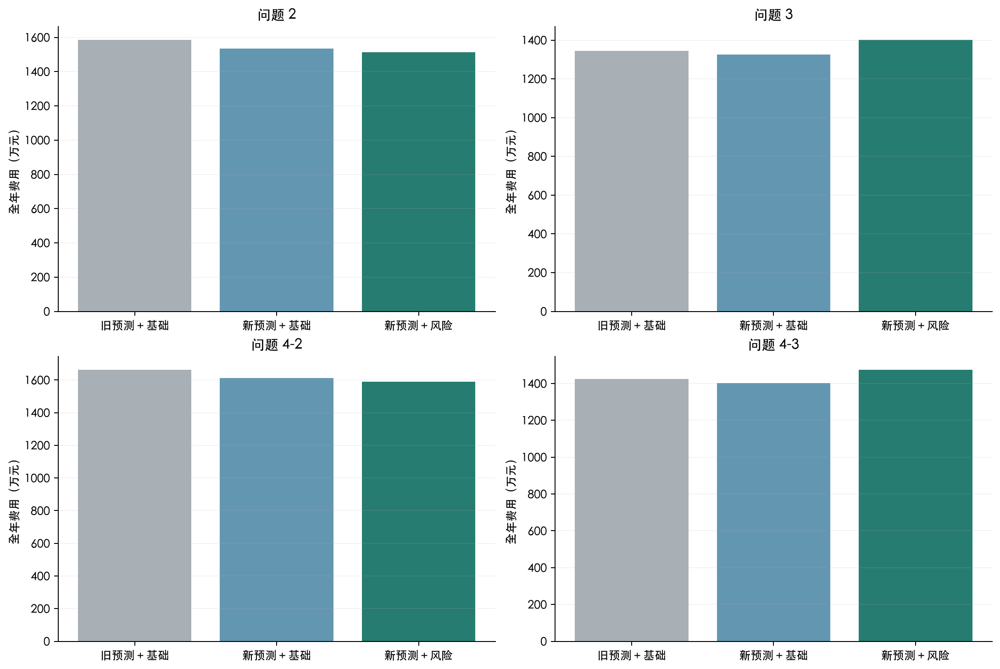

## 7. 历次指标和技术路线对比

自动读取此前全部 1 次登记实验，原记录保持不变。正式策略按其角色匹配，网络名称不必相同。调度比较检查效率、结算、预热、时标与执行规则；预测误差另检查评价期、目标语义与数据，不因为电池效率变化就把负载误差判为不可比。

| 实验 | 问题 | 原登记费用/元 | 技术路线 | 可比性说明 |
|---|---|---|---|---|
| exp001 | 2 | 16,258,308.2174 | 区间终点对齐 → 因果历史窗口与已发布预报 → 三种独立分支神经网络残差预测 → 三种子平均与月初验证费用选模 → 线性规划计划及日内重算 → 固定因果执行 → 逐区间独立结算 | 原记录保留；效率、光伏积分、执行与预热协议不同，不直接排名 |
| exp001 | 3 | 13,957,164.8401 | 区间终点对齐 → 因果历史窗口与已发布预报 → 三种独立分支神经网络残差预测 → 三种子平均与月初验证费用选模 → 线性规划计划及日内重算 → 固定因果执行 → 逐区间独立结算 | 原记录保留；效率、光伏积分、执行与预热协议不同，不直接排名 |
| exp001 | 4-2 | 17,012,164.4096 | 区间终点对齐 → 因果历史窗口与已发布预报 → 三种独立分支神经网络残差预测 → 三种子平均与月初验证费用选模 → 线性规划计划及日内重算 → 固定因果执行 → 逐区间独立结算 | 原记录保留；效率、光伏积分、执行与预热协议不同，不直接排名 |
| exp001 | 4-3 | 14,769,217.0270 | 区间终点对齐 → 因果历史窗口与已发布预报 → 三种独立分支神经网络残差预测 → 三种子平均与月初验证费用选模 → 线性规划计划及日内重算 → 固定因果执行 → 逐区间独立结算 | 原记录保留；效率、光伏积分、执行与预热协议不同，不直接排名 |

旧正式预测经新光伏积分、共同一月预热和新储能协议后重新回放，形成“旧正式预测＋基础调度”。它与“新预测＋基础调度”的差异用于辨认预测贡献；再与正式风险调度比较，辨认调度贡献。历史重算不是旧实验原成绩，不覆盖旧注册记录。发布预报积分转换单独记录在 prediction_archive.json 与本轮协议。

正式预测的全年 WAPE 对比（光伏按新积分口径重算；完整 MAE/RMSE 见 CSV）：

| 问题 | 变量 | 旧正式预测/% | 新正式预测/% | 相对变化/% | 口径 |
|---|---|---|---|---|---|
| 2 | 负载 | 3.9033 | 3.5449 | -9.1820 | 同口径正式预测；保留旧月度选择 |
| 2 | 历史光伏 | 7.6013 | 7.2505 | -4.6158 | 同口径正式预测；保留旧月度选择 |
| 3 | 负载 | 3.8828 | 3.5449 | -8.7031 | 同口径正式预测；保留旧月度选择 |
| 3 | 光伏预报修正 | 7.0532 | 6.6501 | -5.7157 | 同评价区间与单位的历史重算；旧光伏十分钟点积分 |
| 4-2 | 负载 | 3.9187 | 3.5449 | -9.5384 | 同口径正式预测；保留旧月度选择 |
| 4-2 | 历史光伏 | 7.5607 | 7.2505 | -4.1029 | 同口径正式预测；保留旧月度选择 |
| 4-2 | 电价 | 5.6315 | 5.4940 | -2.4424 | 同口径正式预测；保留旧月度选择 |
| 4-3 | 负载 | 3.9059 | 3.5449 | -9.2418 | 同口径正式预测；保留旧月度选择 |
| 4-3 | 光伏预报修正 | 7.0939 | 6.6501 | -6.2560 | 同评价区间与单位的历史重算；旧光伏十分钟点积分 |
| 4-3 | 电价 | 5.6491 | 5.4940 | -2.7460 | 同口径正式预测；保留旧月度选择 |

三层核心调度对照（相同新物理与结算协议，全部固定种子 42）：

| 问题 | 方案 | 总费用/元 | 日费用CVaR90/元 | 紧急购电/kWh |
|---|---|---|---|---|
| 2 | 新预测＋基础调度 | 15,352,302.2799 | 84,488.0593 | 628,285.6174 |
| 2 | 本轮正式策略 | 15,128,897.4527 | 83,083.7379 | 579,717.6630 |
| 2 | 旧正式预测＋基础调度 | 15,842,654.1907 | 92,651.6369 | 730,041.0881 |
| 3 | 新预测＋基础调度 | 13,257,848.3582 | 63,898.8914 | 168,559.6631 |
| 3 | 旧正式预测＋基础调度 | 13,446,145.2166 | 66,415.1306 | 205,236.0662 |
| 4-2 | 本轮正式策略 | 15,901,397.2011 | 93,158.9881 | 579,538.5193 |
| 4-2 | 新预测＋基础调度 | 16,114,809.6566 | 94,639.4864 | 625,692.5069 |
| 4-2 | 旧正式预测＋基础调度 | 16,613,721.6045 | 102,959.2739 | 727,997.2776 |
| 4-3 | 新预测＋基础调度 | 14,026,450.8280 | 74,420.3692 | 176,842.0583 |
| 4-3 | 旧正式预测＋基础调度 | 14,249,194.6053 | 77,647.3034 | 225,579.3692 |
| 3 | 本轮正式策略 | 14,005,062.7759 | 69,501.1979 | 329,778.1349 |
| 4-3 | 本轮正式策略 | 14,734,925.1249 | 80,214.8642 | 329,083.1511 |
两步变化的费用分项（本步减前一步，负值表示节省；预测变化保持基础调度相同，调度变化保持新预测相同）：

| 问题 | 步骤 | 原计划变化/元 | 上调变化/元 | 下调变化/元 | 紧急购电变化/元 | 总费变化/元 |
|---|---|---|---|---|---|---|
| 2 | 预测变化 | 64,574.8290 | 0.0000 | 0.0000 | -554,926.7397 | -490,351.9108 |
| 2 | 调度变化 | 77,871.6517 | 0.0000 | 0.0000 | -301,276.4789 | -223,404.8272 |
| 3 | 预测变化 | 76,561.0236 | -100,017.7394 | 177.1284 | -165,017.2711 | -188,296.8585 |
| 3 | 调度变化 | 85,808.3847 | -233,694.6497 | -3,449.7464 | 898,550.4290 | 747,214.4177 |
| 4-2 | 预测变化 | 87,281.8221 | 0.0000 | 0.0000 | -586,193.7699 | -498,911.9479 |
| 4-2 | 调度变化 | 73,022.5492 | 0.0000 | 0.0000 | -286,435.0047 | -213,412.4555 |
| 4-3 | 预测变化 | 86,674.5412 | -65,648.9510 | -14.6899 | -243,754.6776 | -222,743.7773 |
| 4-3 | 调度变化 | 82,849.3723 | -250,657.0415 | -5,006.7350 | 881,288.7011 | 708,474.2969 |

[论文 SVG](figures/three-layer-cost-comparison.svg)
