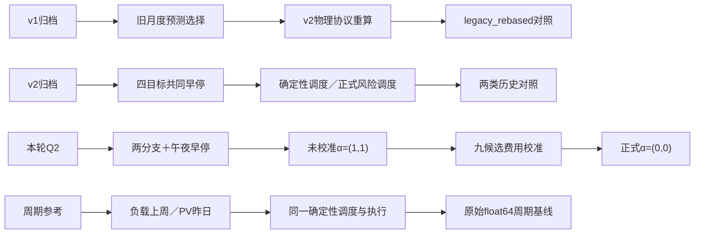

# 第二问方法附录

## 信息、样本与特征

每个十分钟区间以结束时刻记录。预测发布为自然日0时；训练可使用0/6/12/18时历史窗口，但全部144标签须在训练边界内。每月从头训练，早停只检查最近七个完整日期的午夜窗口，标准化不读验证集。

每个目标16项特征：日内正余弦、星期正余弦、发布时刻正余弦、提前量、昨日同期、上周同期、最近观测、近6/24/168小时均值、近24/168小时标准差、周期基线。负载周期基线为上周同期，PV为昨日同期。只有附件1固定电价和附件2供需历史参与本轮。

## 两分支残差学习

两个独立参数分支各16→32→16→1，隐藏层ReLU，共2178参数。输出层零初始化。标准化残差目标z=(y−b)/σ；Huber(e)=e²/2（|e|≤1），否则|e|−1/2；训练损失平均144×2个目标，并加入隐藏层L2=0.0001。Adam学习率0.001、batch64、最多60轮、patience6恢复验证损失最低权重。两分支共享早停，但共享目标只含负载和PV。

网络标准化输出为fθ(x)，原始残差r=σfθ(x)，单位kW。最终预测max(0,b+αr)，PV的夜间掩码只查看发布前最多28个完整日相同区间是否出现正发电。费用校准施加于未裁剪原始残差，不把已裁剪后的预测误当原始残差。

## 九候选费用校准

αL与αV各取0/0.5/1；在1月25—31日、共同起始SOC、共同确定性调度器下回放。按七日实际总费用选最小者，1分钱内并列先取α之和小，再按αL、αV依次小。二月及之后固定该组合，三个随机种子共用正式种子42选出的强度。共同早停/费用调参段不是独立泛化评估；二月检查点用于一月留出段的离线选参，不声称一月当天已可部署。

## 费用目标为何会拒绝误差更小的模型

无储能单时段的期望费用为J(g)=pg+5pE[(N−g)₊]，g≥0；连续分布下内点导数J′(g)=p−5pP(N>g)，故最优非负购电为max(0,Q₀.₈(N))。这说明少买与多买的费用不对称，对称Huber误差并不直接代表经济目标。储能把全日决策及跨日状态耦合，不能机械逐时采用0.8分位数。

本轮在固定调度与执行映射下，直接最小化九个修正组合的留出段费用Ĵ(αL,αV)=Σday Cday(αL,αV)，以有限候选降低调参自由度。α=0抑制全部网络残差，α=1保留全部残差；实际选出两者均为零，只能说明该共同调参段更支持周期基线，不保证未来月份均有同样次序。

## 储能与费用

η=√0.9，q=g+(V−L)/6。q≥0时c=min(q,5000/6,(10800−E)/η)，d=0；q<0时d=min(−q,5000/6,(E−1200)η)，c=0；剩余缺口为紧急购电e。E'=E+ηc−d/η。物理边界、功率与充放电互斥独立核验。

全日计划g在0时确定，费用C=Σp(g+5e)；无调整费与售电。计划器使用确定性预测，执行器只读当前实际供需与当前SOC。1月共同周期预热，全年状态连续，日末仅物理边界。本轮不增加人为终端目标，也不计期末储电残值。两秒求解器预算与组装核验总时间分别记录；可行不等同于全局最优。

## 指标与解释范围

MAE=Σ|ŷ−y|/n；RMSE=√(Σ(ŷ−y)²/n)；WAPE=100Σ|ŷ−y|/Σ|y|；bias=Σ(ŷ−y)/n。净负载L−V保留负数。PV>0使用实际发电掩码，只作事后评价切片。全年指标汇总误差和，不平均月百分比。日费用CVaR90为最贵10%概率质量的加权均值，包括边界日期的部分质量。

v2网络的共同四目标早停可能受到附件3/4影响；凌晨重评分不能消除这个历史边界差异。v1原费用不可与新协议直接排名，legacy_rebased保留其旧月度预测选择后用v2物理口径重算。不同调度器的耗时差不能归因预测网络提速。结果是预先冻结配置后的回溯评价，不是新数据上的独立前瞻试验。

## 路线与耗时范围

本轮33组训练累计390.406秒，首次预测与数组组装累计1.411秒；整次evaluate为41.674秒，包含九候选费用校准、共同预热、三个不同预测的全年回放及评分导出。校准未单独计时，41.674秒不是单策略回放时间；上述首次预测累计值也不是单次在线推理延迟。
