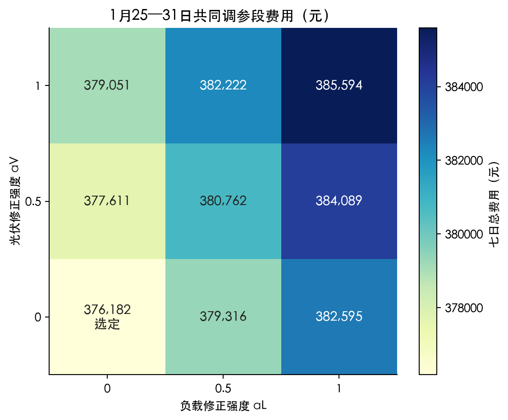
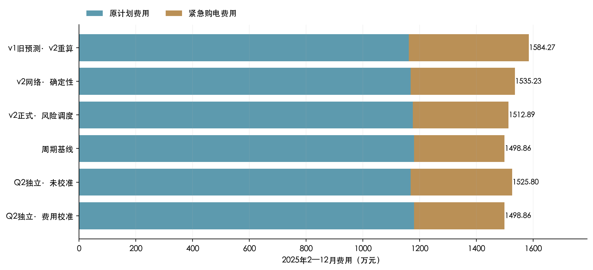
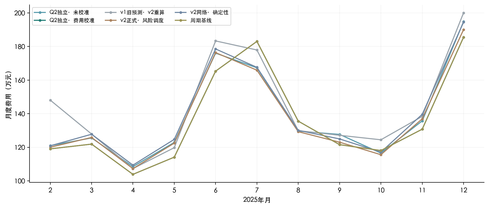
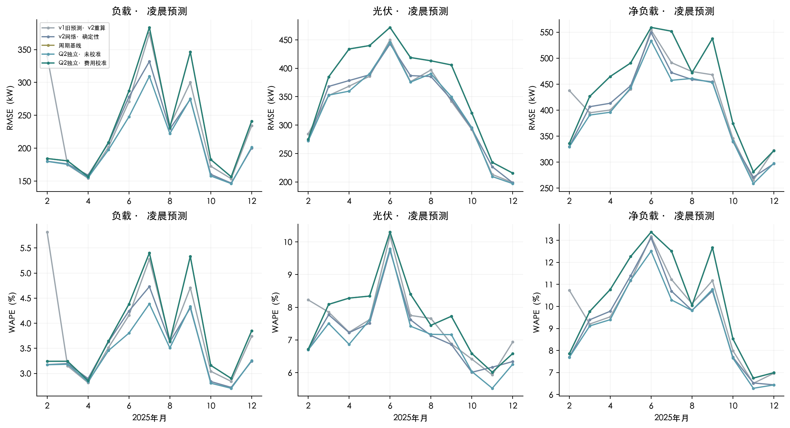
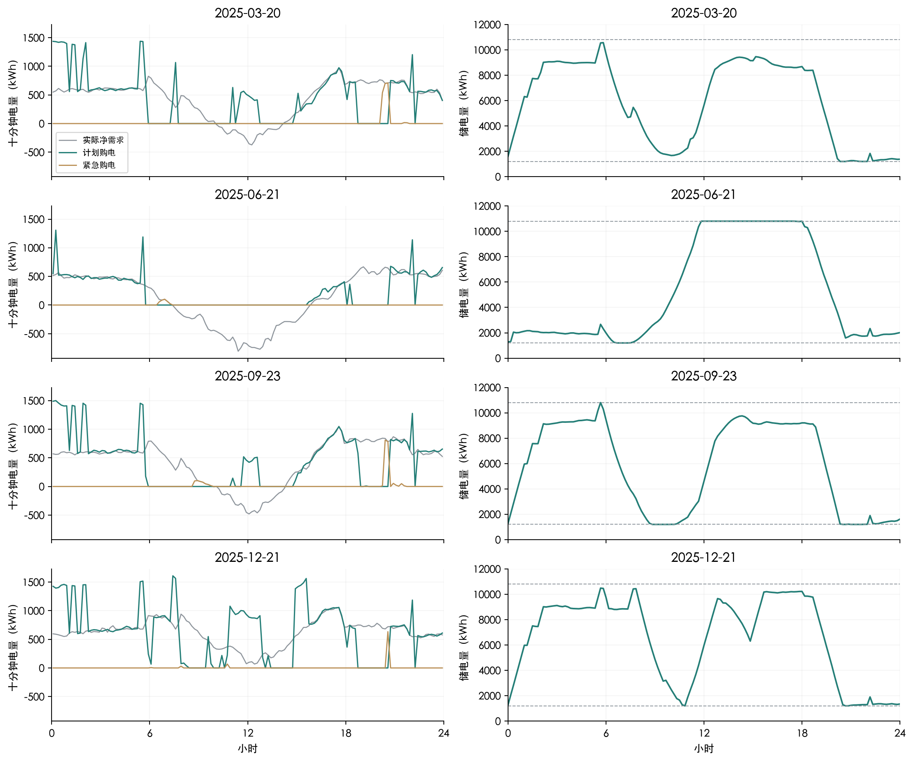
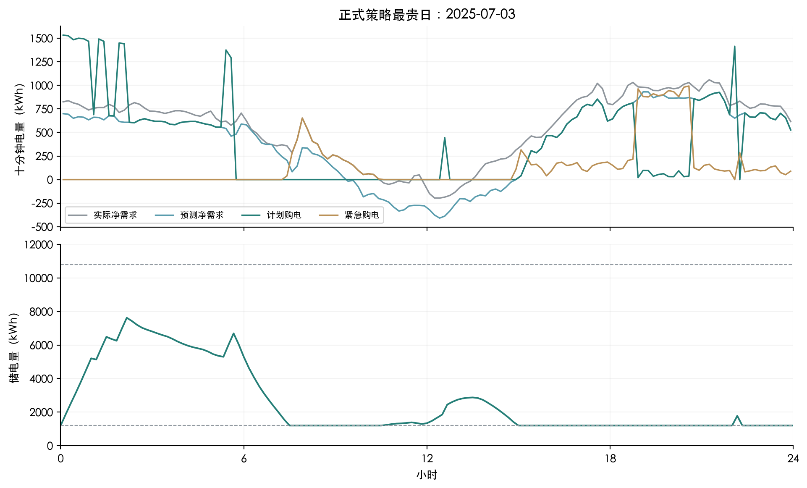
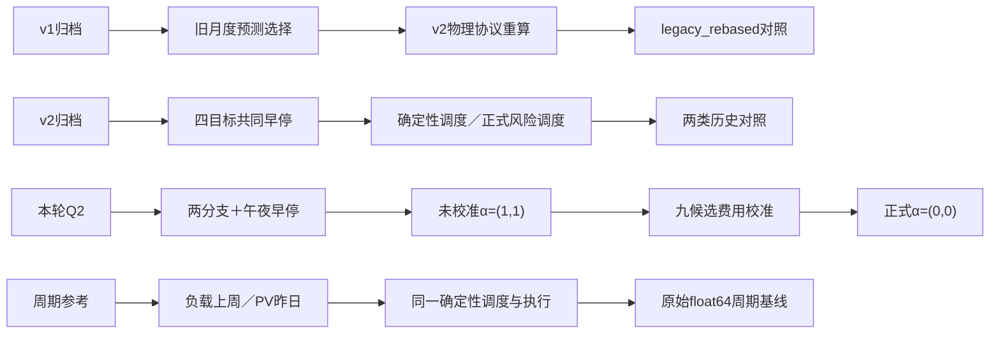

# exp003：第二问独立预测与费用校准

## 1. 结论与成绩

正式策略全年费用 **1498.86万元**，较v2正式风险策略降低0.927%，较周期基线费用变化+8.4136元。紧急购电54.97万kWh，日费用CVaR90为84,837.28元，较v2正式风险策略增加2.111%。

本轮仅优化第二问：将负载/PV训练与其他题目隔离，再用一月实际费用固定修正强度αL=0、αV=0。独立未校准模型较v2确定性策略费用变化-94,272.19元；随后费用校准再变化-269,407.44元。后一步才是本轮修正强度校准的净贡献。

**费用校准拒绝了两个网络分支的残差，正式策略退回周期预测。** 因而本轮费用成绩不能归功于神经网络修正；保留未校准对照，是为了展示费用目标如何否决看似有用的预测调整。

正式策略较原始周期基线多8.4136元，来自缓存基础预测的float32舍入及随后的调度数值变化，不代表实质改善。α为零使三个种子的正式预测相同，费用回放按相同预测复用；三份相同成绩不构成随机稳定性的独立证据。

| 原计划费/元 | 应急费/元 | 总费用/元 | 期末SOC/kWh |
|---|---|---|---|
| 11,804,823.0801 | 3,183,799.5680 | 14,988,622.6482 | 1,252.2127 |

## 2. 题目指标及信息边界

只用附件1固定电价和附件2已观测负载/PV；每天0时生成未来144区间并固定全日购电，日内不调整计划。总费用 C=Σp(g+5e)，计划电量全部付费，无售电收入。功率kW除以6得到十分钟电量kWh。

沿用v2团队物理假设：充放电效率各√0.9，往返90%；SOC为1200—10800kWh，充放电各不超过5000kW且互斥。2025年1月1日初始6000kWh，经共同周期基线预热后连续运行，日末只施加物理边界。充放电按当前净盈余与SOC贪心执行；这些假设限定本次费用比较。

## 3. 数据与时间验证

正式回溯区间为2025年2—12月334天、48,096个十分钟区间。预测只评分凌晨窗口，实际PV>0人群为26,880区间；负载、PV与净负载的MAE/RMSE/bias均为kW，WAPE为%。净负载=负载−PV，不裁剪负值；平均偏差为预测−实际。

训练样本的整个24小时标签不得越过训练截止点，标准化只拟合训练段；月末最近七个完整日期的凌晨窗口用于早停，当月冻结检查点。1月25—31日同时用于二月早停与费用校准，属于共同调参段；2025年既有结果已用于本轮诊断，因此报告称冻结配置后的时间顺序回溯评价，不称全新未接触测试集。

## 4. 逐步技术讲解

周期预测b先取负载上周同期与PV昨日同期。两个独立参数分支各采用16→32→16→1残差MLP；输出零初始化，学习标准化Huber损失并加入L2正则。两个分支的共同早停仅依赖负载/PV；附件3和附件4不进入本轮训练、损失、早停、签名或调度。

送入调度的预测为 max(0,b+αr)，光伏再施加仅由历史观测确定的夜间掩码。αL、αV各取0、0.5、1，九个组合用一月七天实际费用选一次，并列时优先较小修正。α=0保留周期基线，允许网络修正不被采用。对称误差下降并不保证购电费用下降；储能耦合下，单时段最优分位数不能直接替代全日求解。

正式与未校准策略使用同一确定性购电模型、同一因果执行器和两秒求解预算。详细损失、特征、校准规则与储能方程见[方法附录](methods.md)。

## 5. 实验设置

已完成33组两分支网络训练，2178参数/检查点；累计GPU训练6.5068分钟，16组达到60轮上限。三个固定种子42/2026/3407分别评价，42为正式种子，另外两种子保留作敏感性记录，本次α为零不提供独立稳定性证据。历史共享四分支训练耗时不作为Q2专属效率比较。

[论文SVG](figures/q2-alpha-calibration.svg)

## 6. 结果及失败案例

[论文SVG](figures/q2-cost-components.svg)

[论文SVG](figures/q2-monthly-cost.svg)

[论文SVG](figures/q2-monthly-error.svg)

[论文SVG](figures/q2-specified-days.svg)

正式策略最贵日为2025-07-03，费用154,222.41元。以下供需、购电与SOC取自该日真实回放，作为事后失败诊断；该日不参与重新选参。费用尾部CVaR90按全年最贵10%概率质量计算，包括边界日的部分权重。

[论文SVG](figures/q2-worst-day.svg)

## 7. 历次指标和技术路线对比

费用比较包含两层变化：v2确定性→Q2独立未校准，同时包含训练输入、预测发布验证边界修正；Q2未校准→费用校准只改变修正强度。v2正式风险策略额外改变调度器，不能把其求解耗时差归为预测网络提速。各方案使用相同物理、预热与结算；旧网络仍有附件3/4通过共同早停间接影响Q2的边界差异。

本轮33组训练累计390.406秒，首次预测与数组组装累计1.411秒；整次evaluate为41.674秒，包含九候选费用校准、共同预热、三个不同预测的全年回放及评分导出。校准未单独计时，41.674秒不是单策略回放时间；上述首次预测累计值也不是单次在线推理延迟。

| 方案 | 总费用/元 | CVaR90/元 | 应急电量/kWh | 组装求解执行/s |
|---|---|---|---|---|
| v1旧预测·v2重算 | 15,842,654.1907 | 92,651.6369 | 730,041.0881 | 19.0684 |
| v2网络·确定性 | 15,352,302.2799 | 84,488.0593 | 628,285.6174 | 17.6989 |
| v2正式·风险调度 | 15,128,897.4527 | 83,083.7379 | 579,717.6630 | 907.7402 |
| 周期基线 | 14,988,614.2346 | 84,837.2764 | 549,745.6303 | 12.7570 |
| Q2独立·未校准 | 15,258,030.0912 | 82,559.0103 | 607,930.4056 | 12.6689 |
| Q2独立·费用校准 | 14,988,622.6482 | 84,837.2771 | 549,746.4201 | 12.3983 |

| 变化 | 计划费变化/元 | 应急费变化/元 | 总费变化/元 |
|---|---|---|---|
| 独立训练与午夜早停 | 8,340.4722 | -102,612.6609 | -94,272.1887 |
| 费用校准 | 118,629.7469 | -388,037.1899 | -269,407.4430 |

v1原登记第二问费用16,258,308.22元，其效率与执行协议不同，仅保存在[原始记录](evidence/exp001_original_q2_costs.csv)，不纳入上述排名。历史预测均从原档案筛出0时窗口重新评分；旧四次发布统计不再沿用。完整三种子误差、偏差、费用及求解证书见[结果附表](appendix.md)。

## 8. 复现说明

复现命令：`.venv/bin/python -m experiments.problem2.exp003.train` → `predict` → `evaluate`，随后运行`.venv/bin/python reports/build_report_q2.py`。本报告构建只读已冻结结果，不触发训练或回放。完整命令与缓存签名规则见项目实验README；每轮全部技术选项与选择保存在[决策日志](decision-log.md)。

交付包括本八节正文、离线HTML、PNG/SVG、[result2.xlsx](result2.xlsx)、[方法附录](methods.md)、[结果附表](appendix.md)、[全部第二问比较](relative_comparison.csv)及evidence/机器可读快照。工作簿的全年费用与正文使用同一正式种子42逐区间结算；附表或多个工作表中的重复费用不可相加。
