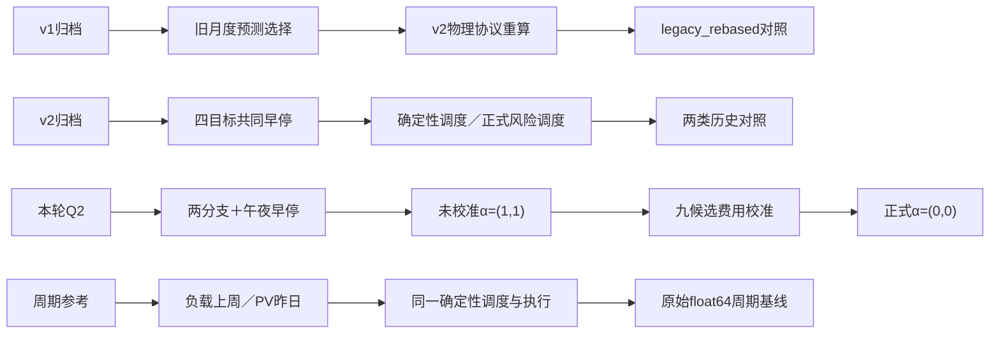

## 7. 历次指标和技术路线对比

费用比较包含两层变化：v2确定性→Q2独立未校准，同时包含训练输入、预测发布验证边界修正；Q2未校准→费用校准只改变修正强度。v2正式风险策略额外改变调度器，不能把其求解耗时差归为预测网络提速。各方案使用相同物理、预热与结算；旧网络仍有附件3/4通过共同早停间接影响Q2的边界差异。

本轮33组训练累计390.406秒，首次预测与数组组装累计1.411秒；整次evaluate为41.674秒，包含九候选费用校准、共同预热、三个不同预测的全年回放及评分导出。校准未单独计时，41.674秒不是单策略回放时间；上述首次预测累计值也不是单次在线推理延迟。

| 方案 | 总费用/元 | CVaR90/元 | 应急电量/kWh | 组装求解执行/s |
|---|---|---|---|---|
| v1旧预测·v2重算 | 15,842,654.1907 | 92,651.6369 | 730,041.0881 | 19.0684 |
| v2网络·确定性 | 15,352,302.2799 | 84,488.0593 | 628,285.6174 | 17.6989 |
| v2正式·风险调度 | 15,128,897.4527 | 83,083.7379 | 579,717.6630 | 907.7402 |
| 周期基线 | 14,988,614.2346 | 84,837.2764 | 549,745.6303 | 12.7570 |
| Q2独立·未校准 | 15,258,030.0912 | 82,559.0103 | 607,930.4056 | 12.6689 |
| Q2独立·费用校准 | 14,988,622.6482 | 84,837.2771 | 549,746.4201 | 12.3983 |

| 变化 | 计划费变化/元 | 应急费变化/元 | 总费变化/元 |
|---|---|---|---|
| 独立训练与午夜早停 | 8,340.4722 | -102,612.6609 | -94,272.1887 |
| 费用校准 | 118,629.7469 | -388,037.1899 | -269,407.4430 |

v1原登记第二问费用16,258,308.22元，其效率与执行协议不同，仅保存在[原始记录](evidence/exp001_original_q2_costs.csv)，不纳入上述排名。历史预测均从原档案筛出0时窗口重新评分；旧四次发布统计不再沿用。完整三种子误差、偏差、费用及求解证书见[结果附表](appendix.md)。
