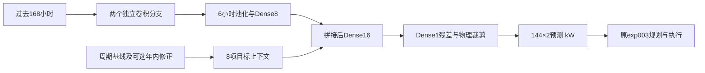

# exp004 完整预测方法与规划组交接边界

## 信息、时标与基线

只用附件1固定电价、附件2实际负载和光伏。附件2的00:10是当天第一段终点，0:00+1是24:00。每天0:00生成144个十分钟目标，数组列为负载、PV，单位kW。规划器把功率除以6得到kWh。正式评价从2025-02-01至12-31，共334日、48,096个目标槽位。

基础曲线负载取上周同日同槽位，PV取昨日同槽位。“无季节”仍含日内、周内规律，只是不加这次新增的年内趋势模块。

每月从头训练，从1月8日开始收集完整午夜样本。最近7个完整历史日用于早停，训练标签在早停段开始前结束，标准化均值/标准差只拟合该训练前缀。样本特征只用其发布前的观测；历史季节拟合也在各个历史发布时点截断，不能用后来才知道的资料回填早期特征。模型训练不读取附件3/4。

## 短序列网络

每6个十分钟功率取均值，把过去7个完整日转为168小时×2变量。对负载和PV分别建立参数独立的分支：

| 步骤 | 结构 | 输出与作用 |
|---|---|---|
| 历史输入 | 单变量168小时序列 | 顺序保留连续7日形状 |
| 第1层卷积 | Conv1D，8通道、核宽5、膨胀1、causal padding、ReLU | 识别局部历史模式 |
| 第2层卷积 | Conv1D，8通道、核宽5、膨胀2、causal padding、ReLU | 扩大历史感受范围 |
| 历史压缩 | 6小时平均池化、Flatten、Dense(8,ReLU) | 得到8维历史摘要 |
| 目标上下文 | 每个未来槽位8项，见下文 | 已知周期与时间信息 |
| 残差输出 | 拼接为16维，Dense(16,ReLU)、Dense(1) | 每个槽位一个标准化残差 |

8项上下文为归一化基础曲线、昨日值、上周值、过去7日均值，以及日内sin/cos、周内sin/cos。8维历史摘要重复144次，与目标上下文拼接。两分支共4930参数，最终输出层零初始化，初始预测等于基线。卷积核使用L2=0.0001正则。

最终预测为“基础曲线＋反标准化网络残差”，裁剪为非负。PV夜间掩码来自最近28完整日实际发电槽位的并集，再固定向两侧各扩展20分钟，允许尚未发生的昼长变化；三组使用相同掩码。

## 历史降权与非对称损失

相对训练截止日D，训练样本日d的权重为w_d=2^(−(D−1−d)/90)，再除以样本权重的均值。保留全部完整历史，90天前的样本权重是最新样本的一半。

设标准化真实残差为r，网络输出为r̂，误差u=r−r̂。Huber损失H(u)在|u|≤1时为u²/2，否则为|u|−1/2。少预测负载(u>0)或多预测PV(u<0)乘5，反方向乘1，再乘p_t/mean(p)，p_t是已知固定电价。对槽位和变量取均值后乘上述历史样本权重，并加入卷积正则项。

这是一种费用代理损失。5:1表达紧急购电昂贵的方向，但没有把电池状态、跨时段价格和每个误差的真实调度影响全部求解进去，因此不能称为精确最小化总购电费。联合改变短序列、降权、损失的收益不能分别归因给单个模块。

## 年内规律如何向前外推

对每个历史日d构造b(d)=[1,sin(2πd/365.25),cos(2πd/365.25),sin(4πd/365.25),cos(4πd/365.25),6项星期虚变量]。把各日144槽位的负载/PV拼成288个输出列Y，通过B=(XᵀX+Λ)⁻¹XᵀY拟合；年周期项岭惩罚为10，星期项为5，截距只施加1e−8数值正则。

用年周期项推算目标日曲线，再减去基线参考日的年周期曲线：负载参考d−7，PV参考d−1。星期项只帮助拟合时分离周内差异，不进入季节差值。修正按min(1,拟合历史日数/90)收缩，再裁剪到当时历史标准差的±0.35倍内，加入基础曲线后重新训练同一网络。少于28日不做季节修正。

| 组别 | 拟合季节规律的数据 | 可用性 |
|---|---|---|
| no_season | 不拟合年内修正 | 可实施预测对照 |
| causal_season | 每次发布前的全部完整历史日 | 可实施、事先指定正式方案 |
| oracle_season | 2025全年365日，包括未来实际值 | 仅探索，不参与正式策略排名 |

历史季节组用已知日历相位和历史系数外推尚未发生的变化，并没有直接读取未来实际值。但附件只有一年，年初尚未见过全年周期，正则和收缩只能限制外推，不能保证识别正确。全年探索也不是严格最优上界：它只是同一估计器获得了更完整的季节信息。

## 固定实验设置

三组×11个月×3种子=99组。种子42事先指定为主种子，2026/3407只检查稳定性；不平均预测，不按全年费用选种子。Adam学习率0.001，batch=32，最多60轮，耐心6，按照最近7个历史日的同一非对称损失早停。最早最佳轮次的权重被恢复。

结构、90日半衰期、损失比例、季节正则、收缩与裁剪在正式运行前冻结。每月只早停，不做新的费用选参。设备为CPU两线程，TensorFlow 2.18.1、NumPy 2.0.2，开启确定性算子。所有99组都核验权重保存后重新加载的输出一致。此前GPU实验的阶段耗时与本次只能描述性比较。

## 不变的费用评价

调用未修改的exp003.dispatch.day_run。每天只在午夜求解一次确定性MILP，预算2秒，相对gap阈值1%。日内按原有因果贪心规则执行储能，缺口购买紧急电。计划量全天不变，费用C=Σp(g+5e)，计划量全部计费，没有售电收入。充放单向效率均为√0.9，SOC为1200–10800 kWh，充放功率上限5000 kW。

复用exp003一月从6000 kWh因果预热后的同一初始SOC，正式各组SOC自身连续接续。年末只施加物理边界，不额外计储能残值。计划量、紧急量、充放电量、SOC及四日表1—3均保存。

用户明确本次只负责预测。因此Q2T006–010对应的场景选择、随机规划、预算增加、滚动储能与跨日预看全部留给规划组。预测组的completed_error_paths接口仅提供已完整揭晓日的联合误差数组，不替规划组选择场景或制定计划。
