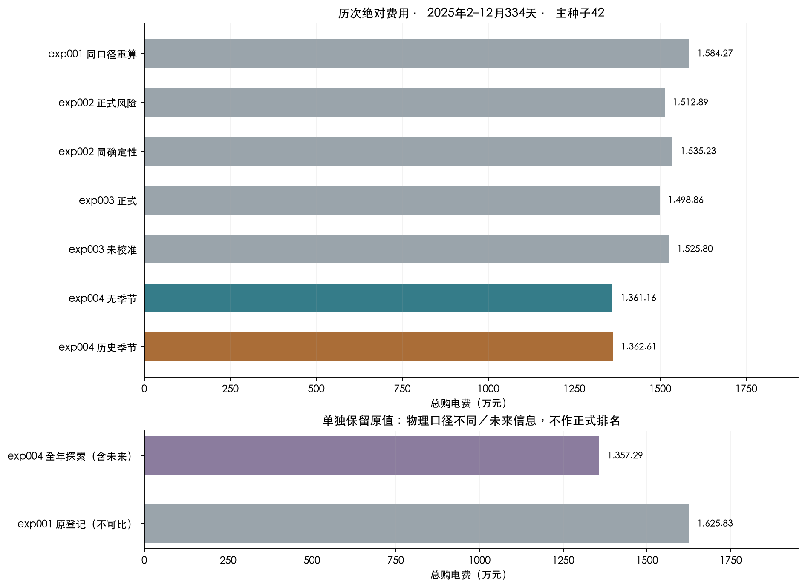
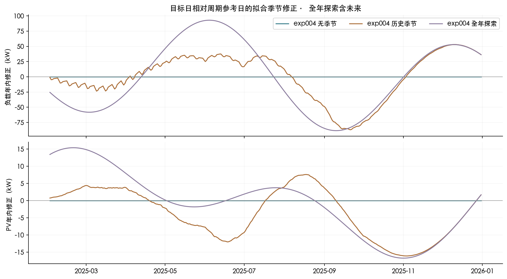
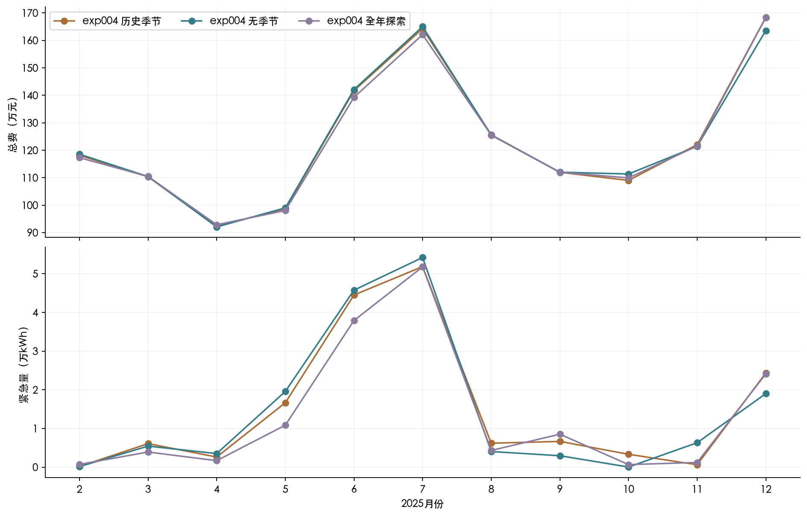
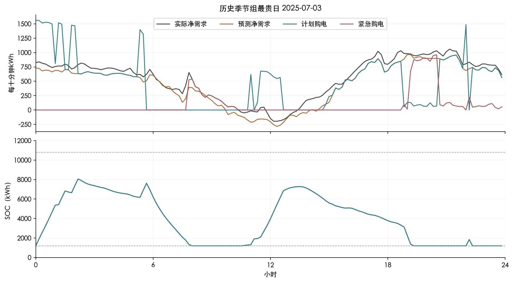
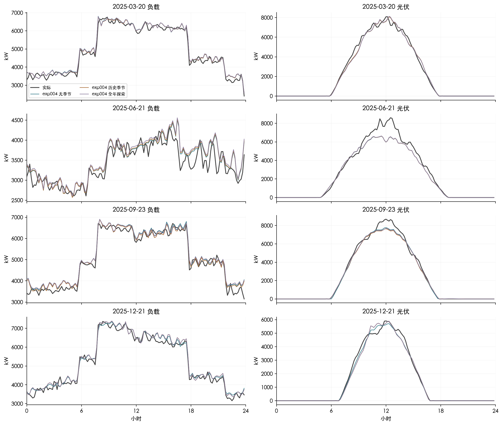
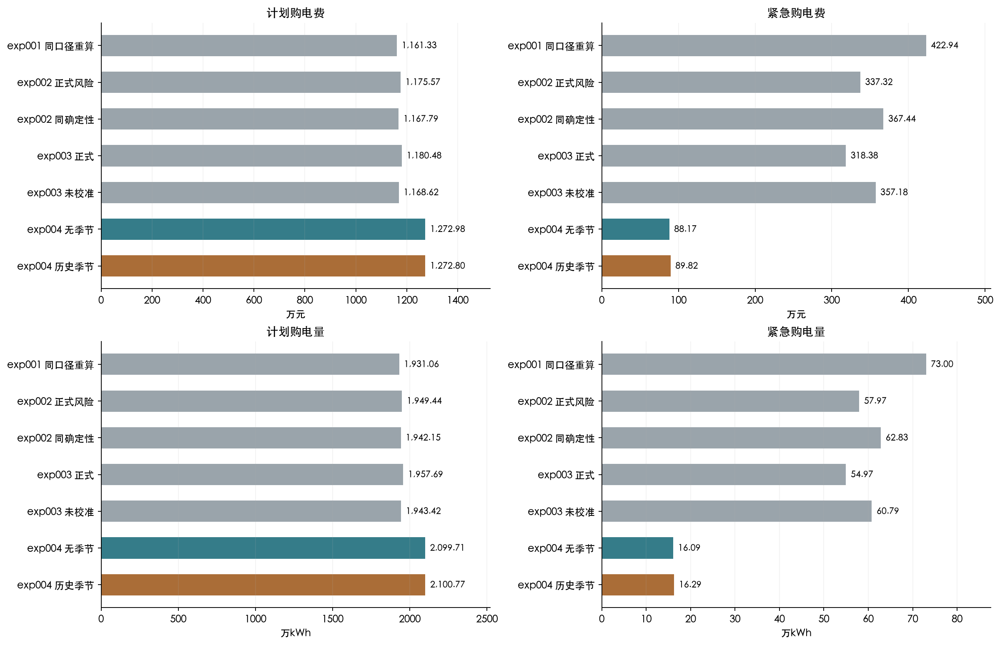
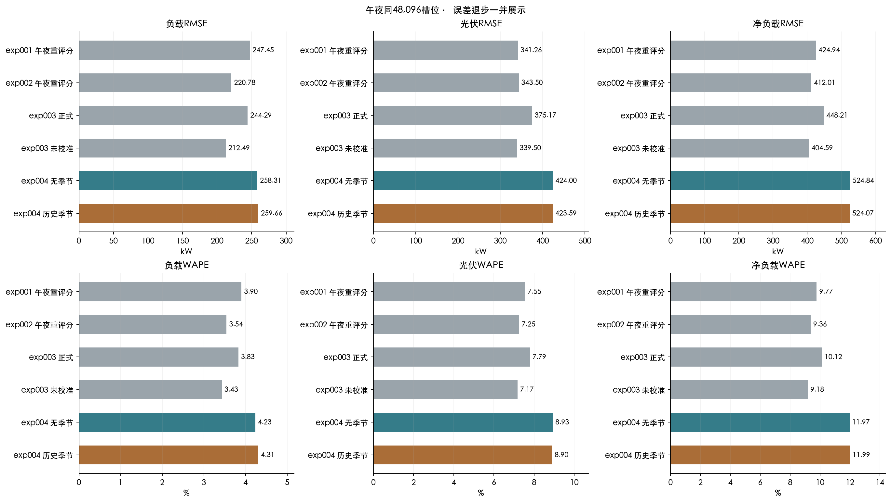
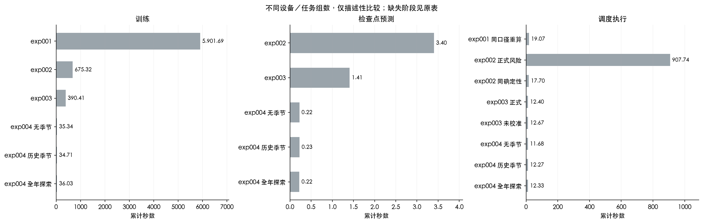
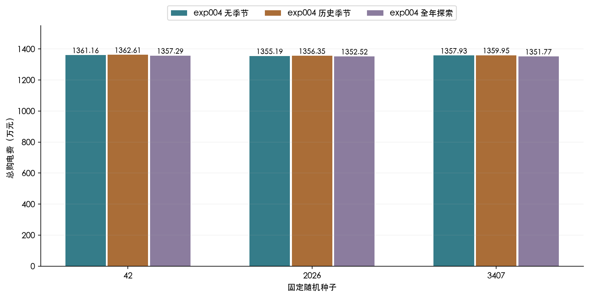
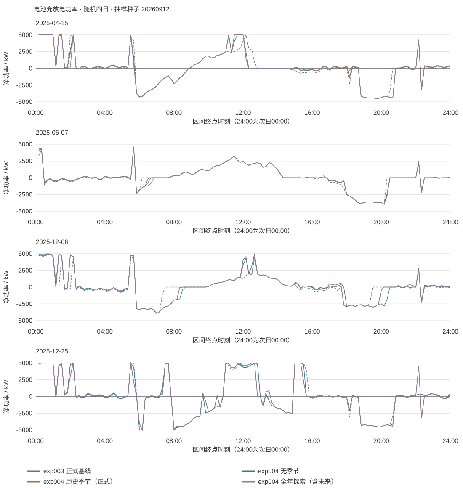

# exp004：预测组合降低费用，历史季节预判未增益

## 1. 结论与成绩

**在相同调度器下，本轮预测组合降低了实测费用，额外历史季节模块没有带来收益。**

- 无季节组总购电费 **1361.16万元**，较exp003少 **137.70万元（9.19%）**。
- 历史季节组 **1362.61万元**，反而多花 **14,557.57元（0.107%）**，其他两个种子也更贵。
- 全年季节探索组 **1357.29万元**，使用未来实际信息，不能作为可实施成绩或严格最优上界。

历史季节组和种子42是事先指定的正式方案，没有按全年结果改名或选种子。现有结果支持规划组先接入无季节预测。

### 三组绝对绩效 · 主种子42

| 方案 | 计划购电/kWh | 紧急购电/kWh | 计划费/元 | 紧急费/元 | 总费/元 |
|---|---|---|---|---|---|
| exp004 无季节 | 20,997,147.6117 | 160,912.1654 | 12,729,841.3665 | 881,746.4664 | 13,611,587.8329 |
| exp004 历史季节 | 21,007,720.4459 | 162,942.3891 | 12,727,957.7050 | 898,187.7010 | 13,626,145.4060 |
| exp004 全年探索 | 21,070,735.9395 | 145,611.6324 | 12,774,482.5883 | 798,443.8903 | 13,572,926.4786 |



## 2. 题目指标及信息边界

本次只修改预测。题目直接绩效是总购电费及其计划费、紧急费构成，另外报告计划/紧急电量、充放电量及SOC。每天零点发布144×2的负载/PV数组(kW)，原计划全天锁定。10分钟电量为功率除以6(kWh)。总费C=Σp(g+5e)，p为固定电价，g为原计划电量，e为紧急购电量；计划全部计费，没有调整费或售电收入。

沿用单向效率√0.9、1200–10800 kWh SOC与5000 kW功率上限。一月从6000 kWh预热，2月以同一初始SOC开始，之后各组分别连续跨日。年末仅有物理边界，不额外计残值。

预测辅助指标：MAE=Σ|预测−实际|/n；RMSE=√(Σ(预测−实际)²/n)，单位kW。WAPE=100Σ|预测−实际|/Σ|实际|，单位%；零分母缺失。bias=mean(预测−实际)，正值表示多预测。WAPE绝对差为百分点，相对变化仍为%。全天和实际PV>0的发电槽位分别评分。日费用CVaR90为最贵10%日费用的分数权重平均。

## 3. 数据与时间验证

### 原始输入校验值

| 文件 | SHA-256 |
|---|---|
| 附件1.csv | ac5e0ff84e0e339ac6a703d0bb07cec2baf4326fea4025c83f51b0be10e5dabb |
| 附件2_小区负载.csv | 4ecde20838ec8c6c1fb890d5cf378fb985d9d2c123fda3bf4458c4d8f6f27b56 |
| 附件2_光伏发电实际功率.csv | 7020d6c8f695809b3c8a1730c50294f5c56723652f31e94a43eb132acf52f6d2 |

附件2终点00:10对应第一段，0:00+1对应24:00。原始365天完整、非负且日期无重复；正式评价334天、48,096个午夜目标。每月训练标签在最后7日早停段之前结束，验证标签在当月发布前结束，标准化仅用训练前缀。

未来数据扰动测试证明正式两组特征/季节修正不随尚未发生的观测改变；全年探索阳性对照会改变。训练样本的季节特征在各历史发布日截断。这里“因果”仅指信息时序合规，不是因果推断。单年资料不能独立验证跨年度季节性。

## 4. 逐步技术讲解

### 信息、时标与基线

只用附件1固定电价、附件2实际负载和光伏。附件2的00:10是当天第一段终点，0:00+1是24:00。每天0:00生成144个十分钟目标，数组列为负载、PV，单位kW。规划器把功率除以6得到kWh。正式评价从2025-02-01至12-31，共334日、48,096个目标槽位。

基础曲线负载取上周同日同槽位，PV取昨日同槽位。“无季节”仍含日内、周内规律，只是不加这次新增的年内趋势模块。

每月从头训练，从1月8日开始收集完整午夜样本。最近7个完整历史日用于早停，训练标签在早停段开始前结束，标准化均值/标准差只拟合该训练前缀。样本特征只用其发布前的观测；历史季节拟合也在各个历史发布时点截断，不能用后来才知道的资料回填早期特征。模型训练不读取附件3/4。

### 短序列网络

每6个十分钟功率取均值，把过去7个完整日转为168小时×2变量。对负载和PV分别建立参数独立的分支：


8项上下文为归一化基础曲线、昨日值、上周值、过去7日均值，以及日内sin/cos、周内sin/cos。8维历史摘要重复144次，与目标上下文拼接。两分支共4930参数，最终输出层零初始化，初始预测等于基线。卷积核使用L2=0.0001正则。

最终预测为“基础曲线＋反标准化网络残差”，裁剪为非负。PV夜间掩码来自最近28完整日实际发电槽位的并集，再固定向两侧各扩展20分钟，允许尚未发生的昼长变化；三组使用相同掩码。


### 历史降权与非对称损失

相对训练截止日D，训练样本日d的权重为w_d=2^(−(D−1−d)/90)，再除以样本权重的均值。保留全部完整历史，90天前的样本权重是最新样本的一半。

设标准化真实残差为r，网络输出为r̂，误差u=r−r̂。Huber损失H(u)在|u|≤1时为u²/2，否则为|u|−1/2。少预测负载(u>0)或多预测PV(u<0)乘5，反方向乘1，再乘p_t/mean(p)，p_t是已知固定电价。对槽位和变量取均值后乘上述历史样本权重，并加入卷积正则项。

这是一种费用代理损失。5:1表达紧急购电昂贵的方向，但没有把电池状态、跨时段价格和每个误差的真实调度影响全部求解进去，因此不能称为精确最小化总购电费。联合改变短序列、降权、损失的收益不能分别归因给单个模块。

### 年内规律如何向前外推

对每个历史日d构造b(d)=[1,sin(2πd/365.25),cos(2πd/365.25),sin(4πd/365.25),cos(4πd/365.25),6项星期虚变量]。把各日144槽位的负载/PV拼成288个输出列Y，通过B=(XᵀX+Λ)⁻¹XᵀY拟合；年周期项岭惩罚为10，星期项为5，截距只施加1e−8数值正则。

用年周期项推算目标日曲线，再减去基线参考日的年周期曲线：负载参考d−7，PV参考d−1。星期项只帮助拟合时分离周内差异，不进入季节差值。修正按min(1,拟合历史日数/90)收缩，再裁剪到当时历史标准差的±0.35倍内，加入基础曲线后重新训练同一网络。少于28日不做季节修正。


历史季节组用已知日历相位和历史系数外推尚未发生的变化，并没有直接读取未来实际值。但附件只有一年，年初尚未见过全年周期，正则和收缩只能限制外推，不能保证识别正确。全年探索也不是严格最优上界：它只是同一估计器获得了更完整的季节信息。

### 固定实验设置

三组×11个月×3种子=99组。种子42事先指定为主种子，2026/3407只检查稳定性；不平均预测，不按全年费用选种子。Adam学习率0.001，batch=32，最多60轮，耐心6，按照最近7个历史日的同一非对称损失早停。最早最佳轮次的权重被恢复。

结构、90日半衰期、损失比例、季节正则、收缩与裁剪在正式运行前冻结。每月只早停，不做新的费用选参。设备为CPU两线程，TensorFlow 2.18.1、NumPy 2.0.2，开启确定性算子。所有99组都核验权重保存后重新加载的输出一致。此前GPU实验的阶段耗时与本次只能描述性比较。

### 不变的费用评价

调用未修改的exp003.dispatch.day_run。每天只在午夜求解一次确定性MILP，预算2秒，相对gap阈值1%。日内按原有因果贪心规则执行储能，缺口购买紧急电。计划量全天不变，费用C=Σp(g+5e)，计划量全部计费，没有售电收入。充放单向效率均为√0.9，SOC为1200–10800 kWh，充放功率上限5000 kW。

复用exp003一月从6000 kWh因果预热后的同一初始SOC，正式各组SOC自身连续接续。年末只施加物理边界，不额外计储能残值。计划量、紧急量、充放电量、SOC及四日表1—3均保存。

用户明确本次只负责预测。因此Q2T006–010对应的场景选择、随机规划、预算增加、滚动储能与跨日预看全部留给规划组。预测组的completed_error_paths接口仅提供已完整揭晓日的联合误差数组，不替规划组选择场景或制定计划。




## 5. 实验设置

### 三组训练实测配置

| 组 | 月度训练组数 | 平均训练轮数 | 训练/s | 检查点预测/s |
|---|---|---|---|---|
| exp004 历史季节 | 33.0000 | 42.6667 | 34.7130 | 0.2259 |
| exp004 无季节 | 33.0000 | 42.8788 | 35.3422 | 0.2235 |
| exp004 全年探索 | 33.0000 | 44.3939 | 36.0251 | 0.2230 |

三组各11月×3种子，共99组；两分支4930参数，种子42事先指定，其他种子不参与选择或集成。Adam=0.001，batch=32，上限60轮、早停耐心6；以最近7历史日同一非对称损失恢复最佳权重，全年不回选。CPU两线程，TensorFlow 2.18.1、NumPy 2.0.2，开启确定性算子。各组保存/重载输出均核验。

用户限定预测范围，Q2T006–010的场景规划、增加求解预算、滚动储能、跨日预看留给规划组。只保留历史联合误差读取接口，不决定场景权重或购电计划。

## 6. 结果及失败案例

预测步长按0–4、4–8、8–12、12–16、16–20、20–24小时分段。各组全部种子的MAE、RMSE、WAPE与偏差保留于[步长误差CSV](evidence/forecast_lead.csv)。夜间PV实际功率总和接近零，会放大WAPE，图中使用绝对RMSE。

### 全部组和种子的绝对绩效

| 组 | 种子 | 计划费/元 | 紧急费/元 | 总费/元 | 紧急电量/kWh |
|---|---|---|---|---|---|
| exp004 无季节 | 42.0000 | 12,729,841.3665 | 881,746.4664 | 13,611,587.8329 | 160,912.1654 |
| exp004 无季节 | 2,026.0000 | 12,716,707.5649 | 835,160.1686 | 13,551,867.7335 | 150,926.2495 |
| exp004 无季节 | 3,407.0000 | 12,681,140.0111 | 898,172.7049 | 13,579,312.7160 | 162,838.0350 |
| exp004 历史季节 | 42.0000 | 12,727,957.7050 | 898,187.7010 | 13,626,145.4060 | 162,942.3891 |
| exp004 历史季节 | 2,026.0000 | 12,723,359.6704 | 840,180.1591 | 13,563,539.8295 | 151,536.0451 |
| exp004 历史季节 | 3,407.0000 | 12,699,816.1769 | 899,648.4121 | 13,599,464.5890 | 162,667.8656 |
| exp004 全年探索 | 42.0000 | 12,774,482.5883 | 798,443.8903 | 13,572,926.4786 | 145,611.6324 |
| exp004 全年探索 | 2,026.0000 | 12,752,549.5363 | 772,613.8683 | 13,525,163.4046 | 140,630.7522 |
| exp004 全年探索 | 3,407.0000 | 12,744,546.4809 | 773,151.7874 | 13,517,698.2683 | 139,806.0193 |

### 三种子均值与样本标准差

| 组 | 指标 | 均值 | 样本标准差 |
|---|---|---|---|
| exp004 无季节 | 总费用/元 | 13,580,922.7608 | 29,892.5869 |
| exp004 无季节 | 计划费/元 | 12,709,229.6475 | 25,197.1217 |
| exp004 无季节 | 紧急费/元 | 871,693.1133 | 32,687.1132 |
| exp004 无季节 | 紧急电量/kWh | 158,225.4833 | 6,394.2438 |
| exp004 历史季节 | 总费用/元 | 13,596,383.2748 | 31,416.3242 |
| exp004 历史季节 | 计划费/元 | 12,717,044.5175 | 15,096.2667 |
| exp004 历史季节 | 紧急费/元 | 879,338.7574 | 33,920.2047 |
| exp004 历史季节 | 紧急电量/kWh | 159,048.7666 | 6,507.6554 |
| exp004 全年探索 | 总费用/元 | 13,538,596.0505 | 29,964.4086 |
| exp004 全年探索 | 计划费/元 | 12,757,192.8685 | 15,498.8074 |
| exp004 全年探索 | 紧急费/元 | 781,403.1820 | 14,760.1370 |
| exp004 全年探索 | 紧急电量/kWh | 142,016.1346 | 3,140.9790 |

历史季节组的净负载RMSE略降，但费用仍增加14,557.57元，误差与储能后的费用并不等价。配对最不利日期2025-12-02多花10,963.26元。历史季节组最贵日2025-07-03为120,510.23元。最坏日曲线另存evidence/detail.csv。

7日区块2000次重采样的年度费用差95%区间为[-48,338, 94,507]元，跨过0。它只描述单年内的敏感性，不能证明季节模块必然有害或已经跨年验证。9组均无超时/回退，432,864槽位物理和费用核验通过。

### 题目指定四日的全天指标

| 组 | 日期 | 计划/kWh | 紧急/kWh | 总费/元 | 日初SOC/kWh | 日末SOC/kWh |
|---|---|---|---|---|---|---|
| exp004 无季节 | 2025-03-20 | 66,406.0835 | 176.6902 | 41,372.4102 | 2,177.7110 | 1,627.7694 |
| exp004 无季节 | 2025-06-21 | 33,694.8336 | 0.0000 | 19,325.9803 | 1,998.1556 | 2,580.2475 |
| exp004 无季节 | 2025-09-23 | 70,500.9373 | 16.6094 | 43,671.2422 | 1,526.5321 | 2,081.9368 |
| exp004 无季节 | 2025-12-21 | 94,135.7062 | 69.9526 | 60,391.5653 | 1,883.9757 | 1,929.0570 |
| exp004 历史季节 | 2025-03-20 | 66,126.0466 | 153.6872 | 41,053.6342 | 2,212.5239 | 1,649.3930 |
| exp004 历史季节 | 2025-06-21 | 33,857.1377 | 0.0000 | 19,504.0171 | 2,068.3608 | 2,717.6275 |
| exp004 历史季节 | 2025-09-23 | 69,588.1458 | 49.4520 | 43,022.4026 | 1,454.2180 | 1,804.5963 |
| exp004 历史季节 | 2025-12-21 | 94,868.1099 | 0.0000 | 60,812.0565 | 1,794.4986 | 1,864.8180 |
| exp004 全年探索 | 2025-03-20 | 66,490.7734 | 30.3777 | 40,541.8691 | 2,259.4175 | 1,690.4334 |
| exp004 全年探索 | 2025-06-21 | 34,220.2384 | 0.0000 | 19,766.7557 | 2,166.9110 | 2,895.7972 |
| exp004 全年探索 | 2025-09-23 | 70,336.7129 | 16.6094 | 43,375.0712 | 1,374.2833 | 2,192.4927 |
| exp004 全年探索 | 2025-12-21 | 94,880.1626 | 0.0000 | 60,820.8742 | 1,790.2052 | 1,860.7475 |

完整表1六个购电时段、表2六个4小时充放电块与日初/末SOC、表3全部紧急购电明细见[指定四日完整表格](specified_dates.md)。[无季节工作簿](no_season/result2.xlsx)、[历史季节工作簿](causal_season/result2.xlsx)、[全年探索工作簿](oracle_season/result2.xlsx)均为原题模板334天结果。







## 7. 历次指标和技术路线对比

按实验顺序并列绝对成绩，不按表现排序。exp001同口径重算、exp002确定性对照、exp003和本轮使用同一物理/结算；exp002正式风险策略还改变决策器。exp001/2历史共享四目标早停，不能宣称严格Q2隔离。原exp001登记的效率/SOC/控制不同，保留原值但不算改善率。全年季节探索含未来信息，不进入正式比较图。

### 全部原登记、重算与本轮原始值

| 方案 | 口径 | 计划/kWh | 紧急/kWh | 计划费/元 | 紧急费/元 | 总费/元 | 年末SOC/kWh |
|---|---|---|---|---|---|---|---|
| exp001 同口径重算 | 同物理口径 | 19,310,623.5698 | 730,041.0881 | 11,613,278.0321 | 4,229,376.1586 | 15,842,654.1907 | 1,200.0000 |
| exp002 正式风险 | 同物理口径 | 19,494,424.5794 | 579,717.6630 | 11,755,724.5128 | 3,373,172.9400 | 15,128,897.4527 | 1,200.0000 |
| exp002 同确定性 | 同物理口径 | 19,421,489.4203 | 628,285.6174 | 11,677,852.8611 | 3,674,449.4188 | 15,352,302.2799 | 1,200.0000 |
| exp003 正式 | 同物理口径 | 19,576,927.8687 | 549,746.4201 | 11,804,823.0801 | 3,183,799.5680 | 14,988,622.6482 | 1,252.2127 |
| exp003 未校准 | 同物理口径 | 19,434,153.1449 | 607,930.4056 | 11,686,193.3333 | 3,571,836.7579 | 15,258,030.0912 | 1,200.0000 |
| exp004 无季节 | 同物理口径 | 20,997,147.6117 | 160,912.1654 | 12,729,841.3665 | 881,746.4664 | 13,611,587.8329 | 1,335.7963 |
| exp004 历史季节 | 同物理口径 | 21,007,720.4459 | 162,942.3891 | 12,727,957.7050 | 898,187.7010 | 13,626,145.4060 | 1,429.3240 |
| exp004 全年探索 | 含未来信息，仅探索 | 21,070,735.9395 | 145,611.6324 | 12,774,482.5883 | 798,443.8903 | 13,572,926.4786 | 1,430.5804 |
| exp001 原登记（不可比） | 原协议不可直接比较 | 19,836,870.4998 | 728,394.1218 | 12,025,380.5614 | 4,232,927.6560 | 16,258,308.2174 | 1,200.0000 |

**费用降低伴随着常规误差退步。** 无季节组负载/PV的RMSE为258.31/424.00 kW，高于exp003正式的244.29/375.17 kW；净负载RMSE为524.84 kW，高于448.21 kW。无季节组平均多预测负载101.16 kW、少预测PV135.60 kW，与5:1损失的保守方向一致。原调度器因此倾向多作日前购电，紧急费下降超过计划费增加。这个费用代理并不等同于直接优化储能后的实际总费，也不能声称预测精度整体改善。

### 本轮全天完整误差 · 主种子42

| 组 | 目标 | MAE/kW | RMSE/kW | WAPE/% | 偏差/kW |
|---|---|---|---|---|---|
| exp004 无季节 | load | 195.4576 | 258.3118 | 4.2336 | 101.1629 |
| exp004 无季节 | pv | 212.4198 | 423.9991 | 8.9295 | -135.5960 |
| exp004 无季节 | net_load | 359.3112 | 524.8383 | 11.9733 | 236.7588 |
| exp004 历史季节 | load | 198.8447 | 259.6564 | 4.3070 | 104.9368 |
| exp004 历史季节 | pv | 211.6436 | 423.5937 | 8.8969 | -133.8788 |
| exp004 历史季节 | net_load | 359.8994 | 524.0700 | 11.9929 | 238.8157 |
| exp004 全年探索 | load | 201.7519 | 259.0150 | 4.3700 | 116.4950 |
| exp004 全年探索 | pv | 210.6072 | 423.6735 | 8.8533 | -134.5088 |
| exp004 全年探索 | net_load | 363.0487 | 527.1141 | 12.0978 | 251.0038 |

### 实际发电时段PV误差 · 含探索原值

| 模型 | 槽位数 | MAE/kW | RMSE/kW | WAPE/% | 偏差/kW |
|---|---|---|---|---|---|
| exp001 午夜重评分 | 26,880.0000 | 306.5591 | 455.7890 | 7.2022 | 9.4531 |
| exp002 午夜重评分 | 26,880.0000 | 307.1910 | 459.4373 | 7.2171 | 12.0803 |
| exp003 正式 | 26,880.0000 | 331.6338 | 501.8496 | 7.7913 | 1.3577 |
| exp003 未校准 | 26,880.0000 | 303.6413 | 454.0779 | 7.1337 | 16.2428 |
| exp004 无季节 | 26,880.0000 | 379.3326 | 567.1410 | 8.9119 | -243.3670 |
| exp004 历史季节 | 26,880.0000 | 377.6413 | 566.5907 | 8.8722 | -240.5971 |
| exp004 全年探索 | 26,880.0000 | 376.0833 | 566.7055 | 8.8356 | -241.4277 |

### 总费的原值、绝对差和相对变化

| 此前 | 本次 | 此前/元 | 本次/元 | 绝对差/元 | 相对变化/% |
|---|---|---|---|---|---|
| exp001 同口径重算 | exp004 无季节 | 15,842,654.1907 | 13,611,587.8329 | -2,231,066.3578 | -14.0827 |
| exp002 正式风险 | exp004 无季节 | 15,128,897.4527 | 13,611,587.8329 | -1,517,309.6198 | -10.0292 |
| exp002 同确定性 | exp004 无季节 | 15,352,302.2799 | 13,611,587.8329 | -1,740,714.4470 | -11.3385 |
| exp003 正式 | exp004 无季节 | 14,988,622.6482 | 13,611,587.8329 | -1,377,034.8153 | -9.1872 |
| exp003 未校准 | exp004 无季节 | 15,258,030.0912 | 13,611,587.8329 | -1,646,442.2583 | -10.7907 |
| exp001 同口径重算 | exp004 历史季节 | 15,842,654.1907 | 13,626,145.4060 | -2,216,508.7847 | -13.9908 |
| exp002 正式风险 | exp004 历史季节 | 15,128,897.4527 | 13,626,145.4060 | -1,502,752.0467 | -9.9330 |
| exp002 同确定性 | exp004 历史季节 | 15,352,302.2799 | 13,626,145.4060 | -1,726,156.8739 | -11.2436 |
| exp003 正式 | exp004 历史季节 | 14,988,622.6482 | 13,626,145.4060 | -1,362,477.2422 | -9.0901 |
| exp003 未校准 | exp004 历史季节 | 15,258,030.0912 | 13,626,145.4060 | -1,631,884.6852 | -10.6953 |

### 阶段耗时范围与缺失项

| 实验/组 | 阶段 | 秒 | 组/日数 | 范围 |
|---|---|---|---|---|
| exp001 | 训练 | 5,901.6948 | 165.0000 | 历史训练任务累计；设备/目标数/样本数不同，仅描述 |
| exp001 | 检查点预测 | — | 165.0000 | 历史训练任务累计；设备/目标数/样本数不同，仅描述 |
| exp002 | 训练 | 675.3243 | 33.0000 | 历史训练任务累计；设备/目标数/样本数不同，仅描述 |
| exp002 | 检查点预测 | 3.4018 | 33.0000 | 历史训练任务累计；设备/目标数/样本数不同，仅描述 |
| exp003 | 训练 | 390.4056 | 33.0000 | 历史训练任务累计；设备/目标数/样本数不同，仅描述 |
| exp003 | 检查点预测 | 1.4111 | 33.0000 | 历史训练任务累计；设备/目标数/样本数不同，仅描述 |
| exp004 无季节 | 训练 | 35.3422 | 33.0000 | CPU两线程，33组累计；特征准备另计，不是端到端耗时 |
| exp004 无季节 | 检查点预测 | 0.2235 | 33.0000 | CPU两线程，33组累计；特征准备另计，不是端到端耗时 |
| exp004 历史季节 | 训练 | 34.7130 | 33.0000 | CPU两线程，33组累计；特征准备另计，不是端到端耗时 |
| exp004 历史季节 | 检查点预测 | 0.2259 | 33.0000 | CPU两线程，33组累计；特征准备另计，不是端到端耗时 |
| exp004 全年探索 | 训练 | 36.0251 | 33.0000 | CPU两线程，33组累计；特征准备另计，不是端到端耗时 |
| exp004 全年探索 | 检查点预测 | 0.2230 | 33.0000 | CPU两线程，33组累计；特征准备另计，不是端到端耗时 |
| exp001 同口径重算 | 调度执行 | 19.0684 | 334.0000 | 主种子334日组装求解执行累计，非并行墙钟 |
| exp002 正式风险 | 调度执行 | 907.7402 | 334.0000 | 主种子334日组装求解执行累计，非并行墙钟 |
| exp002 同确定性 | 调度执行 | 17.6989 | 334.0000 | 主种子334日组装求解执行累计，非并行墙钟 |
| exp003 正式 | 调度执行 | 12.3983 | 334.0000 | 主种子334日组装求解执行累计，非并行墙钟 |
| exp003 未校准 | 调度执行 | 12.6689 | 334.0000 | 主种子334日组装求解执行累计，非并行墙钟 |
| exp004 无季节 | 调度执行 | 11.6773 | 334.0000 | 主种子334日组装求解执行累计，非并行墙钟 |
| exp004 历史季节 | 调度执行 | 12.2731 | 334.0000 | 主种子334日组装求解执行累计，非并行墙钟 |
| exp004 全年探索 | 调度执行 | 12.3319 | 334.0000 | 主种子334日组装求解执行累计，非并行墙钟 |
| exp002 | 费用校准 | 197.3803 | — | 历史阶段记录；exp002含四问。缺失不填零 |
| exp003 | 费用校准 | — | — | 历史阶段记录；exp002含四问。缺失不填零 |
| exp004 | 费用校准 | — | 0.0000 | 不适用：未实施费用回选 |

本次99组训练累计106.08秒，检查点推理0.672秒。9组回放并行墙钟38.90秒，三份工作簿导出/读回10.14秒。特征准备按同月同组共享一次，记录在training_metadata.json；报告构建单独记时。

exp001为165组GPU训练，exp002/003各33组，本次CPU每组33次；设备、样本与计时范围不同，不能把训练耗时下降解释为端到端加速。此前缺失阶段保留空值，本次费用校准标为不适用。

总体节省的费用来自计划费增加与紧急费减少的净差。短序列、降权、非对称损失共同变化，不能把组合收益单独分配给某个模块。









## 8. 复现说明

仓库根目录执行：

```sh
.venv/bin/python -m unittest discover -s tests -p 'test_q2_*.py' -v
.venv/bin/python -m experiments.problem2.exp004.train
.venv/bin/python -m experiments.problem2.exp004.evaluate --workers 3
.venv/bin/python -m experiments.problem2.exp004.verify
.venv/bin/python -m experiments.problem2.exp004.export --node /absolute/path/to/codex/node
.venv/bin/python -m reports.build_report_exp004 --complete --node /absolute/path/to/codex/node
```

预测接口`ForecastStore("no_season", seed=42).get(origin)`返回144×2 float64 kW。origin为自2025-01-01起的十分钟索引，必须是2–12月午夜。`completed_error_paths(origin)`只返回此前完整揭晓的误差路径；全年探索需`allow_oracle=True`。

权重与可恢复逐日缓存放在忽略的runs/；已提交predictions.npz与训练元数据能直接供规划组和报告使用，无须权重。缓存签名绑定源代码、参数、数据与初始SOC。见[预测交接说明](README-prediction.md)。

独立核验通过：9组完整全年、99组训练边界/重载、41项Q2测试、三份工作簿334天读回。既有规划和历次结果共1145个文件保持不变。代码/数据清单与评价签名保存于evidence；页面检查记录与构建记录分开。

<!-- battery-power:start -->
## 补充：电池充放电功率与波动核验

P=6×(充电量−放电量)，母线侧 kW；充电为正、放电为负。每点对应前10分钟平均功率，使用区间终点。1月为共用预热，2–12月为各方案独立执行的正式评价，模型种子42。全年每方案52,560点，评价48,096点；评价差分48,095项，含跨午夜变化，不含预热到评价的跳变（另存清单）。大跳变阈值1000 kW/10min仅作描述，零容差1e-6 kW；未做降采样、移动平均或曲线平滑。随机日使用NumPy default_rng(20260912)，从334个评价日不放回抽4天：2025-04-15、2025-06-07、2025-12-06、2025-12-25。

未观察到功率变化被明显抑制。正式历史季节组的平均相邻功率变化为 695.36 kW，较 exp003 变化 +0.18%；P95 为 4742.86 kW，最大跳变 9707.94 kW。现有执行器仅按供需余额、SOC 和 5000 kW 上限充放电，没有显式爬坡约束或平滑惩罚。波动是否下降应结合下表各项判断；功率贴限不代表变化率受限，此比较也不能证明平滑机制的因果效果或统计显著性。

[完整指标与曲线](battery-power.html)




<!-- battery-power:end -->
