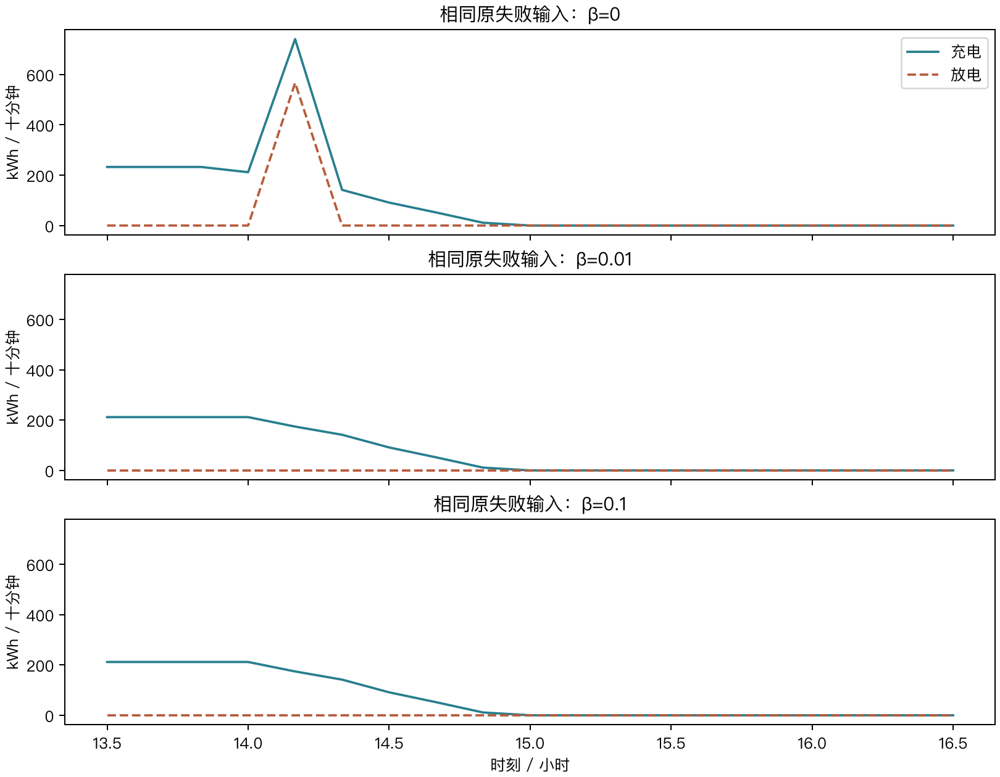
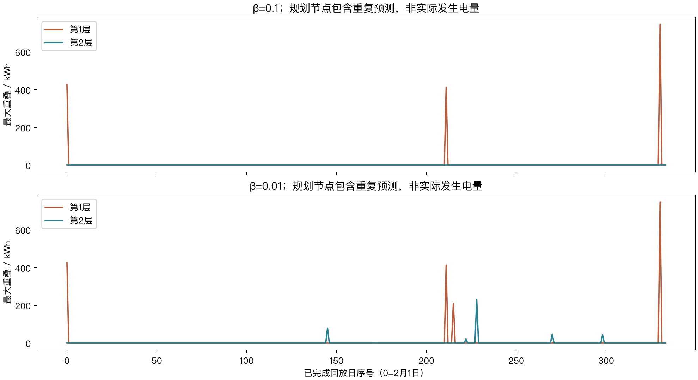
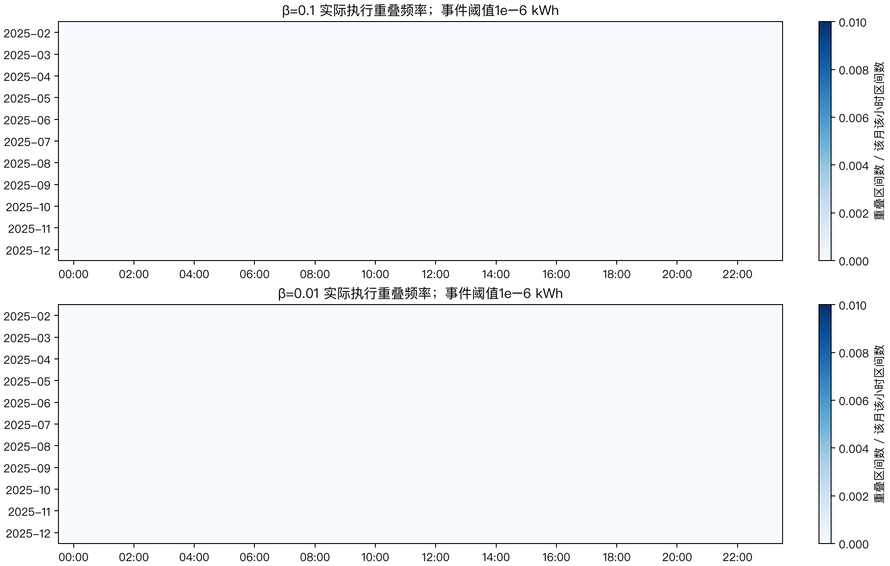
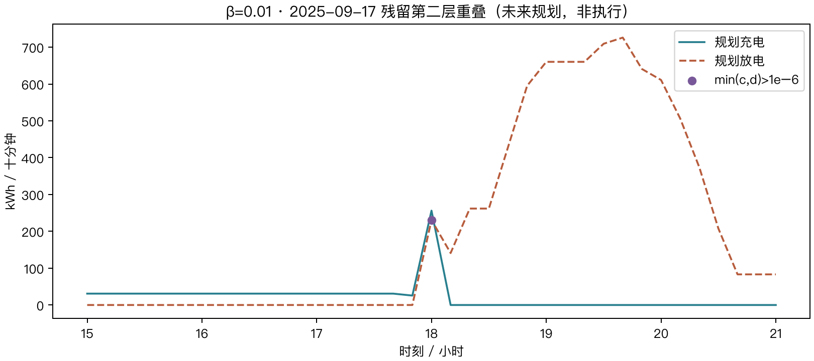

# exp005：周转惩罚与充放电重叠检验

两组均已完成2025-02-01至12-31的334日回放。

## 1. 结论与成绩

两组均已完成2025-02-01至12-31的334日回放。

本次按用户决定移除整数开关，在第二层加入归一化周转惩罚。主方案β=0.1，敏感性对照β=0.01；原实验源码未修改。β在回放前固定，不按全年账单回选。

主方案已完成334日的模拟结算总费为14,717,882.1655元，计划费12,125,606.9831元、紧急费2,592,275.1824元、调整费0元。exp004同日期为13,611,587.8329元，差额+1,106,294.3326元（+8.13%）。exp004使用不同控制器和爬坡协议，费用差为描述性对照，不能单独归因于周转惩罚。

主方案48,096个实际模拟执行区间中，超过1e−6 kWh的重叠有0段；第二层全部规划节点中有0个重叠节点。连续LP没有互斥的数学保证，以下依据原始输出逐项检验。

分项看，相比exp004，主方案普通计划费变化-604,234.3834元，紧急购电费变化+1,710,528.7159元。该分解解释账单差额，不构成对某一模型设计的因果归因。


period（原值可查对应CSV）

| label | beta | days | total_cost | planned_cost | emergency_cost | adjustment_cost | emergency_kwh | total_wan | overlap_intervals | max_overlap_kwh | throughput_kwh | tv_kw |
| --- | --- | --- | --- | --- | --- | --- | --- | --- | --- | --- | --- | --- |
| exp004 无季节·原调度器 | — | 334 | 13,611,587.832914 | 12,729,841.366489 | 881,746.466425 | 0 | 160,912.165421 | 1,361.158783 | — | — | — | — |
| β=0.01敏感性对照 | 0.01 | 334 | 14,740,993.873913 | 12,142,430.663598 | 2,598,563.210314 | 0 | 700,763.434848 | 1,474.099387 | 0 | 1.28679e-11 | 11,622,043.989632 | 12,681,513.558849 |
| β=0.1 主方案 | 0.1 | 334 | 14,717,882.165476 | 12,125,606.983119 | 2,592,275.182357 | 0 | 698,388.269991 | 1,471.788217 | 0 | 7.67386e-12 | 11,513,308.870902 | 12,692,001.82797 |

## 2. 题目指标及信息边界

时间步长Δt=1/6小时；负载和光伏由kW乘Δt转为交流侧kWh。每天0:00锁定普通购电g，实际账单为Σp(g+5e)，e为实际紧急购电。普通计划全部计费，弃电w无收入，周转惩罚不是电费。

单向效率η=√0.9；内部SOC保持1200—10800 kWh；单向功率不超过5000 kW，相邻十分钟净功率变化不超过1000 kW。SOC和末段净功率跨日传递，不设日末等于日初。D5-A允许紧急购电服务系统平衡，包括充电。

每次滚动仅反馈当前十分钟平均供需，未来实际数据不进入规划。日内既不更改普通计划，也不更新场景权重。

重叠原始量为min(c,d)，超过1e−6 kWh才计为重叠事件；数值容差内的原始残差仍保存。汇总重叠电量只累计超过阈值的事件。第一层参考解、第二层未来方案与实际执行分别统计，重复预测到的未来节点不能当作真实发生电量累加。四小时汇总段内先充后放，可能使两列都为正，不能据此判断十分钟重叠。

## 3. 数据与时间验证

固定采用exp004/no_season_seed_42预测，来源分支提交b42168d5271097762953f38d472d0ef5fe1a908d；未重训或使用附件3、4。冻结档案SHA-256为6f7bcf27e420e2f05251820a5c1d8d1f87cd6234287e23505b33a51ae6d757b9。

2月1日初始SOC=1421.7991105135516 kWh、上一段净功率=172.76 kW，承接相同一月预热。首日缺少历史预测误差供体，退化为一条点路径；之后只用已完整揭晓的历史日。评价区间为2—12月，不伪造1月新模型成绩。

逐日独立核对供需平衡、SOC递推、单向边界、硬爬坡、跨日状态、普通计划锁定和五倍紧急费。两层节点按求解日志核对原约束和第二层预算。原模型、预测和执行相关13个源文件哈希未变。

由于此前已查看过全年数据及实验成绩，本轮属于回顾性时序评价。严格遵守逐段可用信息，不把它称作未接触过的独立测试集。

## 4. 逐步技术讲解

冻结午夜预测 → 抽取完整日联合误差 → 构造等权路径与前缀信息树 → 午夜两层LP → 锁定普通计划 → 当前反馈下逐段两层LP → 只执行当前动作 → 更新SOC与末段功率 → 按真实输入模拟结算。

节点平衡为g+v+d+e=ℓ+c+w；内部能量递推为E后=E前+ηc−d/η；净充电功率P=(c−d)/Δt。节点概率q用于规划期望；同一信息节点共享动作，以避免使用未揭晓的场景身份。

第一层最小化预期购电费用C。午夜包括普通计划和预期紧急费；日内普通计划已锁定，只优化剩余预期紧急费。第二层约束C≤(1+0.001)C*+0.0001元，目标为：

`J₂ = Σqₙ|Pₙ−P父节点|/(2PmaxT) + βΣqₙ(cₙ+dₙ)/(2PmaxΔtT)`

T是本次剩余段数，Pmax=5000 kW，β无量纲。只改变β，不增设第三层。c+d既包括净充放电，也包括无意义循环，因为c+d=|c−d|+2min(c,d)。所以该项能抑制重叠，也会影响正常周转；不能把它写成仅对重叠收费或已标定的电池退化费。

本轮完全移除0/1开关，模型为连续LP，不再使用MIP gap。仍按原连续LP精度求解，两层费用让步0.001与求解精度是不同概念。

## 5. 实验设置

主方案β=0.1，对照β=0.01，均按用户确认的固定参数执行。最近最多56个完整历史日、最多16条整日负载/光伏联合路径、等权无放回抽样，种子42；06:00、12:00、18:00按已可见前缀二分，子节点至少2条路径。两组从同一初始状态开始，各自连续传递状态；两组只差周转权重。

SciPy/HiGHS连续LP，每层60秒上限，原始/对偶可行性容差请求值1e−8，物理残差按1e−6验收。没有整数变量，也不以互斥作为停止条件；若出现重叠，保留原始数组和节点证据，继续松弛模型模拟。其他求解失败或原物理约束未通过仍停止。

β=0、0.001、0.01、0.1、1仅在20个已保存输入上作小范围诊断；该诊断不形成全年策略，也不按其费用替换预先确定的β=0.1。两组完整回放按顺序运行。记录求解器累计耗时和回放墙钟，两者有包含关系，不相加。Excel导出与人工报告编制未独立计时，不补填估计实测值。

runs（原值可查对应CSV）

| beta | completed_days | last_date | status | wall_seconds | solver_seconds | original_source_files_unchanged |
| --- | --- | --- | --- | --- | --- | --- |
| 0.1 | 334 | 2025-12-31 | complete | 1,217.521125 | 959.652549 | 13 |
| 0.01 | 334 | 2025-12-31 | complete | 1,400.27009 | 1,131.944671 | 13 |

## 6. 结果及失败案例

原LP在2月1日13:30求解窗口的未来14:10出现566.5937811694077 kWh重叠。同输入、同状态、同锁定计划的诊断中，β=0.01和0.1都将该窗口重叠降到数值阈值以下。下图同时展示充电与放电，表中保留总变差、周转量与费用，不能只看重叠下降。

主方案当前实际执行重叠0段；第一层参考解重叠3个节点，第二层方案重叠0个节点。第一层参考解用于提供费用基准，最终执行第二层的当前动作；第一层有重叠不等于实际电池同时充放电。

已完成范围内最贵日期为2025-07-03，日费101,480.9435元。逐日费用、月度重叠分布、完整节点事件、实际充放电和SOC曲线均可检查。题目四个指定日期按完成状态列出；主方案完整购电策略已导出并回读核验：[result2.xlsx](result2.xlsx)。含334日的144段普通购电、四小时充放电、日初日末SOC及紧急购电区间；β=0.01作为报告中的敏感性对照。

β=0.01第二层未来规划共有5个超过阈值的重叠节点，最大230.649630 kWh。以下残留案例沿包含最大重叠节点的一条祖先—后继路径展示规划充放电，属于当时的未来计划；它并未直接成为实际执行动作。









preflight（原值可查对应CSV）

| beta | label | max_overlap_kwh | expected_tv_kw | second_cost | expected_throughput_kwh |
| --- | --- | --- | --- | --- | --- |
| 0 | β=0 | 566.593781 | 8,452.504787 | 0.0001 | 11,620.078653 |
| 0.01 | β=0.01 | 0 | 8,452.504787 | 0.0001 | 10,423.936226 |
| 0.1 | β=0.1 | 0 | 8,452.504787 | 0.0001 | 10,423.936226 |

overlap_summary（原值可查对应CSV）

| beta | days | scope | layer | calls | nodes | overlap_nodes | windows_with_overlap | max_overlap_kwh | expected_overlap_sum_kwh | solver_seconds | overlap_node_rate_pct | scope_label |
| --- | --- | --- | --- | --- | --- | --- | --- | --- | --- | --- | --- | --- |
| 0.1 | 334 | midnight | 1 | 334 | 124956 | 0 | 0 | 0 | -6.81091e-13 | 5.090406 | 0 | 午夜规划·第1层 |
| 0.1 | 334 | midnight | 2 | 334 | 124956 | 0 | 0 | 0 | -2.31569e-12 | 26.68947 | 0 | 午夜规划·第2层 |
| 0.1 | 334 | execution | 1 | 48096 | 8252676 | 3 | 3 | 748.559797 | 1,590.234571 | 247.729306 | 0.000036 | 日内滚动·第1层 |
| 0.1 | 334 | execution | 2 | 48096 | 8252676 | 0 | 0 | 7.67386e-12 | -9.39866e-10 | 680.143367 | 0 | 日内滚动·第2层 |
| 0.01 | 334 | midnight | 1 | 334 | 124956 | 0 | 0 | 0 | -6.23063e-13 | 5.209132 | 0 | 午夜规划·第1层 |
| 0.01 | 334 | midnight | 2 | 334 | 124956 | 0 | 0 | 0 | -8.21861e-12 | 30.936545 | 0 | 午夜规划·第2层 |
| 0.01 | 334 | execution | 1 | 48096 | 8252676 | 5 | 5 | 748.559797 | 1,801.988909 | 253.923639 | 0.000061 | 日内滚动·第1层 |
| 0.01 | 334 | execution | 2 | 48096 | 8252676 | 5 | 5 | 230.64963 | 52.907238 | 841.875355 | 0.000061 | 日内滚动·第2层 |

overlap_nodes（原值可查对应CSV）

| beta | date | scope | replay_slot | layer | node | future_slot | probability | charge_kwh | discharge_kwh | overlap_kwh | end_soc_kwh | net_power_kw |
| --- | --- | --- | --- | --- | --- | --- | --- | --- | --- | --- | --- | --- |
| 0.1 | 2025-02-01 | execution | 24 | 1 | 0 | 24 | 1 | 475.127198 | 427.614478 | 427.614478 | 10,800 | 285.076319 |
| 0.1 | 2025-08-31 | execution | 31 | 1 | 2 | 33 | 1 | 414.060296 | 833.333333 | 414.060296 | 9,509.263647 | -2,515.638224 |
| 0.1 | 2025-12-28 | execution | 34 | 1 | 0 | 34 | 1 | 831.733107 | 748.559797 | 748.559797 | 10,800 | 499.039864 |
| 0.01 | 2025-02-01 | execution | 24 | 1 | 0 | 24 | 1 | 475.127198 | 427.614478 | 427.614478 | 10,800 | 285.076319 |
| 0.01 | 2025-06-26 | execution | 9 | 2 | 244 | 108 | 0.125 | 88.193759 | 79.374383 | 79.374383 | 10,800 | 52.916255 |
| 0.01 | 2025-07-22 | execution | 109 | 1 | 0 | 109 | 1 | 0.720398 | 66.163362 | 0.720398 | 10,730.941122 | -392.657786 |
| 0.01 | 2025-08-31 | execution | 31 | 1 | 2 | 33 | 1 | 414.060296 | 833.333333 | 414.060296 | 9,493.352932 | -2,515.638224 |
| 0.01 | 2025-09-04 | execution | 24 | 1 | 0 | 24 | 1 | 234.482156 | 211.03394 | 211.03394 | 10,800 | 140.689294 |
| 0.01 | 2025-09-11 | execution | 10 | 2 | 137 | 108 | 0.125 | 24.593076 | 21.355171 | 21.355171 | 10,800 | 19.427427 |
| 0.01 | 2025-09-17 | execution | 36 | 2 | 109 | 108 | 0.125 | 256.277366 | 230.64963 | 230.64963 | 10,800 | 153.76642 |
| 0.01 | 2025-10-29 | execution | 8 | 2 | 248 | 108 | 0.125 | 53.440661 | 48.096595 | 48.096595 | 10,800 | 32.064397 |
| 0.01 | 2025-11-26 | execution | 17 | 2 | 236 | 108 | 0.125 | 48.646803 | 43.782123 | 43.782123 | 10,800 | 29.188082 |
| 0.01 | 2025-12-28 | execution | 34 | 1 | 0 | 34 | 1 | 831.733107 | 748.559797 | 748.559797 | 10,800 | 499.039864 |

monthly（原值可查对应CSV）

| beta | month | days | total_cost | emergency_cost | overlap_intervals | throughput_kwh |
| --- | --- | --- | --- | --- | --- | --- |
| 0.01 | 2025-02 | 28 | 1,286,526.539905 | 187,359.482442 | 0 | 1,054,785.953592 |
| 0.01 | 2025-03 | 31 | 1,224,579.21615 | 224,167.275249 | 0 | 1,087,844.290223 |
| 0.01 | 2025-04 | 30 | 999,067.523385 | 152,649.764721 | 0 | 997,408.58782 |
| 0.01 | 2025-05 | 31 | 1,032,860.276851 | 187,568.348358 | 0 | 943,454.834467 |
| 0.01 | 2025-06 | 30 | 1,522,414.635659 | 390,715.466627 | 0 | 1,033,648.756267 |
| 0.01 | 2025-07 | 31 | 1,651,785.47367 | 260,555.804846 | 0 | 1,034,595.784161 |
| 0.01 | 2025-08 | 31 | 1,351,487.768227 | 197,433.756941 | 0 | 1,006,041.567661 |
| 0.01 | 2025-09 | 30 | 1,229,404.399034 | 208,680.327139 | 0 | 1,025,895.714714 |
| 0.01 | 2025-10 | 31 | 1,212,318.297927 | 192,148.765857 | 0 | 1,088,118.829042 |
| 0.01 | 2025-11 | 30 | 1,462,009.933875 | 350,029.607242 | 0 | 1,105,926.13562 |
| 0.01 | 2025-12 | 31 | 1,768,539.80923 | 247,254.610893 | 0 | 1,244,323.536063 |
| 0.1 | 2025-02 | 28 | 1,287,425.211646 | 188,264.04064 | 0 | 1,053,583.500066 |
| 0.1 | 2025-03 | 31 | 1,223,897.493699 | 223,501.282549 | 0 | 1,087,761.095728 |
| 0.1 | 2025-04 | 30 | 997,677.703741 | 151,261.947092 | 0 | 995,821.536827 |
| 0.1 | 2025-05 | 31 | 1,032,519.665014 | 187,540.586371 | 0 | 940,085.960281 |
| 0.1 | 2025-06 | 30 | 1,519,334.706234 | 388,878.953631 | 0 | 1,023,575.369062 |
| 0.1 | 2025-07 | 31 | 1,642,712.721145 | 260,286.114241 | 0 | 987,442.596718 |
| 0.1 | 2025-08 | 31 | 1,350,872.444447 | 196,862.797591 | 0 | 1,002,315.95893 |
| 0.1 | 2025-09 | 30 | 1,225,537.510641 | 208,429.4756 | 0 | 1,006,562.476322 |
| 0.1 | 2025-10 | 31 | 1,209,403.040475 | 192,320.495536 | 0 | 1,071,121.746208 |
| 0.1 | 2025-11 | 30 | 1,462,154.221279 | 350,159.735795 | 0 | 1,105,151.483918 |
| 0.1 | 2025-12 | 31 | 1,766,347.447154 | 244,769.753311 | 0 | 1,239,887.146842 |

specified_plan（原值可查对应CSV）

| date | interval | grid_kwh |
| --- | --- | --- |
| 2025-03-20 | 10:00—10:10 | 0 |
| 2025-03-20 | 12:00—12:10 | 529.768382 |
| 2025-03-20 | 14:00—14:10 | 0 |
| 2025-03-20 | 16:00—16:10 | 439.946973 |
| 2025-03-20 | 18:00—18:10 | 646.689335 |
| 2025-03-20 | 20:00—20:10 | 0 |
| 2025-06-21 | 10:00—10:10 | 0 |
| 2025-06-21 | 12:00—12:10 | 0 |
| 2025-06-21 | 14:00—14:10 | 0 |
| 2025-06-21 | 16:00—16:10 | 135.016082 |
| 2025-06-21 | 18:00—18:10 | 210.484201 |
| 2025-06-21 | 20:00—20:10 | 36.624338 |
| 2025-09-23 | 10:00—10:10 | 0 |
| 2025-09-23 | 12:00—12:10 | 613.028361 |
| 2025-09-23 | 14:00—14:10 | 0 |
| 2025-09-23 | 16:00—16:10 | 549.32291 |
| 2025-09-23 | 18:00—18:10 | 720.548198 |
| 2025-09-23 | 20:00—20:10 | 10.730017 |
| 2025-12-21 | 10:00—10:10 | 51.136135 |
| 2025-12-21 | 12:00—12:10 | 894.500344 |
| 2025-12-21 | 14:00—14:10 | 0 |
| 2025-12-21 | 16:00—16:10 | 812.178789 |
| 2025-12-21 | 18:00—18:10 | 704.895986 |
| 2025-12-21 | 20:00—20:10 | 11.278708 |

specified_battery（原值可查对应CSV）

| date | interval | charge_kwh | discharge_kwh |
| --- | --- | --- | --- |
| 2025-03-20 | 00:00—04:00 | 9,300.721634 | 0 |
| 2025-03-20 | 04:00—08:00 | 641.981136 | 6,085.474575 |
| 2025-03-20 | 08:00—12:00 | 4,580.150175 | 2,808.87537 |
| 2025-03-20 | 12:00—16:00 | 5,615.636506 | 201.537118 |
| 2025-03-20 | 16:00—20:00 | 93.12004 | 6,623.849209 |
| 2025-03-20 | 20:00—24:00 | 13.617615 | 2,500.930999 |
| 2025-06-21 | 00:00—04:00 | 754.47546 | 4.177511 |
| 2025-06-21 | 04:00—08:00 | 615.217265 | 1,248.052221 |
| 2025-06-21 | 08:00—12:00 | 5,245.335093 | 0 |
| 2025-06-21 | 12:00—16:00 | 4,529.499169 | 0 |
| 2025-06-21 | 16:00—20:00 | 2.089207 | 6,669.213721 |
| 2025-06-21 | 20:00—24:00 | 0 | 2,440.026227 |
| 2025-09-23 | 00:00—04:00 | 9,309.449265 | 0 |
| 2025-09-23 | 04:00—08:00 | 736.26191 | 7,459.557673 |
| 2025-09-23 | 08:00—12:00 | 4,555.152574 | 1,584.992444 |
| 2025-09-23 | 12:00—16:00 | 5,623.668505 | 279.708489 |
| 2025-09-23 | 16:00—20:00 | 262.635729 | 6,715.916204 |
| 2025-09-23 | 20:00—24:00 | 50.043718 | 2,426.219454 |
| 2025-12-21 | 00:00—04:00 | 8,452.606121 | 0 |
| 2025-12-21 | 04:00—08:00 | 1,723.354623 | 996.200431 |
| 2025-12-21 | 08:00—12:00 | 5,187.95994 | 7,666.01455 |
| 2025-12-21 | 12:00—16:00 | 6,054.143348 | 1,574.243632 |
| 2025-12-21 | 16:00—20:00 | 54.253882 | 6,799.928571 |
| 2025-12-21 | 20:00—24:00 | 42.449988 | 2,326.91808 |

specified_soc（原值可查对应CSV）

| date | initial_soc_kwh | final_soc_kwh |
| --- | --- | --- |
| 2025-03-20 | 1,200 | 1,200.039131 |
| 2025-06-21 | 1,547.339418 | 1,200 |
| 2025-09-23 | 1,200.022235 | 1,218.043281 |
| 2025-12-21 | 1,200.014918 | 1,200 |

specified_emergency（原值可查对应CSV）

| date | interval | emergency_kwh |
| --- | --- | --- |
| 2025-03-20 | 00:20—00:30 | 30.798636 |
| 2025-03-20 | 00:50—01:40 | 213.079628 |
| 2025-03-20 | 01:50—02:10 | 31.003265 |
| 2025-03-20 | 02:30—02:50 | 9.953206 |
| 2025-03-20 | 03:00—04:10 | 139.515862 |
| 2025-03-20 | 04:20—04:40 | 15.186812 |
| 2025-03-20 | 04:50—05:20 | 66.18698 |
| 2025-03-20 | 05:50—06:10 | 35.035432 |
| 2025-03-20 | 07:20—07:30 | 9.486765 |
| 2025-03-20 | 11:00—11:30 | 117.041522 |
| 2025-03-20 | 12:20—13:10 | 751.491024 |
| 2025-03-20 | 14:50—17:30 | 1,375.972094 |
| 2025-03-20 | 18:40—19:00 | 23.852297 |
| 2025-03-20 | 20:10—20:30 | 21.790434 |
| 2025-03-20 | 21:10—21:50 | 128.481581 |
| 2025-03-20 | 22:50—23:00 | 5.899643 |
| 2025-03-20 | 23:30—24:00 | 69.767447 |
| 2025-06-21 | 00:20—00:30 | 12.863591 |
| 2025-06-21 | 01:50—02:10 | 8.016659 |
| 2025-06-21 | 02:50—03:30 | 73.723933 |
| 2025-06-21 | 03:50—04:10 | 20.549631 |
| 2025-06-21 | 04:30—04:50 | 19.702207 |
| 2025-06-21 | 05:00—06:00 | 103.711762 |
| 2025-06-21 | 06:40—07:20 | 267.022887 |
| 2025-06-21 | 22:20—22:30 | 0.000048 |
| 2025-06-21 | 23:50—24:00 | 0.000047 |
| 2025-09-23 | 00:30—01:10 | 86.39138 |
| 2025-09-23 | 01:30—01:40 | 12.504428 |
| 2025-09-23 | 02:00—02:30 | 75.966153 |
| 2025-09-23 | 03:50—04:00 | 16.485322 |
| 2025-09-23 | 04:50—05:00 | 0.3467 |
| 2025-09-23 | 05:30—06:10 | 87.685878 |
| 2025-09-23 | 07:20—08:00 | 214.908376 |
| 2025-09-23 | 08:50—09:50 | 311.623272 |
| 2025-09-23 | 12:50—13:00 | 5.704319 |
| 2025-09-23 | 14:40—15:20 | 344.236732 |
| 2025-09-23 | 16:00—16:50 | 146.631071 |
| 2025-09-23 | 17:00—17:20 | 40.538915 |
| 2025-09-23 | 17:30—17:40 | 2.667496 |
| 2025-09-23 | 18:40—18:50 | 2.363517 |
| 2025-09-23 | 20:00—20:30 | 88.930786 |
| 2025-09-23 | 20:40—21:30 | 162.720221 |
| 2025-09-23 | 22:20—22:30 | 13.210026 |
| 2025-09-23 | 23:30—23:40 | 28.020124 |
| 2025-09-23 | 23:50—24:00 | 0.000047 |
| 2025-12-21 | 00:00—00:30 | 26.463666 |
| 2025-12-21 | 01:00—01:50 | 100.069715 |
| 2025-12-21 | 02:00—02:20 | 39.38899 |
| 2025-12-21 | 03:00—03:20 | 70.982302 |
| 2025-12-21 | 03:30—04:20 | 179.885529 |
| 2025-12-21 | 05:00—05:20 | 6.002892 |
| 2025-12-21 | 05:40—05:50 | 15.73571 |
| 2025-12-21 | 06:10—06:40 | 57.586411 |
| 2025-12-21 | 07:40—08:10 | 152.73023 |
| 2025-12-21 | 10:20—11:20 | 412.025028 |
| 2025-12-21 | 12:00—12:20 | 57.802681 |
| 2025-12-21 | 12:30—13:10 | 167.821285 |
| 2025-12-21 | 15:50—16:00 | 13.263209 |
| 2025-12-21 | 16:20—16:30 | 5.116985 |
| 2025-12-21 | 17:30—17:50 | 22.185349 |
| 2025-12-21 | 18:30—19:00 | 40.317434 |
| 2025-12-21 | 19:20—19:30 | 4.212762 |
| 2025-12-21 | 19:40—20:00 | 9.091843 |
| 2025-12-21 | 20:30—20:50 | 77.356455 |
| 2025-12-21 | 21:10—21:20 | 12.04789 |
| 2025-12-21 | 22:50—23:10 | 12.332958 |
| 2025-12-21 | 23:30—24:00 | 44.037711 |

## 7. 历次指标和技术路线对比

exp001—exp004原登记或重算成绩保留，标明评价期和可比性。exp004主要改变预测，执行器为确定性午夜MILP与日内贪心；本轮沿用它的同一冻结预测，改为有硬爬坡、信息树、两层LP与周转惩罚的逐段滚动策略。费用差是这些设计共同作用的结果，不能据此单独识别场景收益。

β=0.1与β=0.01只在共同完成日期上比较费用、净功率总变差和周转量。严格互斥旧版本的55日进度与旧LP失败证据独立归档，不混入本轮账单，也不将55日总额与334日总额排名。

本轮没有新增预测模型。对冻结334日预测重算MAE、RMSE与WAPE，核对与exp004无季节组一致；光伏另列实际发电时段，分月数据与全时段指标分开。历史耗时保留设备、阶段、组数和统计范围，不把不同口径的时长作端到端速度排名。

共同334日内，β=0.1相比β=0.01费用变化-23,111.7084元（-0.1568%），充放电周转量变化-108,735.1187 kWh，净功率总变差变化+10,488.2691 kW。两组实际重叠分别为0段与0段。这是各自状态连续演化后的全年策略比较；更高权重不保证实际全年每项指标单调改善。

本轮获批的完整回放仅含上述两个β。推导稿14.3建议的“点预测两层LP”及控制器分离对照尚未在本轮周转惩罚设置下完成；旧版点预测严格互斥进度保留，不能替代这一消融。因此本报告不宣称已经识别随机场景带来的独立收益。


paired_beta（原值可查对应CSV）

| label | beta | days | last_date | total_cost | planned_cost | emergency_cost | throughput_kwh | tv_kw | overlap_intervals |
| --- | --- | --- | --- | --- | --- | --- | --- | --- | --- |
| β=0.01敏感性对照 | 0.01 | 334 | 2025-12-31 | 14,740,993.873913 | 12,142,430.663598 | 2,598,563.210314 | 11,622,043.989632 | 12,681,513.558849 | 0 |
| β=0.1 主方案 | 0.1 | 334 | 2025-12-31 | 14,717,882.165476 | 12,125,606.983119 | 2,592,275.182357 | 11,513,308.870902 | 12,692,001.82797 | 0 |

history（原值可查对应CSV）

| label | total_cost | planned_cost | emergency_cost | status | period |
| --- | --- | --- | --- | --- | --- |
| exp001 同口径重算 | 15,842,654.190685 | 11,613,278.032119 | 4,229,376.158567 | 同物理口径 | 2025-02-01—12-31（334天） |
| exp002 正式风险 | 15,128,897.45271 | 11,755,724.512758 | 3,373,172.939952 | 同物理口径 | 2025-02-01—12-31（334天） |
| exp002 同确定性 | 15,352,302.279914 | 11,677,852.861074 | 3,674,449.41884 | 同物理口径 | 2025-02-01—12-31（334天） |
| exp003 正式 | 14,988,622.648177 | 11,804,823.080144 | 3,183,799.568033 | 同物理口径 | 2025-02-01—12-31（334天） |
| exp003 未校准 | 15,258,030.091191 | 11,686,193.333266 | 3,571,836.757925 | 同物理口径 | 2025-02-01—12-31（334天） |
| exp004 无季节 | 13,611,587.832914 | 12,729,841.366489 | 881,746.466425 | 同物理口径 | 2025-02-01—12-31（334天） |
| exp004 历史季节 | 13,626,145.405991 | 12,727,957.70501 | 898,187.700981 | 同物理口径 | 2025-02-01—12-31（334天） |
| exp004 全年探索 | 13,572,926.478582 | 12,774,482.588253 | 798,443.890329 | 含未来信息，仅探索 | 2025-02-01—12-31（334天） |
| exp001 原登记（不可比） | 16,258,308.217355 | 12,025,380.561355 | 4,232,927.656 | 原协议不可直接比较 | 2025-02-01—12-31（334天） |
| exp005 周转惩罚 β=0.01敏感性对照 | 14,740,993.873913 | 12,142,430.663598 | 2,598,563.210314 | 新增硬爬坡、场景、两层滚动及周转惩罚，费用描述性并列 | 2025-02-01—2025-12-31（334天） |
| exp005 周转惩罚 β=0.1 主方案 | 14,717,882.165476 | 12,125,606.983119 | 2,592,275.182357 | 新增硬爬坡、场景、两层滚动及周转惩罚，费用描述性并列 | 2025-02-01—2025-12-31（334天） |
| exp005 严格互斥·已暂停 | 2,390,053.77666 | 2,002,817.07628 | 387,236.70038 | 原零差距MILP；55日，不能与334日总额排名 | 2025-02-01—2025-03-27（55天） |

forecast_history（原值可查对应CSV）

| predictor_id | scenario | issue_hour | month | period | target | population | unit | n | absolute_error_sum | squared_error_sum | signed_error_sum | actual_abs_sum | mae | rmse | wape_pct | bias | label | experiment | source | seed | exploratory | name | case_id | alpha_load | alpha_pv | period_label |
| --- | --- | --- | --- | --- | --- | --- | --- | --- | --- | --- | --- | --- | --- | --- | --- | --- | --- | --- | --- | --- | --- | --- | --- | --- | --- | --- |
| exp001_selected | 2 | 0 | 0 | annual | load | all | kW | 48096 | 8,669,526.319059 | 2,945,028,750.618527 | -519,810.249953 | 222,048,476.9355 | 180.254622 | 247.451614 | 3.904339 | -10.807765 | exp001 午夜重评分 | exp001 | data/results/exp003/baseline/forecast_annual.csv | 42 | False | — | — | — | — | 2025-02-01—12-31，334日全部十分钟 |
| exp001_selected | 2 | 0 | 0 | annual | pv | all | kW | 48096 | 8,638,221.941362 | 5,601,253,511.279113 | 652,012.464421 | 114,413,339.9657 | 179.60375 | 341.26216 | 7.550013 | 13.55648 | exp001 午夜重评分 | exp001 | data/results/exp003/baseline/forecast_annual.csv | 42 | False | — | — | — | — | 2025-02-01—12-31，334日全部十分钟 |
| exp001_selected | 2 | 0 | 0 | annual | net_load | all | kW | 48096 | 14,100,565.995139 | 8,684,998,062.593105 | -1,171,822.714375 | 144,333,055.9642 | 293.175441 | 424.94271 | 9.769464 | -24.364245 | exp001 午夜重评分 | exp001 | data/results/exp003/baseline/forecast_annual.csv | 42 | False | — | — | — | — | 2025-02-01—12-31，334日全部十分钟 |
| exp002_seed_42 | 2 | 0 | 0 | annual | load | all | kW | 48096 | 7,870,928.698316 | 2,344,379,286.202595 | -387,159.65132 | 222,048,476.9355 | 163.65038 | 220.779862 | 3.544689 | -8.049727 | exp002 午夜重评分 | exp002 | data/results/exp003/baseline/forecast_annual.csv | 42 | False | — | — | — | — | 2025-02-01—12-31，334日全部十分钟 |
| exp002_seed_42 | 2 | 0 | 0 | annual | pv | all | kW | 48096 | 8,297,438.038426 | 5,674,846,520.367779 | 364,862.108077 | 114,413,339.9657 | 172.518256 | 343.496709 | 7.25216 | 7.586122 | exp002 午夜重评分 | exp002 | data/results/exp003/baseline/forecast_annual.csv | 42 | False | — | — | — | — | 2025-02-01—12-31，334日全部十分钟 |
| exp002_seed_42 | 2 | 0 | 0 | annual | net_load | all | kW | 48096 | 13,515,796.576568 | 8,164,568,388.897764 | -752,021.759398 | 144,333,055.9642 | 281.017061 | 412.014154 | 9.364311 | -15.635848 | exp002 午夜重评分 | exp002 | data/results/exp003/baseline/forecast_annual.csv | 42 | False | — | — | — | — | 2025-02-01—12-31，334日全部十分钟 |
| primary_seed_42 | 2 | 0 | 0 | annual | load | all | kW | 48096 | 8,503,166.98488 | 2,870,174,500.618159 | 93,761.671556 | 222,048,476.9355 | 176.795721 | 244.286615 | 3.829419 | 1.949469 | exp003 正式 | exp003 | data/results/exp003/forecast_annual.csv | 42 | False | primary | primary_seed_42 | 0 | 0 | 2025-02-01—12-31，334日全部十分钟 |
| primary_seed_42 | 2 | 0 | 0 | annual | pv | all | kW | 48096 | 8,914,424.861082 | 6,769,809,671.473829 | 36,601.922533 | 114,413,339.9657 | 185.346492 | 375.174878 | 7.791421 | 0.761018 | exp003 正式 | exp003 | data/results/exp003/forecast_annual.csv | 42 | False | primary | primary_seed_42 | 0 | 0 | 2025-02-01—12-31，334日全部十分钟 |
| primary_seed_42 | 2 | 0 | 0 | annual | net_load | all | kW | 48096 | 14,612,966.872371 | 9,662,178,233.786337 | 57,159.749022 | 144,333,055.9642 | 303.829152 | 448.211549 | 10.124477 | 1.188451 | exp003 正式 | exp003 | data/results/exp003/forecast_annual.csv | 42 | False | primary | primary_seed_42 | 0 | 0 | 2025-02-01—12-31，334日全部十分钟 |
| uncalibrated_seed_42 | 2 | 0 | 0 | annual | load | all | kW | 48096 | 7,619,926.628484 | 2,171,603,630.476665 | -271,140.614952 | 222,048,476.9355 | 158.431608 | 212.488681 | 3.43165 | -5.637488 | exp003 未校准 | exp003 | data/results/exp003/forecast_annual.csv | 42 | False | uncalibrated | uncalibrated_seed_42 | 1 | 1 | 2025-02-01—12-31，334日全部十分钟 |
| uncalibrated_seed_42 | 2 | 0 | 0 | annual | pv | all | kW | 48096 | 8,204,928.249599 | 5,543,508,857.12518 | 479,656.490302 | 114,413,339.9657 | 170.594816 | 339.498526 | 7.171304 | 9.972898 | exp003 未校准 | exp003 | data/results/exp003/forecast_annual.csv | 42 | False | uncalibrated | uncalibrated_seed_42 | 1 | 1 | 2025-02-01—12-31，334日全部十分钟 |
| uncalibrated_seed_42 | 2 | 0 | 0 | annual | net_load | all | kW | 48096 | 13,245,859.215323 | 7,873,159,878.755345 | -750,797.105254 | 144,333,055.9642 | 275.404591 | 404.594576 | 9.177287 | -15.610386 | exp003 未校准 | exp003 | data/results/exp003/forecast_annual.csv | 42 | False | uncalibrated | uncalibrated_seed_42 | 1 | 1 | 2025-02-01—12-31，334日全部十分钟 |
| — | 2 | 0 | 0 | annual | load | all | kW | 48096 | 9,400,726.962633 | 3,209,204,298.777941 | 4,865,529.367615 | 222,048,476.9355 | 195.457563 | 258.311775 | 4.233637 | 101.162869 | exp004 无季节 | exp004 | data/results/exp004/forecast_annual.csv | 42 | False | no_season | no_season_seed_42 | — | — | 2025-02-01—12-31，334日全部十分钟 |
| — | 2 | 0 | 0 | annual | pv | all | kW | 48096 | 10,216,542.02426 | 8,646,471,185.873417 | -6,521,622.830911 | 114,413,339.9657 | 212.419786 | 423.999134 | 8.929502 | -135.59595 | exp004 无季节 | exp004 | data/results/exp004/forecast_annual.csv | 42 | False | no_season | no_season_seed_42 | — | — | 2025-02-01—12-31，334日全部十分钟 |
| — | 2 | 0 | 0 | annual | net_load | all | kW | 48096 | 17,281,430.164439 | 13,248,292,996.045303 | 11,387,152.198526 | 144,333,055.9642 | 359.311173 | 524.838255 | 11.9733 | 236.75882 | exp004 无季节 | exp004 | data/results/exp004/forecast_annual.csv | 42 | False | no_season | no_season_seed_42 | — | — | 2025-02-01—12-31，334日全部十分钟 |
| — | 2 | 0 | 0 | annual | load | all | kW | 48096 | 9,563,633.669258 | 3,242,702,837.456779 | 5,047,042.427846 | 222,048,476.9355 | 198.844679 | 259.656439 | 4.307003 | 104.936844 | exp004 历史季节 | exp004 | data/results/exp004/forecast_annual.csv | 42 | False | causal_season | causal_season_seed_42 | — | — | 2025-02-01—12-31，334日全部十分钟 |
| — | 2 | 0 | 0 | annual | pv | all | kW | 48096 | 10,179,211.751146 | 8,629,944,264.828342 | -6,439,035.887208 | 114,413,339.9657 | 211.643624 | 423.593723 | 8.896875 | -133.878823 | exp004 历史季节 | exp004 | data/results/exp004/forecast_annual.csv | 42 | False | causal_season | causal_season_seed_42 | — | — | 2025-02-01—12-31，334日全部十分钟 |
| — | 2 | 0 | 0 | annual | net_load | all | kW | 48096 | 17,309,723.116705 | 13,209,535,646.27544 | 11,486,078.315054 | 144,333,055.9642 | 359.899433 | 524.069996 | 11.992903 | 238.815667 | exp004 历史季节 | exp004 | data/results/exp004/forecast_annual.csv | 42 | False | causal_season | causal_season_seed_42 | — | — | 2025-02-01—12-31，334日全部十分钟 |
| — | 2 | 0 | 0 | annual | load | all | kW | 48096 | 9,703,457.08991 | 3,226,701,787.772354 | 5,602,943.387534 | 222,048,476.9355 | 201.751852 | 259.015012 | 4.369972 | 116.494997 | exp004 全年探索 | exp004 | data/results/exp004/forecast_annual.csv | 42 | True | oracle_season | oracle_season_seed_42 | — | — | 2025-02-01—12-31，334日全部十分钟 |
| — | 2 | 0 | 0 | annual | pv | all | kW | 48096 | 10,129,362.797872 | 8,633,194,586.00444 | -6,469,334.86158 | 114,413,339.9657 | 210.607177 | 423.673485 | 8.853306 | -134.508792 | exp004 全年探索 | exp004 | data/results/exp004/forecast_annual.csv | 42 | True | oracle_season | oracle_season_seed_42 | — | — | 2025-02-01—12-31，334日全部十分钟 |
| — | 2 | 0 | 0 | annual | net_load | all | kW | 48096 | 17,461,192.08309 | 13,363,439,796.839016 | 12,072,278.249114 | 144,333,055.9642 | 363.048738 | 527.114122 | 12.097847 | 251.003789 | exp004 全年探索 | exp004 | data/results/exp004/forecast_annual.csv | 42 | True | oracle_season | oracle_season_seed_42 | — | — | 2025-02-01—12-31，334日全部十分钟 |
| — | 2 | 0 | 0 | annual | load | all | kW | 48096 | 9,400,726.962633 | 3,209,204,298.777941 | 4,865,529.367615 | 222,048,476.9355 | 195.457563 | 258.311775 | 4.233637 | 101.162869 | exp005 周转惩罚·同一冻结预测 | exp005 | data/results/exp004/forecast_annual.csv | 42 | False | no_season | no_season_seed_42 | — | — | 2025-02-01—12-31，334日全部十分钟 |
| — | 2 | 0 | 0 | annual | pv | all | kW | 48096 | 10,216,542.02426 | 8,646,471,185.873417 | -6,521,622.830911 | 114,413,339.9657 | 212.419786 | 423.999134 | 8.929502 | -135.59595 | exp005 周转惩罚·同一冻结预测 | exp005 | data/results/exp004/forecast_annual.csv | 42 | False | no_season | no_season_seed_42 | — | — | 2025-02-01—12-31，334日全部十分钟 |
| — | 2 | 0 | 0 | annual | net_load | all | kW | 48096 | 17,281,430.164439 | 13,248,292,996.045303 | 11,387,152.198526 | 144,333,055.9642 | 359.311173 | 524.838255 | 11.9733 | 236.75882 | exp005 周转惩罚·同一冻结预测 | exp005 | data/results/exp004/forecast_annual.csv | 42 | False | no_season | no_season_seed_42 | — | — | 2025-02-01—12-31，334日全部十分钟 |

timing_history（原值可查对应CSV）

| experiment | label | stage | seconds | groups | scope | source |
| --- | --- | --- | --- | --- | --- | --- |
| exp001 | exp001 | 训练 | 5,901.694831 | 165 | 历史训练任务累计；设备/目标数/样本数不同，仅描述 | data/results/exp001/training_metadata.json |
| exp001 | exp001 | 检查点预测 | — | 165 | 历史训练任务累计；设备/目标数/样本数不同，仅描述 | data/results/exp001/training_metadata.json |
| exp002 | exp002 | 训练 | 675.324328 | 33 | 历史训练任务累计；设备/目标数/样本数不同，仅描述 | data/results/exp002/training_metadata.json |
| exp002 | exp002 | 检查点预测 | 3.401796 | 33 | 历史训练任务累计；设备/目标数/样本数不同，仅描述 | data/results/exp002/training_metadata.json |
| exp003 | exp003 | 训练 | 390.405616 | 33 | 历史训练任务累计；设备/目标数/样本数不同，仅描述 | data/results/exp003/training_metadata.json |
| exp003 | exp003 | 检查点预测 | 1.411148 | 33 | 历史训练任务累计；设备/目标数/样本数不同，仅描述 | data/results/exp003/training_metadata.json |
| exp004 | exp004 无季节 | 训练 | 35.342221 | 33 | CPU两线程，33组累计；特征准备另计，不是端到端耗时 | data/results/exp004/training_metadata.json |
| exp004 | exp004 无季节 | 检查点预测 | 0.223547 | 33 | CPU两线程，33组累计；特征准备另计，不是端到端耗时 | data/results/exp004/training_metadata.json |
| exp004 | exp004 历史季节 | 训练 | 34.71298 | 33 | CPU两线程，33组累计；特征准备另计，不是端到端耗时 | data/results/exp004/training_metadata.json |
| exp004 | exp004 历史季节 | 检查点预测 | 0.225881 | 33 | CPU两线程，33组累计；特征准备另计，不是端到端耗时 | data/results/exp004/training_metadata.json |
| exp004 | exp004 全年探索 | 训练 | 36.025077 | 33 | CPU两线程，33组累计；特征准备另计，不是端到端耗时 | data/results/exp004/training_metadata.json |
| exp004 | exp004 全年探索 | 检查点预测 | 0.223039 | 33 | CPU两线程，33组累计；特征准备另计，不是端到端耗时 | data/results/exp004/training_metadata.json |
| exp001 | exp001 同口径重算 | 调度执行 | 19.068357 | 334 | 主种子334日组装求解执行累计，非并行墙钟 | data/results/exp003/baseline/exp002_q2_costs.csv |
| exp002 | exp002 正式风险 | 调度执行 | 907.740153 | 334 | 主种子334日组装求解执行累计，非并行墙钟 | data/results/exp003/baseline/exp002_q2_costs.csv |
| exp002 | exp002 同确定性 | 调度执行 | 17.698893 | 334 | 主种子334日组装求解执行累计，非并行墙钟 | data/results/exp003/baseline/exp002_q2_costs.csv |
| exp003 | exp003 正式 | 调度执行 | 12.398277 | 334 | 主种子334日组装求解执行累计，非并行墙钟 | data/results/exp003/dispatch_metrics.csv |
| exp003 | exp003 未校准 | 调度执行 | 12.668887 | 334 | 主种子334日组装求解执行累计，非并行墙钟 | data/results/exp003/dispatch_metrics.csv |
| exp004 | exp004 无季节 | 调度执行 | 11.677328 | 334 | 主种子334日组装求解执行累计，非并行墙钟 | data/results/exp004/dispatch_metrics.csv |
| exp004 | exp004 历史季节 | 调度执行 | 12.273091 | 334 | 主种子334日组装求解执行累计，非并行墙钟 | data/results/exp004/dispatch_metrics.csv |
| exp004 | exp004 全年探索 | 调度执行 | 12.331863 | 334 | 主种子334日组装求解执行累计，非并行墙钟 | data/results/exp004/dispatch_metrics.csv |
| exp002 | exp002 | 费用校准 | 197.380283 | — | 历史阶段记录；exp002含四问。缺失不填零 | data/results/exp002/stage_timings.json |
| exp003 | exp003 | 费用校准 | — | — | 历史阶段记录；exp002含四问。缺失不填零 | data/results/exp003/stage_timings.json |
| exp004 | exp004 | 费用校准 | — | 0 | 不适用：未实施费用回选 | experiments/problem2/exp004/protocol.json |
| exp005 | β=0.1 | 新增训练 | 0 | 334 | 334日；两组顺序运行，未重训。求解时间与回放时间有包含关系，不相加。 | data/results/exp005/soft-penalty-beta-0.1/status.json |
| exp005 | β=0.1 | 回放墙钟 | 1,217.521125 | 334 | 334日；两组顺序运行，未重训。求解时间与回放时间有包含关系，不相加。 | data/results/exp005/soft-penalty-beta-0.1/status.json |
| exp005 | β=0.1 | 求解器累计 | 959.652549 | 334 | 334日；两组顺序运行，未重训。求解时间与回放时间有包含关系，不相加。 | data/results/exp005/soft-penalty-beta-0.1/status.json |
| exp005 | β=0.01 | 新增训练 | 0 | 334 | 334日；两组顺序运行，未重训。求解时间与回放时间有包含关系，不相加。 | data/results/exp005/soft-penalty-beta-0.01/status.json |
| exp005 | β=0.01 | 回放墙钟 | 1,400.27009 | 334 | 334日；两组顺序运行，未重训。求解时间与回放时间有包含关系，不相加。 | data/results/exp005/soft-penalty-beta-0.01/status.json |
| exp005 | β=0.01 | 求解器累计 | 1,131.944671 | 334 | 334日；两组顺序运行，未重训。求解时间与回放时间有包含关系，不相加。 | data/results/exp005/soft-penalty-beta-0.01/status.json |

technical_comparison（原值可查对应CSV）

| scheme | forecast | midnight | execution | ramp | overlap |
| --- | --- | --- | --- | --- | --- |
| exp004 无季节 | 同一冻结午夜预测 | 确定性午夜MILP | 日内贪心反馈 | 未采用本轮硬爬坡协议 | 原控制器充放电逻辑 |
| exp005 严格互斥旧版 | 同一冻结午夜预测 | 场景信息树、两层MILP | 逐十分钟滚动MILP | 含跨日1000 kW硬爬坡 | 0/1互斥；已暂停55日 |
| exp005 周转惩罚 | 同一冻结午夜预测 | 场景信息树、两层LP | 逐十分钟滚动LP | 含跨日1000 kW硬爬坡 | 第二层β(c+d)归一化惩罚；事后诊断 |

## 8. 复现说明

原实验源码不变，新增入口位于`reports/experiments/exp005/soft_penalty/`。两组独立命令分别为：

```sh
.venv/bin/python reports/experiments/exp005/soft_penalty/run.py --beta 0.1 --out .work/reproduce-beta-0.1
.venv/bin/python reports/experiments/exp005/soft_penalty/run.py --beta 0.01 --out .work/reproduce-beta-0.01
```

输出目录必须不存在。每个完整日保存场景、午夜方案、原始十分钟执行、两层求解日志和所有超过阈值的重叠节点；progress.json保存下一日初始状态。逐日诊断不净化充放电数组。

重建报告：`.venv/bin/python reports/experiments/exp005/soft_penalty/build_report.py --complete --build`。完整证据表位于soft_penalty/evidence，费用与图表使用同一份原始数据。原连续LP与严格互斥报告分别归档于versions/lp-failure和versions/strict-paused。

原模型11项测试已通过，覆盖单段五倍电价手算、共享节点后分支、满电硬爬坡的重叠反例、D5-A紧急充电、未来实际值扰动不改变之前动作、历史供体可见性与锁定普通计划。全年独立回放审计补充跨日跨月状态、实际结算与各层最优状态核对。

Excel复现：先运行`soft_penalty/prepare_workbook.py`生成主方案表格载荷，再用未修改的`reports/export_workbooks_v2.mjs`通过artifact-tool导出，最后执行`soft_penalty/verify_workbook.py`回读核验。严格互斥旧版完整日另存于`data/results/exp005/paused-before-gap-review/saved-progress.zip`。

audit（原值可查对应CSV）

| beta | check | value | limit | passed | check_label |
| --- | --- | --- | --- | --- | --- |
| 0.1 | balance | 2.16005e-12 | 1e-06 | True | 逐段供需平衡残差 / kWh |
| 0.1 | soc | 1.81899e-12 | 1e-06 | True | SOC递推残差 / kWh |
| 0.1 | bounds | 9.09495e-12 | 1e-06 | True | 电量与SOC边界超出 / kWh |
| 0.1 | fixed_grid | 0 | 1e-06 | True | 日内普通计划变化 / kWh |
| 0.1 | actual_source | 0 | 1e-06 | True | 实际输入与冻结原值差 / kW |
| 0.1 | cross_day_soc | 0 | 1e-06 | True | 跨日SOC断点 / kWh |
| 0.1 | ramp | 1,000 | 1,000.000001 | True | 相邻净功率最大变化 / kW |
| 0.1 | node_constraints | 1.20622e-10 | 1e-06 | True | 规划节点最大约束残差 |
| 0.1 | cost_budget | 4.36557e-11 | 1e-06 | True | 第二层超预算金额 / 元 |
| 0.1 | fees | 4.36557e-11 | 1e-06 | True | 独立账单差额 / 元 |
| 0.1 | integer_variables | 0 | 0 | True | 整数变量数 |
| 0.01 | balance | 2.95586e-12 | 1e-06 | True | 逐段供需平衡残差 / kWh |
| 0.01 | soc | 1.04308e-11 | 1e-06 | True | SOC递推残差 / kWh |
| 0.01 | bounds | 2.00089e-11 | 1e-06 | True | 电量与SOC边界超出 / kWh |
| 0.01 | fixed_grid | 0 | 1e-06 | True | 日内普通计划变化 / kWh |
| 0.01 | actual_source | 0 | 1e-06 | True | 实际输入与冻结原值差 / kW |
| 0.01 | cross_day_soc | 0 | 1e-06 | True | 跨日SOC断点 / kWh |
| 0.01 | ramp | 1,000 | 1,000.000001 | True | 相邻净功率最大变化 / kW |
| 0.01 | node_constraints | 3.75557e-10 | 1e-06 | True | 规划节点最大约束残差 |
| 0.01 | cost_budget | 3.63798e-11 | 1e-06 | True | 第二层超预算金额 / 元 |
| 0.01 | fees | 4.36557e-11 | 1e-06 | True | 独立账单差额 / 元 |
| 0.01 | integer_variables | 0 | 0 | True | 整数变量数 |
