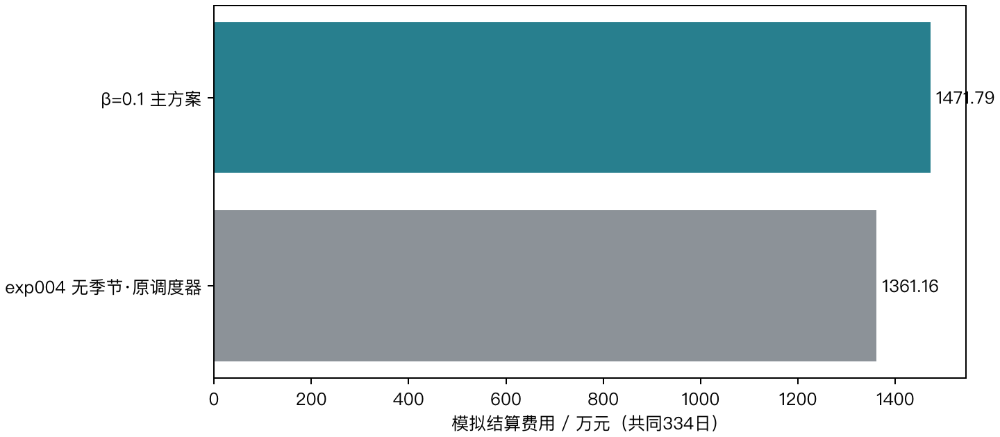

## 1. 结论与成绩

两组均已完成2025-02-01至12-31的334日回放。

本次按用户决定移除整数开关，在第二层加入归一化周转惩罚。主方案β=0.1，敏感性对照β=0.01；原实验源码未修改。β在回放前固定，不按全年账单回选。

主方案已完成334日的模拟结算总费为14,717,882.1655元，计划费12,125,606.9831元、紧急费2,592,275.1824元、调整费0元。exp004同日期为13,611,587.8329元，差额+1,106,294.3326元（+8.13%）。exp004使用不同控制器和爬坡协议，费用差为描述性对照，不能单独归因于周转惩罚。

主方案48,096个实际模拟执行区间中，超过1e−6 kWh的重叠有0段；第二层全部规划节点中有0个重叠节点。连续LP没有互斥的数学保证，以下依据原始输出逐项检验。

分项看，相比exp004，主方案普通计划费变化-604,234.3834元，紧急购电费变化+1,710,528.7159元。该分解解释账单差额，不构成对某一模型设计的因果归因。

period（原值可查对应CSV）

| label | beta | days | total_cost | planned_cost | emergency_cost | adjustment_cost | emergency_kwh | total_wan | overlap_intervals | max_overlap_kwh | throughput_kwh | tv_kw |
| --- | --- | --- | --- | --- | --- | --- | --- | --- | --- | --- | --- | --- |
| exp004 无季节·原调度器 | — | 334 | 13,611,587.832914 | 12,729,841.366489 | 881,746.466425 | 0 | 160,912.165421 | 1,361.158783 | — | — | — | — |
| β=0.01敏感性对照 | 0.01 | 334 | 14,740,993.873913 | 12,142,430.663598 | 2,598,563.210314 | 0 | 700,763.434848 | 1,474.099387 | 0 | 1.28679e-11 | 11,622,043.989632 | 12,681,513.558849 |
| β=0.1 主方案 | 0.1 | 334 | 14,717,882.165476 | 12,125,606.983119 | 2,592,275.182357 | 0 | 698,388.269991 | 1,471.788217 | 0 | 7.67386e-12 | 11,513,308.870902 | 12,692,001.82797 |
