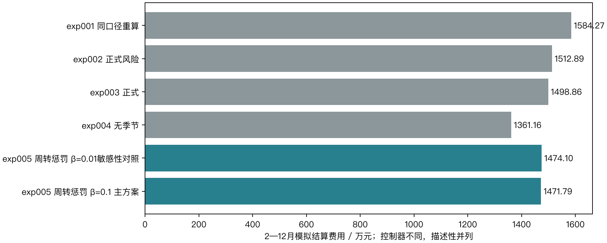
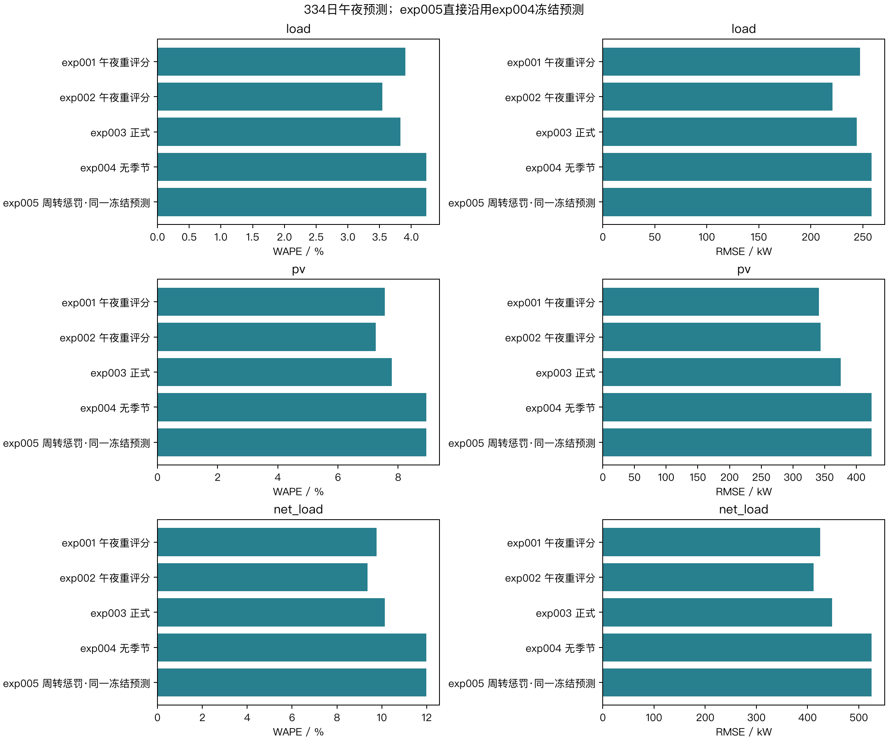
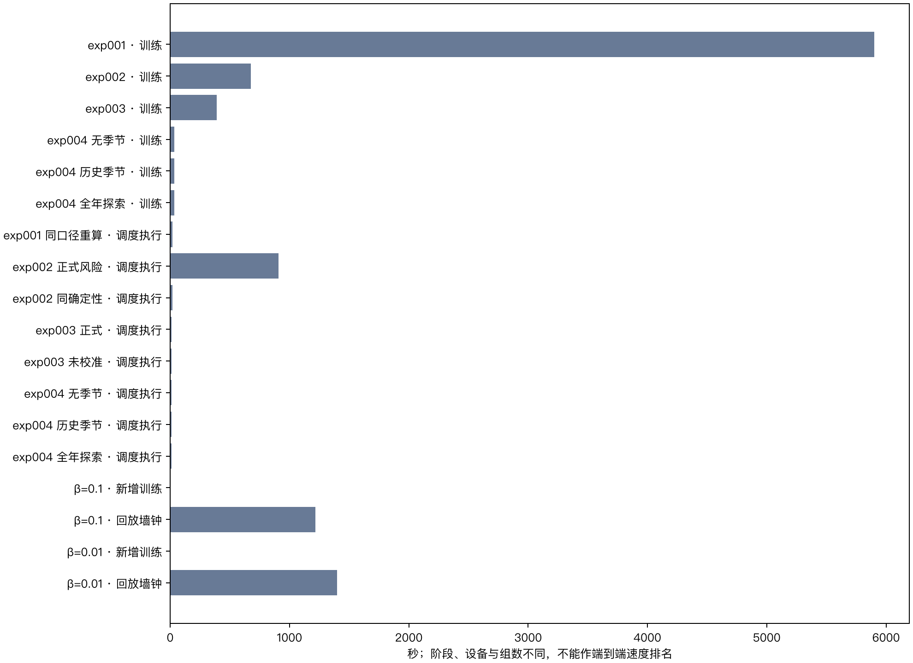

## 7. 历次指标和技术路线对比

exp001—exp004原登记或重算成绩保留，标明评价期和可比性。exp004主要改变预测，执行器为确定性午夜MILP与日内贪心；本轮沿用它的同一冻结预测，改为有硬爬坡、信息树、两层LP与周转惩罚的逐段滚动策略。费用差是这些设计共同作用的结果，不能据此单独识别场景收益。

β=0.1与β=0.01只在共同完成日期上比较费用、净功率总变差和周转量。严格互斥旧版本的55日进度与旧LP失败证据独立归档，不混入本轮账单，也不将55日总额与334日总额排名。

本轮没有新增预测模型。对冻结334日预测重算MAE、RMSE与WAPE，核对与exp004无季节组一致；光伏另列实际发电时段，分月数据与全时段指标分开。历史耗时保留设备、阶段、组数和统计范围，不把不同口径的时长作端到端速度排名。

共同334日内，β=0.1相比β=0.01费用变化-23,111.7084元（-0.1568%），充放电周转量变化-108,735.1187 kWh，净功率总变差变化+10,488.2691 kW。两组实际重叠分别为0段与0段。这是各自状态连续演化后的全年策略比较；更高权重不保证实际全年每项指标单调改善。

本轮获批的完整回放仅含上述两个β。推导稿14.3建议的“点预测两层LP”及控制器分离对照尚未在本轮周转惩罚设置下完成；旧版点预测严格互斥进度保留，不能替代这一消融。因此本报告不宣称已经识别随机场景带来的独立收益。

paired_beta（原值可查对应CSV）

| label | beta | days | last_date | total_cost | planned_cost | emergency_cost | throughput_kwh | tv_kw | overlap_intervals |
| --- | --- | --- | --- | --- | --- | --- | --- | --- | --- |
| β=0.01敏感性对照 | 0.01 | 334 | 2025-12-31 | 14,740,993.873913 | 12,142,430.663598 | 2,598,563.210314 | 11,622,043.989632 | 12,681,513.558849 | 0 |
| β=0.1 主方案 | 0.1 | 334 | 2025-12-31 | 14,717,882.165476 | 12,125,606.983119 | 2,592,275.182357 | 11,513,308.870902 | 12,692,001.82797 | 0 |

history（原值可查对应CSV）

| label | total_cost | planned_cost | emergency_cost | status | period |
| --- | --- | --- | --- | --- | --- |
| exp001 同口径重算 | 15,842,654.190685 | 11,613,278.032119 | 4,229,376.158567 | 同物理口径 | 2025-02-01—12-31（334天） |
| exp002 正式风险 | 15,128,897.45271 | 11,755,724.512758 | 3,373,172.939952 | 同物理口径 | 2025-02-01—12-31（334天） |
| exp002 同确定性 | 15,352,302.279914 | 11,677,852.861074 | 3,674,449.41884 | 同物理口径 | 2025-02-01—12-31（334天） |
| exp003 正式 | 14,988,622.648177 | 11,804,823.080144 | 3,183,799.568033 | 同物理口径 | 2025-02-01—12-31（334天） |
| exp003 未校准 | 15,258,030.091191 | 11,686,193.333266 | 3,571,836.757925 | 同物理口径 | 2025-02-01—12-31（334天） |
| exp004 无季节 | 13,611,587.832914 | 12,729,841.366489 | 881,746.466425 | 同物理口径 | 2025-02-01—12-31（334天） |
| exp004 历史季节 | 13,626,145.405991 | 12,727,957.70501 | 898,187.700981 | 同物理口径 | 2025-02-01—12-31（334天） |
| exp004 全年探索 | 13,572,926.478582 | 12,774,482.588253 | 798,443.890329 | 含未来信息，仅探索 | 2025-02-01—12-31（334天） |
| exp001 原登记（不可比） | 16,258,308.217355 | 12,025,380.561355 | 4,232,927.656 | 原协议不可直接比较 | 2025-02-01—12-31（334天） |
| exp005 周转惩罚 β=0.01敏感性对照 | 14,740,993.873913 | 12,142,430.663598 | 2,598,563.210314 | 新增硬爬坡、场景、两层滚动及周转惩罚，费用描述性并列 | 2025-02-01—2025-12-31（334天） |
| exp005 周转惩罚 β=0.1 主方案 | 14,717,882.165476 | 12,125,606.983119 | 2,592,275.182357 | 新增硬爬坡、场景、两层滚动及周转惩罚，费用描述性并列 | 2025-02-01—2025-12-31（334天） |
| exp005 严格互斥·已暂停 | 2,390,053.77666 | 2,002,817.07628 | 387,236.70038 | 原零差距MILP；55日，不能与334日总额排名 | 2025-02-01—2025-03-27（55天） |

forecast_history（原值可查对应CSV）

| predictor_id | scenario | issue_hour | month | period | target | population | unit | n | absolute_error_sum | squared_error_sum | signed_error_sum | actual_abs_sum | mae | rmse | wape_pct | bias | label | experiment | source | seed | exploratory | name | case_id | alpha_load | alpha_pv | period_label |
| --- | --- | --- | --- | --- | --- | --- | --- | --- | --- | --- | --- | --- | --- | --- | --- | --- | --- | --- | --- | --- | --- | --- | --- | --- | --- | --- |
| exp001_selected | 2 | 0 | 0 | annual | load | all | kW | 48096 | 8,669,526.319059 | 2,945,028,750.618527 | -519,810.249953 | 222,048,476.9355 | 180.254622 | 247.451614 | 3.904339 | -10.807765 | exp001 午夜重评分 | exp001 | data/results/exp003/baseline/forecast_annual.csv | 42 | False | — | — | — | — | 2025-02-01—12-31，334日全部十分钟 |
| exp001_selected | 2 | 0 | 0 | annual | pv | all | kW | 48096 | 8,638,221.941362 | 5,601,253,511.279113 | 652,012.464421 | 114,413,339.9657 | 179.60375 | 341.26216 | 7.550013 | 13.55648 | exp001 午夜重评分 | exp001 | data/results/exp003/baseline/forecast_annual.csv | 42 | False | — | — | — | — | 2025-02-01—12-31，334日全部十分钟 |
| exp001_selected | 2 | 0 | 0 | annual | net_load | all | kW | 48096 | 14,100,565.995139 | 8,684,998,062.593105 | -1,171,822.714375 | 144,333,055.9642 | 293.175441 | 424.94271 | 9.769464 | -24.364245 | exp001 午夜重评分 | exp001 | data/results/exp003/baseline/forecast_annual.csv | 42 | False | — | — | — | — | 2025-02-01—12-31，334日全部十分钟 |
| exp002_seed_42 | 2 | 0 | 0 | annual | load | all | kW | 48096 | 7,870,928.698316 | 2,344,379,286.202595 | -387,159.65132 | 222,048,476.9355 | 163.65038 | 220.779862 | 3.544689 | -8.049727 | exp002 午夜重评分 | exp002 | data/results/exp003/baseline/forecast_annual.csv | 42 | False | — | — | — | — | 2025-02-01—12-31，334日全部十分钟 |
| exp002_seed_42 | 2 | 0 | 0 | annual | pv | all | kW | 48096 | 8,297,438.038426 | 5,674,846,520.367779 | 364,862.108077 | 114,413,339.9657 | 172.518256 | 343.496709 | 7.25216 | 7.586122 | exp002 午夜重评分 | exp002 | data/results/exp003/baseline/forecast_annual.csv | 42 | False | — | — | — | — | 2025-02-01—12-31，334日全部十分钟 |
| exp002_seed_42 | 2 | 0 | 0 | annual | net_load | all | kW | 48096 | 13,515,796.576568 | 8,164,568,388.897764 | -752,021.759398 | 144,333,055.9642 | 281.017061 | 412.014154 | 9.364311 | -15.635848 | exp002 午夜重评分 | exp002 | data/results/exp003/baseline/forecast_annual.csv | 42 | False | — | — | — | — | 2025-02-01—12-31，334日全部十分钟 |
| primary_seed_42 | 2 | 0 | 0 | annual | load | all | kW | 48096 | 8,503,166.98488 | 2,870,174,500.618159 | 93,761.671556 | 222,048,476.9355 | 176.795721 | 244.286615 | 3.829419 | 1.949469 | exp003 正式 | exp003 | data/results/exp003/forecast_annual.csv | 42 | False | primary | primary_seed_42 | 0 | 0 | 2025-02-01—12-31，334日全部十分钟 |
| primary_seed_42 | 2 | 0 | 0 | annual | pv | all | kW | 48096 | 8,914,424.861082 | 6,769,809,671.473829 | 36,601.922533 | 114,413,339.9657 | 185.346492 | 375.174878 | 7.791421 | 0.761018 | exp003 正式 | exp003 | data/results/exp003/forecast_annual.csv | 42 | False | primary | primary_seed_42 | 0 | 0 | 2025-02-01—12-31，334日全部十分钟 |
| primary_seed_42 | 2 | 0 | 0 | annual | net_load | all | kW | 48096 | 14,612,966.872371 | 9,662,178,233.786337 | 57,159.749022 | 144,333,055.9642 | 303.829152 | 448.211549 | 10.124477 | 1.188451 | exp003 正式 | exp003 | data/results/exp003/forecast_annual.csv | 42 | False | primary | primary_seed_42 | 0 | 0 | 2025-02-01—12-31，334日全部十分钟 |
| uncalibrated_seed_42 | 2 | 0 | 0 | annual | load | all | kW | 48096 | 7,619,926.628484 | 2,171,603,630.476665 | -271,140.614952 | 222,048,476.9355 | 158.431608 | 212.488681 | 3.43165 | -5.637488 | exp003 未校准 | exp003 | data/results/exp003/forecast_annual.csv | 42 | False | uncalibrated | uncalibrated_seed_42 | 1 | 1 | 2025-02-01—12-31，334日全部十分钟 |
| uncalibrated_seed_42 | 2 | 0 | 0 | annual | pv | all | kW | 48096 | 8,204,928.249599 | 5,543,508,857.12518 | 479,656.490302 | 114,413,339.9657 | 170.594816 | 339.498526 | 7.171304 | 9.972898 | exp003 未校准 | exp003 | data/results/exp003/forecast_annual.csv | 42 | False | uncalibrated | uncalibrated_seed_42 | 1 | 1 | 2025-02-01—12-31，334日全部十分钟 |
| uncalibrated_seed_42 | 2 | 0 | 0 | annual | net_load | all | kW | 48096 | 13,245,859.215323 | 7,873,159,878.755345 | -750,797.105254 | 144,333,055.9642 | 275.404591 | 404.594576 | 9.177287 | -15.610386 | exp003 未校准 | exp003 | data/results/exp003/forecast_annual.csv | 42 | False | uncalibrated | uncalibrated_seed_42 | 1 | 1 | 2025-02-01—12-31，334日全部十分钟 |
| — | 2 | 0 | 0 | annual | load | all | kW | 48096 | 9,400,726.962633 | 3,209,204,298.777941 | 4,865,529.367615 | 222,048,476.9355 | 195.457563 | 258.311775 | 4.233637 | 101.162869 | exp004 无季节 | exp004 | data/results/exp004/forecast_annual.csv | 42 | False | no_season | no_season_seed_42 | — | — | 2025-02-01—12-31，334日全部十分钟 |
| — | 2 | 0 | 0 | annual | pv | all | kW | 48096 | 10,216,542.02426 | 8,646,471,185.873417 | -6,521,622.830911 | 114,413,339.9657 | 212.419786 | 423.999134 | 8.929502 | -135.59595 | exp004 无季节 | exp004 | data/results/exp004/forecast_annual.csv | 42 | False | no_season | no_season_seed_42 | — | — | 2025-02-01—12-31，334日全部十分钟 |
| — | 2 | 0 | 0 | annual | net_load | all | kW | 48096 | 17,281,430.164439 | 13,248,292,996.045303 | 11,387,152.198526 | 144,333,055.9642 | 359.311173 | 524.838255 | 11.9733 | 236.75882 | exp004 无季节 | exp004 | data/results/exp004/forecast_annual.csv | 42 | False | no_season | no_season_seed_42 | — | — | 2025-02-01—12-31，334日全部十分钟 |
| — | 2 | 0 | 0 | annual | load | all | kW | 48096 | 9,563,633.669258 | 3,242,702,837.456779 | 5,047,042.427846 | 222,048,476.9355 | 198.844679 | 259.656439 | 4.307003 | 104.936844 | exp004 历史季节 | exp004 | data/results/exp004/forecast_annual.csv | 42 | False | causal_season | causal_season_seed_42 | — | — | 2025-02-01—12-31，334日全部十分钟 |
| — | 2 | 0 | 0 | annual | pv | all | kW | 48096 | 10,179,211.751146 | 8,629,944,264.828342 | -6,439,035.887208 | 114,413,339.9657 | 211.643624 | 423.593723 | 8.896875 | -133.878823 | exp004 历史季节 | exp004 | data/results/exp004/forecast_annual.csv | 42 | False | causal_season | causal_season_seed_42 | — | — | 2025-02-01—12-31，334日全部十分钟 |
| — | 2 | 0 | 0 | annual | net_load | all | kW | 48096 | 17,309,723.116705 | 13,209,535,646.27544 | 11,486,078.315054 | 144,333,055.9642 | 359.899433 | 524.069996 | 11.992903 | 238.815667 | exp004 历史季节 | exp004 | data/results/exp004/forecast_annual.csv | 42 | False | causal_season | causal_season_seed_42 | — | — | 2025-02-01—12-31，334日全部十分钟 |
| — | 2 | 0 | 0 | annual | load | all | kW | 48096 | 9,703,457.08991 | 3,226,701,787.772354 | 5,602,943.387534 | 222,048,476.9355 | 201.751852 | 259.015012 | 4.369972 | 116.494997 | exp004 全年探索 | exp004 | data/results/exp004/forecast_annual.csv | 42 | True | oracle_season | oracle_season_seed_42 | — | — | 2025-02-01—12-31，334日全部十分钟 |
| — | 2 | 0 | 0 | annual | pv | all | kW | 48096 | 10,129,362.797872 | 8,633,194,586.00444 | -6,469,334.86158 | 114,413,339.9657 | 210.607177 | 423.673485 | 8.853306 | -134.508792 | exp004 全年探索 | exp004 | data/results/exp004/forecast_annual.csv | 42 | True | oracle_season | oracle_season_seed_42 | — | — | 2025-02-01—12-31，334日全部十分钟 |
| — | 2 | 0 | 0 | annual | net_load | all | kW | 48096 | 17,461,192.08309 | 13,363,439,796.839016 | 12,072,278.249114 | 144,333,055.9642 | 363.048738 | 527.114122 | 12.097847 | 251.003789 | exp004 全年探索 | exp004 | data/results/exp004/forecast_annual.csv | 42 | True | oracle_season | oracle_season_seed_42 | — | — | 2025-02-01—12-31，334日全部十分钟 |
| — | 2 | 0 | 0 | annual | load | all | kW | 48096 | 9,400,726.962633 | 3,209,204,298.777941 | 4,865,529.367615 | 222,048,476.9355 | 195.457563 | 258.311775 | 4.233637 | 101.162869 | exp005 周转惩罚·同一冻结预测 | exp005 | data/results/exp004/forecast_annual.csv | 42 | False | no_season | no_season_seed_42 | — | — | 2025-02-01—12-31，334日全部十分钟 |
| — | 2 | 0 | 0 | annual | pv | all | kW | 48096 | 10,216,542.02426 | 8,646,471,185.873417 | -6,521,622.830911 | 114,413,339.9657 | 212.419786 | 423.999134 | 8.929502 | -135.59595 | exp005 周转惩罚·同一冻结预测 | exp005 | data/results/exp004/forecast_annual.csv | 42 | False | no_season | no_season_seed_42 | — | — | 2025-02-01—12-31，334日全部十分钟 |
| — | 2 | 0 | 0 | annual | net_load | all | kW | 48096 | 17,281,430.164439 | 13,248,292,996.045303 | 11,387,152.198526 | 144,333,055.9642 | 359.311173 | 524.838255 | 11.9733 | 236.75882 | exp005 周转惩罚·同一冻结预测 | exp005 | data/results/exp004/forecast_annual.csv | 42 | False | no_season | no_season_seed_42 | — | — | 2025-02-01—12-31，334日全部十分钟 |

timing_history（原值可查对应CSV）

| experiment | label | stage | seconds | groups | scope | source |
| --- | --- | --- | --- | --- | --- | --- |
| exp001 | exp001 | 训练 | 5,901.694831 | 165 | 历史训练任务累计；设备/目标数/样本数不同，仅描述 | data/results/exp001/training_metadata.json |
| exp001 | exp001 | 检查点预测 | — | 165 | 历史训练任务累计；设备/目标数/样本数不同，仅描述 | data/results/exp001/training_metadata.json |
| exp002 | exp002 | 训练 | 675.324328 | 33 | 历史训练任务累计；设备/目标数/样本数不同，仅描述 | data/results/exp002/training_metadata.json |
| exp002 | exp002 | 检查点预测 | 3.401796 | 33 | 历史训练任务累计；设备/目标数/样本数不同，仅描述 | data/results/exp002/training_metadata.json |
| exp003 | exp003 | 训练 | 390.405616 | 33 | 历史训练任务累计；设备/目标数/样本数不同，仅描述 | data/results/exp003/training_metadata.json |
| exp003 | exp003 | 检查点预测 | 1.411148 | 33 | 历史训练任务累计；设备/目标数/样本数不同，仅描述 | data/results/exp003/training_metadata.json |
| exp004 | exp004 无季节 | 训练 | 35.342221 | 33 | CPU两线程，33组累计；特征准备另计，不是端到端耗时 | data/results/exp004/training_metadata.json |
| exp004 | exp004 无季节 | 检查点预测 | 0.223547 | 33 | CPU两线程，33组累计；特征准备另计，不是端到端耗时 | data/results/exp004/training_metadata.json |
| exp004 | exp004 历史季节 | 训练 | 34.71298 | 33 | CPU两线程，33组累计；特征准备另计，不是端到端耗时 | data/results/exp004/training_metadata.json |
| exp004 | exp004 历史季节 | 检查点预测 | 0.225881 | 33 | CPU两线程，33组累计；特征准备另计，不是端到端耗时 | data/results/exp004/training_metadata.json |
| exp004 | exp004 全年探索 | 训练 | 36.025077 | 33 | CPU两线程，33组累计；特征准备另计，不是端到端耗时 | data/results/exp004/training_metadata.json |
| exp004 | exp004 全年探索 | 检查点预测 | 0.223039 | 33 | CPU两线程，33组累计；特征准备另计，不是端到端耗时 | data/results/exp004/training_metadata.json |
| exp001 | exp001 同口径重算 | 调度执行 | 19.068357 | 334 | 主种子334日组装求解执行累计，非并行墙钟 | data/results/exp003/baseline/exp002_q2_costs.csv |
| exp002 | exp002 正式风险 | 调度执行 | 907.740153 | 334 | 主种子334日组装求解执行累计，非并行墙钟 | data/results/exp003/baseline/exp002_q2_costs.csv |
| exp002 | exp002 同确定性 | 调度执行 | 17.698893 | 334 | 主种子334日组装求解执行累计，非并行墙钟 | data/results/exp003/baseline/exp002_q2_costs.csv |
| exp003 | exp003 正式 | 调度执行 | 12.398277 | 334 | 主种子334日组装求解执行累计，非并行墙钟 | data/results/exp003/dispatch_metrics.csv |
| exp003 | exp003 未校准 | 调度执行 | 12.668887 | 334 | 主种子334日组装求解执行累计，非并行墙钟 | data/results/exp003/dispatch_metrics.csv |
| exp004 | exp004 无季节 | 调度执行 | 11.677328 | 334 | 主种子334日组装求解执行累计，非并行墙钟 | data/results/exp004/dispatch_metrics.csv |
| exp004 | exp004 历史季节 | 调度执行 | 12.273091 | 334 | 主种子334日组装求解执行累计，非并行墙钟 | data/results/exp004/dispatch_metrics.csv |
| exp004 | exp004 全年探索 | 调度执行 | 12.331863 | 334 | 主种子334日组装求解执行累计，非并行墙钟 | data/results/exp004/dispatch_metrics.csv |
| exp002 | exp002 | 费用校准 | 197.380283 | — | 历史阶段记录；exp002含四问。缺失不填零 | data/results/exp002/stage_timings.json |
| exp003 | exp003 | 费用校准 | — | — | 历史阶段记录；exp002含四问。缺失不填零 | data/results/exp003/stage_timings.json |
| exp004 | exp004 | 费用校准 | — | 0 | 不适用：未实施费用回选 | experiments/problem2/exp004/protocol.json |
| exp005 | β=0.1 | 新增训练 | 0 | 334 | 334日；两组顺序运行，未重训。求解时间与回放时间有包含关系，不相加。 | data/results/exp005/soft-penalty-beta-0.1/status.json |
| exp005 | β=0.1 | 回放墙钟 | 1,217.521125 | 334 | 334日；两组顺序运行，未重训。求解时间与回放时间有包含关系，不相加。 | data/results/exp005/soft-penalty-beta-0.1/status.json |
| exp005 | β=0.1 | 求解器累计 | 959.652549 | 334 | 334日；两组顺序运行，未重训。求解时间与回放时间有包含关系，不相加。 | data/results/exp005/soft-penalty-beta-0.1/status.json |
| exp005 | β=0.01 | 新增训练 | 0 | 334 | 334日；两组顺序运行，未重训。求解时间与回放时间有包含关系，不相加。 | data/results/exp005/soft-penalty-beta-0.01/status.json |
| exp005 | β=0.01 | 回放墙钟 | 1,400.27009 | 334 | 334日；两组顺序运行，未重训。求解时间与回放时间有包含关系，不相加。 | data/results/exp005/soft-penalty-beta-0.01/status.json |
| exp005 | β=0.01 | 求解器累计 | 1,131.944671 | 334 | 334日；两组顺序运行，未重训。求解时间与回放时间有包含关系，不相加。 | data/results/exp005/soft-penalty-beta-0.01/status.json |

technical_comparison（原值可查对应CSV）

| scheme | forecast | midnight | execution | ramp | overlap |
| --- | --- | --- | --- | --- | --- |
| exp004 无季节 | 同一冻结午夜预测 | 确定性午夜MILP | 日内贪心反馈 | 未采用本轮硬爬坡协议 | 原控制器充放电逻辑 |
| exp005 严格互斥旧版 | 同一冻结午夜预测 | 场景信息树、两层MILP | 逐十分钟滚动MILP | 含跨日1000 kW硬爬坡 | 0/1互斥；已暂停55日 |
| exp005 周转惩罚 | 同一冻结午夜预测 | 场景信息树、两层LP | 逐十分钟滚动LP | 含跨日1000 kW硬爬坡 | 第二层β(c+d)归一化惩罚；事后诊断 |
