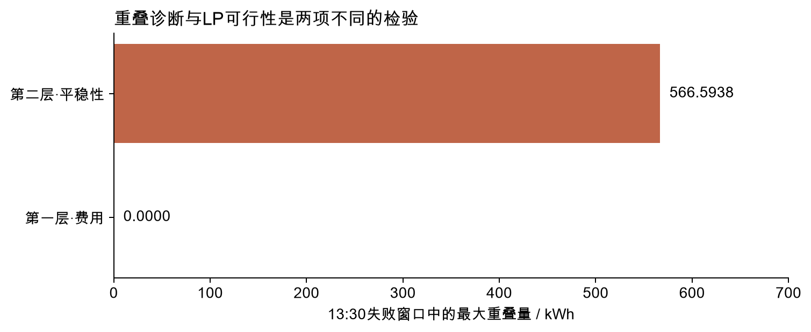
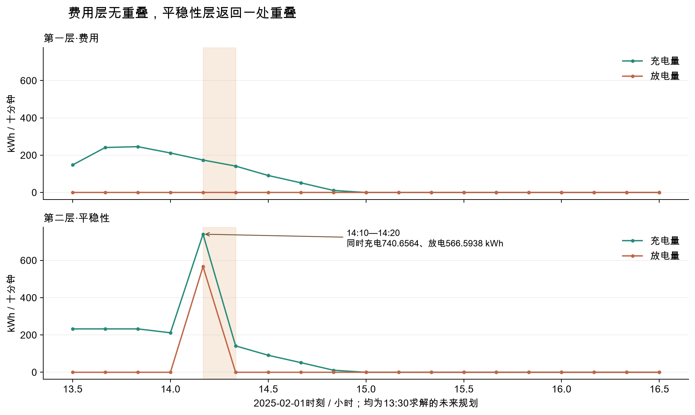
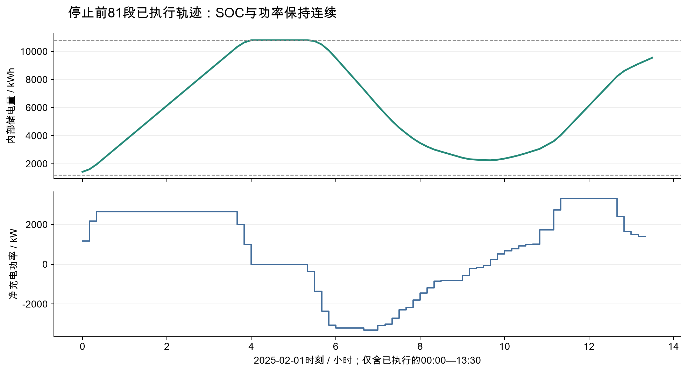

# exp005：问题二连续LP的D4-A失败证据

沿用八节实验报告模板；原模型β=0，正式评价停止。

## 1. 结论与成绩

本轮交付为D4-A失败证据报告。原模型保持不变，β=0；用户在看到失败后明确要求仅整理证据。正式334日评价没有完成，不生成result2.xlsx，不报告全年费用或节约率。

2025年2月1日13:30的滚动求解，在未来14:10—14:20节点返回同时充电 **740.6564 kWh**、放电 **566.5938 kWh**。该窗口第一层无重叠，第二层有一处重叠。当次当前节点没有重叠，停止前81段实际执行也没有重叠。发现后在执行13:30—13:40动作之前停止认证。

## 2. 题目指标及信息边界

购电、充电、放电、未利用量的单位均为kWh，功率输入乘1/6小时转换。单向效率均为√0.9，SOC范围1200—10800 kWh，单向充放电上限5000 kW，净功率相邻变化上限1000 kW。

午夜第一层最小化计划费加信息树预期紧急费，第二层在第一层最优费用的1.001倍加0.0001元以内最小化预期净功率总变差。日内固定普通计划，仅最小化剩余预期紧急费，再优化平稳性；只执行当前动作。D5-A允许紧急电服务充电。

重叠量定义为min(充电量,放电量)，超过0.000001 kWh触发D4-A。重叠不是本连续LP的一条约束，所以“LP最优且残差很小”和“轨迹不能作为单向电池动作”可以同时成立。当前段供需采用区间内计量反馈的十分钟平均近似，不能解读为区间开始前已知未来平均值。

## 3. 数据与时间验证

使用附件1固定电价、附件2负载和光伏实际值、exp004/no_season_seed_42冻结预测。没有重训或读取附件3、4。预测分支提交为b42168d5271097762953f38d472d0ef5fe1a908d；预测档案SHA-256与其清单核对一致。

预测档案从2月1日开始，因此首日没有已完成的历史预测误差供体，信息树明确退化为单条点预测路径。本次失败发生在引入多个历史场景之前，不能归因于16条路径抽样或树分辨率。

共同一月预热提供2月1日初始SOC1421.7991105135516 kWh、前一段净充电功率172.76 kW。真实回放中的当前供需与附件2逐项一致；未来实际值不进入午夜函数。每个原始输入和实现源文件的哈希记录在证据目录。

## 4. 逐步技术讲解

数据流：冻结午夜预测 → 历史实际减当时最终预测 → 整日联合误差路径 → 非负裁剪与历史日照掩码 → 前缀信息树 → 午夜两层LP → 固定购电计划的逐段两层滚动LP → 当前动作与实际账单。

树中每个节点有唯一父节点、一组代表负载/PV和一组共享动作。平衡式为g+v+d+e=ℓ+c+w；SOC递推为E后=E前+√0.9c−d/√0.9；净功率为P=6(c−d)。节点概率在同一时段加总为1，计划费只计算一次，紧急费和总变差乘节点概率。

每个父节点只允许按当前可见的标准化前缀继续二分；当前代表供需取组内均值，不把不同当前供需强塞进同一补救变量。日内当前根节点采用实际计量，未来仍用既有场景，权重不更新。费用和平稳性顺序求解，始终没有第三层、整数互斥或终端储能奖励。

## 5. 实验设置

用户确认的实现参数：最近最多56个完整历史日，最多16条路径，等权无放回抽样，随机种子42；06:00、12:00、18:00的当前反馈段按前缀二分，每个子组至少2条路径；日内不更新权重。午夜δ与执行δ均0.001，费用容差0.0001元，β=0。

求解器为SciPy/HiGHS连续LP，每层必须取得最优状态并检查残差。首日午夜求解一次，两层；随后执行了81个区间，并在第82次滚动求解时发现未来节点重叠。D4检查覆盖第二层返回的全部节点，不能只看当前动作。

没有实施曾询问的β=0.001检验，没有放松硬爬坡，没有净化充放电量。小树分支和未来扰动属于实现测试，不代表多日真实场景效果已被验证。

## 6. 结果及失败案例

13:30窗口的第一层剩余预期紧急费为0.0000元，总变差9626.2791 kW；第二层剩余预期紧急费为0.0001元，总变差8452.5048 kW。第二层费用预算为0.0001元。这里的费用和总变差均属于63段规划窗口，不是实际全天结算。

重叠节点开始SOC为10414.0458 kWh，结束SOC为10519.4518 kWh，净充电功率为1044.3755 kW。它满足供需平衡、SOC和硬爬坡，仍返回充放电重叠。该证据证明求解器返回的这条第二层松弛轨迹存在物理偏差；尚未证明重叠是所有第二层最优解必需的。

停止前实际执行范围为00:00—13:30，共81段。午夜已锁定的全天计划费为23813.6359元；已执行81段的实际紧急费为0.0001元。两者不可称作完整日费，因为余下63段实际紧急量尚未回放。3月20日、6月21日、9月23日、12月21日结果均未生成。

## 7. 历次指标和技术路线对比

exp004提供冻结预测并沿用旧执行器作预测实验；本轮接入同一预测，目标是检验推导稿的两层连续规划与滚动执行。首日信息树退化成点路径，便已触发D4-A。

本轮没有完整日费或正式评价期成绩，因此不与exp001—exp004的全年成绩计算改善率、不作排名。该停止也不能证明exp004预测变差，更不能据此判断场景模型的全年费用。原有实验记录和报告没有修改，本轮不进入完整实验成绩登记。

## 8. 复现说明

运行 `.venv/bin/python -m unittest discover -s tests -p test_q2_stochastic_lp.py -v` 检查11项模型测试。运行 `.venv/bin/python -m experiments.problem2.stochastic_lp.run --days 2 --out .work/exp005-reproduce` 可复现首日停止，输出目录必须不存在。

运行 `.venv/bin/python reports/build_report_exp005.py` 重建证据、静态图和正文；构建器在完全相同输入和原模型下复算失败窗口，保存两层数组并核对原结果，没有改变目标或约束。网页使用与既有报告相同的Data共享运行时，数据完整内嵌到离线HTML。

证据包包括失败记录、固定协议、午夜144段计划、停止前81段实际轨迹、13:30失败窗口的两层完整数组、CSV明细、独立审计、测试日志和源文件哈希。失败报告整理完成不等于购电策略通过认证。
