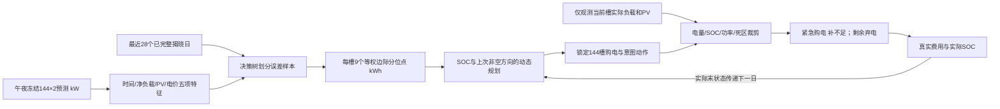

# exp006 技术说明：条件误差树与离散储能动态规划

## 1. 输入与信息流

每个自然日零点读取已冻结的 exp004 预测：未来144个10分钟区间、负载和PV两个通道，单位kW。正式组固定使用无季节预测、种子42；历史季节预测仅作接口兼容对照。实验不重训预测网络，不访问当天未来实际值来制定购电计划。

已实现的数据流为：冻结负载/PV预测 → 已完成日净负载误差 → 决策树条件分位数 → 每槽9点边际支持 → 离散SOC动态规划 → 锁定144槽日前购电 → 当槽观测后裁剪电池动作 → 实际费用结算。决策树仅估计条件误差分布；动态规划选择购电与电池动作。这里没有训练强化学习策略。

## 2. 决策树怎样提取可用的历史误差

对历史槽t，先把功率换为10分钟电量：净需求预测为 n̂_t=(L̂_t−P̂_t)/6，已揭晓净需求为 n_t=(L_t−P_t)/6，误差 r_t=n_t−n̂_t。正误差表示低估净需求。每个样本的五项特征依次为时刻正弦、时刻余弦、预测净需求、预测PV电量和固定电价。

每天重新用最多28个完整历史日拟合一棵回归树。树以平方误差下降选择特征及分割点，最大深度5、叶节点至少48个历史槽、随机状态42。树把具有相近预测条件的槽分到同一叶节点；不把叶节点平均数直接当风险支持。对该叶中的误差求 q_j=(j+0.5)/9（j=0,…,8）九个线性插值分位数，每个权重1/9。目标槽九个净需求支持为 x_tj=n̂_t+Q_leaf(q_j)。

首两天尚不足两个完整 exp004 发布日，用此前已完成日的周期预测误差回退：负载取昨日与上周同槽的平均，PV取昨日同槽，最初不足一周时负载用昨日。该回退明确记录为 periodic_baseline，不能称为 exp004 预测误差样本。之后只读取已经完整揭晓的冻结预测误差日。

九列是各槽的条件边际分位点，不是九条具有时间相关性的联合日路径。把九列解释成共同天气场景或多阶段场景树会高估模型能力。原讨论中联合历史路径的设想，在这条速度优先的替代路线中近似成逐槽边际支持。

## 3. 对一个电池动作，购电量有闭式解

设当前槽充电c≥0、放电d≥0，均为交流侧kWh，电价p>0，日前购电g≥0。在动作固定时，代理阶段购电费用为 p[g+5·(1/9)Σ_j max(x_tj+c−d−g,0)]。购电少1kWh可能触发5倍电价的补购，因而最优购电为 g*=max(0,Q_0.8(x_t·)+c−d)。实现使用离散经验分布的 inverted_cdf 分位数；它与支持点构造时的线性分位数承担不同角色。

例如支持净需求的80%分位数为600kWh、计划充电100kWh、无放电，则锁定购电700kWh；若计划放电100kWh，则锁定购电500kWh。这只是解释公式的算术例子，不是实验中的观测值。

## 4. 动态规划怎样选择一天的电池动作

电池容量12000kWh，允许SOC范围1200–10800kWh，单向效率η=√0.9，单槽最大交流侧充电或放电为5000/6kWh。一月1日从6000kWh按已有策略预热，归档一月末SOC1421.7991105135516kWh成为全部本轮方案2月1日的共同初始值，之后各组独立延续真实SOC。正式网格步长50kWh；另以25kWh做全年精度核查。网格额外插入当天真实初始SOC，绝不通过四舍五入或每日重置制造能量。

从当前SOC s到下一SOC s′，有 c=max(s′−s,0)/η、d=max(s−s′,0)η。一个SOC转移只能有一个方向，因此规划动作天然互斥。状态还保存最近一次非空方向m∈{−1,0,1}；空闲时保留m，充放反转时更新它。

逆向递推从第144槽回到第一槽：V_t(s,m)=min_s′{stage_t(s,s′)+λ_T(c+d)+λ_R·1[m·sign(s′−s)=−1]+V_(t+1)(s′,m′)}。其中stage是上一节的分位数购电代理费用，λ_T=0.002元/交流侧kWh、λ_R=0.05元/反转。这两项是操作强度的次要偏好，不计入题目总购电费用，也没有校准为电池真实寿命成本。

普通日的终值为−[min(p)/η]·(s−1200)，给下一日留电一个简单价值；评价最后一天的终值设为0。终值是规划代理的跨日近似，报告全年费用没有任何期末残值抵扣。

在给定SOC网格、边际支持和开环代理下，动态规划枚举所有可行转移并找出该离散代理的最优值。它不是原连续问题的全局最优证书，不给出连续最优间隙；25kWh与50kWh差异是离散敏感性，不能当数学误差上界。

## 5. 真实执行为什么可能偏离规划

日前购电g全日锁定，original=final，没有日内调整。执行第t槽时只使用本槽实际负载与PV，先算 B=g+(PV−load)/6。若B≥0，仅允许充电，充电量取意图充电、可用余电、功率限额、剩余容量四者最小值；其余为弃电。若B<0，仅允许放电，放电量取意图放电、实际缺口、功率限额、可用SOC四者最小值；剩余缺口由紧急购电补齐。小于2kWh的动作进入执行死区，置为0。

实际SOC递推 s_(t+1)=s_t+ηc_t−d_t/η，并连续传给下一天。不会用紧急购电主动充电；不会为执行意图动作而同时充放电。旧执行器本来也满足互斥，本实验不能将“从同时充放变为零”当作相对创新。

这层裁剪使实际电池动作依赖观测，可能与动态规划假设的动作不同。比如计划放电的槽实际出现余电，执行器会保持原意图充电为0而弃电，无法自动吸收全部余电；计划充电的槽出现缺口，也可能因为意图放电为0而补购。全年真实费用必须从执行档案重新结算，不能用代理目标代替。

## 6. 主目标、消融与操作强度

题目总费C=Σ_t p_t(g_t+5e_t)，e为实际执行后的紧急购电。计划费和紧急费分别求和；调整费为0。电池吞吐、切换、循环和死区属于辅助度量，费用优先，不因辅助指标更优而宣称整体优胜。

交流侧吞吐为Σ(c+d)。电芯侧等效满循环数为[ηΣc+Σd/η]/(2×12000)，仅为能量周转代理。方向反转把334日全部槽串联后去掉空闲方向，再计相邻非空符号变化；包含评价期跨日，不包含一月预热边界。功率总变差为Σ|6(c_t−d_t)−6(c_(t−1)−d_(t−1))|，同样不计预热边界。两者不是电池化学退化或寿命预测。

主要消融逐项去掉条件树、吞吐/切换惩罚及死区、跨日终值，或加强吞吐惩罚。旧执行·重新规划让规划器接收该执行器自己的真实末SOC，因此同时改变后续购电；固定购电·旧执行使用正式组整年原购电，不重新规划，才能控制购电计划单独观察执行影响。两组不能混为一个消融。

## 7. 核验与已知边界

正式评价2025年2月1日至12月31日334日，每组48096槽。每组按实际费用重算、功率平衡、SOC递推、容量边界、功率限额、购电锁定及互斥条件检查。树的训练日必须在零点前完整揭晓；未来实际扰动测试检查条件支持和初日计划不随未来观测改变。核验在正式运行后独立读取已保存数组。

同一预测输入下的 exp004 无季节是规划变化的主要基线；exp004 历史季节仍保留其当轮正式角色。exp001重算、exp002和exp003按同物理结算口径并列，exp001原登记另列；全年探索oracle使用未来信息，从正式排名及改善率排除。exp001/2最早的共享四目标早停限制不能由后来的重评分消除。

三种子是稳定性评估，不用于挑选主组或集成。正式组50kWh在全年运行之前已冻结；费用更低的消融或25kWh也只按原角色报告。单年、单场景观测不能证明跨年度泛化，静态效率和额定功率也不能替代温度、SOC老化及真实电池寿命数据。
