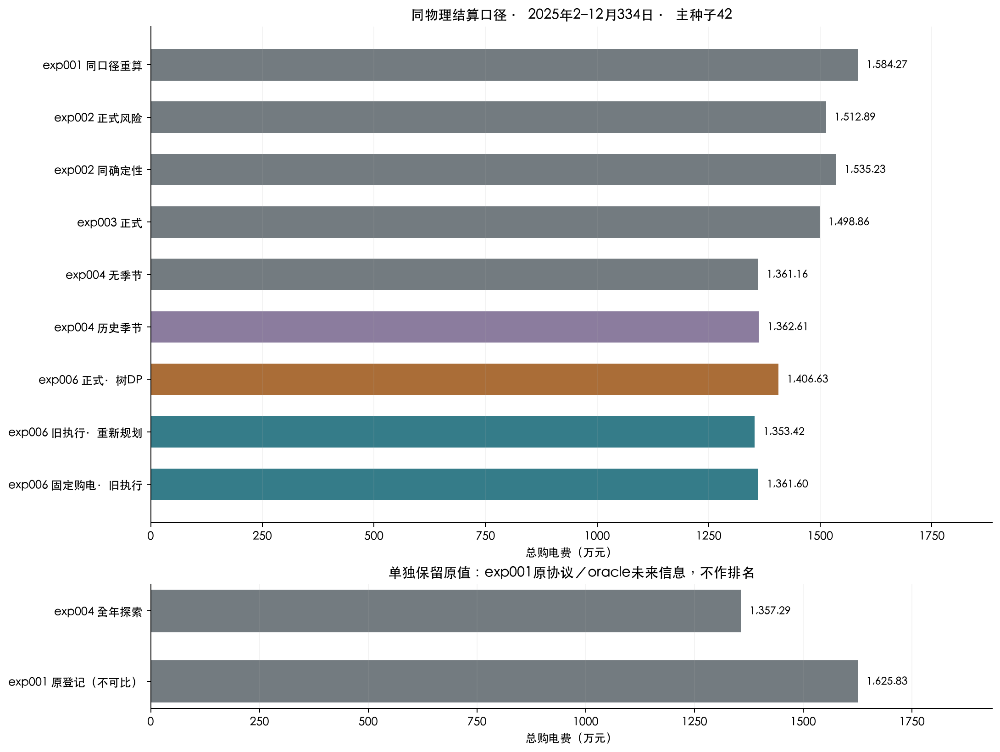
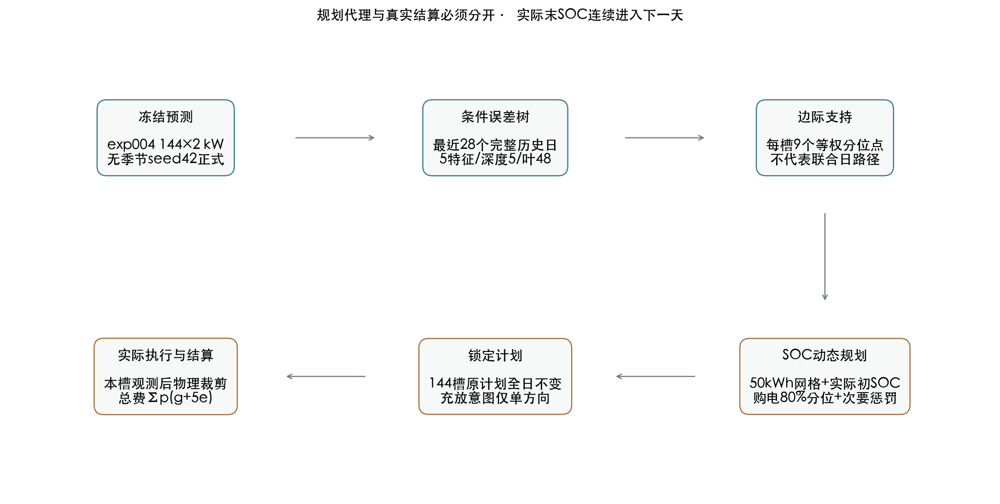
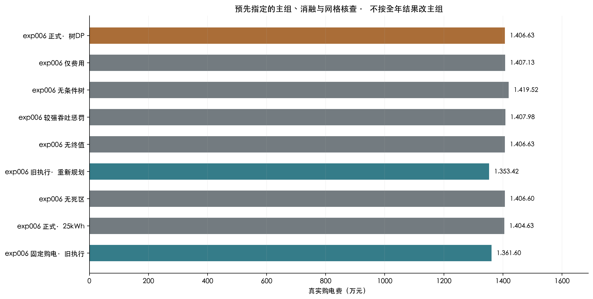
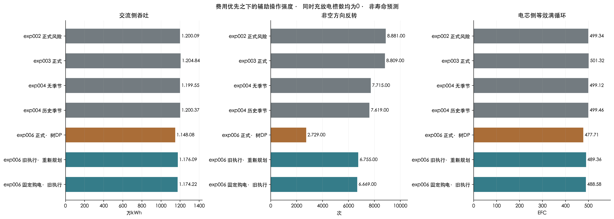
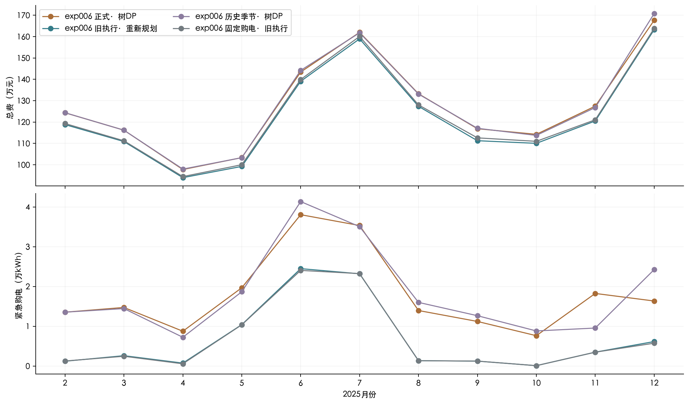
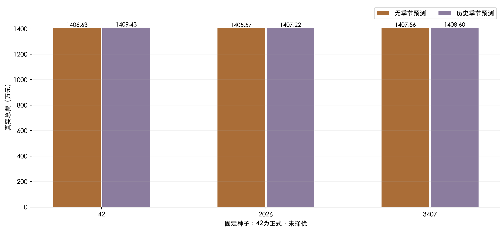
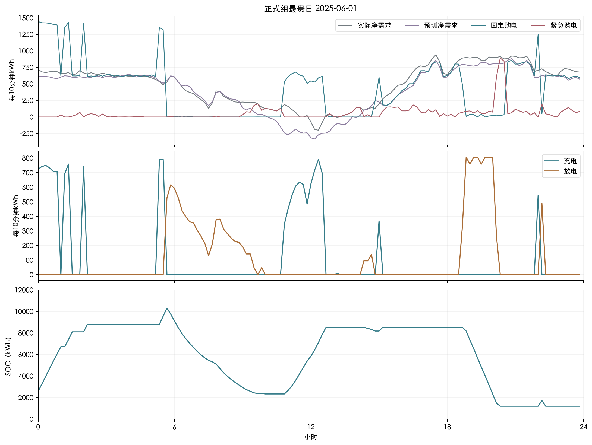
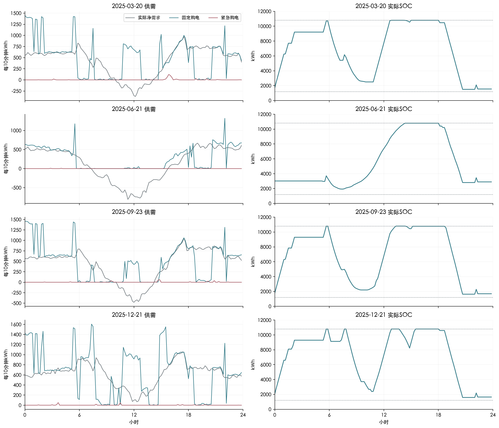
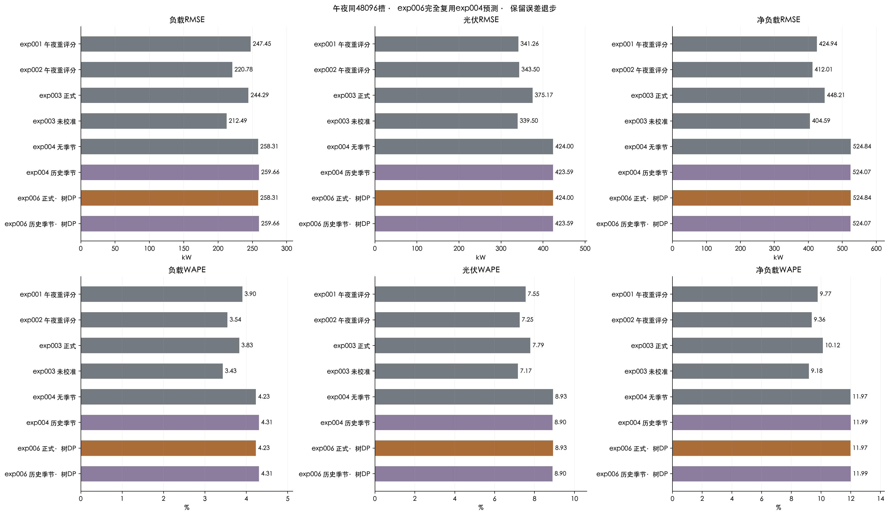
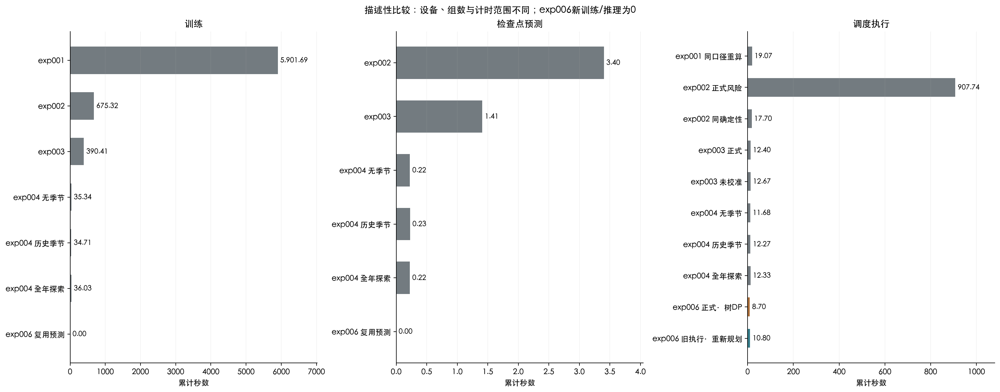

# exp006：树与动态规划降低电池周转，但总费用上升

## 1. 结论与成绩

### 主要结论

**费用上升，不能取代同预测基线作为最低费用方案。**

- 事先冻结的正式树DP组总费 **1406.63万元**，相对同预测的exp004无季节 **+45.47万元（+3.34%）**。相对exp004当轮正式历史季节组为 **+44.01万元**。
- 电池交流侧吞吐 **1148.08万kWh**，相对同预测基线 **-4.29%**；非空方向反转 **2,729次**，基线 **7,715次**。两者同时充放电槽数均为0。
- 正式单组条件准备、规划与执行合计 **8.70秒**；整批15项实验墙钟 **202.34秒**。预先定义的主组、种子及全部消融保留原角色，不按全年最低费用替换主组。

**费用优先时，本轮更值得保留的是已测的“旧执行·重新规划”对照。** 它的真实总费为 **1353.42万元**，比同预测基线少 **77,391.11元（0.569%）**；反转 **6,755次**，比基线少 **12.44%**。这是单种子已测对照，保留其消融角色，不把它事后改名为正式主组，也不据此宣称跨种子或跨年胜出。

主组相对同预测基线的费用分解为：计划费 **+485,950.08元**，紧急费 **-31,280.44元**，合计 **+454,669.64元**。费用上升来自计划费增加超过紧急费节省。

### 主结果与同预测基线 · 334日

| 方案 | 角色 | 计划费/元 | 上调费/元 | 下调费/元 | 紧急费/元 | 总费/元 | 紧急/kWh |
|---|---|---|---|---|---|---|---|
| exp004 无季节 | 同预测基线 | 12,729,841.3665 | 0.0000 | 0.0000 | 881,746.4664 | 13,611,587.8329 | 160,912.1654 |
| exp004 历史季节 | 当轮正式策略 | 12,727,957.7050 | 0.0000 | 0.0000 | 898,187.7010 | 13,626,145.4060 | 162,942.3891 |
| exp006 正式·树DP | 正式策略 | 13,215,791.4493 | 0.0000 | 0.0000 | 850,466.0280 | 14,066,257.4773 | 197,559.7826 |
| exp006 历史季节·树DP | 预测兼容对照 | 13,224,871.8942 | 0.0000 | 0.0000 | 869,418.0373 | 14,094,289.9315 | 201,661.7907 |
| exp006 旧执行·重新规划 | 消融 | 13,127,816.4567 | 0.0000 | 0.0000 | 406,380.2706 | 13,534,196.7273 | 74,976.2978 |
| exp006 固定购电·旧执行 | 执行控制对照 | 13,215,791.4493 | 0.0000 | 0.0000 | 400,176.2069 | 13,615,967.6562 | 73,848.9752 |



## 2. 题目指标及信息边界

本轮修改规划及电池执行，输入复用exp004冻结预测。每天零点一次发布144×2负载/PV功率预测（kW），10分钟电量=功率/6（kWh）。日前购电全天锁定，original=final。实际总费 **C=Σp(g+5e)**，其中g为全部原计划购电、e为实际缺口补购；无日内调整费、售电收入或年末残值抵扣。

预测只使用发布前信息；条件误差最多来自最近28个已完整揭晓日。零点只取已发布预测及已知电价，执行第t槽只读本槽实际值，不看未来实际。树的9列是边际支持，不是联合日场景。

电池总容量12000kWh，SOC范围1200–10800kWh、功率上限5000kW、单向效率√0.9。一月1日6000kWh预热后，2月1日共同初始SOC为1421.7991105135516kWh，来自已冻结一月预热；之后各组延续自己的实际末状态。

主目标仍是实际购电总费。0.002元/交流侧kWh吞吐与0.05元/反转仅为规划次要偏好，2kWh死区避免极小动作；它们未计入题目费用，也不是估算出的电池折旧成本。EFC与切换只能描述操作强度，缺少化学体系、温度及寿命数据，不能据此计算寿命延长。

## 3. 数据与时间验证

### 输入文件与校验值

| 文件 | SHA256 |
|---|---|
| 附件1.csv | 99bae60824c8e80b5b74b180b3f0b76f2649059c437f2a2878d0a7f93e8c598d |
| 附件2_小区负载.csv | a2e0e3e0e35a3551f67a747aeccd308fa745c8a8b6d20bba5d57f05dd9817c97 |
| 附件2_光伏发电实际功率.csv | 8889416ff7231b832487a0d1c8629f10cf321a1d7cc5453043b003f864397fce |

附件2按区间终点解释：00:10为当天第一段，0:00+1为当天24:00。正式范围2025-02-01至12-31，共334日、每组48096槽。负载和PV数组保持原始kW单位，无插值重采样；所有正式组共享同一预测档案版本与预热状态。exp004既有训练、早停与信息边界由其冻结核验记录继承，树更新只用此前完整实际日。

首两日不足两个完整冻结发布日时，条件误差来源明确回退到因果周期基线，属于样本来源回退，不是求解失败。状态与费用核验覆盖15组所有721440槽；未来扰动测试和独立核验结果在复现证据中保留。

## 4. 逐步技术讲解


### 1. 输入与信息流

每个自然日零点读取已冻结的 exp004 预测：未来144个10分钟区间、负载和PV两个通道，单位kW。正式组固定使用无季节预测、种子42；历史季节预测仅作接口兼容对照。实验不重训预测网络，不访问当天未来实际值来制定购电计划。

已实现的数据流为：冻结负载/PV预测 → 已完成日净负载误差 → 决策树条件分位数 → 每槽9点边际支持 → 离散SOC动态规划 → 锁定144槽日前购电 → 当槽观测后裁剪电池动作 → 实际费用结算。决策树仅估计条件误差分布；动态规划选择购电与电池动作。这里没有训练强化学习策略。


### 2. 决策树怎样提取可用的历史误差

对历史槽t，先把功率换为10分钟电量：净需求预测为 n̂_t=(L̂_t−P̂_t)/6，已揭晓净需求为 n_t=(L_t−P_t)/6，误差 r_t=n_t−n̂_t。正误差表示低估净需求。每个样本的五项特征依次为时刻正弦、时刻余弦、预测净需求、预测PV电量和固定电价。

每天重新用最多28个完整历史日拟合一棵回归树。树以平方误差下降选择特征及分割点，最大深度5、叶节点至少48个历史槽、随机状态42。树把具有相近预测条件的槽分到同一叶节点；不把叶节点平均数直接当风险支持。对该叶中的误差求 q_j=(j+0.5)/9（j=0,…,8）九个线性插值分位数，每个权重1/9。目标槽九个净需求支持为 x_tj=n̂_t+Q_leaf(q_j)。

首两天尚不足两个完整 exp004 发布日，用此前已完成日的周期预测误差回退：负载取昨日与上周同槽的平均，PV取昨日同槽，最初不足一周时负载用昨日。该回退明确记录为 periodic_baseline，不能称为 exp004 预测误差样本。之后只读取已经完整揭晓的冻结预测误差日。

九列是各槽的条件边际分位点，不是九条具有时间相关性的联合日路径。把九列解释成共同天气场景或多阶段场景树会高估模型能力。原讨论中联合历史路径的设想，在这条速度优先的替代路线中近似成逐槽边际支持。

### 3. 对一个电池动作，购电量有闭式解

设当前槽充电c≥0、放电d≥0，均为交流侧kWh，电价p>0，日前购电g≥0。在动作固定时，代理阶段购电费用为 p[g+5·(1/9)Σ_j max(x_tj+c−d−g,0)]。购电少1kWh可能触发5倍电价的补购，因而最优购电为 g*=max(0,Q_0.8(x_t·)+c−d)。实现使用离散经验分布的 inverted_cdf 分位数；它与支持点构造时的线性分位数承担不同角色。

例如支持净需求的80%分位数为600kWh、计划充电100kWh、无放电，则锁定购电700kWh；若计划放电100kWh，则锁定购电500kWh。这只是解释公式的算术例子，不是实验中的观测值。

### 4. 动态规划怎样选择一天的电池动作

电池容量12000kWh，允许SOC范围1200–10800kWh，单向效率η=√0.9，单槽最大交流侧充电或放电为5000/6kWh。一月1日从6000kWh按已有策略预热，归档一月末SOC1421.7991105135516kWh成为全部本轮方案2月1日的共同初始值，之后各组独立延续真实SOC。正式网格步长50kWh；另以25kWh做全年精度核查。网格额外插入当天真实初始SOC，绝不通过四舍五入或每日重置制造能量。

从当前SOC s到下一SOC s′，有 c=max(s′−s,0)/η、d=max(s−s′,0)η。一个SOC转移只能有一个方向，因此规划动作天然互斥。状态还保存最近一次非空方向m∈{−1,0,1}；空闲时保留m，充放反转时更新它。

逆向递推从第144槽回到第一槽：V_t(s,m)=min_s′{stage_t(s,s′)+λ_T(c+d)+λ_R·1[m·sign(s′−s)=−1]+V_(t+1)(s′,m′)}。其中stage是上一节的分位数购电代理费用，λ_T=0.002元/交流侧kWh、λ_R=0.05元/反转。这两项是操作强度的次要偏好，不计入题目总购电费用，也没有校准为电池真实寿命成本。

普通日的终值为−[min(p)/η]·(s−1200)，给下一日留电一个简单价值；评价最后一天的终值设为0。终值是规划代理的跨日近似，报告全年费用没有任何期末残值抵扣。

在给定SOC网格、边际支持和开环代理下，动态规划枚举所有可行转移并找出该离散代理的最优值。它不是原连续问题的全局最优证书，不给出连续最优间隙；25kWh与50kWh差异是离散敏感性，不能当数学误差上界。

### 5. 真实执行为什么可能偏离规划

日前购电g全日锁定，original=final，没有日内调整。执行第t槽时只使用本槽实际负载与PV，先算 B=g+(PV−load)/6。若B≥0，仅允许充电，充电量取意图充电、可用余电、功率限额、剩余容量四者最小值；其余为弃电。若B<0，仅允许放电，放电量取意图放电、实际缺口、功率限额、可用SOC四者最小值；剩余缺口由紧急购电补齐。小于2kWh的动作进入执行死区，置为0。

实际SOC递推 s_(t+1)=s_t+ηc_t−d_t/η，并连续传给下一天。不会用紧急购电主动充电；不会为执行意图动作而同时充放电。旧执行器本来也满足互斥，本实验不能将“从同时充放变为零”当作相对创新。

这层裁剪使实际电池动作依赖观测，可能与动态规划假设的动作不同。比如计划放电的槽实际出现余电，执行器会保持原意图充电为0而弃电，无法自动吸收全部余电；计划充电的槽出现缺口，也可能因为意图放电为0而补购。全年真实费用必须从执行档案重新结算，不能用代理目标代替。

### 6. 主目标、消融与操作强度

题目总费C=Σ_t p_t(g_t+5e_t)，e为实际执行后的紧急购电。计划费和紧急费分别求和；调整费为0。电池吞吐、切换、循环和死区属于辅助度量，费用优先，不因辅助指标更优而宣称整体优胜。

交流侧吞吐为Σ(c+d)。电芯侧等效满循环数为[ηΣc+Σd/η]/(2×12000)，仅为能量周转代理。方向反转把334日全部槽串联后去掉空闲方向，再计相邻非空符号变化；包含评价期跨日，不包含一月预热边界。功率总变差为Σ|6(c_t−d_t)−6(c_(t−1)−d_(t−1))|，同样不计预热边界。两者不是电池化学退化或寿命预测。

主要消融逐项去掉条件树、吞吐/切换惩罚及死区、跨日终值，或加强吞吐惩罚。旧执行·重新规划让规划器接收该执行器自己的真实末SOC，因此同时改变后续购电；固定购电·旧执行使用正式组整年原购电，不重新规划，才能控制购电计划单独观察执行影响。两组不能混为一个消融。

### 7. 核验与已知边界

正式评价2025年2月1日至12月31日334日，每组48096槽。每组按实际费用重算、功率平衡、SOC递推、容量边界、功率限额、购电锁定及互斥条件检查。树的训练日必须在零点前完整揭晓；未来实际扰动测试检查条件支持和初日计划不随未来观测改变。核验在正式运行后独立读取已保存数组。

同一预测输入下的 exp004 无季节是规划变化的主要基线；exp004 历史季节仍保留其当轮正式角色。exp001重算、exp002和exp003按同物理结算口径并列，exp001原登记另列；全年探索oracle使用未来信息，从正式排名及改善率排除。exp001/2最早的共享四目标早停限制不能由后来的重评分消除。

三种子是稳定性评估，不用于挑选主组或集成。正式组50kWh在全年运行之前已冻结；费用更低的消融或25kWh也只按原角色报告。单年、单场景观测不能证明跨年度泛化，静态效率和额定功率也不能替代温度、SOC老化及真实电池寿命数据。




## 5. 实验设置

### 冻结主组参数

| 参数 | 取值 |
|---|---|
| grid_kwh | 50 |
| throughput_yuan_per_ac_kwh | 0.002 |
| reversal_yuan | 0.05 |
| execution_deadband_kwh | 2 |
| terminal_soc_value_yuan_per_kwh | minimum fixed tariff / sqrt(0.9); zero on last evaluation day |
| eta_charge | sqrt(0.9) |
| eta_discharge | sqrt(0.9) |
| capacity_kwh | 12000 |
| soc_bounds_kwh | [1200, 10800] |
| max_power_kw | 5000 |
| tree_max_depth | 5 |
| tree_min_samples_leaf | 48 |
| tree_random_state | 42 |
| history_days | 28 |
| equal_probability_support_points | 9 |

### 全部正式、兼容、种子、消融与精度检查

| ID | 角色 | 预测 | 种子 | SOC网格/kWh | 条件分布 | 执行器 | 吞吐惩罚 | 反转惩罚 | 死区/kWh |
|---|---|---|---|---|---|---|---|---|---|
| primary | 正式策略 | no_season | 42.0000 | 50.0000 | tree | projected | 0.0020 | 0.0500 | 2.0000 |
| seed_2026 | 种子稳定性 | no_season | 2,026.0000 | 50.0000 | tree | projected | 0.0020 | 0.0500 | 2.0000 |
| seed_3407 | 种子稳定性 | no_season | 3,407.0000 | 50.0000 | tree | projected | 0.0020 | 0.0500 | 2.0000 |
| causal_42 | 预测兼容对照 | causal_season | 42.0000 | 50.0000 | tree | projected | 0.0020 | 0.0500 | 2.0000 |
| causal_2026 | 种子稳定性 | causal_season | 2,026.0000 | 50.0000 | tree | projected | 0.0020 | 0.0500 | 2.0000 |
| causal_3407 | 种子稳定性 | causal_season | 3,407.0000 | 50.0000 | tree | projected | 0.0020 | 0.0500 | 2.0000 |
| cost_only | 消融 | no_season | 42.0000 | 50.0000 | tree | projected | 0.0000 | 0.0000 | 0.0000 |
| no_tree | 消融 | no_season | 42.0000 | 50.0000 | per_slot | projected | 0.0020 | 0.0500 | 2.0000 |
| more_throughput_penalty | 消融 | no_season | 42.0000 | 50.0000 | tree | projected | 0.0100 | 0.0500 | 2.0000 |
| zero_terminal | 消融 | no_season | 42.0000 | 50.0000 | tree | projected | 0.0020 | 0.0500 | 2.0000 |
| greedy_execution | 消融 | no_season | 42.0000 | 50.0000 | tree | old_greedy | 0.0020 | 0.0500 | 2.0000 |
| no_deadband | 消融 | no_season | 42.0000 | 50.0000 | tree | projected | 0.0020 | 0.0500 | 0.0000 |
| primary_grid25 | 网格精度核查 | no_season | 42.0000 | 25.0000 | tree | projected | 0.0020 | 0.0500 | 2.0000 |
| causal_42_grid25 | 网格精度核查 | causal_season | 42.0000 | 25.0000 | tree | projected | 0.0020 | 0.0500 | 2.0000 |
| fixed_primary_greedy | 执行控制对照 | no_season | 42.0000 | 50.0000 | not_refit_archived_primary_purchases | old_greedy | 0.0020 | 0.0500 | 2.0000 |

总计15项：12项50kWh、2项25kWh全年精度检查、1项固定正式购电的旧执行回放。正式组及seed42在全年评价前冻结，2026和3407只检查稳定性，未取平均决策或择优。当前CPU单线程计算，Python 3.12.13、NumPy 2.0.2、scikit-learn 1.9.1。任务与原LP并行，因此实测计时也受共享机器竞争影响。

无需训练强化学习或调用LP。离散DP能给出网格代理的最优动作；原连续随机控制最优间隙没有证书，保留为未知。全部参数与运行角色见[冻结协议](evidence/protocol.json)。

## 6. 结果及失败案例

### 全部15项原始成绩 · 未按成绩重选主组

| 方案 | 角色 | 计划费/元 | 紧急费/元 | 总费/元 | 紧急/kWh | 期末SOC/kWh | 计算/s |
|---|---|---|---|---|---|---|---|
| exp006 正式·树DP | 正式策略 | 13,215,791.4493 | 850,466.0280 | 14,066,257.4773 | 197,559.7826 | 1,470.5929 | 8.6979 |
| exp006 树DP·种子2026 | 种子稳定性 | 13,210,305.3151 | 845,421.1100 | 14,055,726.4251 | 197,686.7370 | 1,542.5770 | 9.1205 |
| exp006 树DP·种子3407 | 种子稳定性 | 13,197,952.1187 | 877,653.1311 | 14,075,605.2498 | 202,731.9047 | 1,604.3169 | 9.1362 |
| exp006 历史季节·树DP | 预测兼容对照 | 13,224,871.8942 | 869,418.0373 | 14,094,289.9315 | 201,661.7907 | 1,531.2363 | 9.0890 |
| exp006 历史季节·2026 | 种子稳定性 | 13,228,793.6054 | 843,390.1508 | 14,072,183.7562 | 196,666.1488 | 1,646.8938 | 9.3885 |
| exp006 历史季节·3407 | 种子稳定性 | 13,207,545.3739 | 878,465.4526 | 14,086,010.8265 | 202,468.1254 | 1,721.6150 | 10.0494 |
| exp006 仅费用 | 消融 | 13,215,909.9956 | 855,407.0593 | 14,071,317.0549 | 198,364.8633 | 1,471.7901 | 9.4127 |
| exp006 无条件树 | 消融 | 13,314,119.3597 | 881,097.9401 | 14,195,217.2998 | 205,820.0096 | 1,407.7945 | 8.4284 |
| exp006 较强吞吐惩罚 | 消融 | 13,222,248.4259 | 857,579.4171 | 14,079,827.8430 | 199,516.2349 | 1,498.2408 | 9.7435 |
| exp006 无终值 | 消融 | 13,215,791.4493 | 850,466.0280 | 14,066,257.4773 | 197,559.7826 | 1,470.5929 | 10.5300 |
| exp006 旧执行·重新规划 | 消融 | 13,127,816.4567 | 406,380.2706 | 13,534,196.7273 | 74,976.2978 | 1,629.7771 | 10.7958 |
| exp006 无死区 | 消融 | 13,215,779.3812 | 850,175.4738 | 14,065,954.8549 | 197,498.7618 | 1,470.5929 | 11.2517 |
| exp006 正式·25kWh | 网格精度核查 | 13,185,249.0577 | 861,061.4862 | 14,046,310.5439 | 200,108.3620 | 1,470.5929 | 41.3152 |
| exp006 历史季节·25kWh | 网格精度核查 | 13,194,017.2914 | 880,913.0412 | 14,074,930.3326 | 204,507.5157 | 1,524.6675 | 40.9907 |
| exp006 固定购电·旧执行 | 执行控制对照 | 13,215,791.4493 | 400,176.2069 | 13,615,967.6562 | 73,848.9752 | 1,629.7771 | 0.0759 |

### 代理目标、实际费用及尾部风险

| 方案 | 每日代理目标之和/元 | 真实总费/元 | 最贵10%日均费/元 | 最贵日/元 | 连续问题最优间隙 |
|---|---|---|---|---|---|
| exp006 正式·树DP | 13,801,994.5023 | 14,066,257.4773 | 64,129.5551 | 80,885.4093 | — |
| exp006 树DP·种子2026 | 13,792,603.4534 | 14,055,726.4251 | 64,429.2901 | 84,690.4184 | — |
| exp006 树DP·种子3407 | 13,786,142.2190 | 14,075,605.2498 | 64,522.1052 | 85,162.0761 | — |
| exp006 历史季节·树DP | 13,818,573.7002 | 14,094,289.9315 | 65,054.4205 | 86,083.0256 | — |
| exp006 历史季节·2026 | 13,812,849.7272 | 14,072,183.7562 | 64,798.1071 | 86,821.6142 | — |
| exp006 历史季节·3407 | 13,796,763.6103 | 14,086,010.8265 | 64,966.0765 | 85,851.4805 | — |
| exp006 仅费用 | 13,775,868.2581 | 14,071,317.0549 | 64,129.0563 | 80,877.5709 | — |
| exp006 无条件树 | 13,905,665.0962 | 14,195,217.2998 | 64,570.2738 | 84,018.3796 | — |
| exp006 较强吞吐惩罚 | 13,908,935.1395 | 14,079,827.8430 | 64,118.1449 | 80,803.4423 | — |
| exp006 无终值 | 13,801,994.5023 | 14,066,257.4773 | 64,129.5551 | 80,885.4093 | — |
| exp006 旧执行·重新规划 | 13,713,556.0690 | 13,534,196.7273 | 63,202.6340 | 86,927.0645 | — |
| exp006 无死区 | 13,801,994.0020 | 14,065,954.8549 | 64,129.3955 | 80,880.0786 | — |
| exp006 正式·25kWh | 13,775,643.2977 | 14,046,310.5439 | 64,003.7671 | 80,993.0399 | — |
| exp006 历史季节·25kWh | 13,792,164.2285 | 14,074,930.3326 | 64,954.5922 | 85,672.0942 | — |
| exp006 固定购电·旧执行 | — | 13,615,967.6562 | 63,293.2383 | 83,830.3201 | — |

每日代理目标之和包含辅助惩罚及普通日终值，各日又以各自真实SOC重新开始规划；因此它既不是全年同一路径的规划费用，也不能与真实费用直接相减解释为遗憾值。固定购电旧执行组未求解新规划，代理目标记为缺失。连续问题最优间隙均未知，不填0。日费用CVaR90取最贵10%日概率质量的分数权重均值，334日对应33.4日。

25kWh主预测组相对50kWh正式组总费差 **-19,946.93元**，计算时间 **41.32秒**。更细网格只优化更丰富的代理动作，实际裁剪后的费用不保证单调；结果不构成连续最优间隙。

固定正式购电、只换旧执行器的总费 **1361.60万元**，比主组 **-450,289.82元**。旧执行并逐日重新规划组为 **1353.42万元**，其后续购电会随自身SOC改变，故不能把两组差异均归为纯执行效应。

### 三种子均值与样本标准差 · 非置信区间

| 预测家族 | 指标 | 种子数 | 均值 | 样本标准差 |
|---|---|---|---|---|
| 无季节预测 | total_cost | 3.0000 | 14,065,863.0507 | 9,945.2802 |
| 无季节预测 | emergency_cost | 3.0000 | 857,846.7564 | 17,337.3055 |
| 无季节预测 | emergency_kwh | 3.0000 | 199,326.1415 | 2,950.1605 |
| 无季节预测 | charge_kwh | 3.0000 | 6,049,881.9853 | 6,382.9089 |
| 无季节预测 | discharge_kwh | 3.0000 | 5,444,782.4464 | 5,684.9664 |
| 历史季节预测 | total_cost | 3.0000 | 14,084,161.5047 | 11,168.5156 |
| 历史季节预测 | emergency_cost | 3.0000 | 863,757.8803 | 18,209.8114 |
| 历史季节预测 | emergency_kwh | 3.0000 | 200,265.3550 | 3,142.9696 |
| 历史季节预测 | charge_kwh | 3.0000 | 6,046,717.1299 | 5,715.2940 |
| 历史季节预测 | discharge_kwh | 3.0000 | 5,441,844.8185 | 5,056.4083 |

### 电池操作强度与互斥核验

| 方案 | 充电/kWh | 放电/kWh | 电芯EFC | 反转/次 | 同时槽 | 功率总变差/kW |
|---|---|---|---|---|---|---|
| exp004 无季节 | 6,313,399.0876 | 5,682,140.7682 | 499.1216 | 7,715.0000 | 0.0000 | 33,430,432.9182 |
| exp004 历史季节 | 6,317,717.4916 | 5,685,938.6037 | 499.4591 | 7,619.0000 | 0.0000 | 33,443,497.3776 |
| exp006 正式·树DP | 6,042,575.4367 | 5,438,271.6032 | 477.7055 | 2,729.0000 | 0.0000 | 30,451,039.1435 |
| exp006 仅费用 | 6,044,516.6129 | 5,440,017.5261 | 477.8589 | 2,731.0000 | 0.0000 | 30,353,734.1015 |
| exp006 无条件树 | 6,007,097.3606 | 5,406,400.9105 | 474.9033 | 2,721.0000 | 0.0000 | 30,278,315.1775 |
| exp006 较强吞吐惩罚 | 5,813,812.4493 | 5,232,358.6855 | 459.6190 | 2,047.0000 | 0.0000 | 25,858,387.1548 |
| exp006 无终值 | 6,042,575.4367 | 5,438,271.6032 | 477.7055 | 2,729.0000 | 0.0000 | 30,451,039.1435 |
| exp006 旧执行·重新规划 | 6,190,052.9047 | 5,570,850.3089 | 489.3580 | 6,755.0000 | 0.0000 | 32,666,146.3283 |
| exp006 无死区 | 6,042,574.1760 | 5,438,270.4686 | 477.7054 | 2,731.0000 | 0.0000 | 30,452,352.7533 |
| exp006 固定购电·旧执行 | 6,180,199.6842 | 5,561,982.4105 | 488.5790 | 6,669.0000 | 0.0000 | 31,423,560.0540 |

正式组方向反转减少 **64.63%**，电芯EFC只减少 **4.29%**，两者含义不同。去掉弱惩罚和死区的仅费用组反转 **2,731次**，正式组 **2,729次**；因此不能把相对旧基线的大幅反转下降归功于弱惩罚本身。规划与意图执行的组合改变才是主要区分。

期末SOC：同预测旧基线 **1335.7963kWh**，正式组 **1470.5929kWh**，旧执行重规划 **1629.7771kWh**。三者均按实际购电费结算，没有残值抵扣。

正式组最贵日为 **2025-06-01**，总费 **80,885.41元**、紧急购电 **8,521.88kWh**。相对同预测基线最不利日为 **2025-02-01**，多花 **14,701.01元**。

代理把电池意图动作与购电一同优化，实际执行又把动作按本槽余缺裁剪；该不一致是需要检查的模型局限。固定购电旧执行对照直接显示执行规则的影响。以下曲线并列净需求、固定购电、紧急补购与实际SOC，避免只展示代理费用或有利日期。

### 题目指定四日的正式组全天结果

| 日期 | 计划/kWh | 紧急/kWh | 总费/元 | 日初SOC/kWh | 日末SOC/kWh |
|---|---|---|---|---|---|
| 2025-03-20 | 70,346.8576 | 516.7373 | 44,611.7234 | 1,716.3069 | 1,548.9025 |
| 2025-06-21 | 38,948.4076 | 28.9619 | 23,451.0853 | 3,021.5486 | 2,896.9393 |
| 2025-09-23 | 68,715.0583 | 297.5050 | 44,341.4090 | 1,792.1947 | 1,693.4148 |
| 2025-12-21 | 96,470.3643 | 196.7028 | 62,775.1315 | 2,083.6162 | 1,644.8034 |

[原题模板全年工作簿](result2.xlsx)包含334天三张表；[指定四日完整表格](specified_dates.md)列出表1六个槽位、表2六个4小时段充放电及日初末SOC、表3全部紧急购电区间。[详细方法](methods.md)保留公式、接口和全部近似边界。

费用较低的已测对照也提供独立[旧执行·重新规划工作簿](greedy_execution/result2.xlsx)及[对应指定日表](greedy_execution/specified_dates.md)，与冻结正式主组分开标识。固定主组购电只换旧执行的控制结果说明：执行裁剪及其状态轨迹确实改变费用；再次逐日规划后的额外变化还涉及后续购电，不能全部归因于树。













## 7. 历次指标和技术路线对比

以下按实验顺序并列，费用单位、评价334日、效率/SOC、固定日前购电与5倍紧急购电口径相同。exp004无季节是同预测主要基线，历史季节保留其当轮正式角色。exp002正式风险改变规划，exp006也改变执行，不能把这些费用差归因于预测。exp001/2的共享四目标早停边界仍存在。

exp001原登记物理协议不同，单独保留原值；exp004全年探索使用未来实际信息，单独列示且排除正式排名和改善率。并行运行的exp005尚不属于本轮冻结比较。

### 历史原登记、重算、探索与本轮正式原值

| 策略 | 原角色 | 可比性 | 计划费/元 | 紧急费/元 | 总费/元 | 期末SOC/kWh |
|---|---|---|---|---|---|---|
| exp001 同口径重算 | 历史对照 | 同物理口径 | 11,613,278.0321 | 4,229,376.1586 | 15,842,654.1907 | 1,200.0000 |
| exp002 正式风险 | 当轮正式策略 | 同物理口径 | 11,755,724.5128 | 3,373,172.9400 | 15,128,897.4527 | 1,200.0000 |
| exp002 同确定性 | 历史对照 | 同物理口径 | 11,677,852.8611 | 3,674,449.4188 | 15,352,302.2799 | 1,200.0000 |
| exp003 正式 | 当轮正式策略 | 同物理口径 | 11,804,823.0801 | 3,183,799.5680 | 14,988,622.6482 | 1,252.2127 |
| exp003 未校准 | 历史对照 | 同物理口径 | 11,686,193.3333 | 3,571,836.7579 | 15,258,030.0912 | 1,200.0000 |
| exp004 无季节 | 同预测基线 | 同物理口径 | 12,729,841.3665 | 881,746.4664 | 13,611,587.8329 | 1,335.7963 |
| exp004 历史季节 | 当轮正式策略 | 同物理口径 | 12,727,957.7050 | 898,187.7010 | 13,626,145.4060 | 1,429.3240 |
| exp004 全年探索 | 含未来探索 | 含未来信息，仅探索 | 12,774,482.5883 | 798,443.8903 | 13,572,926.4786 | 1,430.5804 |
| exp001 原登记（不可比） | 原登记不可比 | 原协议不可直接比较 | 12,025,380.5614 | 4,232,927.6560 | 16,258,308.2174 | 1,200.0000 |
| exp006 正式·树DP | 正式策略 | 同物理口径；新规划及执行 | 13,215,791.4493 | 850,466.0280 | 14,066,257.4773 | 1,470.5929 |
| exp006 历史季节·树DP | 预测兼容对照 | 同物理口径；新规划及执行 | 13,224,871.8942 | 869,418.0373 | 14,094,289.9315 | 1,531.2363 |
| exp006 旧执行·重新规划 | 消融 | 同物理口径；新规划及执行 | 13,127,816.4567 | 406,380.2706 | 13,534,196.7273 | 1,629.7771 |
| exp006 固定购电·旧执行 | 执行控制对照 | 同物理口径；新规划及执行 | 13,215,791.4493 | 400,176.2069 | 13,615,967.6562 | 1,629.7771 |

### 正式组对各历史费用的原值与变化

| 历史策略 | 历史/元 | 本次/元 | 差值/元 | 变化/% | 可比 |
|---|---|---|---|---|---|
| exp001 同口径重算 | 15,842,654.1907 | 14,066,257.4773 | -1,776,396.7134 | -11.2127 | 是 |
| exp002 正式风险 | 15,128,897.4527 | 14,066,257.4773 | -1,062,639.9755 | -7.0239 | 是 |
| exp002 同确定性 | 15,352,302.2799 | 14,066,257.4773 | -1,286,044.8027 | -8.3769 | 是 |
| exp003 正式 | 14,988,622.6482 | 14,066,257.4773 | -922,365.1709 | -6.1538 | 是 |
| exp003 未校准 | 15,258,030.0912 | 14,066,257.4773 | -1,191,772.6139 | -7.8108 | 是 |
| exp004 无季节 | 13,611,587.8329 | 14,066,257.4773 | 454,669.6443 | 3.3403 | 是 |
| exp004 历史季节 | 13,626,145.4060 | 14,066,257.4773 | 440,112.0713 | 3.2299 | 是 |
| exp004 全年探索 | 13,572,926.4786 | 14,066,257.4773 | — | — | 否 |
| exp001 原登记（不可比） | 16,258,308.2174 | 14,066,257.4773 | — | — | 否 |

### 复用预测的完整误差 · 主种子42

| 本次组 | 目标 | MAE/kW | RMSE/kW | WAPE/% | 偏差/kW |
|---|---|---|---|---|---|
| exp006 正式·树DP | load | 195.4576 | 258.3118 | 4.2336 | 101.1629 |
| exp006 正式·树DP | pv | 212.4198 | 423.9991 | 8.9295 | -135.5960 |
| exp006 正式·树DP | net_load | 359.3112 | 524.8383 | 11.9733 | 236.7588 |
| exp006 历史季节·树DP | load | 198.8447 | 259.6564 | 4.3070 | 104.9368 |
| exp006 历史季节·树DP | pv | 211.6436 | 423.5937 | 8.8969 | -133.8788 |
| exp006 历史季节·树DP | net_load | 359.8994 | 524.0700 | 11.9929 | 238.8157 |

exp006没有重训或修改预测；正式组与exp004无季节的每一项预测误差完全相同，历史季节兼容组同理。规划费用变化不能宣称预测精度提高。误差图仍展示历次RMSE与WAPE，保留exp004组合相对exp003的误差退步。

### 实际光伏发电时段误差 · 探索保留原值

| 策略 | 槽位 | MAE/kW | RMSE/kW | WAPE/% | 偏差/kW |
|---|---|---|---|---|---|
| exp001 午夜重评分 | 26,880.0000 | 306.5591 | 455.7890 | 7.2022 | 9.4531 |
| exp002 午夜重评分 | 26,880.0000 | 307.1910 | 459.4373 | 7.2171 | 12.0803 |
| exp003 正式 | 26,880.0000 | 331.6338 | 501.8496 | 7.7913 | 1.3577 |
| exp003 未校准 | 26,880.0000 | 303.6413 | 454.0779 | 7.1337 | 16.2428 |
| exp004 无季节 | 26,880.0000 | 379.3326 | 567.1410 | 8.9119 | -243.3670 |
| exp004 历史季节 | 26,880.0000 | 377.6413 | 566.5907 | 8.8722 | -240.5971 |
| exp004 全年探索 | 26,880.0000 | 376.0833 | 566.7055 | 8.8356 | -241.4277 |
| exp006 正式·树DP | 26,880.0000 | 379.3326 | 567.1410 | 8.9119 | -243.3670 |
| exp006 历史季节·树DP | 26,880.0000 | 377.6413 | 566.5907 | 8.8722 | -240.5971 |

### 阶段时间与计时范围

| 实验/组 | 阶段 | 秒 | 组/日数 | 计时范围 |
|---|---|---|---|---|
| exp001 | 训练 | 5,901.6948 | 165.0000 | 历史训练任务累计；设备/目标数/样本数不同，仅描述 |
| exp001 | 检查点预测 | — | 165.0000 | 历史训练任务累计；设备/目标数/样本数不同，仅描述 |
| exp002 | 训练 | 675.3243 | 33.0000 | 历史训练任务累计；设备/目标数/样本数不同，仅描述 |
| exp002 | 检查点预测 | 3.4018 | 33.0000 | 历史训练任务累计；设备/目标数/样本数不同，仅描述 |
| exp003 | 训练 | 390.4056 | 33.0000 | 历史训练任务累计；设备/目标数/样本数不同，仅描述 |
| exp003 | 检查点预测 | 1.4111 | 33.0000 | 历史训练任务累计；设备/目标数/样本数不同，仅描述 |
| exp004 无季节 | 训练 | 35.3422 | 33.0000 | CPU两线程，33组累计；特征准备另计，不是端到端耗时 |
| exp004 无季节 | 检查点预测 | 0.2235 | 33.0000 | CPU两线程，33组累计；特征准备另计，不是端到端耗时 |
| exp004 历史季节 | 训练 | 34.7130 | 33.0000 | CPU两线程，33组累计；特征准备另计，不是端到端耗时 |
| exp004 历史季节 | 检查点预测 | 0.2259 | 33.0000 | CPU两线程，33组累计；特征准备另计，不是端到端耗时 |
| exp004 全年探索 | 训练 | 36.0251 | 33.0000 | CPU两线程，33组累计；特征准备另计，不是端到端耗时 |
| exp004 全年探索 | 检查点预测 | 0.2230 | 33.0000 | CPU两线程，33组累计；特征准备另计，不是端到端耗时 |
| exp001 同口径重算 | 调度执行 | 19.0684 | 334.0000 | 主种子334日组装求解执行累计，非并行墙钟 |
| exp002 正式风险 | 调度执行 | 907.7402 | 334.0000 | 主种子334日组装求解执行累计，非并行墙钟 |
| exp002 同确定性 | 调度执行 | 17.6989 | 334.0000 | 主种子334日组装求解执行累计，非并行墙钟 |
| exp003 正式 | 调度执行 | 12.3983 | 334.0000 | 主种子334日组装求解执行累计，非并行墙钟 |
| exp003 未校准 | 调度执行 | 12.6689 | 334.0000 | 主种子334日组装求解执行累计，非并行墙钟 |
| exp004 无季节 | 调度执行 | 11.6773 | 334.0000 | 主种子334日组装求解执行累计，非并行墙钟 |
| exp004 历史季节 | 调度执行 | 12.2731 | 334.0000 | 主种子334日组装求解执行累计，非并行墙钟 |
| exp004 全年探索 | 调度执行 | 12.3319 | 334.0000 | 主种子334日组装求解执行累计，非并行墙钟 |
| exp002 | 费用校准 | 197.3803 | — | 历史阶段记录；exp002含四问。缺失不填零 |
| exp003 | 费用校准 | — | — | 历史阶段记录；exp002含四问。缺失不填零 |
| exp004 | 费用校准 | — | 0.0000 | 不适用：未实施费用回选 |
| exp006 正式·树DP | 条件分布准备 | 1.1283 | 334.0000 | 单组334日累计；当前CPU与LP并行，阶段有包含关系，不相加所有图项 |
| exp006 正式·树DP | 动态规划 | 7.4953 | 334.0000 | 单组334日累计；当前CPU与LP并行，阶段有包含关系，不相加所有图项 |
| exp006 正式·树DP | 实际执行 | 0.0743 | 334.0000 | 单组334日累计；当前CPU与LP并行，阶段有包含关系，不相加所有图项 |
| exp006 正式·树DP | 调度执行 | 8.6979 | 334.0000 | 单组334日累计；当前CPU与LP并行，阶段有包含关系，不相加所有图项 |
| exp006 正式·树DP | 存储 | 0.1997 | 334.0000 | 单组334日累计；当前CPU与LP并行，阶段有包含关系，不相加所有图项 |
| exp006 正式·树DP | 树拟合（含在条件准备） | 0.8012 | 334.0000 | 单组334日累计；当前CPU与LP并行，阶段有包含关系，不相加所有图项 |
| exp006 树DP·种子2026 | 条件分布准备 | 1.1701 | 334.0000 | 单组334日累计；当前CPU与LP并行，阶段有包含关系，不相加所有图项 |
| exp006 树DP·种子2026 | 动态规划 | 7.8721 | 334.0000 | 单组334日累计；当前CPU与LP并行，阶段有包含关系，不相加所有图项 |
| exp006 树DP·种子2026 | 实际执行 | 0.0783 | 334.0000 | 单组334日累计；当前CPU与LP并行，阶段有包含关系，不相加所有图项 |
| exp006 树DP·种子2026 | 调度执行 | 9.1205 | 334.0000 | 单组334日累计；当前CPU与LP并行，阶段有包含关系，不相加所有图项 |
| exp006 树DP·种子2026 | 存储 | 0.1906 | 334.0000 | 单组334日累计；当前CPU与LP并行，阶段有包含关系，不相加所有图项 |
| exp006 树DP·种子2026 | 树拟合（含在条件准备） | 0.8318 | 334.0000 | 单组334日累计；当前CPU与LP并行，阶段有包含关系，不相加所有图项 |
| exp006 树DP·种子3407 | 条件分布准备 | 1.1752 | 334.0000 | 单组334日累计；当前CPU与LP并行，阶段有包含关系，不相加所有图项 |
| exp006 树DP·种子3407 | 动态规划 | 7.8833 | 334.0000 | 单组334日累计；当前CPU与LP并行，阶段有包含关系，不相加所有图项 |
| exp006 树DP·种子3407 | 实际执行 | 0.0777 | 334.0000 | 单组334日累计；当前CPU与LP并行，阶段有包含关系，不相加所有图项 |
| exp006 树DP·种子3407 | 调度执行 | 9.1362 | 334.0000 | 单组334日累计；当前CPU与LP并行，阶段有包含关系，不相加所有图项 |
| exp006 树DP·种子3407 | 存储 | 0.1919 | 334.0000 | 单组334日累计；当前CPU与LP并行，阶段有包含关系，不相加所有图项 |
| exp006 树DP·种子3407 | 树拟合（含在条件准备） | 0.8339 | 334.0000 | 单组334日累计；当前CPU与LP并行，阶段有包含关系，不相加所有图项 |
| exp006 历史季节·树DP | 条件分布准备 | 1.1633 | 334.0000 | 单组334日累计；当前CPU与LP并行，阶段有包含关系，不相加所有图项 |
| exp006 历史季节·树DP | 动态规划 | 7.8492 | 334.0000 | 单组334日累计；当前CPU与LP并行，阶段有包含关系，不相加所有图项 |
| exp006 历史季节·树DP | 实际执行 | 0.0766 | 334.0000 | 单组334日累计；当前CPU与LP并行，阶段有包含关系，不相加所有图项 |
| exp006 历史季节·树DP | 调度执行 | 9.0890 | 334.0000 | 单组334日累计；当前CPU与LP并行，阶段有包含关系，不相加所有图项 |
| exp006 历史季节·树DP | 存储 | 0.1880 | 334.0000 | 单组334日累计；当前CPU与LP并行，阶段有包含关系，不相加所有图项 |
| exp006 历史季节·树DP | 树拟合（含在条件准备） | 0.8264 | 334.0000 | 单组334日累计；当前CPU与LP并行，阶段有包含关系，不相加所有图项 |
| exp006 历史季节·2026 | 条件分布准备 | 1.2050 | 334.0000 | 单组334日累计；当前CPU与LP并行，阶段有包含关系，不相加所有图项 |
| exp006 历史季节·2026 | 动态规划 | 8.1048 | 334.0000 | 单组334日累计；当前CPU与LP并行，阶段有包含关系，不相加所有图项 |
| exp006 历史季节·2026 | 实际执行 | 0.0786 | 334.0000 | 单组334日累计；当前CPU与LP并行，阶段有包含关系，不相加所有图项 |
| exp006 历史季节·2026 | 调度执行 | 9.3885 | 334.0000 | 单组334日累计；当前CPU与LP并行，阶段有包含关系，不相加所有图项 |
| exp006 历史季节·2026 | 存储 | 0.2101 | 334.0000 | 单组334日累计；当前CPU与LP并行，阶段有包含关系，不相加所有图项 |
| exp006 历史季节·2026 | 树拟合（含在条件准备） | 0.8574 | 334.0000 | 单组334日累计；当前CPU与LP并行，阶段有包含关系，不相加所有图项 |
| exp006 历史季节·3407 | 条件分布准备 | 1.2995 | 334.0000 | 单组334日累计；当前CPU与LP并行，阶段有包含关系，不相加所有图项 |
| exp006 历史季节·3407 | 动态规划 | 8.6618 | 334.0000 | 单组334日累计；当前CPU与LP并行，阶段有包含关系，不相加所有图项 |
| exp006 历史季节·3407 | 实际执行 | 0.0881 | 334.0000 | 单组334日累计；当前CPU与LP并行，阶段有包含关系，不相加所有图项 |
| exp006 历史季节·3407 | 调度执行 | 10.0494 | 334.0000 | 单组334日累计；当前CPU与LP并行，阶段有包含关系，不相加所有图项 |
| exp006 历史季节·3407 | 存储 | 0.2074 | 334.0000 | 单组334日累计；当前CPU与LP并行，阶段有包含关系，不相加所有图项 |
| exp006 历史季节·3407 | 树拟合（含在条件准备） | 0.9119 | 334.0000 | 单组334日累计；当前CPU与LP并行，阶段有包含关系，不相加所有图项 |
| exp006 仅费用 | 条件分布准备 | 1.2108 | 334.0000 | 单组334日累计；当前CPU与LP并行，阶段有包含关系，不相加所有图项 |
| exp006 仅费用 | 动态规划 | 8.1225 | 334.0000 | 单组334日累计；当前CPU与LP并行，阶段有包含关系，不相加所有图项 |
| exp006 仅费用 | 实际执行 | 0.0794 | 334.0000 | 单组334日累计；当前CPU与LP并行，阶段有包含关系，不相加所有图项 |
| exp006 仅费用 | 调度执行 | 9.4127 | 334.0000 | 单组334日累计；当前CPU与LP并行，阶段有包含关系，不相加所有图项 |
| exp006 仅费用 | 存储 | 0.1946 | 334.0000 | 单组334日累计；当前CPU与LP并行，阶段有包含关系，不相加所有图项 |
| exp006 仅费用 | 树拟合（含在条件准备） | 0.8610 | 334.0000 | 单组334日累计；当前CPU与LP并行，阶段有包含关系，不相加所有图项 |
| exp006 无条件树 | 条件分布准备 | 0.1538 | 334.0000 | 单组334日累计；当前CPU与LP并行，阶段有包含关系，不相加所有图项 |
| exp006 无条件树 | 动态规划 | 8.1969 | 334.0000 | 单组334日累计；当前CPU与LP并行，阶段有包含关系，不相加所有图项 |
| exp006 无条件树 | 实际执行 | 0.0777 | 334.0000 | 单组334日累计；当前CPU与LP并行，阶段有包含关系，不相加所有图项 |
| exp006 无条件树 | 调度执行 | 8.4284 | 334.0000 | 单组334日累计；当前CPU与LP并行，阶段有包含关系，不相加所有图项 |
| exp006 无条件树 | 存储 | 0.2119 | 334.0000 | 单组334日累计；当前CPU与LP并行，阶段有包含关系，不相加所有图项 |
| exp006 无条件树 | 树拟合（含在条件准备） | 0.0000 | 334.0000 | 单组334日累计；当前CPU与LP并行，阶段有包含关系，不相加所有图项 |
| exp006 较强吞吐惩罚 | 条件分布准备 | 1.2478 | 334.0000 | 单组334日累计；当前CPU与LP并行，阶段有包含关系，不相加所有图项 |
| exp006 较强吞吐惩罚 | 动态规划 | 8.4137 | 334.0000 | 单组334日累计；当前CPU与LP并行，阶段有包含关系，不相加所有图项 |
| exp006 较强吞吐惩罚 | 实际执行 | 0.0820 | 334.0000 | 单组334日累计；当前CPU与LP并行，阶段有包含关系，不相加所有图项 |
| exp006 较强吞吐惩罚 | 调度执行 | 9.7435 | 334.0000 | 单组334日累计；当前CPU与LP并行，阶段有包含关系，不相加所有图项 |
| exp006 较强吞吐惩罚 | 存储 | 0.1976 | 334.0000 | 单组334日累计；当前CPU与LP并行，阶段有包含关系，不相加所有图项 |
| exp006 较强吞吐惩罚 | 树拟合（含在条件准备） | 0.8842 | 334.0000 | 单组334日累计；当前CPU与LP并行，阶段有包含关系，不相加所有图项 |
| exp006 无终值 | 条件分布准备 | 1.3560 | 334.0000 | 单组334日累计；当前CPU与LP并行，阶段有包含关系，不相加所有图项 |
| exp006 无终值 | 动态规划 | 9.0845 | 334.0000 | 单组334日累计；当前CPU与LP并行，阶段有包含关系，不相加所有图项 |
| exp006 无终值 | 实际执行 | 0.0895 | 334.0000 | 单组334日累计；当前CPU与LP并行，阶段有包含关系，不相加所有图项 |
| exp006 无终值 | 调度执行 | 10.5300 | 334.0000 | 单组334日累计；当前CPU与LP并行，阶段有包含关系，不相加所有图项 |
| exp006 无终值 | 存储 | 0.2388 | 334.0000 | 单组334日累计；当前CPU与LP并行，阶段有包含关系，不相加所有图项 |
| exp006 无终值 | 树拟合（含在条件准备） | 0.9554 | 334.0000 | 单组334日累计；当前CPU与LP并行，阶段有包含关系，不相加所有图项 |
| exp006 旧执行·重新规划 | 条件分布准备 | 1.3764 | 334.0000 | 单组334日累计；当前CPU与LP并行，阶段有包含关系，不相加所有图项 |
| exp006 旧执行·重新规划 | 动态规划 | 9.3332 | 334.0000 | 单组334日累计；当前CPU与LP并行，阶段有包含关系，不相加所有图项 |
| exp006 旧执行·重新规划 | 实际执行 | 0.0862 | 334.0000 | 单组334日累计；当前CPU与LP并行，阶段有包含关系，不相加所有图项 |
| exp006 旧执行·重新规划 | 调度执行 | 10.7958 | 334.0000 | 单组334日累计；当前CPU与LP并行，阶段有包含关系，不相加所有图项 |
| exp006 旧执行·重新规划 | 存储 | 0.2169 | 334.0000 | 单组334日累计；当前CPU与LP并行，阶段有包含关系，不相加所有图项 |
| exp006 旧执行·重新规划 | 树拟合（含在条件准备） | 0.9727 | 334.0000 | 单组334日累计；当前CPU与LP并行，阶段有包含关系，不相加所有图项 |
| exp006 无死区 | 条件分布准备 | 1.4393 | 334.0000 | 单组334日累计；当前CPU与LP并行，阶段有包含关系，不相加所有图项 |
| exp006 无死区 | 动态规划 | 9.7200 | 334.0000 | 单组334日累计；当前CPU与LP并行，阶段有包含关系，不相加所有图项 |
| exp006 无死区 | 实际执行 | 0.0924 | 334.0000 | 单组334日累计；当前CPU与LP并行，阶段有包含关系，不相加所有图项 |
| exp006 无死区 | 调度执行 | 11.2517 | 334.0000 | 单组334日累计；当前CPU与LP并行，阶段有包含关系，不相加所有图项 |
| exp006 无死区 | 存储 | 0.2410 | 334.0000 | 单组334日累计；当前CPU与LP并行，阶段有包含关系，不相加所有图项 |
| exp006 无死区 | 树拟合（含在条件准备） | 1.0176 | 334.0000 | 单组334日累计；当前CPU与LP并行，阶段有包含关系，不相加所有图项 |
| exp006 正式·25kWh | 条件分布准备 | 1.6844 | 334.0000 | 单组334日累计；当前CPU与LP并行，阶段有包含关系，不相加所有图项 |
| exp006 正式·25kWh | 动态规划 | 39.5188 | 334.0000 | 单组334日累计；当前CPU与LP并行，阶段有包含关系，不相加所有图项 |
| exp006 正式·25kWh | 实际执行 | 0.1120 | 334.0000 | 单组334日累计；当前CPU与LP并行，阶段有包含关系，不相加所有图项 |
| exp006 正式·25kWh | 调度执行 | 41.3152 | 334.0000 | 单组334日累计；当前CPU与LP并行，阶段有包含关系，不相加所有图项 |
| exp006 正式·25kWh | 存储 | 0.2572 | 334.0000 | 单组334日累计；当前CPU与LP并行，阶段有包含关系，不相加所有图项 |
| exp006 正式·25kWh | 树拟合（含在条件准备） | 1.1803 | 334.0000 | 单组334日累计；当前CPU与LP并行，阶段有包含关系，不相加所有图项 |
| exp006 历史季节·25kWh | 条件分布准备 | 1.6796 | 334.0000 | 单组334日累计；当前CPU与LP并行，阶段有包含关系，不相加所有图项 |
| exp006 历史季节·25kWh | 动态规划 | 39.2005 | 334.0000 | 单组334日累计；当前CPU与LP并行，阶段有包含关系，不相加所有图项 |
| exp006 历史季节·25kWh | 实际执行 | 0.1105 | 334.0000 | 单组334日累计；当前CPU与LP并行，阶段有包含关系，不相加所有图项 |
| exp006 历史季节·25kWh | 调度执行 | 40.9907 | 334.0000 | 单组334日累计；当前CPU与LP并行，阶段有包含关系，不相加所有图项 |
| exp006 历史季节·25kWh | 存储 | 0.2691 | 334.0000 | 单组334日累计；当前CPU与LP并行，阶段有包含关系，不相加所有图项 |
| exp006 历史季节·25kWh | 树拟合（含在条件准备） | 1.1834 | 334.0000 | 单组334日累计；当前CPU与LP并行，阶段有包含关系，不相加所有图项 |
| exp006 固定购电·旧执行 | 条件分布准备 | 0.0000 | 334.0000 | 单组334日累计；当前CPU与LP并行，阶段有包含关系，不相加所有图项 |
| exp006 固定购电·旧执行 | 动态规划 | 0.0000 | 334.0000 | 单组334日累计；当前CPU与LP并行，阶段有包含关系，不相加所有图项 |
| exp006 固定购电·旧执行 | 实际执行 | 0.0759 | 334.0000 | 单组334日累计；当前CPU与LP并行，阶段有包含关系，不相加所有图项 |
| exp006 固定购电·旧执行 | 调度执行 | 0.0759 | 334.0000 | 单组334日累计；当前CPU与LP并行，阶段有包含关系，不相加所有图项 |
| exp006 固定购电·旧执行 | 存储 | 0.2139 | 334.0000 | 单组334日累计；当前CPU与LP并行，阶段有包含关系，不相加所有图项 |
| exp006 固定购电·旧执行 | 树拟合（含在条件准备） | 0.0000 | 334.0000 | 单组334日累计；当前CPU与LP并行，阶段有包含关系，不相加所有图项 |
| exp006 复用预测 | 训练 | 0.0000 | 0.0000 | 冻结exp004预测，不重复训练；原训练费归exp004 |
| exp006 复用预测 | 检查点预测 | 0.0000 | 0.0000 | 直接读取冻结数组，不重新运行预测网络 |





## 8. 复现说明

在本独立工作树根目录进行日常复核。此工作树没有自己的`.venv`，可用原项目绝对Python路径`/Users/vegetarianwolf/Projects/CUMCM2026/.venv/bin/python`或同依赖环境替换下列`/path/to/python`：

```sh
/path/to/python -m unittest discover -s tests -p 'test_q2_tree*.py' -v
/path/to/python -m experiments.problem2.tree_planning.verify data/results/exp006/primary
/path/to/python -m experiments.problem2.tree_planning.verify data/results/exp006/greedy_execution
/path/to/python -m reports.build_report_exp006 --complete --node /path/to/codex/node
```

工作簿如需重新导出，另执行`/path/to/python -m experiments.problem2.tree_planning.export --node /path/to/codex/node`；较低费用对照再增加`--case greedy_execution`。以上复核无需重跑求解，保留原始计时。

完整重新计算应在新的隔离副本中进行：保留exp001–004输入档案，将该副本已有的`data/results/exp006`另存备份后，在副本根目录运行`/path/to/python -m experiments.problem2.tree_planning.run`。运行器没有`--output`参数；不要在已交付目录中用重跑覆盖原timings。

运行器有签名绑定的按组/分段缓存；签名由代码、冻结预测、输入、预热及参数共同决定。报告构建仅读取核验档案，不调用规划或训练。完整预测仍来自exp004 `predictions.npz`，工作簿从对应组`dispatch_2.npz`生成。

已保存15组逐日与逐槽档案、条件树及代理目标审计、独立物理/费用检查、原题工作簿读回与预览。正式预测档案SHA256：`6f7bcf27e420e2f05251820a5c1d8d1f87cd6234287e23505b33a51ae6d757b9`。

报告页、Markdown、PNG/SVG、对话图均由同一evidence CSV生成。浏览器视觉检查另由页面验收记录支持；构建成功本身不代表视觉验收。报告构建与工作簿导出时间分开记入[构建记录](report_build.json)和工作簿审计。

测速提交为`a112933`，仅标识获准前的小样本测速状态。当前正式实现由`run_manifest.json`中的逐文件source_sha256绑定，不能用测速提交替代正式源码版本。最终提交号以同包登记记录为准。原LP任务、旧报告及历史输出均由独立工作树隔离；本报告不触发任何求解或修改旧成绩。
