# exp008：费用与换向改善的多问题优化成果

| 实验信息 | 内容 |
|---|---|
| 评价协议版本 | exp008-accepted-2026-09-13 |
| 评价日期范围 | 2025-02-01—12-31（334日），Q1为附件1单日 |
| 实验代码提交 | a571ff91f7c773708d2533567903f206099352c9 |
| 数据校验值清单 | [data_hashes.json](data_hashes.json) |
| 环境与模型配置 | [record.json](record.json)，[正式登记](../../registry/exp008.json) |


## 1. 结论与成绩

**第二问实际总费用13,201,981.95元，较exp006减少864,275.53元（6.1443%），非空方向反转2729→2533（减少7.1821%）。** 用户接受当前已验证结果并要求定稿，原先8%费用目标仍未达到，未将未完成试验作为结果。

| 问题 | 采用模型与调度 | 范围 | 计划费/元 | 调整费/元 | 紧急费/元 | 总费用/元 | 紧急购电/kWh | 基线说明 |
|---|---|---|---|---|---|---|---|---|
| 第一问 | main最新两层确定性规划 | 附件1给定单日 | 34,115.03 | 0.00 | 0.00 | 34,115.03 | 0.00 | 费用容差0.1%的阶段2 |
| 第二问 | HGB/ExtraTrees融合；10分钟模式+购电精修 | 334日 | 12,634,934.21 | 0.00 | 567,047.74 | 13,201,981.95 | 105,253.93 | 较exp006：-6.1443% |
| 第三问 | 单HGB；6小时更新LP+物理贪心 | 334日 | 11,618,817.81 | 1,005,681.02 | 201,764.24 | 12,826,263.07 | 40,813.74 | 与各问自身历史版本比较，见第7节 |
| 第四问方案2 | 单HGB+联动价格；小时模式+购电精修 | 334日 | 13,400,456.68 | 0.00 | 594,074.58 | 13,994,531.26 | 109,880.04 | 与各问自身历史版本比较，见第7节 |
| 第四问方案3 | 单HGB+原因果价格；6小时更新LP | 334日 | 12,265,276.06 | 1,089,701.92 | 224,892.48 | 13,579,870.46 | 46,317.72 | 与各问自身历史版本比较，见第7节 |

全部最终实际轨迹满足SOC、效率、最大功率及充放电互斥，紧急购电不用于给电池充电。第二问吞吐量、功率总变差降低，但连续充放电段3791→3898、活动槽23028→37211、相邻直接反转730→1407增加，不能说所有行为指标都下降。

各问保留各自完整验证版本：Q2为HGB/ExtraTrees融合，Q3与4-3为单HGB滚动更新，Q4-2为单HGB和新联动电价。各问不共享同一个最终预测器，Q3/4-3也未实施Q2的8次计划模式预算。

## 2. 题目指标及信息边界

评价区间为2025-02-01至12-31，334日、48096个十分钟槽；一月为冷启动和预热，未计入主费用及功率变化。第一问另用附件1给定单日，不与年度费用相加排名。

| 指标 | 精确定义 | 单位 | 汇总 |
|---|---|---|---|
| MAE | Σ\|预测−实测\|/n | kW | 从误差总和重算 |
| RMSE | √(Σ误差²/n) | kW | 不平均月度RMSE |
| WAPE | 100Σ\|误差\|/Σ\|实测\| | % | 零分母标缺失；差值单位百分点 |
| 总费用 | 原计划费+最终调整惩罚+5倍紧急购电费 | 元 | 逐槽真实结算，不含辅助罚和终值 |
| 非空换向 | 删除空闲动作后相邻方向翻转数 | 次 | 跨日串联，排除预热边界 |
| 功率总变差 | Σ\|Pₜ−Pₜ₋₁\|，P=6(c−d) | kW | 连续原始时点，不平滑 |

电池12000kWh、SOC1200–10800kWh、双向5000kW、ηc=ηd=√0.9。效率固定，未拟合温度、倍率和老化；EFC和次数只作为运行强度代理。费用优先，其他目标不作为实际收入或折扣。

Q2午夜发布后购电锁定；Q3/4-3只在0/6/12/18点使用已发布官方预报。Q4真实未来价格仅用于事后结算。所有历史残差均使用对应历史时点自身已发布的预测。

## 3. 数据与时间验证

原始字节SHA256、表格形状、重复列、缺失与时间轴核验如下；完整证据见[data_validation.json](evidence/data_validation.json)。区间右端00:10对应00:00–00:10，所有工作簿采用修正后的144个时段。

| 数据 | 形状 | 数值缺失 | SHA256 |
|---|---|---|---|
| data/raw/附件1.csv | 144×4 | 0 | ac5e0ff84e0e339ac6a703d0bb07cec2baf4326fea4025c83f51b0be10e5dabb |
| data/raw/附件2_光伏发电实际功率.csv | 365×145 | 0 | 7020d6c8f695809b3c8a1730c50294f5c56723652f31e94a43eb132acf52f6d2 |
| data/raw/附件2_小区负载.csv | 365×145 | 0 | 4ecde20838ec8c6c1fb890d5cf378fb985d9d2c123fda3bf4458c4d8f6f27b56 |
| data/raw/附件3.csv | 1460×26 | 0 | f089243c6855ae069919ee4bd211420900eac42b547d0f22260ee943a9395cef |
| data/raw/附件4.csv | 365×145 | 0 | 1fd4d83225f84bcd84683b030ec9fcf0d6e939c45d88888a0cda39a46f9aa1a3 |

月度训练使用发布之前的数据，最近7个完整日验证，训练样本采用90日半衰期；历史校准最多28日、14日半衰期。1月冷启动有明确周期基线标记，不能伪称真实历史HGB发布。未来实况和未发布预报扰动检查通过。

**2025年已被反复用于开发分析，不是未触碰的独立测试集。** 因果输入审计证明每次运行的信息边界，不消除跨候选选择造成的开发集偏差。

## 4. 逐步技术讲解

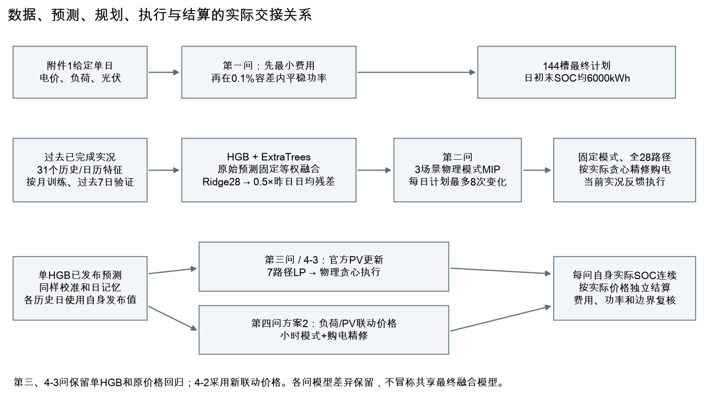

图：实际数据交接流程；最终树模型的并行融合与各问调度分支。

### exp008 方法与模型联动

本次从 exp006 的分支与储能评价基准出发。问题一采用 main 最新两层优化设定；年度问题先更新至单 HGB 预测，第二问又完成 HGB/ExtraTrees 融合。用户接受当时已有的完整结果后停止实验，因此不同问题保留各自已经核验的版本。本文不把未完成的自适应换向预算 DP 当作最终模型，也不声称所有问题已经共享同一个融合预测器。

#### 1. 时间、物理量和结算

每个区间长10分钟，一天144槽。原始附件中的00:10是区间右端，代表00:00–00:10。负载与光伏的单位是kW，先乘1/6小时得到电量。记负载功率为L、光伏功率为V，净需求电量为n，日前购电为g⁰，最终执行购电为g，充放电电量为c、d，紧急购电为e，弃电为w，储电量为E。

$$ n_t=(L_t-V_t)/6 $$

$$ g_t+d_t+e_t-c_t-w_t=n_t $$

$$ E_{t+1}=E_t+\eta_c c_t-d_t/\eta_d $$

电池容量12000kWh，SOC限制为1200–10800kWh，双向最大功率均5000kW，即单槽充、放电量各不超过833.333333kWh。团队将题面的效率0.9解释为往返效率，单向效率均取√0.9；这是建模假设。年度方案连续传递实际SOC，不每日重置。实际执行不同时充放电，不用紧急购电给电池充电，不在净盈余时额外放电。

第二问已知固定分时电价p。年度最终实际账单为：

$$ C_2=\sum_t p_t(g^0_t+5e_t) $$

第三问和4-3保留已经支付的原始计划，按最终调整一次结算。记正部为[x]₊=max(x,0)，实际费用为：

$$ C=\sum_t p_t\left(g^0_t+1.5[g_t-g^0_t]_++0.5[g^0_t-g_t]_++5e_t\right) $$

已购电不退款，减少购电还增加惩罚；允许弃电时，下调购电被保留原计划支配，因此当前规划只允许向上调整。4-2、4-3在规划时只能使用因果电价预测，费用则按附件4真实价格核算。目标中的终端电量估值、吞吐罚项、功率变化罚项均不从实际账单扣除。

例如某槽净需求400kWh、既定购电350kWh且电池有足够能量时，允许放电的实际控制释放50kWh，SOC下降50/√0.9≈52.7046kWh，紧急购电为0。若模式不允许放电，则紧急补足50kWh并按5倍电价计费。模式与SOC必须一起参与购电决策。

#### 2. 第一问：费用优先的两层确定性规划

附件1给出固定一天的负荷、光伏预测和电价，第一问不另训练年度预测器。程序沿用main的新设定：日初、日末SOC均6000kWh，充放电互斥，净充放电功率相邻变化不超过1000kW。充电和放电各自的模式最短开启3槽、关闭2槽，开启时功率至少1kW；所有模式和功率变化约束都循环连接前一天末槽与当天首槽。这里的关闭时间是同一充电或放电模式的关闭时间，并非要求整个电池必须空闲。额外平稳性要求是团队的模型设定，不是题面给定电池硬件上限。

第一层在这些约束下最小化购电费用，实测最优费用34080.9513996元。第二层把费用限制为第一层费用的1.001倍加0.0001元数值容差，再最小化归一化运行平稳性目标。该目标同时包含净功率总变差、充放电启动数，以及相对于30分钟参考长度的短运行段缺额：

$$ P_t=6(c_t-d_t),\qquad TV_{cyclic}=\sum_{t=0}^{143}|P_t-P_{(t-1)\,\mathrm{mod}\,144}| $$

$$ S=\frac{TV_{cyclic}}{2\cdot5000\cdot144}+\frac{N_{start}}{2\cdot144}+\frac{B_{short}}{4\cdot144} $$

其中N_start为充电和放电模式启动总数；每个连续开启段长度为ℓ槽时，对B_short贡献max(0,3−ℓ)。本版最短开启3槽，所以短段项为0，但启动数仍参与第二目标。实际N_start=4、S=0.03695080976。上式c、d沿用本文电量记号；第一问JSON的c、d则直接存kW，导出电量必须除以6，购电g已是kWh。

第二层实际费用34115.03245097元，恰好使用给定费用容差范围，TV为33209.1661kW。报告与result1.xlsx使用第二层最终轨迹。第一层结果不是另一份最终调度；也不能将带平稳性约束的第一层称为不加限制的绝对费用下界。

#### 3. 年度预测：从历史特征到树模型输出

负荷与光伏分别建模。原始31个特征均来自发布时已知的历史实况或日历，包含过去日、周的同槽水平及时间特征。模型在每月边界重新训练，最近7个已完成日作为验证区间，更早的历史用于训练，样本权重按90日半衰期衰减。它们都是回归树模型，不存在本轮需要描述的卷积层或神经网络层。

HGB逐轮拟合当前预测残差的树，并以学习率0.08加入已有预测，训练目标是平方误差。固定最大100轮、最多15个叶节点、最小叶样本50、L2正则2，验证早停耐心10、损失改进容差10⁻⁷，随机种子42。显式传入先前验证周，未采用随机验证切分，也未用正式月份重新拟合。它适合用有限大小的树学习历史负荷、光伏和时段之间的非线性关系。验证周只用于早停，不作为随后评价日的已知标签。

ExtraTrees使用128棵随机化分裂树，叶节点最少10个样本，每次使用全部特征，不进行bootstrap，种子42，并行工作数2，分裂标准为平方误差。每棵树在叶节点给出回归预测，森林平均所有树的结果。与HGB逐轮修正残差不同，各ExtraTrees树并列形成平均预测。验证周仅记录误差，不用于拟合、森林树数早停或模型选择。最终第二问对两类原始预测固定等权融合：

$$ \widehat y^{raw}_t=0.5\widehat y^{HGB}_t+0.5\widehat y^{ET}_t $$

融合权重不随当天实际表现变化，不逐日挑选“事后更准”的通道。两类模型均为种子42，22个HGB负荷/PV月模型加22个ExtraTrees月模型，共44个原始模型。单种子不构成稳定性试验，不能编造多种子标准差。既有training_seconds记录包含model.fit及紧接的验证集predict，HGB累计44.971846877秒、ExtraTrees累计63.233388833秒；纯拟合、单独验证预测与正式评价期预测不能由此拆出，不将这两个累计值称为纯训练或端到端耗时。

##### 3.1 过去28日输出校准

融合之后统一校准，不能将两套已经分别校准的结果平均来冒充该流程。每个通道用过去最多28个已完成发布日拟合残差岭回归。回归的10列包含截距、原始预测、昨日/上周/近3日同槽与预测的差、另一个通道预测，以及日内一阶和二阶正余弦。功率以1000kW缩放，历史权重半衰期14日。

$$ \theta=(X^TWX+\Lambda)^{-1}X^TWr $$

这里r为“历史实测减当时原始发布预测”再除以1000后的无量纲残差，X为对应历史发布时的特征，W为近期加权矩阵；截距正则2，其余系数正则20。回归修正还原为1000Xθ kW，幅度限制为max(100kW,3倍该通道全部历史残差RMSE)。光伏的预测与实测均不超过1kW时，训练权重乘0.1；日照屏蔽取发布前28个完整日正光伏槽的并集，再向两侧扩展20分钟，输出截断为非负。没有可用历史发布时保留原始输出。这里的输出校准历史仅含已归档的二月至十二月发布日，首个正式日不借用一月伪装的树模型输出。

##### 3.2 日负荷偏差记忆

在岭校准后，对当天每个负荷槽统一加入昨日完整日均残差的0.5倍，光伏不变。昨日残差相对于昨日“岭校准后、记忆修正前”的预测计算，不递归使用本层已经修正的结果。这样避免持续偏差被完全留给电池承担，同时保留明确的信息截止边界。

$$ \widehat L_{d,t}=\max\left(0,\widehat L^{ridge}_{d,t}+0.5\overline{(L_{d-1}-\widehat L^{ridge}_{d-1})}\right) $$

最终第二问净需求RMSE约357.162kW。这个数属于完整融合与校准管线，不是未经后处理的原始树模型误差。

#### 4. 第二问：同一预测下的模式、购电和实际执行

每天午夜先发布当天预测，再取过去28个完整日各自已发布预测的误差路径。每条路径保留144槽时间顺序及负载与光伏共同误差，不把分位列当成独立历史日。历史误差来自与当前相同的预测管线，日内实况不会反向修改已经发布的购电量。

先在28条按日期排序的路径中等距取3条，求带共同二元充放电模式的物理混合整数规划。各场景共享购电量与模式，但场景SOC及动作分别计算；这仍是可见整条场景路径的规划近似，不是严格非预见性多阶段树的最优性证明。

模式每10分钟可变化，最短保持1槽，每日计划模式变化最多8次，包括计划的跨午夜变化，没有额外换向软罚。它相对之前hold3候选放宽了附加最短保持时间，不改变容量、效率、功率或互斥。固定5秒求解预算和目标gap0.2%；达到时间上限时保留并核验可行解，实测gap按原日志披露，不填成0。

然后固定模式，在全部28条历史路径上以真实贪心执行规则重新优化购电量。目标包括计划费、平均紧急费、小幅吞吐罚和终端电量估值：

$$ J(g)=\sum_t p_tg_t+\frac{1}{28}\sum_j\left[\sum_t5p_te_{j,t}+0.002\sum_t(c_{j,t}+d_{j,t})-\tau(E_{j,144}-1200)\right] $$

普通日τ=0.45元/储电kWh，最后评价日τ=0。程序对裁剪后的SOC递推反向求导，使用L-BFGS-B，最多120次迭代。裁剪及模式造成目标非光滑且非凸，这是一种局部数值优化，不能称全局最优。

实际运行只读取当前槽已观察负荷和光伏：购电加光伏减负荷后有盈余且模式允许充电时，在盈余、电池容量和功率上限中取最小可充电量；有缺口且模式允许放电时，在缺口、可用SOC和功率上限中取最小可放电量；剩余缺口紧急购电、剩余盈余弃电。第二问最终执行死区为0。每天携带自身真实SOC，同时传递上日末的计划模式及计划保持长度，用于下一日计划变化预算；真实最后非空方向另行记录。计划模式和真实非空方向不是同一状态。

年度实际非空方向序列是允许模式序列删除空闲后的子序列，因此全年实际换向受全年计划模式变化约束。不能据此要求每一天的实际非空换向一定小于当天计划变化，因为空闲可能跨越午夜。本次实测2533次换向，并非把预算2672次直接当成实测值。

#### 5. 第三问与4-3：按正式预报发布时刻滚动更新

这两问保留已验证的单HGB加相同岭校准、半记忆基础预测。负荷在6/12/18点读取当日最近18槽（3小时）的已观察误差，按6槽半衰期加权，乘样本数/(样本数+12)收缩，然后按exp(−h/36)衰减地加到未来第h槽预测。光伏使用附件3当时已经发布的官方小时节点。节点在十分钟区间内线性插值并积分取均值，当前节点以前一已观察实况锚定，不能用未来实测补齐节点。

官方光伏预报还按相同发布时刻、完整24小时提前量的既往预报误差拟合24个小时节点偏差，最长回看28日、半衰期14日。节点修正使用12倍二阶差分正则和2倍单位阵正则，并乘历史日数/(历史日数+7)收缩；官方零功率节点保持为零。该节点校准必须等历史完整24小时标签到达，因此它的可用历史边界与“只预测到当日24点”的调度残差边界不同。

每次发布重新构造相同发布时间、相同剩余提前量的已完成历史误差。当前实现从这些完整路径等距选7条，做共享购电的情景线性规划，随后实际控制只执行到下一个合法更新时间。下一次更新后的短缺机会权重使用1.5作代理，而即将执行的区间仍使用5倍紧急成本。这个代理只用于规划，不改实际计费。

情景LP另外使用每kWh吞吐0.005元和每kW相邻功率变化0.001元的软罚，普通日终端每储电kWh估值为当次预测价格最小值/√0.9，最后评价日估值为0。LP没有二元互斥或禁止紧急电充电约束，其场景动作可能比可执行动作乐观；这些辅助路径只用来形成购电计划。4-3虽然归档同发布的历史电价误差，当前LP只使用当前因果点预测电价，没有将历史电价误差建成联合电价场景。

实际执行仍为物理贪心控制，充电死区20kWh；不采用LP的场景平均充放电量，也不调用第二问的L-BFGS-B购电精修。原日前计划与后续最终购电保存为两个数组，调整费用对最终差额只结算一次，已执行区间不可被后续计划覆盖。情景LP中的未来动作是乐观规划近似，不能将其当作真实电池动作或严格非预见性策略。工作簿、功率图和可行性检查全部使用实际执行轨迹。

这两问没有实施第二问最终的8次模式变化预算。因此第三问和4-3较高的换向数必须展示，不能声称本次已经让所有问题的电池行为全面减少。由于预测和控制结构也不同，不能把第二问与第三问之间的全部费用差解释成“增加官方预报”的单因素效果。

#### 6. 第四问电价联动

4-2在单HGB基础上采用与负荷、光伏联动的价格回归。旧的8列包含截距、固定分时价、历史日周价格和谐波，新模型加入当天自身午夜已发布的负荷与光伏预测各一列，共10列。每个历史训练行也使用它当时自身的发布值，不能把当前模型回算历史后冒充历史已发预报。

使用过去28日真实价格、按十分钟标签年龄计算的14日半衰期和固定岭正则。前8列依次为1、附件1同槽价、昨日同槽价、上周同槽价、日内一阶正余弦、二阶正余弦；不足一周时周价退回昨日价。新增两列是自身已发布HGB负荷与光伏预测除以1000kW。与输出残差校准不同，这里直接回归价格，并保留非零先验：

$$ \theta_p=(X^TWX+\Lambda_p)^{-1}(X^TWp+\Lambda_p\mu),\quad \Lambda_p=\operatorname{diag}(10^{-6},5,5,5,5,5,5,5,5,5),\quad \mu=(0,0,0.5,0.5,0,0,0,0,0,0)^T $$

价格输出下限为0.0001元/kWh。随后沿用既有小时共同模式、三场景物理规划、28路径购电精修和真实执行，只有价格模型及其自身历史价格误差计算改变。调度用当前点预测电价；已保存的历史电价误差供审计，未作为额外电价风险场景进入该规划。所有购电按附件4真实价格核算。

4-2新模型的价格RMSE改善约9.38%，但固定购电量加权的价格预测误差变化不是实际费用节省。完整调度实际比上一版本少23491.352076元，应分别报告。4-3仍采用原先的因果价格回归，不冒称已接入这份新价格模型。

#### 7. 评价与可复现范围

全部年度费用评价采用2025-02-01至12-31的334日、48096个十分钟槽。一月为训练/冷启动和预热依据，主费用、主功率变化统计不纳入该月。所有日期都经历过开发分析，本年度不是未触碰的独立测试集。

非空换向、连续充放电段起点、活跃时段、交流吞吐、等效完整循环和功率总变差分别统计。它们是运行强度代理，不能直接推断真实电池寿命。效率为常数，尚未识别温度、倍率、SOC依赖效率、循环与日历老化曲线，报告不编造寿命收益。

用户接受的最终第二问费用下降6.144318%，换向由2729降至2533，但启停段由3791增至3898、活跃槽由23028增至37211。原先8%的目标并未达到；后续用户接受当前结果是停止优化和生成报告的依据。停止时未完成的自适应DP年度候选保留中止记录，不参与正式成果和历史排名。


## 5. 实验设置

| 配置 | 实际设定 |
|---|---|
| 第一问 | 互斥；1000kW/10min爬坡；最短开3/关2槽；SOC起止6000；费用容差0.1% |
| HGB | 2通道×11月，种子42；最多100轮、15叶、min_leaf50、L2=2、learning_rate0.08 |
| ExtraTrees | 2通道×11月，种子42；128树、min_leaf10、max_features1、bootstrap=False |
| 融合与后处理 | raw等权0.5/0.5；统一Ridge28；昨日负荷日均残差×0.5 |
| Q2规划 | 3条历史路径初始化物理MIP；hold1；每日计划变化≤8；5秒、gap目标0.2%；全28路径精修≤120次 |
| Q3/4-3 | 同发布历史7条代表路径LP；下一更新时间后短缺权重代理1.5；实际充电死区20kWh |
| Q4-2 | 自身已发布负荷/PV加入10列价格岭回归；小时模式switching=50、wear=.002；5秒/gap.002；精修120次；终值.45(末日0)、deadband0；真实电价计费 |

44个树模型是两个家族、两个通道和11个月份，不是44个独立随机种子。正式种子仅42；跨种子样本数1，样本标准差未记录，不能用月间差异替代种子稳定性。随机示例日种子20260912仅用于画图。

场景规划的未来动作是乐观近似，真实执行才严格逐槽因果。MIP有固定预算、精修为局部非光滑数值法，记录可行性和gap，不声称全局最优。完整超参及训练边界见[模型配置](evidence/forecast/model_configuration.json)、[求解记录](evidence/planning_solver_diagnostics.json)。

## 6. 结果及失败案例

以下主预测表评价午夜发布：final_blend为Q2最终融合，single_hgb为其他问基础负荷/PV预测。single_hgb不代表Q3/4-3后续官方PV更新后的最终预测；价格使用元/kWh另列，不能混入kW误差。

| 预测版本 | 目标 | 样本 | 槽位数 | MAE/kW | RMSE/kW | WAPE/% | 偏差/kW |
|---|---|---|---|---|---|---|---|
| final_blend | load | all | 48,096.0000 | 136.9731 | 182.9870 | 2.9669 | -3.5806 |
| final_blend | load | pv_generating | 26,880.0000 | 136.4243 | 181.2378 | 2.5679 | -4.6192 |
| final_blend | pv | all | 48,096.0000 | 153.2594 | 307.0504 | 6.4426 | 6.1798 |
| final_blend | pv | pv_generating | 26,880.0000 | 272.3276 | 410.6293 | 6.3980 | 9.1603 |
| final_blend | net_load | all | 48,096.0000 | 242.0206 | 357.1618 | 8.0648 | -9.7604 |
| final_blend | net_load | pv_generating | 26,880.0000 | 324.2524 | 448.4727 | 13.3903 | -13.7795 |
| single_hgb | load | all | 48,096.0000 | 144.7736 | 192.8553 | 3.1358 | -3.2276 |
| single_hgb | load | pv_generating | 26,880.0000 | 143.1384 | 190.1017 | 2.6942 | -3.9878 |
| single_hgb | pv | all | 48,096.0000 | 153.6607 | 307.5828 | 6.4594 | 7.5600 |
| single_hgb | pv | pv_generating | 26,880.0000 | 272.6909 | 411.3247 | 6.4065 | 11.2750 |
| single_hgb | net_load | all | 48,096.0000 | 247.9816 | 362.8992 | 8.2635 | -10.7875 |
| single_hgb | net_load | pv_generating | 26,880.0000 | 327.7507 | 452.9885 | 13.5347 | -15.2628 |

all为全部48096槽；pv_generating为实际光伏大于0的26880槽，仅用于评价分组，不作为未来已知信息。load、pv、net分别表示负荷、光伏和净需求。逐月和全部144个提前槽保留在[monthly_metrics.csv](evidence/forecast/monthly_metrics.csv)与[lead_metrics.csv](evidence/forecast/lead_metrics.csv)。以下图与上述同一数据生成。

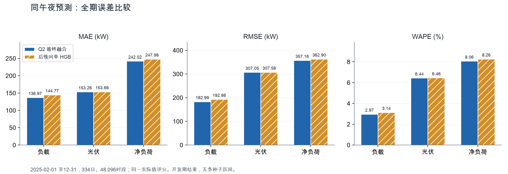

预测诊断：annual metrics

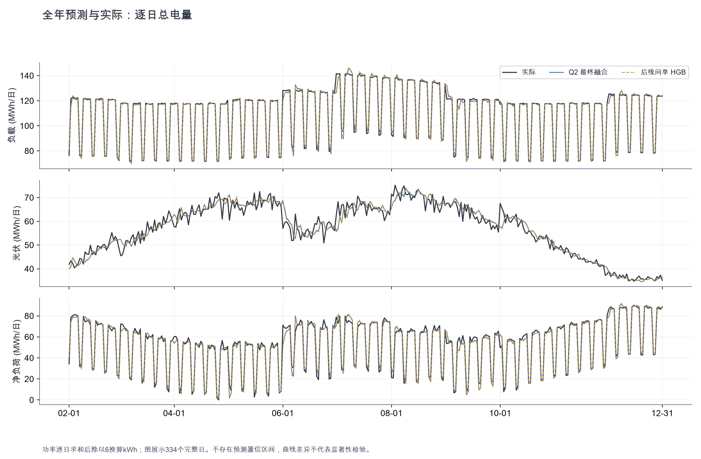

预测诊断：daily energy metrics

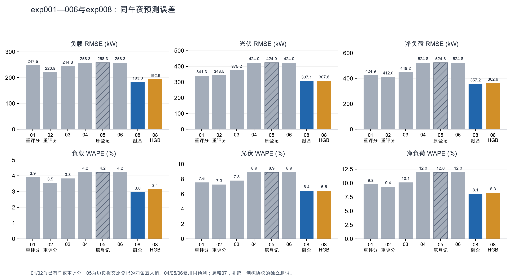

预测诊断：history midnight comparable

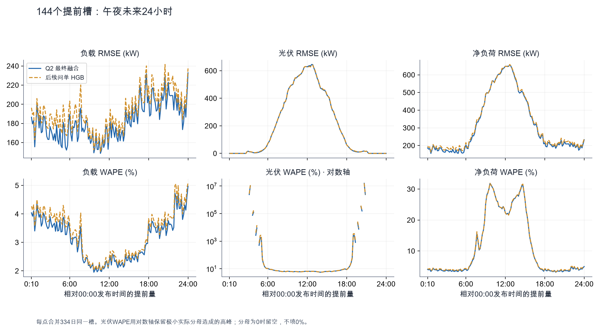

预测诊断：lead metrics

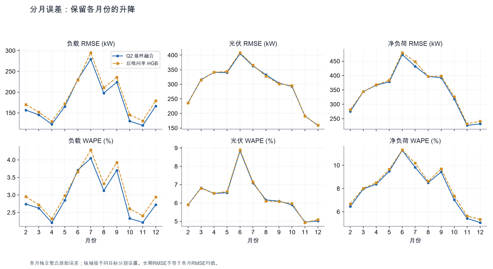

预测诊断：monthly metrics

### 第三、第四问实际发布预测与电价误差

| 问题 | 发布版本 | 变量 | 误差单位 | 样本 | 槽位 | MAE | RMSE | WAPE/% | 偏差 |
|---|---|---|---|---|---|---|---|---|---|
| 第三问 | updated_issued | load | kW | all | 48,096.000000 | 139.607882 | 184.085237 | 3.023926 | -0.894156 |
| 第三问 | updated_issued | pv | kW | all | 48,096.000000 | 91.240387 | 171.735511 | 3.835477 | 4.371019 |
| 第三问 | updated_issued | pv | kW | pv_generating | 26,880.000000 | 158.245181 | 227.595089 | 3.717775 | 2.811061 |
| 第三问 | updated_issued | net_load | kW | all | 48,096.000000 | 187.212109 | 251.801066 | 6.238456 | -5.265175 |
| 第四问方案3 | updated_issued | load | kW | all | 48,096.000000 | 139.607882 | 184.085237 | 3.023926 | -0.894156 |
| 第四问方案3 | updated_issued | pv | kW | all | 48,096.000000 | 91.240387 | 171.735511 | 3.835477 | 4.371019 |
| 第四问方案3 | updated_issued | pv | kW | pv_generating | 26,880.000000 | 158.245181 | 227.595089 | 3.717775 | 2.811061 |
| 第四问方案3 | updated_issued | net_load | kW | all | 48,096.000000 | 187.212109 | 251.801066 | 6.238456 | -5.265175 |
| 第四问方案3 | updated_issued | price | yuan/kWh | all | 48,096.000000 | 0.045889 | 0.061327 | 6.057747 | -0.000048 |
| 第四问方案2 | original_causal_price | price | yuan/kWh | all | 48,096.000000 | 0.046318 | 0.061948 | 6.114366 | 0.000021 |
| 第四问方案2 | linked_HGB_price | price | yuan/kWh | all | 48,096.000000 | 0.042157 | 0.056140 | 5.565101 | 0.000109 |

Q3/4-3按每次发布后六小时不重叠覆盖计分，共48096槽；剩余自然日全提前量另有120240槽，不能混作同一总体。2672次发布的三通道序列依据冻结校正量和原始输入算术重建，8016个发布哈希全部匹配，未重新拟合。逐月、发布时间和剩余提前槽见[完整误差CSV](evidence/other_question_forecasts.csv)及[来源审计](evidence/other_question_forecasts.json)。

| 问题 | 变量 | RMSE单位 | 保持午夜/旧价格RMSE | 实际更新/新价格RMSE | RMSE变化/% | WAPE变化/百分点 |
|---|---|---|---|---|---|---|
| 第四问方案2 | price | yuan/kWh | 0.061948 | 0.056140 | -9.375323 | -0.549266 |
| 第三问 | load | kW | 192.855259 | 184.085237 | -4.547463 | -0.111890 |
| 第三问 | pv | kW | 379.472446 | 171.735511 | -54.743615 | -4.525091 |
| 第三问 | net_load | kW | 428.943196 | 251.801066 | -41.297340 | -3.362726 |
| 第四问方案3 | load | kW | 192.855259 | 184.085237 | -4.547463 | -0.111890 |
| 第四问方案3 | pv | kW | 379.472446 | 171.735511 | -54.743615 | -4.525091 |
| 第四问方案3 | net_load | kW | 428.943196 | 251.801066 | -41.297340 | -3.362726 |
| 第四问方案3 | price | yuan/kWh | 0.061948 | 0.061327 | -1.002520 | -0.056620 |

该表对Q3/4-3比较“保持当天午夜已发布预测”与“实际日内更新”，只衡量预测更新价值；4-2比较原因果价格与联动价格。负荷、PV、净需求与电价保持各自单位。上述预测误差变化不等同于调度节费，也不证明每次更新具有经济必要性。

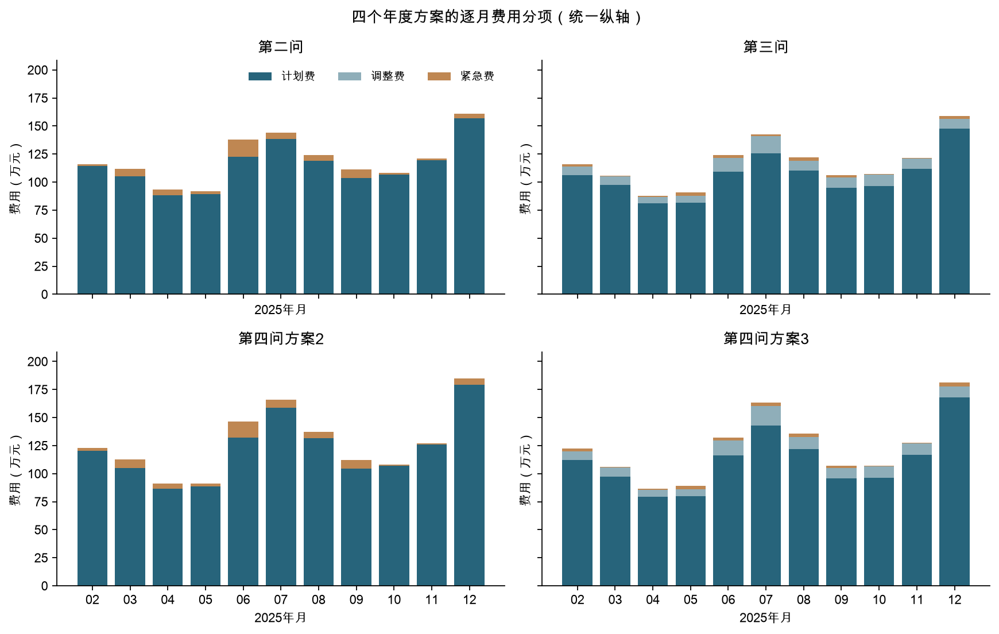

四个年度问题的逐月费用分解，统一纵轴。

| 问题 | 非空换向/次 | 活动槽 | 交流吞吐/kWh | EFC | 同时充放槽 | 功率总变差/kW |
|---|---|---|---|---|---|---|
| 第二问 | 2,533.00 | 37,211.00 | 11,353,818.83 | 472.42 | 0.00 | 28,219,286.97 |
| 第三问 | 5,693.00 | 39,548.00 | 11,726,491.27 | 487.93 | 0.00 | 24,229,597.55 |
| 第四问方案2 | 1,763.00 | 35,187.00 | 11,179,601.98 | 465.17 | 0.00 | 28,859,635.10 |
| 第四问方案3 | 6,625.00 | 39,696.00 | 12,593,476.88 | 524.00 | 0.00 | 36,753,201.46 |

| 问题 | 求解次数 | 可行数 | 平均gap/% | 最大gap/% |
|---|---|---|---|---|
| 第二问 | 334.0000 | 334.0000 | 0.1642 | 1.1202 |
| 第三问 | 1,336.0000 | 1,336.0000 | 未记录 | 未记录 |
| 第四问方案2 | 334.0000 | 334.0000 | 0.2049 | 1.7049 |
| 第四问方案3 | 1,336.0000 | 1,336.0000 | 未记录 | 未记录 |

### 电池充放电功率与波动核验

四个统一随机日为2025-04-15、06-07、12-06、12-25，随机种子20260912；另检查题目指定03-20、06-21、09-23、12-21。每张年度图保留48096个实际时点；每张日图保留144槽，不平滑或降采样。正为充电、负为放电。第一问为单独144槽。

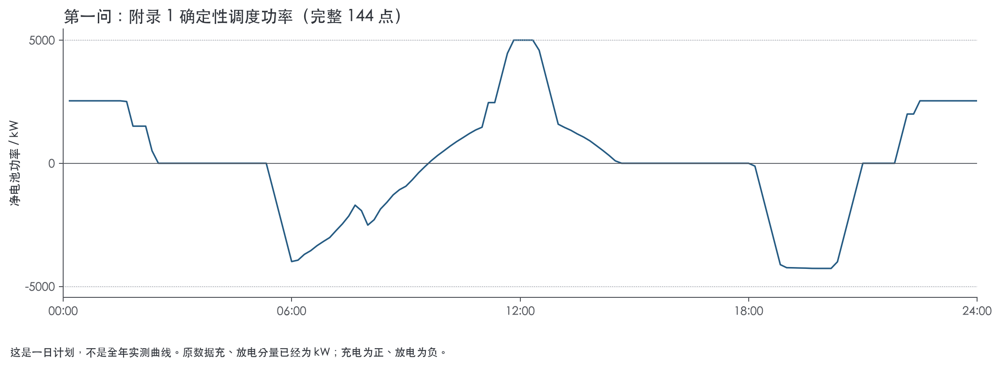

实际电池功率：q1 deterministic power

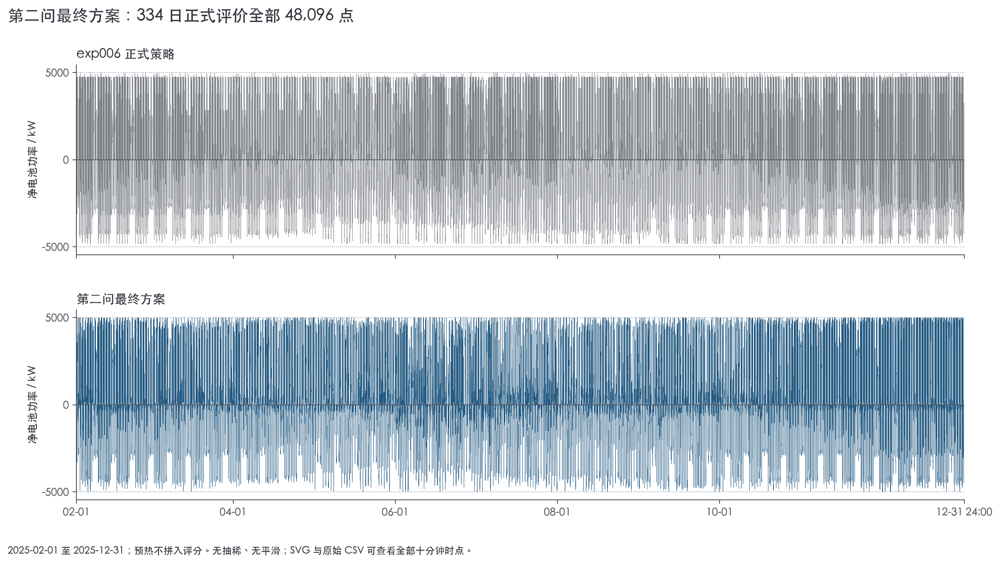

实际电池功率：q2 final all 48096 points

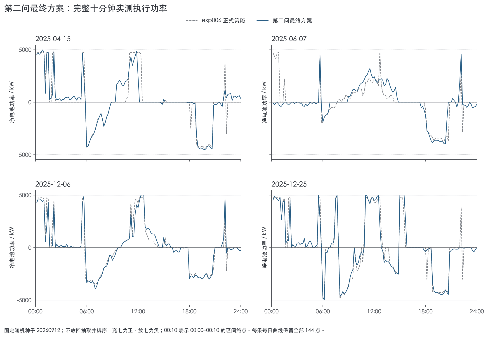

实际电池功率：q2 final random days

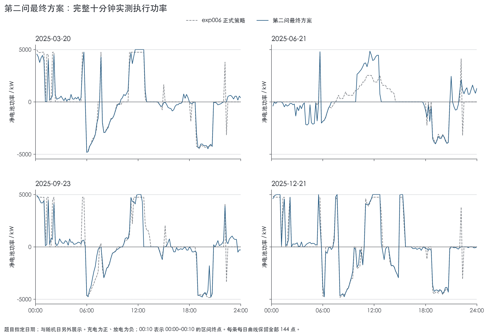

实际电池功率：q2 final specified days

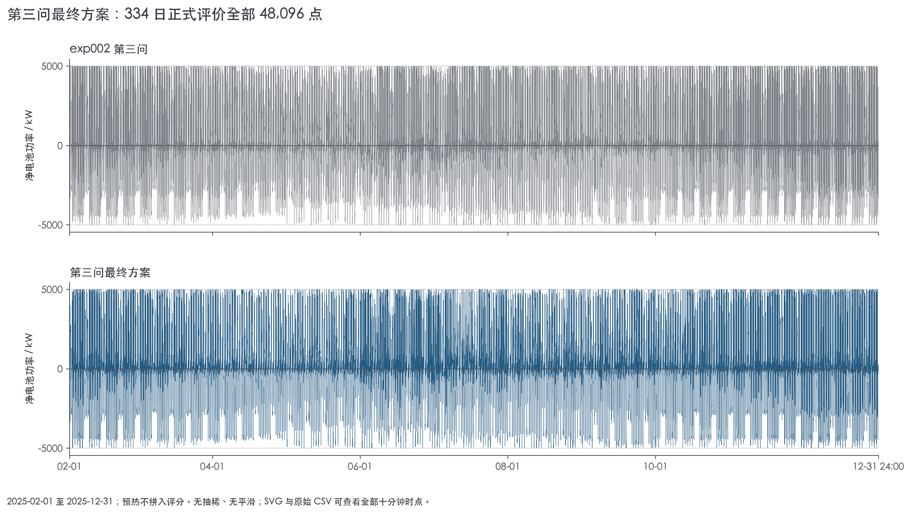

实际电池功率：q3 final all 48096 points

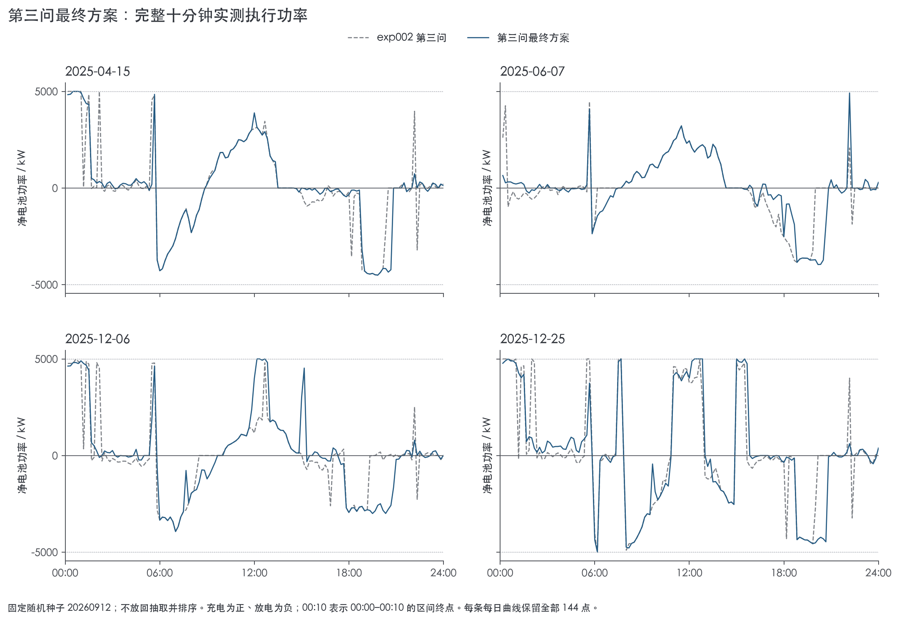

实际电池功率：q3 final random days

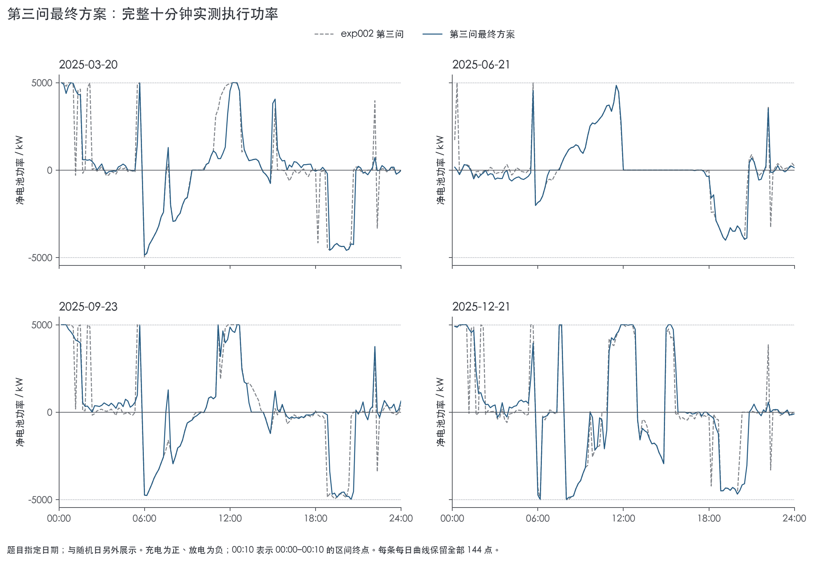

实际电池功率：q3 final specified days

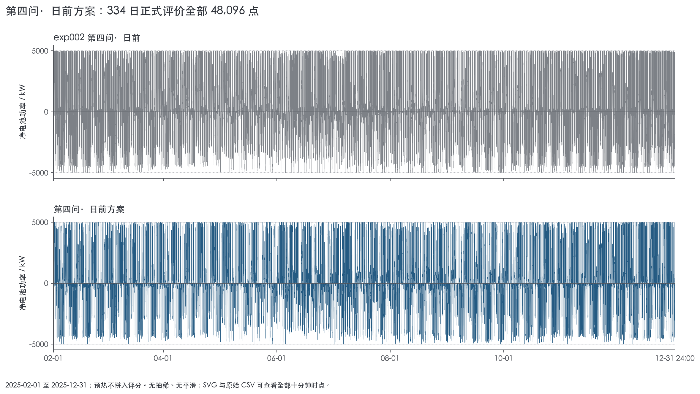

实际电池功率：q4 2 final all 48096 points

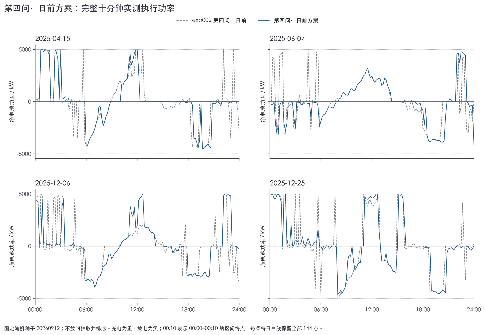

实际电池功率：q4 2 final random days

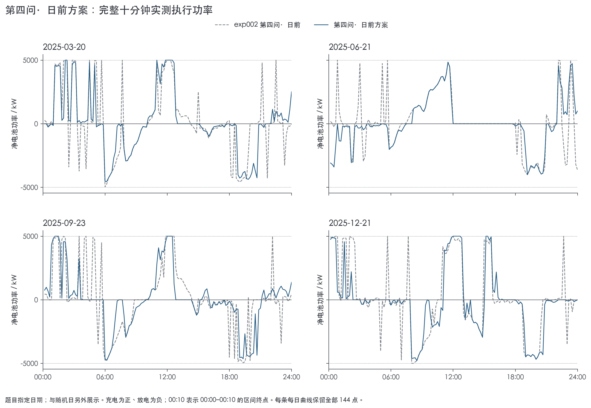

实际电池功率：q4 2 final specified days

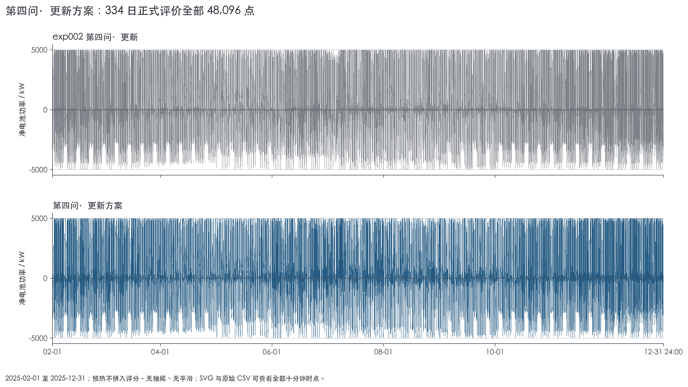

实际电池功率：q4 3 final all 48096 points

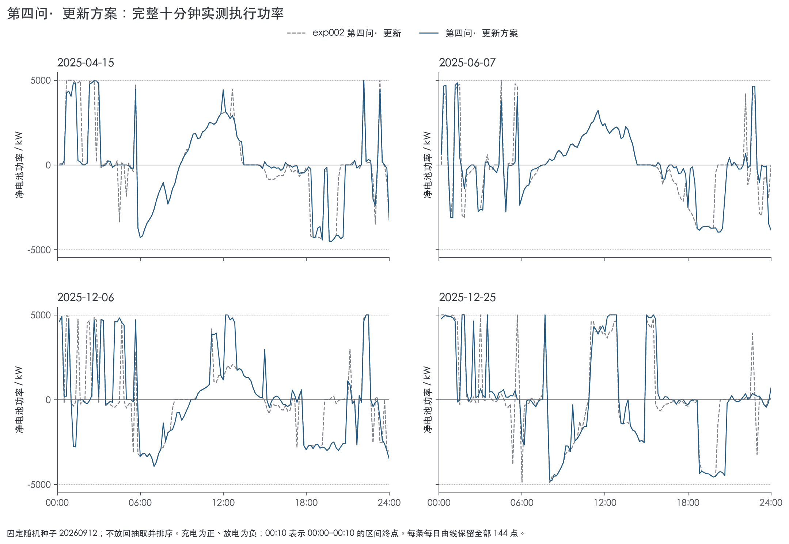

实际电池功率：q4 3 final random days

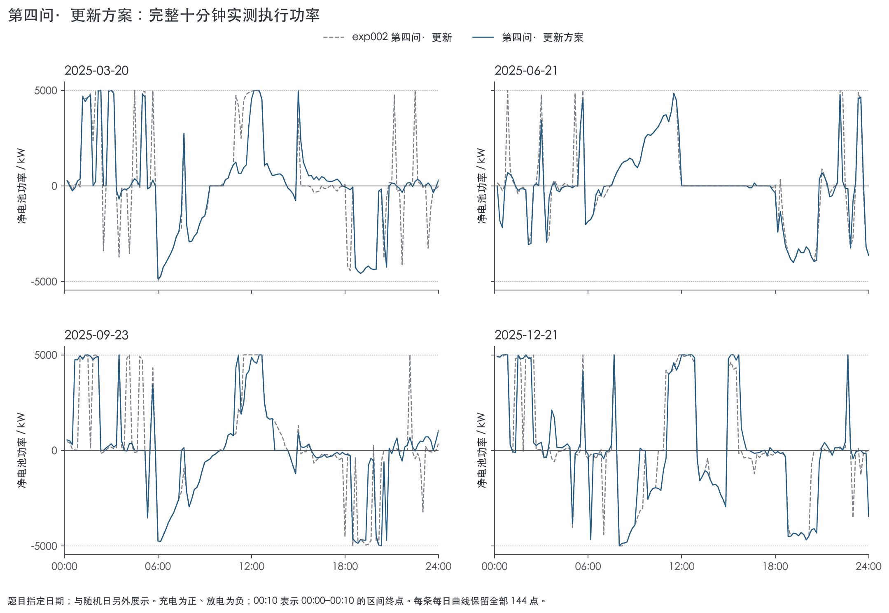

实际电池功率：q4 3 final specified days

[全部原始功率、差分和计数依据](evidence/battery/README.md)。Q2比较排除1月预热边界；全年方向和TV包括2–12月之间的日边界。四小时汇总内充放两列都为正不代表同一十分钟同时充放。

### 最贵日期与失败边界

| 问题 | 日期 | 计划费/元 | 调整费/元 | 紧急费/元 | 总费/元 |
|---|---|---|---|---|---|
| 第二问 | 2025-06-01 | 35,684.39 | 0.00 | 78,592.77 | 114,277.16 |
| 第三问 | 2025-12-01 | 53,087.38 | 3,444.72 | 10,776.34 | 67,308.45 |
| 第四问方案2 | 2025-06-01 | 39,183.42 | 0.00 | 85,079.16 | 124,262.58 |
| 第四问方案3 | 2025-12-01 | 62,437.96 | 4,257.68 | 13,985.45 | 80,681.09 |

这些是各方案自身最贵日期，不将费用最大直接解释为预测最差。费用还受到电价、负荷规模、SOC和可用调整机会影响。历史全路径分位、更多求解场景、按周重训及日内误差状态等候选均有未改善案例，完整开发摘要保留在[种子与消融证据](evidence/seed_and_ablation_results.json)。用户停止时两个自适应DP年度候选尚未完整，禁止和334日正式费用比较。

### 计算时间

| 阶段/方案 | 模型数 | 拟合+验证预测/秒 | 求解器累计/秒 | 精修累计/秒 | 运行墙钟/秒 | 预测/秒 | 校准/秒 |
|---|---|---|---|---|---|---|---|
| forecast_absolute_hgb | 22.00 | 44.97 | 未记录 | 未记录 | 未记录 | 未记录 | 未记录 |
| forecast_absolute_extra_trees | 22.00 | 63.23 | 未记录 | 未记录 | 未记录 | 未记录 | 未记录 |
| Q1 | 未记录 | 未记录 | 7.93 | 未记录 | 未记录 | 未记录 | 未记录 |
| Q2 | 未记录 | 未记录 | 699.07 | 304.32 | 未记录 | 未记录 | 未记录 |
| Q3 | 未记录 | 未记录 | 39.69 | 未记录 | 76.18 | 未记录 | 未记录 |
| Q4-2 | 未记录 | 未记录 | 933.99 | 342.26 | 未记录 | 未记录 | 未记录 |
| Q4-3 | 未记录 | 未记录 | 46.16 | 未记录 | 90.73 | 未记录 | 未记录 |

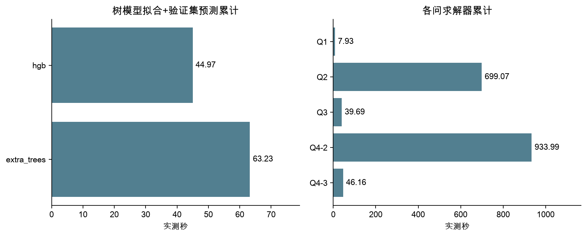

已记录的拟合+验证预测和求解时间；缺失不补0，累计阶段不可直接当端到端墙钟。

训练、预测、风险校准、实际回放、导出和报告的计时范围并不完整。未记录值明确保留；报告和导出自身新测耗时分别记录在report_build.json和工作簿QA中，不反推既有阶段。

[指定日期完整表格](specified_dates.md)。五份附件格式成果分别为[result1.xlsx](result1.xlsx)、[result2.xlsx](result2.xlsx)、[result3.xlsx](result3.xlsx)、[result4-2.xlsx](result4-2.xlsx)、[result4-3.xlsx](result4-3.xlsx)。

## 7. 历次指标和技术路线对比

exp001–006全部历史均保留，exp007按用户要求忽略。各实验原角色、原登记、同口径重算与开发消融分别标明；本轮候选不冒充新的历史实验。exp005注册表从其固定Git提交读取并核验哈希，不因当前工作树缺少文件而遗漏。

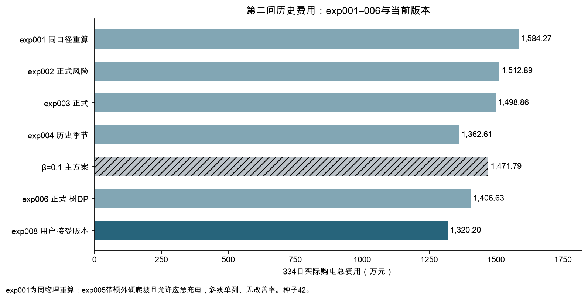

第二问历史费用原值。exp005物理设置不同，只描述性并列，不连线排名或计算改善率。

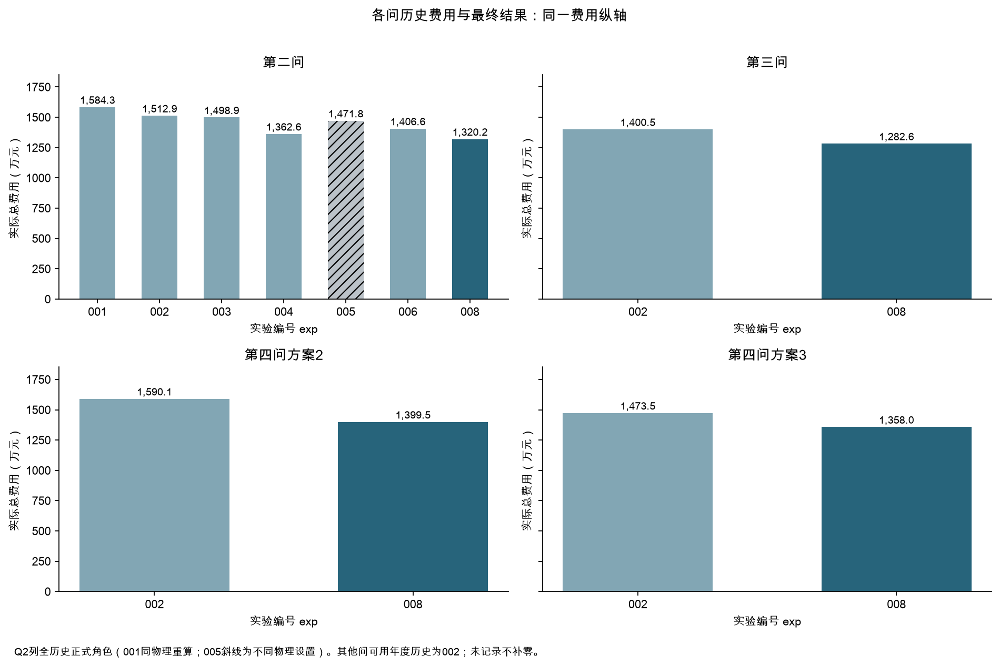

各问自身历史费用比较，所有子图采用相同费用尺度；其他问未登记的实验不填零。

| 问题 | 历史基准 | 历史费/元 | 本次费/元 | 本次−历史/元 | 变化/% |
|---|---|---|---|---|---|
| 第二问 | exp006 | 14,066,257.4773 | 13,201,981.9479 | -864,275.5293 | -6.1443 |
| 第三问 | exp002 | 14,005,062.7759 | 12,826,263.0743 | -1,178,799.7015 | -8.4170 |
| 第四问方案2 | exp002 | 15,901,397.2011 | 13,994,531.2579 | -1,906,865.9432 | -11.9918 |
| 第四问方案3 | exp002 | 14,734,925.1249 | 13,579,870.4650 | -1,155,054.6600 | -7.8389 |

| 实验 | 原角色/策略 | 历史费/元 | 本次费/元 | 本次−历史/元 | 变化/% | 同口径排名 | 边界 |
|---|---|---|---|---|---|---|---|
| exp001 | exp001 同口径重算 | 15,842,654.19 | 13,201,981.95 | -2,640,672.24 | -16.67 | 是 | same Q2 physical and settlement convention; forecast and/or controller may differ |
| exp001 | exp001 原登记（不可比） | 16,258,308.22 | 13,201,981.95 | 未记录 | 未记录 | 否 | incompatible single-way eta=.9 (round trip .81) and warmup initial SOC; descriptive only |
| exp002 | exp002 正式风险 | 15,128,897.45 | 13,201,981.95 | -1,926,915.50 | -12.74 | 是 | same Q2 physical and settlement convention; forecast and/or controller may differ |
| exp003 | exp003 正式 | 14,988,622.65 | 13,201,981.95 | -1,786,640.70 | -11.92 | 是 | same Q2 physical and settlement convention; forecast and/or controller may differ |
| exp004 | exp004 无季节 | 13,611,587.83 | 13,201,981.95 | -409,605.88 | -3.01 | 是 | same Q2 physical and settlement convention; forecast and/or controller may differ |
| exp004 | exp004 历史季节 | 13,626,145.41 | 13,201,981.95 | -424,163.46 | -3.11 | 是 | same Q2 physical and settlement convention; forecast and/or controller may differ |
| exp005 | β=0.1 主方案 | 14,717,882.17 | 13,201,981.95 | 未记录 | 未记录 | 否 | completed LP simulation; additional 1000 kW/10min hard ramp and emergency charging allowed; show separately as descriptive historical comparator |
| exp006 | exp006 正式·树DP | 14,066,257.48 | 13,201,981.95 | -864,275.53 | -6.14 | 是 | same Q2 physical and settlement convention; forecast and/or controller may differ |
| exp006 | exp006 旧执行·重新规划 | 13,534,196.73 | 13,201,981.95 | -332,214.78 | -2.45 | 是 | same Q2 physical and settlement convention; forecast and/or controller may differ |

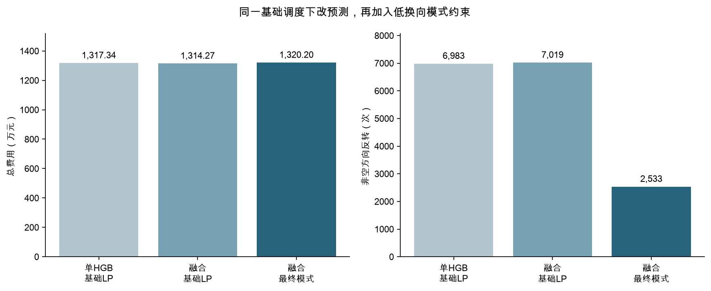

三层核心对照：先在同一基础LP下改预测，再增加低换向模式。

| 对照 | 总费/元 | 非空换向/次 | 吞吐/kWh | 活动槽 |
|---|---|---|---|---|
| 单HGB+同基础LP | 13,173,407.80 | 6,983.00 | 12,105,874.68 | 40,268.00 |
| 融合预测+同基础LP | 13,142,739.17 | 7,019.00 | 12,103,872.79 | 40,331.00 |
| 融合预测+最终模式规划 | 13,201,981.95 | 2,533.00 | 11,353,818.83 | 37,211.00 |

这里的“旧预测”是本轮之前的单HGB管线，与exp006的冻结CNN不是同一层对照。融合降低同基础LP费用；加入最终模式规划进一步降低换向，但费用相对无模式LP增加。不能把三层差额全部归因于某一个模型，也不能把LP费用和另一个控制器的低换向拼为同一个方案。

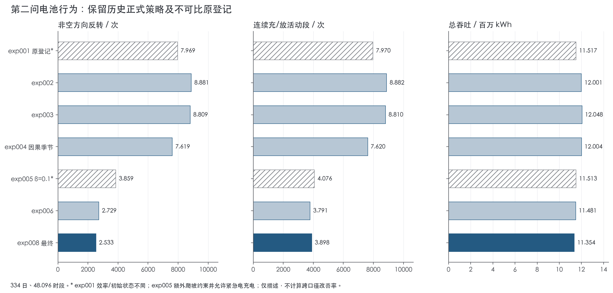

历史电池强度：同时保留减少和增加的指标。


历史预测在同一午夜发布口径下的RMSE与WAPE，保留各目标的改善和退步。

原登记192168个多次发布样本与48096个午夜重评分不得混用；单独标明实际发电时段。WAPE差值为百分点，不与相对变化百分比混淆。完整数据见[evidence/forecast](evidence/forecast/README.md)。

第三、4-2、4-3问较exp002分别减少8.4170%、11.9918%、7.8389%。数据、评价期、效率和实际计费相同，允许展示历史费用数值变化；原exp002预测器通过四目标共同验证损失选择早停点，对Q3和4-2的严格同信息公平性存在限制。各问模型、预测及控制器均有变化，不能将差额全部归因于日内更新或某一单因素。详见[历史可比性审计](evidence/history_other_questions_comparability.json)。


本轮实际记录的分阶段时间。历史阶段与设备未统一，禁止从此图计算端到端加速率。

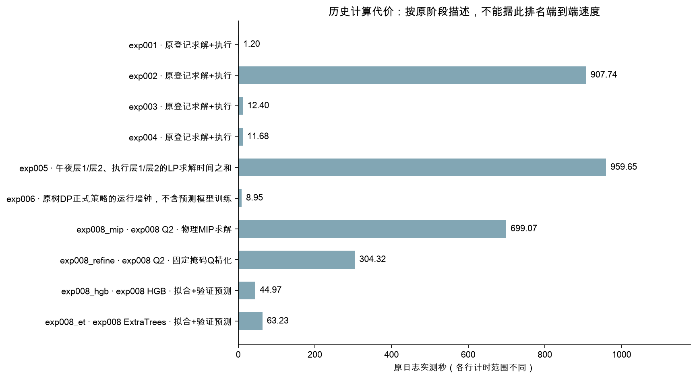

历史原登记计时与本轮对应实测阶段分列；不是同一工作量基准。

| 实验/阶段 | 计时范围 | 实测秒 | 原字段 | 来源 |
|---|---|---|---|---|
| exp001 | 原登记求解+执行 | 1.1972 | solve_execute_seconds | reports/registry/exp001.json |
| exp002 | 原登记求解+执行 | 907.7402 | solve_execute_seconds | reports/registry/exp002.json |
| exp003 | 原登记求解+执行 | 12.3983 | solve_execute_seconds | reports/registry/exp003.json |
| exp004 | 原登记求解+执行 | 11.6773 | solve_execute_seconds | reports/registry/exp004.json |
| exp005 | 午夜层1/层2、执行层1/层2的LP求解时间之和 | 959.6525 | sum(overlap_summary[beta=0.1].solver_seconds) | git:8108d0475ae4f2ea25565a806dfec5e836f62c0a:reports/registry/exp005.json |
| exp006 | 原树DP正式策略的运行墙钟，不含预测模型训练 | 8.9549 | run_wall_seconds | reports/registry/exp006.json |
| exp008_mip | exp008 Q2 · 物理MIP求解 | 699.0726 | Q2.solver_seconds.sum | reports/experiments/exp008/evidence/runtime_by_stage.json |
| exp008_refine | exp008 Q2 · 固定掩码Q精化 | 304.3246 | Q2.refinement_seconds.sum | reports/experiments/exp008/evidence/runtime_by_stage.json |
| exp008_hgb | exp008 HGB · 拟合+验证预测 | 44.9718 | HGB.training_seconds.sum | reports/experiments/exp008/evidence/runtime_by_stage.json |
| exp008_et | exp008 ExtraTrees · 拟合+验证预测 | 63.2334 | ET.training_seconds.sum | reports/experiments/exp008/evidence/runtime_by_stage.json |
| exp008_wall | exp008 Q2 · 运行总墙钟 | 未记录 | run_wall_seconds | reports/experiments/exp008/evidence/runtime_by_stage.json |

原始树模型拟合及随后的验证集预测累计约108.21秒；纯拟合时间未单独记录；未把模型复用次数重复计入训练。不同设备、并行负载、训练组数和阶段定义的历史计时只作描述，不能宣称端到端加速。所有原登记时间与缺失说明保留在对应历史注册表和计时证据中。

## 8. 复现说明

实现源码提交：`a571ff91f7c773708d2533567903f206099352c9`。报告模板取自main提交`7ecd9b988665ad628dbf048ed295457166170ffc`。最终选择及用户接受记录见[final_selection.json](../../../experiments/exp008/final_selection.json)，最终数据契约见[final_payload.json](final_payload.json)。

```bash
OMP_NUM_THREADS=1 OPENBLAS_NUM_THREADS=1 .venv/bin/python -m unittest discover -s tests -p 'test_exp008*.py' -v
OMP_NUM_THREADS=1 OPENBLAS_NUM_THREADS=1 .venv/bin/python -m experiments.exp008.refresh_report_payload
.venv/bin/python -m reports.build_report_exp008 --payload reports/experiments/exp008/final_payload.json --code-commit a571ff91f7c773708d2533567903f206099352c9
```

换目录克隆后先运行refresh_report_payload，将来源路径绑定到当前工作树；它确认五份工作簿数据逐项不变才更新派生载荷。缺少main或exp005本地分支时使用明确的哈希锁定快照。重建报告只读取冻结结果，不训练或重新优化。全新算法复现实验应在独立输出位置运行：实验程序拒绝覆盖既有档案。不同机器在相同MIP秒数预算下可能产生不同可行解，未承诺逐位同值。工作簿使用捆绑Node与artifact-tool，具体命令和核验见工作簿交接文档。

[相关测试记录](tests.txt)、[最终选择独立核验](evidence/final_selection_audit.json)、[电池原始轨迹核验](evidence/battery/independent_audit.json)、[预测数值和来源核验](evidence/forecast/verification.json)。正式交付检查另记录文件哈希、全部链接、工作簿、图和浏览器视觉结果。

此前本地迭代遇到瓶颈时已完成一次定向论文检索；[下载来源、页码与适配记录](../../../data/results/exp008/literature/literature_notes.md)保留任务导向预测、机会价值控制及场景相关性等思路。未完成的价值反馈候选没有替代本版选定方案，论文中的市场收益不作为本题实测结论。

原8%费用条件保持未通过。用户接受当前已验证档案后允许定稿，这一接受绑定Q2完整档案SHA256；未豁免物理、信息边界、完整334日、费用降低及换向减少要求。
