# exp009：固定exp008预测与物理口径的费用目标对照

| 实验信息 | 内容 |
|---|---|
| 评价协议版本 | exp009-cost-only-control/1 |
| 评价日期范围 | 2025-02-01—12-31（334日）；第一问附件1单日 |
| 实验代码提交 | 50415037a399f9ee81fd2cb3a1b3ff36ac217078 |
| 数据校验值清单 | [data_hashes.json](data_hashes.json) |
| 环境与模型配置 | [record.json](record.json)，[登记](../../registry/exp009.json) |


## 1. 结论与成绩

本实验是exp008固定预测与物理口径下的费用目标对照。各问均只运行事先固定的一个候选，费用与电池动作的改善、退步全部保留。第一问为附件1单日，其余问评价2025年2–12月334天；不同问题不是同时发生的费用，不能相加作为总账单。

| 问题 | 计划费/元 | 调整费/元 | 紧急费/元 | 总费用/元 | 紧急量/kWh | 较008/% |
|---|---|---|---|---|---|---|
| 1 | 34,080.9514 | 0.0000 | 0.0000 | 34,080.9514 | 0.0000 | -0.0999 |
| 2 | 12,632,239.1427 | 0.0000 | 583,352.3523 | 13,215,591.4950 | 104,955.7813 | 0.1031 |
| 3 | 11,620,322.9561 | 974,441.7236 | 193,055.3453 | 12,787,820.0249 | 37,996.0627 | -0.2997 |
| 4-2 | 13,376,143.7873 | 0.0000 | 602,786.2067 | 13,978,929.9940 | 107,711.1872 | -0.1115 |
| 4-3 | 12,282,382.0897 | 1,073,372.3858 | 217,649.0608 | 13,573,403.5363 | 44,234.5460 | -0.0476 |

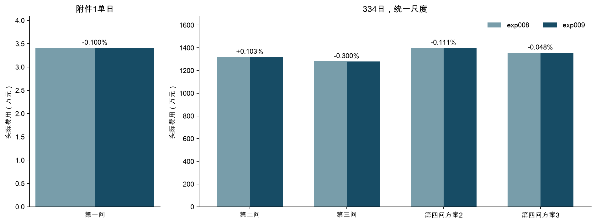

exp008与exp009同问费用。第一问单日独立尺度，年度四问统一尺度。

目标移除运行强度偏好，实际费用仍由相同真实结算规则计算。结果不证明该控制器已经达到真实年度费用全局最小。各问对照与前史采用同一份核验后的JSON/CSV。

## 2. 题目指标及信息边界

净需求为(负荷kW−光伏kW)/6，十分钟槽电量单位kWh。实际账单=Σp[g⁰+1.5(g−g⁰)₊+0.5(g⁰−g)₊+5e]；第二问及4-2没有调整项。原计划费保留，最终差额只计一次，终值和软罚不列为实际费用。

MAE=Σ|误差|/n；RMSE=√(Σ误差²/n)；WAPE=100Σ|误差|/Σ|实况|。全年从充分统计量重算，不平均月度RMSE/WAPE。WAPE差为百分点；相对变化为100×(本次−基准)/|基准|。零分母或缺失不填零。

容量12000kWh，SOC1200–10800kWh，双向5000kW，单向效率均√0.9；往返效率解释为团队假设。真实轨迹严格互斥、无紧急电充电，各问带自身连续SOC。Q1另有固定工程爬坡/最短持续时间；Q4-2保留小时模式网格。

预测与计划仅使用当时已发布信息；实况只用于已到达槽的执行/结算。4-2、4-3真实价格不进入当期预测。非空换向是删除空闲后相邻方向反转；直接反转是原相邻槽正负变化，二者不混用。吞吐、EFC和功率变化仅作运行强度诊断，不推断真实电池寿命。

## 3. 数据与时间验证

所有五个输入CSV按SHA-256锁定，字节与exp008相同；逐问发布预测、历史残差、电价和选中情景也保持一致。Q3/4-3每问1336次发布、每次5类哈希一致。Q2/4-2读取冻结外生路径；旧购电量、旧模式与后续SOC不作为输入。

| 原始数据 | SHA-256 |
|---|---|
| data/raw/附件1.csv | ac5e0ff84e0e339ac6a703d0bb07cec2baf4326fea4025c83f51b0be10e5dabb |
| data/raw/附件2_光伏发电实际功率.csv | 7020d6c8f695809b3c8a1730c50294f5c56723652f31e94a43eb132acf52f6d2 |
| data/raw/附件2_小区负载.csv | 4ecde20838ec8c6c1fb890d5cf378fb985d9d2c123fda3bf4458c4d8f6f27b56 |
| data/raw/附件3.csv | f089243c6855ae069919ee4bd211420900eac42b547d0f22260ee943a9395cef |
| data/raw/附件4.csv | 1fd4d83225f84bcd84683b030ec9fcf0d6e939c45d88888a0cda39a46f9aa1a3 |

原始00:10标记右端[00:00,00:10)，每天144槽；2025-01为冷启动/训练/预热依据，主统计排除一月。缺失不补零，完整性与有限值由独立审计检查。各问初始化严格相同，之后各自演化；终末SOC规则相同。

既有树模型按月，以更早历史训练、最近已完成7日验证，种子42；官方PV按0/6/12/18点合法发布时间更新。所有2025日期已用于此前开发，不能把对照称为未触碰测试集。本轮不重新训练HGB/ExtraTrees、不选新参数、不使用费用筛选候选。Q3/4-3沿原代码重新计算既定在线PV/价格岭校准并缓存；输出与exp008逐发布哈希一致，在线校准计算并未被省略。

## 4. 逐步技术讲解

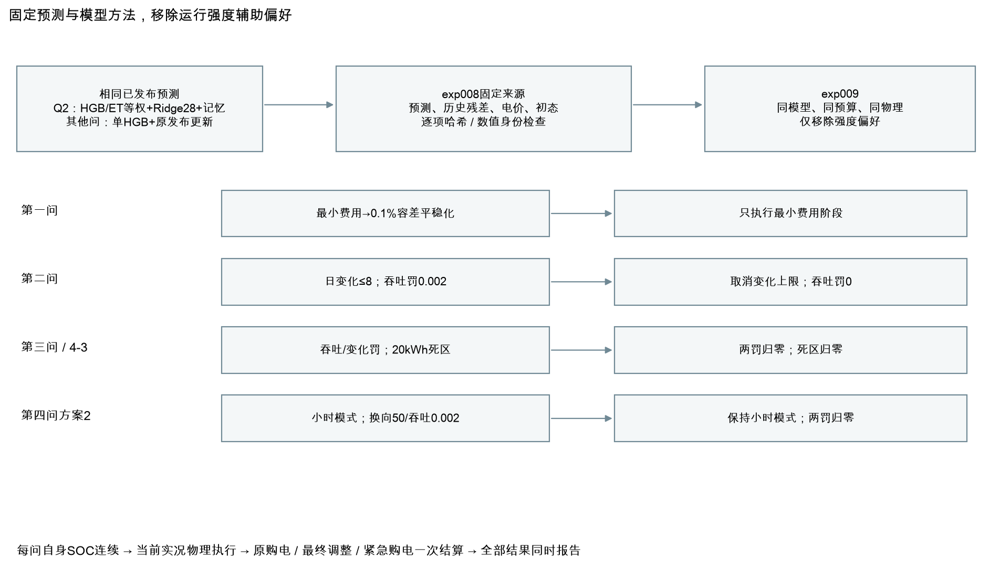

流程图同时显示保留内容、各问修改和实际交接。


本实验从已接受的exp008最终提交出发。预测器、发布数据、年度初态和电池物理口径全部固定，只移除运行强度相关的优化偏好。每问事先固定一个候选，全部完成后一起报告，不按费用或换向数选择版本。这里的“费用唯一目标”指没有运行强度辅助偏好；保留未来购电机会成本代理，并不意味着已求出真实年度账单的全局最优解。

### 1. 时间、物理量和结算

每个区间长10分钟，一天144槽。原始附件中的00:10是区间右端，代表00:00–00:10。负载与光伏的单位是kW，先乘1/6小时得到电量。记负载功率为L、光伏功率为V，净需求电量为n，日前购电为g⁰，最终执行购电为g，充放电电量为c、d，紧急购电为e，弃电为w，储电量为E。

$$ n_t=(L_t-V_t)/6 $$

$$ g_t+d_t+e_t-c_t-w_t=n_t $$

$$ E_{t+1}=E_t+\eta_c c_t-d_t/\eta_d $$

电池容量12000kWh，SOC限制为1200–10800kWh，双向最大功率均5000kW，即单槽充、放电量各不超过833.333333kWh。团队将题面的效率0.9解释为往返效率，单向效率均取√0.9；这是建模假设。年度方案连续传递实际SOC，不每日重置。实际执行不同时充放电，不用紧急购电给电池充电，不在净盈余时额外放电。

第二问已知固定分时电价p。年度最终实际账单为：

$$ C_2=\sum_t p_t(g^0_t+5e_t) $$

第三问和4-3保留已经支付的原始计划，按最终调整一次结算。记正部为[x]₊=max(x,0)，实际费用为：

$$ C=\sum_t p_t\left(g^0_t+1.5[g_t-g^0_t]_++0.5[g^0_t-g_t]_++5e_t\right) $$

已购电不退款，减少购电还增加惩罚；允许弃电时，下调购电被保留原计划支配，因此当前规划只允许向上调整。4-2、4-3在规划时只能使用因果电价预测，费用则按附件4真实价格核算。目标中的终端电量估值、吞吐罚项、功率变化罚项均不从实际账单扣除。

例如某槽净需求400kWh、既定购电350kWh且电池有足够能量时，允许放电的实际控制释放50kWh，SOC下降50/√0.9≈52.7046kWh，紧急购电为0。若模式不允许放电，则紧急补足50kWh并按5倍电价计费。模式与SOC必须一起参与购电决策。

### 2. 第一问：在原可行域内直接执行最小费用解

附件1是给定单日，第一问不训练预测器。原模型的日初末6000kWh、充放电互斥、1000kW/10分钟净功率爬坡、各模式最短开启3槽及关闭2槽、开启至少1kW和循环首尾连接全部保留。爬坡与最短持续时间是团队固定工程假设，不是题面硬件事实；保留它们是为了固定模型可行域。

exp008先最小费用，再允许0.1%费用容差优化总变差、启动数与短运行段。exp009直接重新求解第一阶段，并将该解交给执行与工作簿，不调用第二阶段。固定180秒及相对gap 10⁻⁹，实测34080.95139957元；对照exp008最终34115.03245097元。诊断仍统计净功率变化和启动数，但不进入目标或停止条件。JSON中g为kWh、c和d为kW，输出电量需将c和d除以6。

### 3. 年度预测：从历史特征到树模型输出

负荷与光伏分别建模。原始31个特征均来自发布时已知的历史实况或日历，包含过去日、周的同槽水平及时间特征。模型在每月边界重新训练，最近7个已完成日作为验证区间，更早的历史用于训练，样本权重按90日半衰期衰减。它们都是回归树模型，不存在本轮需要描述的卷积层或神经网络层。

HGB逐轮拟合当前预测残差的树，并以学习率0.08加入已有预测，训练目标是平方误差。固定最大100轮、最多15个叶节点、最小叶样本50、L2正则2，验证早停耐心10、损失改进容差10⁻⁷，随机种子42。显式传入先前验证周，未采用随机验证切分，也未用正式月份重新拟合。它适合用有限大小的树学习历史负荷、光伏和时段之间的非线性关系。验证周只用于早停，不作为随后评价日的已知标签。

ExtraTrees使用128棵随机化分裂树，叶节点最少10个样本，每次使用全部特征，不进行bootstrap，种子42，并行工作数2，分裂标准为平方误差。每棵树在叶节点给出回归预测，森林平均所有树的结果。与HGB逐轮修正残差不同，各ExtraTrees树并列形成平均预测。验证周仅记录误差，不用于拟合、森林树数早停或模型选择。最终第二问对两类原始预测固定等权融合：

$$ \widehat y^{raw}_t=0.5\widehat y^{HGB}_t+0.5\widehat y^{ET}_t $$

融合权重不随当天实际表现变化，不逐日挑选“事后更准”的通道。两类模型均为种子42，22个HGB负荷/PV月模型加22个ExtraTrees月模型，共44个原始模型。单种子不构成稳定性试验，不能编造多种子标准差。既有training_seconds记录包含model.fit及紧接的验证集predict，HGB累计44.971846877秒、ExtraTrees累计63.233388833秒；纯拟合、单独验证预测与正式评价期预测不能由此拆出，不将这两个累计值称为纯训练或端到端耗时。

#### 3.1 过去28日输出校准

融合之后统一校准，不能将两套已经分别校准的结果平均来冒充该流程。每个通道用过去最多28个已完成发布日拟合残差岭回归。回归的10列包含截距、原始预测、昨日/上周/近3日同槽与预测的差、另一个通道预测，以及日内一阶和二阶正余弦。功率以1000kW缩放，历史权重半衰期14日。

$$ \theta=(X^TWX+\Lambda)^{-1}X^TWr $$

这里r为“历史实测减当时原始发布预测”再除以1000后的无量纲残差，X为对应历史发布时的特征，W为近期加权矩阵；截距正则2，其余系数正则20。回归修正还原为1000Xθ kW，幅度限制为max(100kW,3倍该通道全部历史残差RMSE)。光伏的预测与实测均不超过1kW时，训练权重乘0.1；日照屏蔽取发布前28个完整日正光伏槽的并集，再向两侧扩展20分钟，输出截断为非负。没有可用历史发布时保留原始输出。这里的输出校准历史仅含已归档的二月至十二月发布日，首个正式日不借用一月伪装的树模型输出。

#### 3.2 日负荷偏差记忆

在岭校准后，对当天每个负荷槽统一加入昨日完整日均残差的0.5倍，光伏不变。昨日残差相对于昨日“岭校准后、记忆修正前”的预测计算，不递归使用本层已经修正的结果。这样避免持续偏差被完全留给电池承担，同时保留明确的信息截止边界。

$$ \widehat L_{d,t}=\max\left(0,\widehat L^{ridge}_{d,t}+0.5\overline{(L_{d-1}-\widehat L^{ridge}_{d-1})}\right) $$

最终第二问净需求RMSE约357.162kW。这个数属于完整融合与校准管线，不是未经后处理的原始树模型误差。

### 4. 第二问：相同预测下取消次数预算与吞吐罚

每天午夜使用exp008已冻结HGB/ExtraTrees融合预测及过去28个完整日各自已发布预测的误差路径；读取的只有外生净需求场景、固定电价和等距选取的3条场景编号，不读取exp008购电量、模式或后续SOC。负荷、PV、误差时序及信息截止完全不变。

3条路径的物理混合整数规划共享144个十分钟二元模式和购电量，各自保留SOC与动作。精确XOR统计计划模式变化，但移除每日8次变化约束；最短保持仍为1槽。MIP吞吐罚从0.002改为0，换向软罚原本即0。初始化MIP的普通日终端系数为当次预测电价最小值/√0.9，末日为0；精修另用下文0.45。每次5秒、相对gap目标0.002；时限可行解保留实测gap，没有可行解则记录失败并停止，不自动增加预算。

固定模式后在全部28条路径上沿用L-BFGS-B购电精修，最多120迭代，吞吐与功率变化罚均为0，目标为：

$$ J(g)=\sum_t p_tg_t+\frac{1}{28}\sum_j\left[\sum_t5p_te_{j,t}-\tau(E_{j,144}-1200)\right] $$

普通日τ=0.45元/储电kWh、最后评价日τ=0。它是减少未来购电的机会成本代理，不是电池动作奖励，也不从报告账单扣除。精修目标因实际贪心裁剪而非光滑，L-BFGS-B只提供局部数值解；未成功达到数值终止条件的解照原算法保留并核验，不能记为全局最优。

真实控制在模式许可下，仅用当前净盈余、SOC余量及5000kW功率上限决定充电；有缺口时只在许可模式下放电，其余缺口紧急购电。实际死区仍为0，严格互斥且不允许应急充电。每一天传递自身实际SOC和计划末模式，绝不复制exp008后续状态。取消每日预算后，原2672次年度计划变化上界及实际换向上界不再适用。

场景动作仍可见其整条场景路径，属于乐观规划近似，不是严格非预见性多阶段树；实际执行才逐槽因果。两阶段MIP+精修也不保证在放松限制后真实年度账单必然下降。

### 5. 第三问与4-3：按正式预报发布时刻滚动更新

这两问保留已验证的单HGB加相同岭校准、半记忆基础预测。负荷在6/12/18点读取当日最近18槽（3小时）的已观察误差，按6槽半衰期加权，乘样本数/(样本数+12)收缩，然后按exp(−h/36)衰减地加到未来第h槽预测。光伏使用附件3当时已经发布的官方小时节点。节点在十分钟区间内线性插值并积分取均值，当前节点以前一已观察实况锚定，不能用未来实测补齐节点。

官方光伏预报还按相同发布时刻、完整24小时提前量的既往预报误差拟合24个小时节点偏差，最长回看28日、半衰期14日。节点修正使用12倍二阶差分正则和2倍单位阵正则，并乘历史日数/(历史日数+7)收缩；官方零功率节点保持为零。该节点校准必须等历史完整24小时标签到达，因此它的可用历史边界与“只预测到当日24点”的调度残差边界不同。

每次发布重新构造相同发布时间、相同剩余提前量的已完成历史误差。当前实现从这些完整路径等距选7条，做共享购电的情景线性规划，每次固定20秒（继承接口gap参数10⁻⁷，但LP相对MIP gap不适用），随后实际控制只执行到下一个合法更新时间。下一次更新后的短缺机会权重使用1.5作代理，而即将执行的区间仍使用5倍紧急成本。这个代理只用于规划，不改实际计费。

exp009将原每kWh吞吐0.005元和每kW相邻功率变化0.001元的软罚均置零，普通日终端每储电kWh估值为当次预测价格最小值/√0.9，最后评价日估值为0。LP没有二元互斥或禁止紧急电充电约束，其场景动作可能比可执行动作乐观；这些辅助路径只用来形成购电计划。4-3虽然归档同发布的历史电价误差，当前LP只使用当前因果点预测电价，没有将历史电价误差建成联合电价场景。

实际执行仍为物理贪心控制，充电死区由20kWh降至0；不采用LP的场景平均充放电量，也不调用第二问的L-BFGS-B购电精修。原日前计划与后续最终购电保存为两个数组，调整费用对最终差额只结算一次，已执行区间不可被后续计划覆盖。情景LP中的未来动作是乐观规划近似，不能将其当作真实电池动作或严格非预见性策略。工作簿、功率图和可行性检查全部使用实际执行轨迹。

### 6. 第四问电价联动

4-2在单HGB基础上采用与负荷、光伏联动的价格回归。旧的8列包含截距、固定分时价、历史日周价格和谐波，新模型加入当天自身午夜已发布的负荷与光伏预测各一列，共10列。每个历史训练行也使用它当时自身的发布值，不能把当前模型回算历史后冒充历史已发预报。

使用过去28日真实价格、按十分钟标签年龄计算的14日半衰期和固定岭正则。前8列依次为1、附件1同槽价、昨日同槽价、上周同槽价、日内一阶正余弦、二阶正余弦；不足一周时周价退回昨日价。新增两列是自身已发布HGB负荷与光伏预测除以1000kW。与输出残差校准不同，这里直接回归价格，并保留非零先验：

$$ \theta_p=(X^TWX+\Lambda_p)^{-1}(X^TWp+\Lambda_p\mu),\quad \Lambda_p=\operatorname{diag}(10^{-6},5,5,5,5,5,5,5,5,5),\quad \mu=(0,0,0.5,0.5,0,0,0,0,0,0)^T $$

价格输出下限为0.0001元/kWh。初始化MIP普通日终端系数同样为当次预测价格最小值/√0.9，末日为0；固定模式精修普通日为0.45、末日0。随后沿用既有小时共同模式、三场景物理规划、28路径购电精修和真实执行，这些预测值及历史误差在exp009逐项复用exp008；本次只把换向罚50与吞吐罚0.002置零，小时模式网格仍保持不变。调度用当前点预测电价；已保存的历史电价误差供审计，未作为额外电价风险场景进入该规划。所有购电按附件4真实价格核算。

### 7. 对照、评价与可复现边界

所有年度问统一2025-02-01至12-31，334天、48096槽。各问评价初始SOC严格等于exp008；只固定初始状态，随后各自连续演化。评价期最后SOC目标与经济终值规则保持不变，一月不混入费用和功率统计。本年经过多次开发，不是未触碰测试集。

本次是移除强度偏好的组合对照：除了目标系数，还去掉Q2的8次硬预算和Q3/4-3的20kWh执行死区。Q1工程爬坡/最短持续时间、Q4-2小时模式离散仍保留。不能把结果归因到某个单一系数，也不能声称彻底取消全部运行限制。当前模型的恒定效率未识别真实倍率、温度、SOC依赖效率或日历/循环老化；换向、启停、吞吐、EFC、功率总变差只作诊断，不换算电池寿命。

正式种子只有42，n=1，均值就是本次值，样本标准差不可计算；没有新HGB/ExtraTrees训练，原44模型按既定问题分配复用。一次完整运行结果全部纳入，不继承上一轮8%费用/换向减少的停止门槛，也不因某问费用退步继续试参。

在线校准计算与新树训练应分开：Q3/4-3按原算法重新计算并缓存既定PV/价格岭校准，逐发布输出哈希与exp008完全相同；本轮没有改变校准算法、超参数或信息范围。


## 5. 实验设置

| 问题 | 预先冻结配置 |
|---|---|
| 第一问 | {"secondary_smooth_start_short_run_objective": "removed; execute cost-optimal stage1 directly", "ramp_kw_per_10min": 1000, "min_on_slots": 3, "min_off_slots": 2, "min_active_power_kw": 1, "physical_feasible_set": "unchanged, including ramp/minimum-duration safeguards", "solver_seconds": 180, "mip_rel_gap": 1e-09} |
| 第二问 | {"daily_planned_switch_cap": "removed", "switching_penalty": 0, "wear_penalty": 0, "refinement_throughput_penalty": 0, "variation_penalty": 0, "deadband_kwh": 0, "mode_resolution_slots": 1, "min_mode_hold_slots": 1, "physical_scenarios": 3, "refinement_history_days": 28, "mip_seconds": 5, "mip_rel_gap": 0.002, "refinement_maxiter": 120} |
| 第三问 | {"throughput_penalty": 0, "variation_penalty": 0, "charge_deadband_kwh": 0, "representative_paths": 7, "future_shortfall_weight": 1.5, "updates": [0, 36, 72, 108]} |
| 第四问方案2 | {"switching_penalty": 0, "wear_penalty": 0, "refinement_throughput_penalty": 0, "variation_penalty": 0, "deadband_kwh": 0, "mode_resolution_slots": 6, "physical_scenarios": 3, "refinement_history_days": 28, "mip_seconds": 5, "mip_rel_gap": 0.002, "refinement_maxiter": 120} |
| 第四问方案3 | {"throughput_penalty": 0, "variation_penalty": 0, "charge_deadband_kwh": 0, "representative_paths": 7, "future_shortfall_weight": 1.5, "updates": [0, 36, 72, 108]} |

所有原始预测44个树模型复用，新增训练组数0。HGB为2通道×11月、最多100轮/15叶、最小叶样本50、L2=2、学习率0.08；ExtraTrees为2通道×11月、128树、最小叶样本10。单HGB分配给第三/四问，第二问为固定raw等权融合后统一Ridge28与0.5日记忆。没有新的网络层；树结构及残差递推见第四节。

本机：macOS-26.6.2-arm64-arm-64bit；Python 3.12.13，数值线程1。完整依赖与模型配置继承记录见[record.json](record.json)。单正式种子42（n=1），均值为该结果，样本标准差不可计算。绘图随机种子20260912与模型种子不同。

场景保持整日时间相关性：Q2/4-2从历史28条中等距选3条初始化、全28条精修；Q3/4-3选7条。同场景未来动作仍是乐观近似，并非严格非预见性树。保留未来购电机会成本代理与原终值，末日为0；预算固定且无可行解则记失败停止。

## 6. 结果及失败案例

本轮预测身份核验通过，因此所有预测误差与exp008逐项一致，差值严格为0；不是重新训练得到相同分数。午夜基础预测如下，PV发电时段用实际PV>0评价分组，不能作为未来已知特征。

| 模型 | 变量 | 总体 | 样本 | MAE/kW | RMSE/kW | WAPE/% |
|---|---|---|---|---|---|---|
| final_blend | load | all | 48,096.0000 | 136.9731 | 182.9870 | 2.9669 |
| final_blend | load | pv_generating | 26,880.0000 | 136.4243 | 181.2378 | 2.5679 |
| final_blend | pv | all | 48,096.0000 | 153.2594 | 307.0504 | 6.4426 |
| final_blend | pv | pv_generating | 26,880.0000 | 272.3276 | 410.6293 | 6.3980 |
| final_blend | net_load | all | 48,096.0000 | 242.0206 | 357.1618 | 8.0648 |
| final_blend | net_load | pv_generating | 26,880.0000 | 324.2524 | 448.4727 | 13.3903 |
| single_hgb | load | all | 48,096.0000 | 144.7736 | 192.8553 | 3.1358 |
| single_hgb | load | pv_generating | 26,880.0000 | 143.1384 | 190.1017 | 2.6942 |
| single_hgb | pv | all | 48,096.0000 | 153.6607 | 307.5828 | 6.4594 |
| single_hgb | pv | pv_generating | 26,880.0000 | 272.6909 | 411.3247 | 6.4065 |
| single_hgb | net_load | all | 48,096.0000 | 247.9816 | 362.8992 | 8.2635 |
| single_hgb | net_load | pv_generating | 26,880.0000 | 327.7507 | 452.9885 | 13.5347 |


日内发布及电价误差沿用冻结[完整其他问预测证据](../exp008/evidence/other_question_forecasts.csv)。Q3/4-3 next_6h按每次发布后六小时不重叠覆盖，48096槽；全剩余提前量120240槽另列，不能混合。

| 问题 | 发布 | 变量 | 总体 | 单位 | 样本 | MAE | RMSE | WAPE/% |
|---|---|---|---|---|---|---|---|---|
| 3 | updated_issued | load | all | kW | 48,096.00000 | 139.60788 | 184.08524 | 3.02393 |
| 3 | updated_issued | pv | all | kW | 48,096.00000 | 91.24039 | 171.73551 | 3.83548 |
| 3 | updated_issued | pv | pv_generating | kW | 26,880.00000 | 158.24518 | 227.59509 | 3.71777 |
| 3 | updated_issued | net_load | all | kW | 48,096.00000 | 187.21211 | 251.80107 | 6.23846 |
| 4-3 | updated_issued | load | all | kW | 48,096.00000 | 139.60788 | 184.08524 | 3.02393 |
| 4-3 | updated_issued | pv | all | kW | 48,096.00000 | 91.24039 | 171.73551 | 3.83548 |
| 4-3 | updated_issued | pv | pv_generating | kW | 26,880.00000 | 158.24518 | 227.59509 | 3.71777 |
| 4-3 | updated_issued | net_load | all | kW | 48,096.00000 | 187.21211 | 251.80107 | 6.23846 |
| 4-3 | updated_issued | price | all | yuan/kWh | 48,096.00000 | 0.04589 | 0.06133 | 6.05775 |
| 4-2 | linked_HGB_price | price | all | yuan/kWh | 48,096.00000 | 0.04216 | 0.05614 | 5.56510 |

全年、分月、全部144提前槽及发电时段的充分统计量：[annual](../exp008/evidence/forecast/annual_metrics.csv)、[monthly](../exp008/evidence/forecast/monthly_metrics.csv)、[lead](../exp008/evidence/forecast/lead_metrics.csv)。基础预测与修正量、三层旧控制实验及模型结构保留在[exp008预测证据](../exp008/evidence/forecast/README.md)，本轮未把旧消融作为新候选。

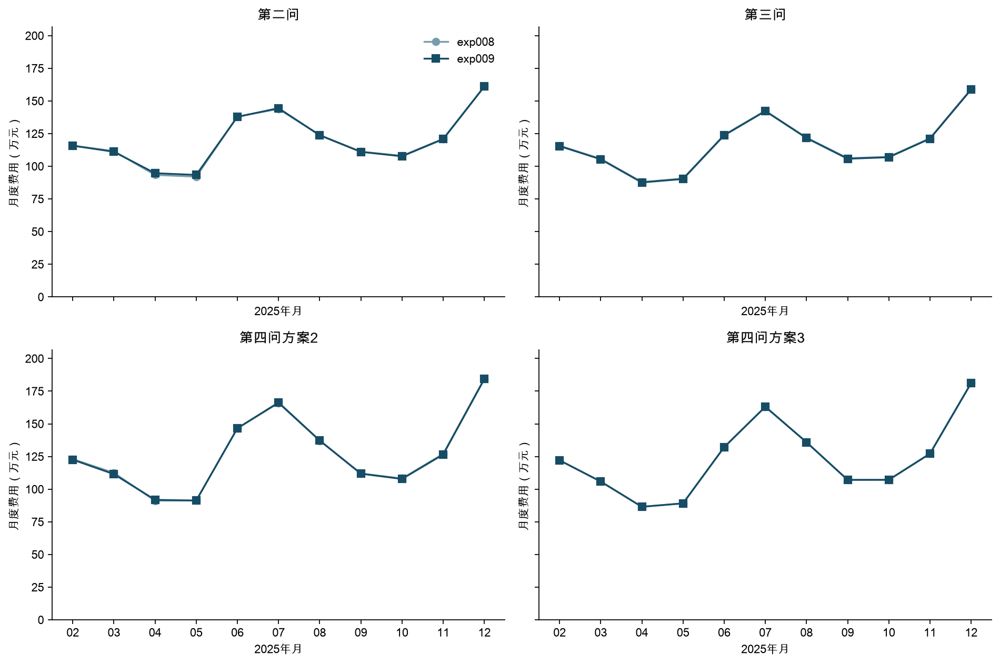

逐月实际费用同轴比较；完整分项见evidence/monthly_cost.csv。

| 问题 | 计划费变化/元 | 调整费变化/元 | 紧急费变化/元 | 总费变化/元 |
|---|---|---|---|---|
| 2 | -2,695.0632 | 0.0000 | 16,304.6103 | 13,609.5471 |
| 3 | 1,505.1451 | -31,239.3014 | -8,708.8931 | -38,443.0494 |
| 4-2 | -24,312.8953 | 0.0000 | 8,711.6314 | -15,601.2639 |
| 4-3 | 17,106.0289 | -16,329.5369 | -7,243.4206 | -6,466.9287 |

第二问计划费减少2,695.0632元，紧急费增加16,304.6103元，合计费用上升13,609.5471元；这是实际账单的直接分项分解。现有局部规划及场景近似可能使更自由的计划在真实误差下承担更多短缺，不能仅凭此次结果认定某个机制是已证实的因果解释。

| 问题 | 非空换向/次 | 活跃槽 | 吞吐/kWh | EFC | 同时充放槽 | 功率TV/kW |
|---|---|---|---|---|---|---|
| 第一问 | 6.000 | 101.000 | 38,578.053 | 1.605 | 0.000 | 50,943.278 |
| 第二问 | 6,935.000 | 36,913.000 | 11,881,095.123 | 494.360 | 0.000 | 34,265,144.577 |
| 第三问 | 7,825.000 | 43,666.000 | 12,068,152.481 | 502.143 | 0.000 | 33,519,916.005 |
| 第四问方案2 | 2,831.000 | 36,323.000 | 11,854,025.828 | 493.234 | 0.000 | 33,682,079.134 |
| 第四问方案3 | 9,255.000 | 43,650.000 | 13,917,141.548 | 579.078 | 0.000 | 52,481,556.265 |

| 问题 | 求解次数 | 可行解数 | 平均gap/% | 最大gap/% | 时限可行解 | LP最大约束残差 | 精修成功 | 精修达120次 | 范围 |
|---|---|---|---|---|---|---|---|---|---|
| 1 | 1.00000 | 1.00000 | 0.00000 | 0.00000 | 0.00000 | 未记录 | 未记录 | 未记录 | 单日确定性MILP；不使用年度预测种子 |
| 2 | 334.00000 | 334.00000 | 0.00302 | 0.17983 | 0.00000 | 未记录 | 29.00000 | 305.00000 | 固定5秒；精修未收敛返回原算法当前解，未追加迭代 |
| 3 | 1,336.00000 | 1,336.00000 | 未记录 | 未记录 | 0.00000 | 3.6380e-12 | 未记录 | 未记录 | 1336 LP optimal；MIP相对gap不适用 |
| 4-2 | 334.00000 | 334.00000 | 0.07216 | 0.44481 | 6.00000 | 未记录 | 30.00000 | 304.00000 | 固定5秒；精修未收敛返回原算法当前解，未追加迭代 |
| 4-3 | 1,336.00000 | 1,336.00000 | 未记录 | 未记录 | 0.00000 | 5.4570e-12 | 未记录 | 未记录 | 1336 LP optimal；MIP相对gap不适用 |

### 电池功率与波动核验

净功率P=6(c−d)，正充负放。正式48096时点全数保留，跨午夜差分计入；首点与预热边界单列，不混进主统计。共同随机日为04-15、06-07、12-06、12-25（seed20260912），指定日03-20、06-21、09-23、12-21，各日144原始点，均不平滑/降采样。

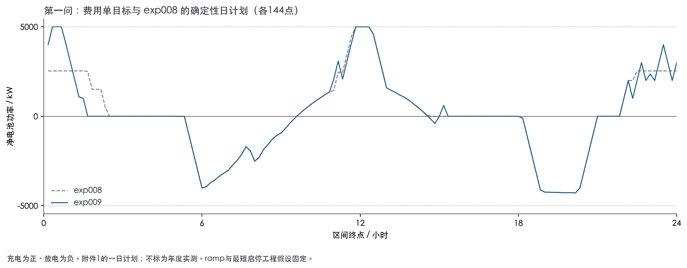

实际轨迹：q1_deterministic_144_points

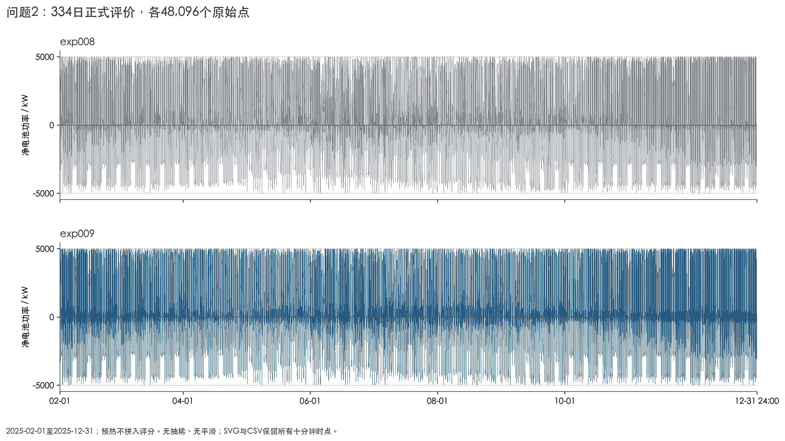

实际轨迹：q2_all_48096_points

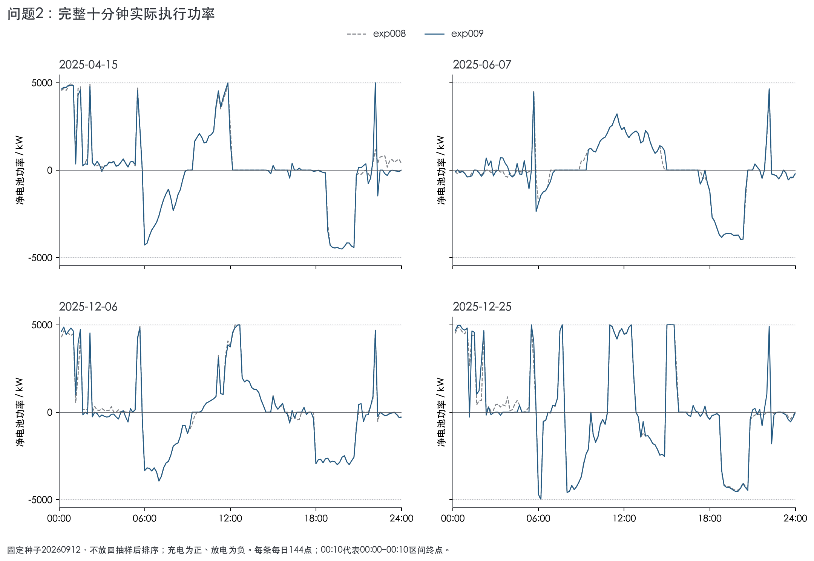

实际轨迹：q2_random_days

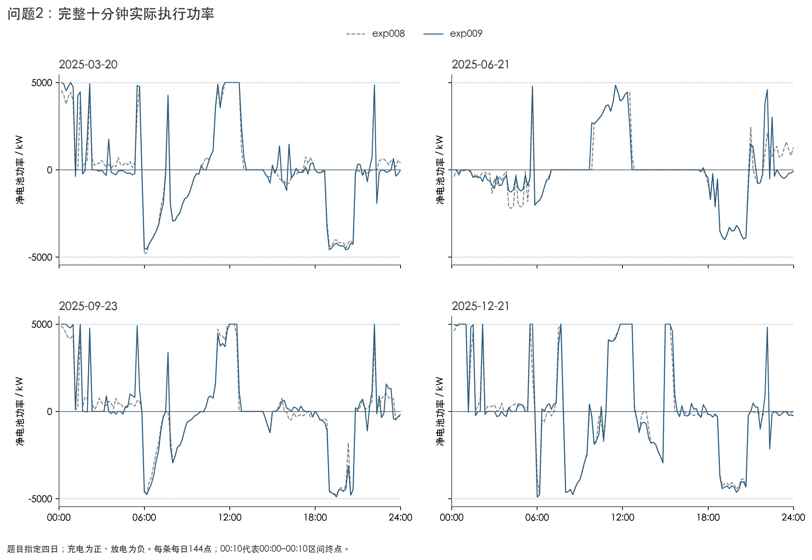

实际轨迹：q2_specified_days

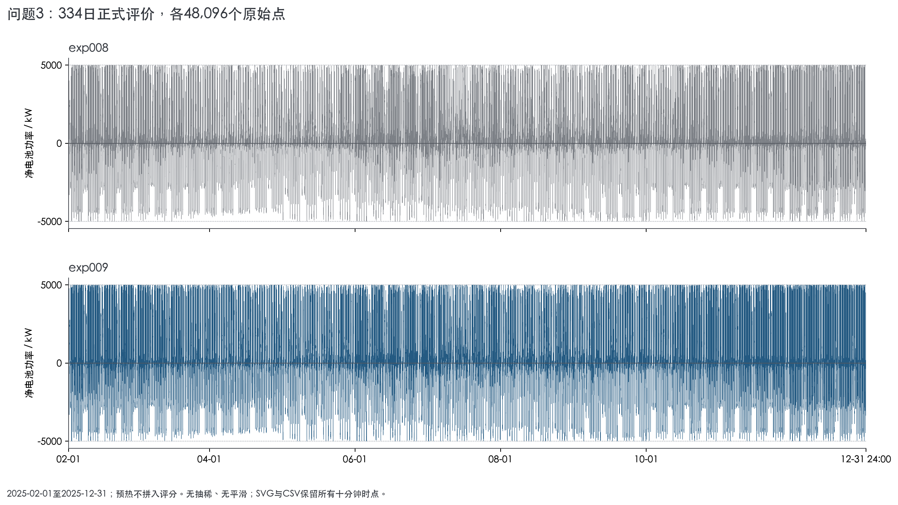

实际轨迹：q3_all_48096_points

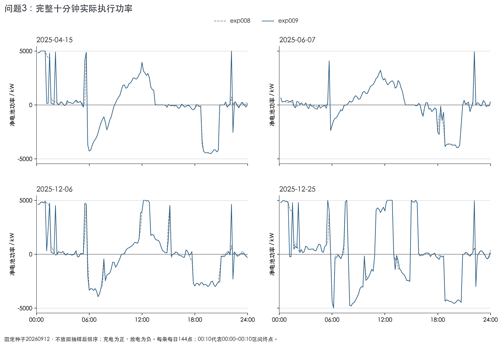

实际轨迹：q3_random_days

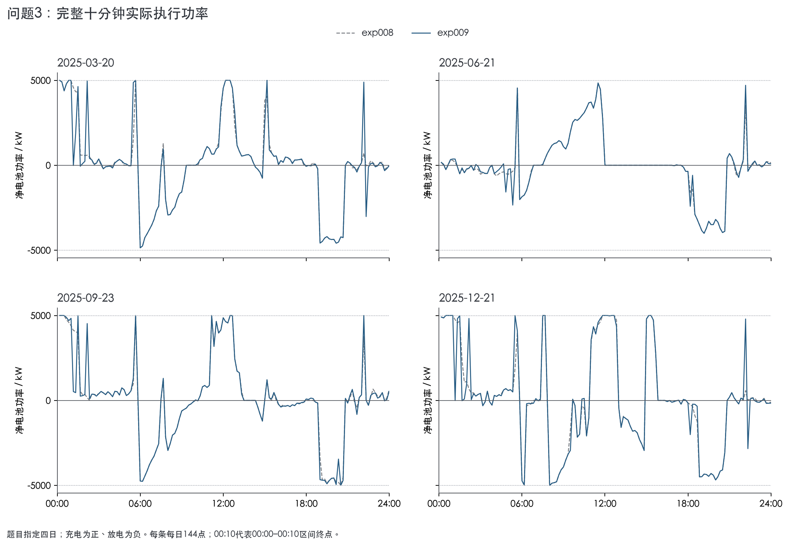

实际轨迹：q3_specified_days

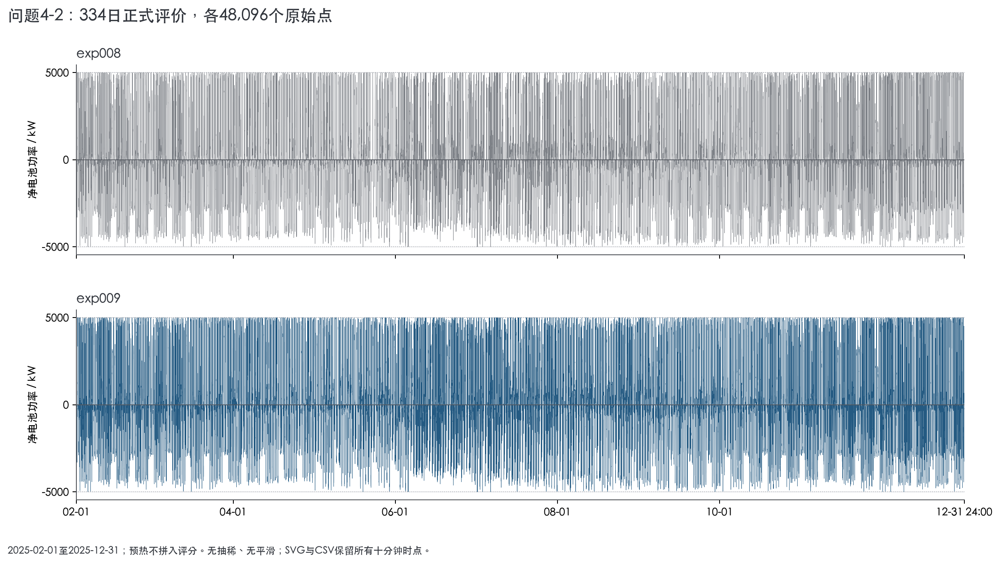

实际轨迹：q4_2_all_48096_points

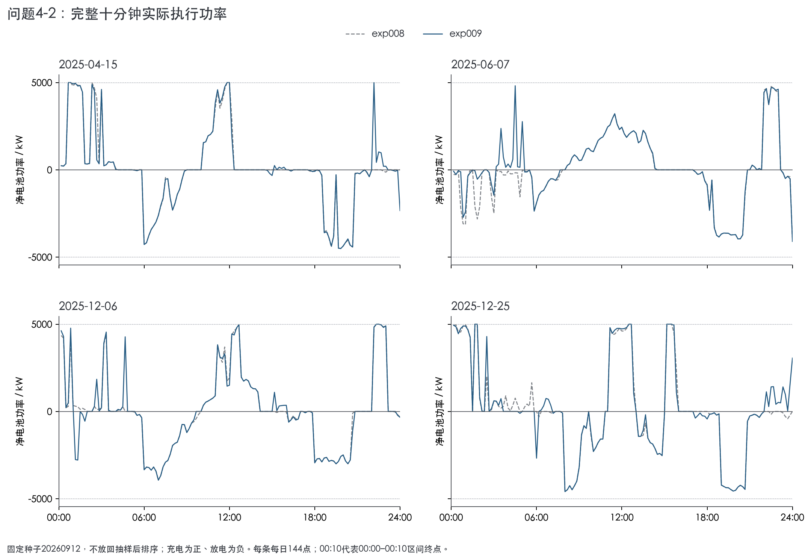

实际轨迹：q4_2_random_days

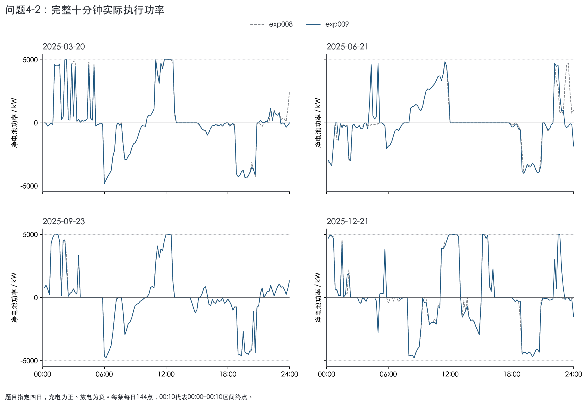

实际轨迹：q4_2_specified_days

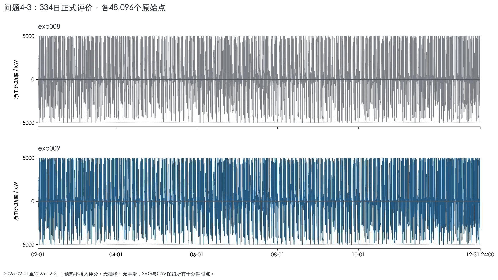

实际轨迹：q4_3_all_48096_points

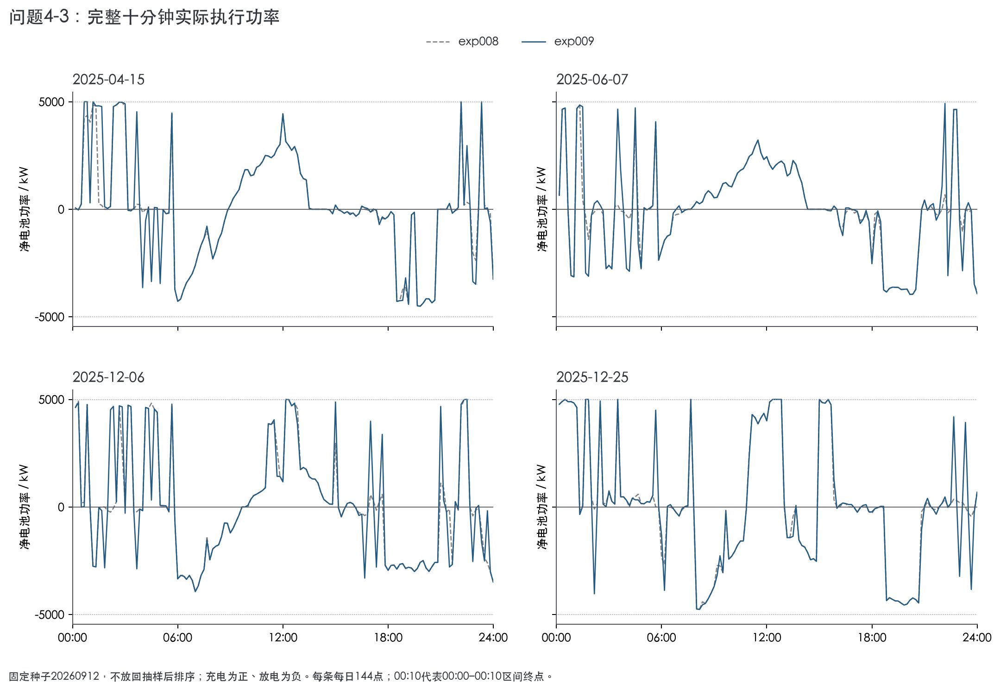

实际轨迹：q4_3_random_days

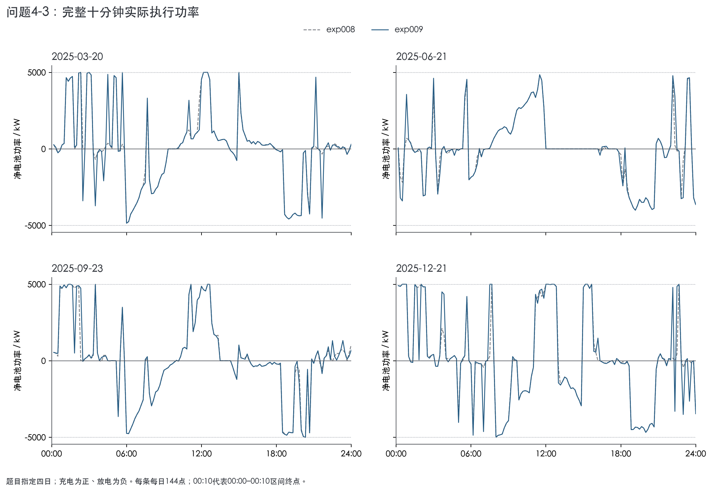

实际轨迹：q4_3_specified_days

第一问采用循环日TV：exp008的33,209.1661→exp009的50,943.2784kW；循环模式启动4→6次。全年问采用线性完整评价期差分，Q1不含首尾连接的49,943.2784kW仅在CSV另作线性诊断。

| 问题 | 指标 | 008 | 009 | 差值 | 相对变化/% |
|---|---|---|---|---|---|
| 2 | throughput_kwh | 11,353,818.8253 | 11,881,095.1228 | 527,276.2976 | 4.6440 |
| 2 | direction_reversals | 2,533.0000 | 6,935.0000 | 4,402.0000 | 173.7860 |
| 2 | episodes | 3,898.0000 | 8,242.0000 | 4,344.0000 | 111.4418 |
| 2 | mean_absolute_delta_kw | 586.7406 | 712.4471 | 125.7066 | 21.4246 |
| 2 | rms_delta_kw | 1,351.8559 | 1,541.0614 | 189.2054 | 13.9960 |
| 2 | p95_absolute_delta_kw | 4,039.9323 | 4,533.3325 | 493.4003 | 12.2131 |
| 2 | max_absolute_delta_kw | 8,946.9885 | 9,264.2900 | 317.3015 | 3.5465 |
| 2 | total_variation_kw | 28,219,286.9653 | 34,265,144.5768 | 6,045,857.6114 | 21.4246 |
| 2 | direct_reversals | 1,407.0000 | 5,028.0000 | 3,621.0000 | 257.3561 |
| 2 | power_limit_share | 0.0304 | 0.0391 | 0.0088 | 28.8356 |
| 2 | large_jump_share | 0.1313 | 0.1653 | 0.0340 | 25.8550 |
| 3 | throughput_kwh | 11,726,491.2697 | 12,068,152.4811 | 341,661.2113 | 2.9136 |
| 3 | direction_reversals | 5,693.0000 | 7,825.0000 | 2,132.0000 | 37.4495 |
| 3 | episodes | 6,984.0000 | 7,826.0000 | 842.0000 | 12.0561 |
| 3 | mean_absolute_delta_kw | 503.7862 | 696.9522 | 193.1660 | 38.3429 |
| 3 | rms_delta_kw | 1,218.9419 | 1,580.0714 | 361.1295 | 29.6265 |
| 3 | p95_absolute_delta_kw | 3,400.0769 | 4,591.3718 | 1,191.2950 | 35.0373 |
| 3 | max_absolute_delta_kw | 9,233.8628 | 9,233.8628 | 0.0000 | 0.0000 |
| 3 | total_variation_kw | 24,229,597.5513 | 33,519,916.0048 | 9,290,318.4536 | 38.3429 |
| 3 | direct_reversals | 3,505.0000 | 7,216.0000 | 3,711.0000 | 105.8773 |
| 3 | power_limit_share | 0.0294 | 0.0371 | 0.0077 | 25.9887 |
| 3 | large_jump_share | 0.0988 | 0.1389 | 0.0401 | 40.6230 |
| 4-2 | throughput_kwh | 11,179,601.9835 | 11,854,025.8277 | 674,423.8443 | 6.0326 |
| 4-2 | direction_reversals | 1,763.0000 | 2,831.0000 | 1,068.0000 | 60.5786 |
| 4-2 | episodes | 3,452.0000 | 4,258.0000 | 806.0000 | 23.3488 |
| 4-2 | mean_absolute_delta_kw | 600.0548 | 700.3239 | 100.2691 | 16.7100 |
| 4-2 | rms_delta_kw | 1,314.0531 | 1,451.1444 | 137.0913 | 10.4327 |
| 4-2 | p95_absolute_delta_kw | 3,988.8649 | 4,150.7884 | 161.9235 | 4.0594 |
| 4-2 | max_absolute_delta_kw | 8,241.3075 | 8,787.7807 | 546.4731 | 6.6309 |
| 4-2 | total_variation_kw | 28,859,635.1038 | 33,682,079.1336 | 4,822,444.0298 | 16.7100 |
| 4-2 | direct_reversals | 594.0000 | 1,343.0000 | 749.0000 | 126.0943 |
| 4-2 | power_limit_share | 0.0331 | 0.0366 | 0.0035 | 10.4965 |
| 4-2 | large_jump_share | 0.1484 | 0.1755 | 0.0271 | 18.2378 |
| 4-3 | throughput_kwh | 12,593,476.8844 | 13,917,141.5481 | 1,323,664.6637 | 10.5107 |
| 4-3 | direction_reversals | 6,625.0000 | 9,255.0000 | 2,630.0000 | 39.6981 |
| 4-3 | episodes | 7,864.0000 | 9,256.0000 | 1,392.0000 | 17.7009 |
| 4-3 | mean_absolute_delta_kw | 764.1793 | 1,091.2061 | 327.0268 | 42.7945 |
| 4-3 | rms_delta_kw | 1,629.9479 | 2,055.3709 | 425.4230 | 26.1004 |
| 4-3 | p95_absolute_delta_kw | 4,563.2720 | 4,777.3515 | 214.0795 | 4.6914 |
| 4-3 | max_absolute_delta_kw | 9,025.6698 | 9,281.4096 | 255.7398 | 2.8335 |
| 4-3 | total_variation_kw | 36,753,201.4560 | 52,481,556.2654 | 15,728,354.8094 | 42.7945 |
| 4-3 | direct_reversals | 4,377.0000 | 8,603.0000 | 4,226.0000 | 96.5501 |
| 4-3 | power_limit_share | 0.0340 | 0.0403 | 0.0063 | 18.5208 |
| 4-3 | large_jump_share | 0.1647 | 0.2425 | 0.0778 | 47.2163 |

[逐槽功率、SOC及完整219条指标对照](evidence/battery/final_evidence.json)。差分指标单位kW/相邻十分钟槽，direct_reversals为相邻直接反转次，power_limit_share及large_jump_share为比例[0,1]，大跳变阈值>1000kW/10min。幅度受限不等于功率平滑，Q1的工程爬坡以外没有新增硬爬坡。

### 最贵日与尾部费用

| 问题 | 日期 | 计划费 | 调整费 | 紧急费 | 总费用 |
|---|---|---|---|---|---|
| 第二问 | 2025-06-01 | 35,564.969 | 0.000 | 79,575.661 | 115,140.630 |
| 第三问 | 2025-12-01 | 53,066.513 | 3,442.922 | 10,744.370 | 67,253.805 |
| 第四问方案2 | 2025-06-01 | 36,120.464 | 0.000 | 87,223.277 | 123,343.741 |
| 第四问方案3 | 2025-12-01 | 62,198.135 | 4,323.548 | 13,908.160 | 80,429.843 |

| 问题 | 日费用P90/元 | ≥P90日均费用/元 | 最贵日/元 |
|---|---|---|---|
| 2 | 57,521.117 | 63,443.147 | 115,140.630 |
| 3 | 54,285.352 | 59,158.062 | 67,253.805 |
| 4-2 | 65,348.410 | 73,347.307 | 123,343.741 |
| 4-3 | 62,161.929 | 69,329.021 | 80,429.843 |

最贵日由价格、需求规模、SOC与预测误差共同决定，不能直接称预测最差日。取消强度偏好可能增加换向、吞吐及弃电；有限预算MIP、局部精修和贪心执行使优化代理目标与真实年度结算有差异。未做多种子检验，不声称统计显著。

| 实验 | 问题 | 新拟合组 | 求解累计/秒 | 精修/秒 | 墙钟/秒 |
|---|---|---|---|---|---|
| exp008 | 1 | 未记录 | 7.928 | 未记录 | 未记录 |
| exp009 | 1 | 0.000 | 0.149 | 未记录 | 0.154 |
| exp008 | 2 | 未记录 | 699.073 | 304.325 | 未记录 |
| exp009 | 2 | 0.000 | 174.316 | 360.039 | 547.617 |
| exp008 | 3 | 未记录 | 39.686 | 未记录 | 76.175 |
| exp009 | 3 | 0.000 | 35.265 | 未记录 | 89.265 |
| exp008 | 4-2 | 未记录 | 933.992 | 342.257 | 未记录 |
| exp009 | 4-2 | 0.000 | 306.694 | 367.601 | 685.604 |
| exp008 | 4-3 | 未记录 | 46.159 | 未记录 | 90.725 |
| exp009 | 4-3 | 0.000 | 48.643 | 未记录 | 125.724 |

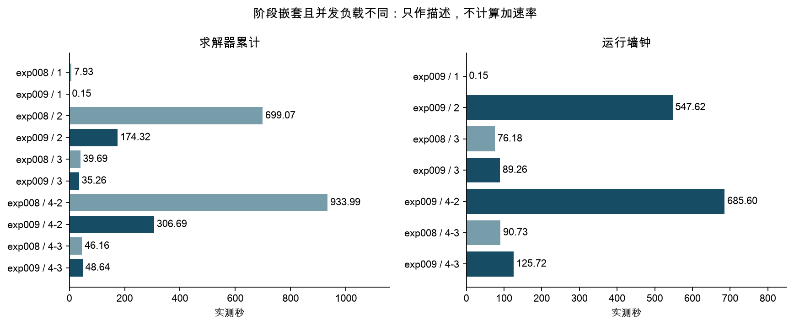

求解与墙钟按阶段分列，不能相加或解释成受控加速率。

新增HGB/ExtraTrees拟合次数0；既有HGB/ET拟合+验证预测累计44.97185/63.23339秒仅作复用来源。纯拟合、单独预测、校准、回放等未独立记录的阶段保留缺失；报告构建和导出计时分别写report_build.json与工作簿QA。

[指定日期的完整表格](specified_dates.md)。附件格式结果：[第一问](result1.xlsx)、[第二问](result2.xlsx)、[第三问](result3.xlsx)、[4-2](result4-2.xlsx)、[4-3](result4-3.xlsx)。四小时汇总两列为正不等于同时充放电。

## 7. 历次指标和技术路线对比

读取全部历史exp001–006登记及exp008；exp007按原要求忽略。原登记角色、数值及同物理重算来源保留在final_payload.history，不把新对照冒充历史正式优化策略。exp005采用原冻结登记快照；没有对应年度问的登记不补零。

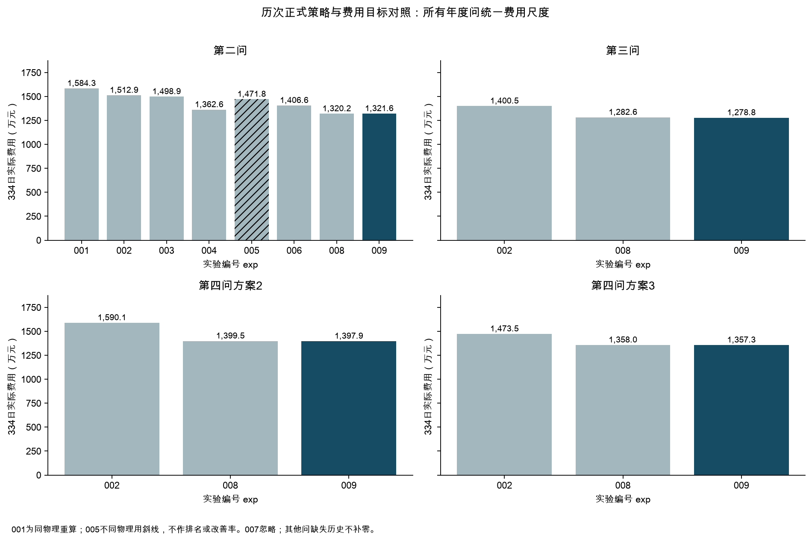

历史费用原值；005为额外硬爬坡且允许应急充电，只描述性并列。

| 问题 | 实验 | 角色 | 历史费用/元 | 009费用/元 | 同口径变化/% | 物理结算可比 |
|---|---|---|---|---|---|---|
| 2 | exp001 | exp001 同口径重算 | 15,842,654.1907 | 13,215,591.4950 | -16.5822 | 是 |
| 2 | exp002 | exp002 正式风险 | 15,128,897.4527 | 13,215,591.4950 | -12.6467 | 是 |
| 2 | exp003 | exp003 正式 | 14,988,622.6482 | 13,215,591.4950 | -11.8292 | 是 |
| 2 | exp004 | exp004 历史季节 | 13,626,145.4060 | 13,215,591.4950 | -3.0130 | 是 |
| 2 | exp005 | β=0.1 主方案 | 14,717,882.1655 | 13,215,591.4950 | 未记录 | 否 |
| 2 | exp006 | exp006 正式·树DP | 14,066,257.4773 | 13,215,591.4950 | -6.0476 | 是 |
| 3 | exp002 | 原正式策略 | 14,005,062.7759 | 12,787,820.0249 | -8.6914 | 是 |
| 4-2 | exp002 | 原正式策略 | 15,901,397.2011 | 13,978,929.9940 | -12.0899 | 是 |
| 4-3 | exp002 | 原正式策略 | 14,734,925.1249 | 13,573,403.5363 | -7.8828 | 是 |
| 2 | exp008 | 用户接受正式策略 | 13,201,981.9479 | 13,215,591.4950 | 0.1031 | 是 |
| 3 | exp008 | 用户接受正式策略 | 12,826,263.0743 | 12,787,820.0249 | -0.2997 | 是 |
| 4-2 | exp008 | 用户接受正式策略 | 13,994,531.2579 | 13,978,929.9940 | -0.1115 | 是 |
| 4-3 | exp008 | 用户接受正式策略 | 13,579,870.4650 | 13,573,403.5363 | -0.0476 | 是 |
| 2 | exp009 | 预先固定费用目标对照 | 13,215,591.4950 | 13,215,591.4950 | 0.0000 | 是 |
| 3 | exp009 | 预先固定费用目标对照 | 12,787,820.0249 | 12,787,820.0249 | 0.0000 | 是 |
| 4-2 | exp009 | 预先固定费用目标对照 | 13,978,929.9940 | 13,978,929.9940 | 0.0000 | 是 |
| 4-3 | exp009 | 预先固定费用目标对照 | 13,573,403.5363 | 13,573,403.5363 | 0.0000 | 是 |

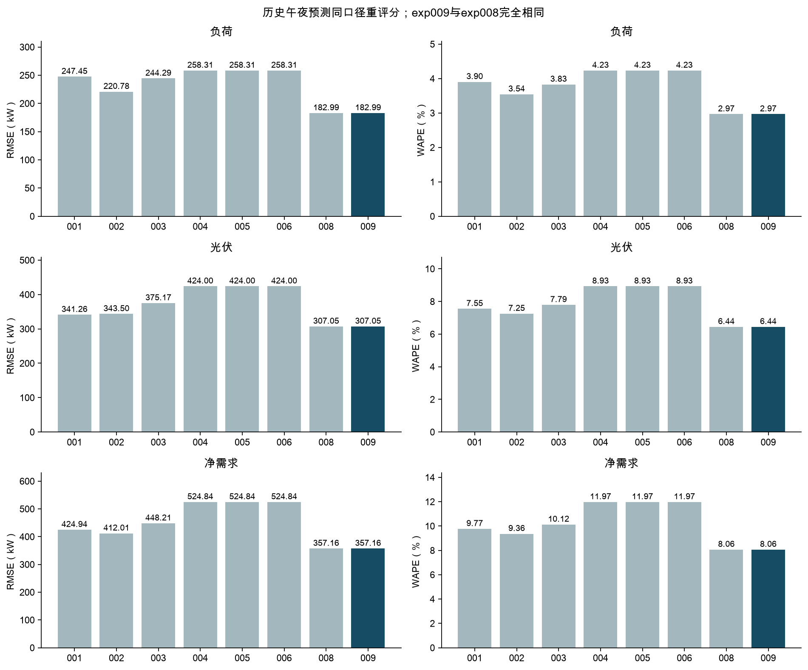

午夜全时段RMSE与WAPE；发电时段及MAE同源CSV完整保留。

exp001/2原预测共同四目标早停存在信息公平性限制；原多发布192168样本与午夜重评分48096样本分开。预测同口径重算不静默覆盖原登记。005物理不同禁止费用排名/改善率；相同物理结算也不代表历史模型控制完全相同。


本轮唯一新增技术对照是移除强度偏好；预测来源不变。


此前三层核心对照仍见[同基础LP预测对照与最终模式](../exp008/evidence/three_layer_control_comparison.csv)，本轮新增的是“相同预测+008强度偏好”与“相同预测+009费用目标”，不存在新的预测贡献。


008/009存在同阶段实测值时并列，缺失不补零。


| 历史实验/阶段 | 计时范围 | 秒 | 来源 |
|---|---|---|---|
| exp001 | 原登记求解+执行 | 1.197 | reports/registry/exp001.json |
| exp002 | 原登记求解+执行 | 907.740 | reports/registry/exp002.json |
| exp003 | 原登记求解+执行 | 12.398 | reports/registry/exp003.json |
| exp004 | 原登记求解+执行 | 11.677 | reports/registry/exp004.json |
| exp005 | 午夜层1/层2、执行层1/层2的LP求解时间之和 | 959.653 | git:8108d0475ae4f2ea25565a806dfec5e836f62c0a:reports/registry/exp005.json |
| exp006 | 原树DP正式策略的运行墙钟，不含预测模型训练 | 8.955 | reports/registry/exp006.json |
| exp008_mip | exp008 Q2 · 物理MIP求解 | 699.073 | reports/experiments/exp008/evidence/runtime_by_stage.json |
| exp008_refine | exp008 Q2 · 固定掩码Q精化 | 304.325 | reports/experiments/exp008/evidence/runtime_by_stage.json |
| exp008_hgb | exp008 HGB · 拟合+验证预测 | 44.972 | reports/experiments/exp008/evidence/runtime_by_stage.json |
| exp008_et | exp008 ExtraTrees · 拟合+验证预测 | 63.233 | reports/experiments/exp008/evidence/runtime_by_stage.json |
| exp008_wall | exp008 Q2 · 运行总墙钟 | 未记录 | reports/experiments/exp008/evidence/runtime_by_stage.json |

历史训练组数、完整模型与各阶段原记录保留在history及exp008 record；不同设备、并发负载和累计范围只作描述，不计算端到端加速率。

## 8. 复现说明

实现与报告构建源码提交：`50415037a399f9ee81fd2cb3a1b3ff36ac217078`。模板取origin/main的`58fd537055dfa5ddb7460cee0413011bdb6d8526`，三个模板原字节保存在[evidence/templates](evidence/templates/report.md)。源代码闭包、输入档案SHA与原证据before/after见每问run_protocol/protocol及独立审计。

```bash
OMP_NUM_THREADS=1 OPENBLAS_NUM_THREADS=1 .venv/bin/python -m experiments.exp009.run_q1
OMP_NUM_THREADS=1 OPENBLAS_NUM_THREADS=1 .venv/bin/python -m experiments.exp009.run_q2
OMP_NUM_THREADS=1 OPENBLAS_NUM_THREADS=1 .venv/bin/python -m experiments.exp009.run_update_cost_only
OMP_NUM_THREADS=1 OPENBLAS_NUM_THREADS=1 .venv/bin/python -m experiments.exp009.q4_2_cost_only
.venv/bin/python -m experiments.exp009.q4_2_cost_only_audit
.venv/bin/python -m experiments.exp009.final_evidence --require-all
.venv/bin/python -m experiments.exp009.report_payload
.venv/bin/python -m reports.build_report_exp009 --code-commit 50415037a399f9ee81fd2cb3a1b3ff36ac217078
```

以上前四条为新运行，已存在冻结目录时应在新检出/独立输出目录执行，禁止覆盖已归档成果。后两条数据整理与报告构建仅读取冻结结果，不训练/优化。跨机器固定MIP秒数预算可能产生不同可行解，不能保证逐位同值。工作簿命令与独立单元格核验见[evidence/workbooks](evidence/workbooks/README.md)。

[物理/费用/功率独立核验](evidence/battery/final_evidence.json)、[全部输入SHA](data_hashes.json)、[测试记录](tests.txt)、[交付QA](evidence/delivery_qa.json)。最终提交时检查全部本地链接、PNG/SVG与HTML视觉结果、工作簿全部填值和原始轨迹一致。

本轮完成条件为预先固定候选的全期运行与独立核验；不要求次数下降，不继承上一轮8%停止阈值，不根据测试费用再挑选版本。
